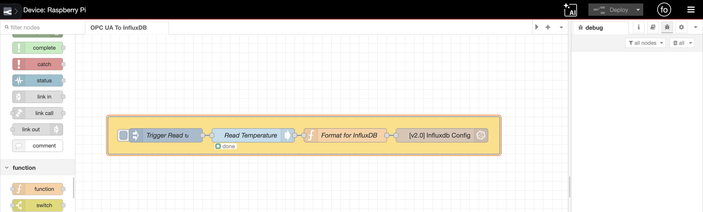
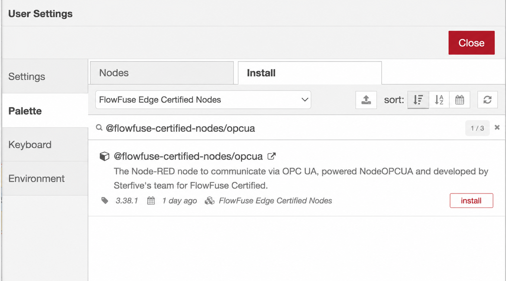
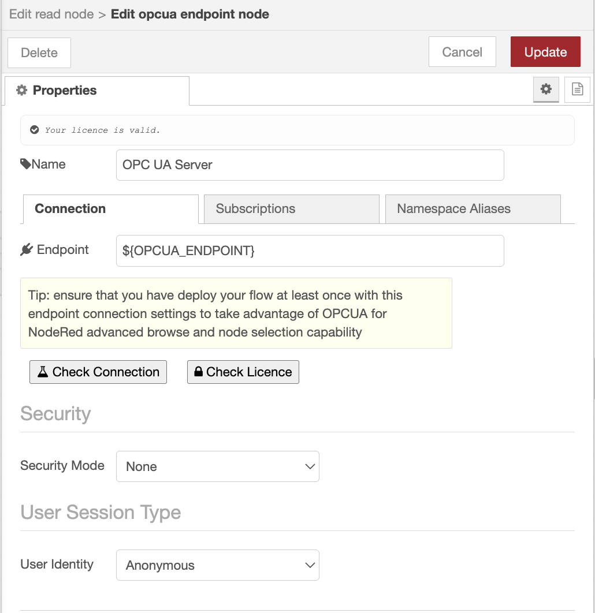
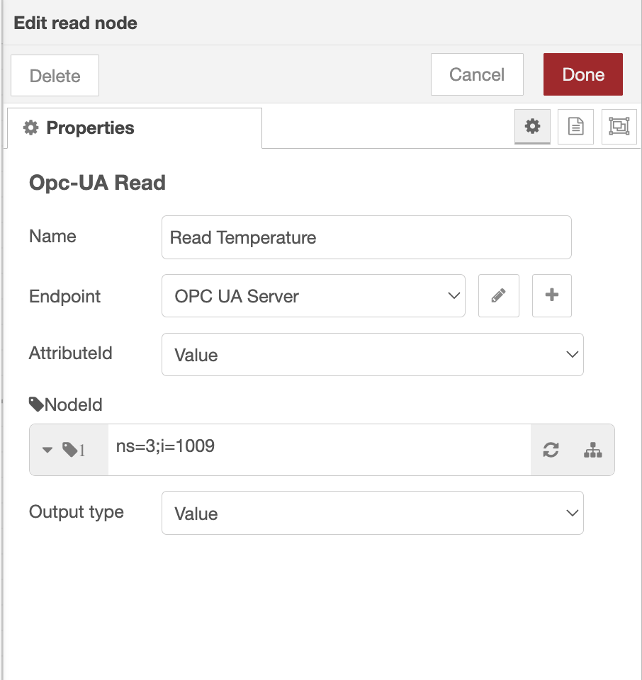
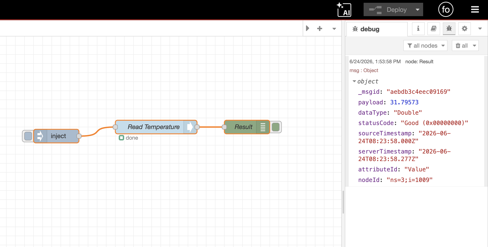
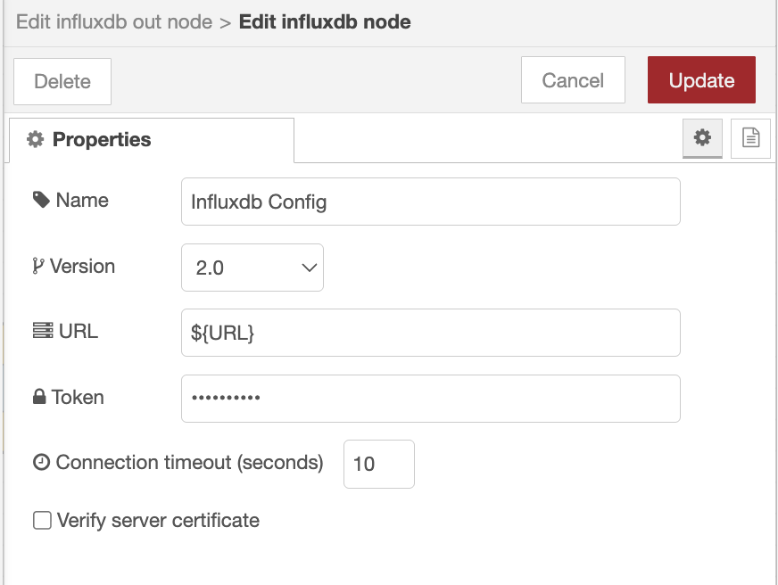
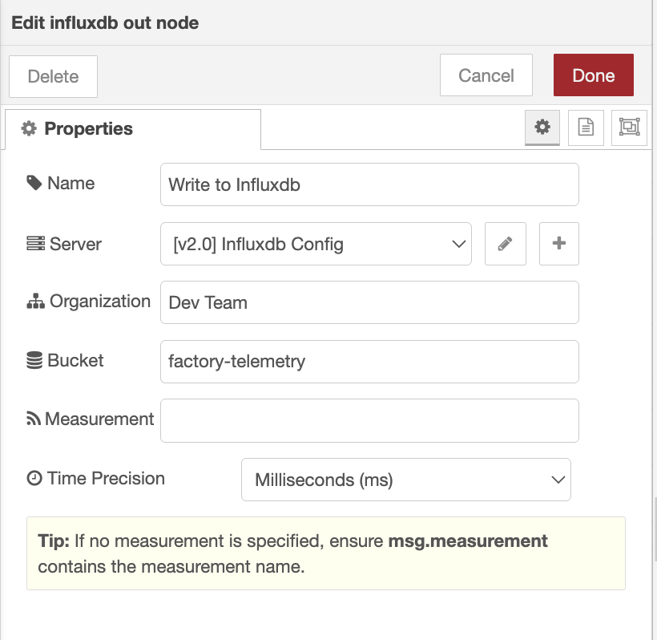
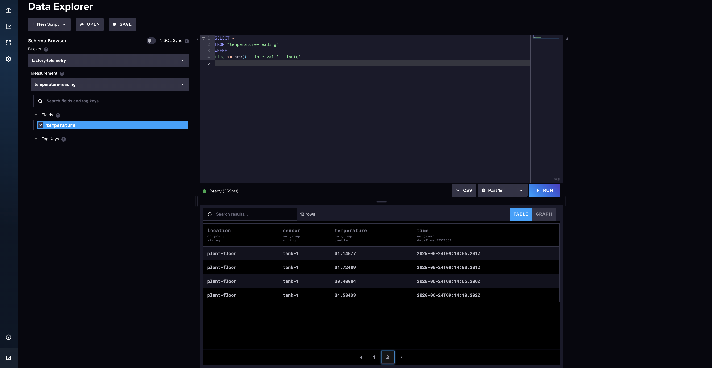

Industrial equipment produces data constantly: temperatures, pressures, motor speeds, tank levels, all changing by the second. Real-time values tell you what's happening now, but the history is where the value lives, spotting a degrading pump, proving a batch stayed within spec, tracing the conditions behind a fault. OPC UA gets that data out of your equipment in a vendor-neutral way, and InfluxDB stores it as timestamped history built to query at scale. In this article, you'll connect the two in FlowFuse to turn live readings into a durable record you can query, chart, and analyze.

<!--more-->


_The complete pipeline: an inject node triggers a read, a function node shapes the reading, and the influxdb out node stores it._

## What you'll need

Before building the flow, make sure you have:

- **A FlowFuse remote instance on an edge device.** OPC UA servers and PLCs sit on the local network, so run this flow on an edge device close to the equipment. Install the [Device Agent](/docs/device-agent/install/overview/) and register it as a remote instance.
- **An OPC UA server to read from.** Your data source: a PLC, gateway, or device exposing tags over OPC UA. No hardware? The free Prosys OPC UA Simulation Server works for testing.
- **A running InfluxDB instance.** Cloud or self-hosted. Create an organization, a bucket, and an API token with write access.
- **Endpoint details for both.** The OPC UA endpoint URL (like `opc.tcp://192.168.1.10:4840`) plus any credentials, and your InfluxDB URL, org, bucket, and token.

For the OPC UA connection, this guide uses the **FlowFuse Edge Certified Nodes package**, vetted, maintained, and tested by the FlowFuse team. [Contact sales](/contact-us/) to enable it for your team. Community nodes work too, but they don't get the same vetting, maintenance, or testing, so reliability varies.

With those ready, the next step is installing the nodes that connect FlowFuse to OPC UA and InfluxDB.

## Installing the nodes

You'll install two packages: the InfluxDB nodes and the FlowFuse Edge Certified OPC UA nodes.

1. Open the editor on your remote instance.
2. From the menu (top right), select **Manage palette**, then switch to the **Install** tab.
3. Search for **`node-red-contrib-influxdb`** and click **Install**. These nodes write to and query InfluxDB. A FlowFuse Edge Certified version is on the way; for now, this community package does the job.

> **ℹ Note:** Existing devices and hosted instances will not see newly added nodes until they are restarted. Restart any instance you plan to install nodes on so it picks up the updated catalogue.

4. Switch the catalog using the top dropdown to **FlowFuse Edge Certified Nodes**.
5. Search for **`@flowfuse-certified-nodes/opcua`** and click **Install**. (Once sales enables the package for your team, it shows up here.)


_Install the OPC UA certified package from the FlowFuse Edge Certified Nodes catalog._

Both packages now appear in the palette on the left: an OPC UA group for reading your equipment, and an InfluxDB group for storing the data. Now you're ready to connect to your server and pull live values.

## Connecting to your OPC UA server

With the nodes installed, you'll build the read side of the flow: define the connection, then read your tag values on a schedule.

### Define the connection

1. Drag a **Read** node onto the canvas.
2. Double-click it to open its settings, then click the "+" next to the **Endpoint** field to add a new endpoint configuration.
3. Enter your endpoint URL, for example `opc.tcp://192.168.1.10:4840`.
4. Set the **Security Policy** and **Security Mode** to match your server. For a local test server such as the Prosys simulator with security disabled, set both to `None`. On production equipment, choose the certificate-based policy and mode your server requires, and point the node at your certificate and private-key files.
5. If your server needs credentials, enable the login option on the endpoint and enter the username and password. Otherwise leave it anonymous.
6. Click **Add**, then **Done**.


_Point the endpoint at your server's URL and match its Security Policy and Mode._

> **ℹ Note:** This guide uses a simulator server for convenience. On production equipment, always enable a certificate-based Security Policy and Mode rather than `None`, so the connection between FlowFuse and your OPC UA server stays encrypted and authenticated.

> **ℹ Note:** Store connection details, endpoint URLs, credentials, InfluxDB tokens, org and bucket names in environment variables rather than hardcoding them in your nodes. This keeps secrets out of your flows and lets you move the same flow between instances without editing each node. See [Using Environment Variables](/docs/user/envvar/) for how to set them.

### Read the values on a schedule

The Read node takes the Node ID of the tag from the incoming message, so feed it a message carrying the tag you want and it returns the value. First you need that Node ID, something like `ns=3;s=Temperature`. If your server's docs already list it, you're set, plug it in and skip to step 2. If not, the Read node can find it for you.

1. In the **Read** node, click the tree button next to the **NodeId** field. Enter the Node ID you want to drill into (a root node such as the Objects folder is the usual starting point), and the editor renders your server's address space as an expandable tree. Drill down, click the tag you want, and its Node ID fills in automatically.
2. Add an **inject** node and set it to repeat at a fixed interval, say every 5 seconds, so each pulse triggers a fresh read. Wire it into the Read node.
3. Connect a **debug** node to the Read node's output, then deploy.


_Opcua read node config_

Each time a message arrives, the Read node returns more than just the number. The value lands in `msg.payload`, and the message also carries `msg.dataType` (such as `Double` or `Boolean`), `msg.statusCode` (`Good` on success, or an error like `BadUnknownNode`), `msg.sourceTimestamp` and `msg.serverTimestamp` as ISO strings, and `msg.nodeId` echoing back what was read. Watch that `statusCode`, it's how you tell a real `0` reading from a tag that failed to read at all.

To read several tags at once, pass an array of Node IDs in `msg.topic` or `msg.nodeId` and the node returns an array of values in `msg.payload`, more efficient than running a separate read per tag.

> **ℹ Tip:** If you ever need the *flow itself* to discover Node IDs while it's running, say, to enumerate tags on a server whose address space changes, there's a dedicated **Browse** node for that. It's overkill for a fixed set of tags like this one, so we'll skip it here.

Deploy and watch the debug output. You should see a value arriving on each interval. The value itself is in `msg.payload`, while the timestamp and quality ride along on separate properties (`msg.sourceTimestamp`, `msg.statusCode`, and so on), so `msg.payload` is just the bare reading, like `42.5`. That's the shape the next step builds on.


_Each read returns the value in msg.payload, with timestamp and quality on separate properties._

## Writing data to InfluxDB

The OPC UA reading and the InfluxDB write node speak different formats, so you'll add a **function** node between them to shape each reading into a measurement.

1. Drop a **function** node after the Read node and open it.
2. Build the payload InfluxDB expects: an array of two objects, fields first, then tags. `msg.payload` holds the bare reading, and `msg.sourceTimestamp` holds the time the server sampled it, set `msg.timestamp` from it so InfluxDB stores the reading against when it actually happened:

```javascript
const value = msg.payload;

msg.measurement = "equipment_readings";  // the measurement (table) to write into
msg.timestamp = msg.sourceTimestamp;     // use the server's sample time, not write time

msg.payload = [
    {
        temperature: value
    },
    {
        sensor: "tank-1",
        location: "plant-floor"
    }
];
return msg;
```

The first object holds the fields (the actual measured values). The second holds tags, the metadata you'll filter and group by later when querying. Tags make the difference between "show me every temperature" and "show me tank-1's temperature last Tuesday." Setting `msg.measurement` here keeps the measurement name in your flow rather than buried in the write node, so you can drive it from the data later if you add more tags; if you'd rather, leave this line out and set the measurement in the influxdb out node instead.

3. Wire the function node into an **influxdb out** node.
4. Open the influxdb out node and click the pencil icon next to the **Server** field to configure the connection: enter your InfluxDB URL and select the version (1.x or 2.0) that matches your instance.
5. For InfluxDB 2.0, enter your **Token**, **Organization**, and **Bucket**. For 1.x, enter the database name and any credentials.
6. Back in the node, set the **Measurement** name (for example `equipment_readings`) if you didn't set `msg.measurement` in the function node. This is the table your data lands in.
7. Deploy.


_Configure the server connection with your InfluxDB URL and version._


_Set the token, organization, and bucket so readings land in the right place._

Your readings are now flowing into InfluxDB. Each interval, the Read node reads the tag, the function node shapes it, and the influxdb out node writes a timestamped point to your bucket. Because you set `msg.timestamp` from the server's sample time, each point is stored against when the reading actually happened, not when it reached the database. Drop that line and InfluxDB falls back to stamping each point with its write time instead.

## Verifying your data

Confirm the history is actually landing before you rely on it.

1. Open the InfluxDB UI and go to the **Data Explorer**.
2. Select your bucket, your `equipment_readings` measurement, and the `temperature` field.
3. Set the time range to the last few minutes and run the query.


_InfluxDB Data Explorer showing the temperature filling in_

You'll see your readings listed in a table, one row per read interval. If new rows keep appearing as time passes, your pipeline is working end to end: equipment to OPC UA to FlowFuse to InfluxDB.

Verifying in the InfluxDB UI proves the data is there, but you don't have to leave FlowFuse to use it. The influxdb in node runs a query and returns the results to your flow, so you can pull the same history back, the last hour of temperature, a daily average, whichever slice you need, and feed it straight into a [FlowFuse Dashboard](https://dashboard.flowfuse.com) chart.

## Where to go from here

You now have a durable, queryable record of your equipment's behavior. From here you can read more tags, tag each reading with its machine or line so you can slice the data later, and build dashboards on top of InfluxDB to chart trends and spot the slow drift that real-time values hide.

The real payoff comes when you stop reacting to problems and start seeing them coming. A pump that's drawing a little more current each week, a tank that's taking longer to fill, a temperature that's creeping past its usual range, all of it now sits in a history you can query, instead of vanishing the moment it happens.