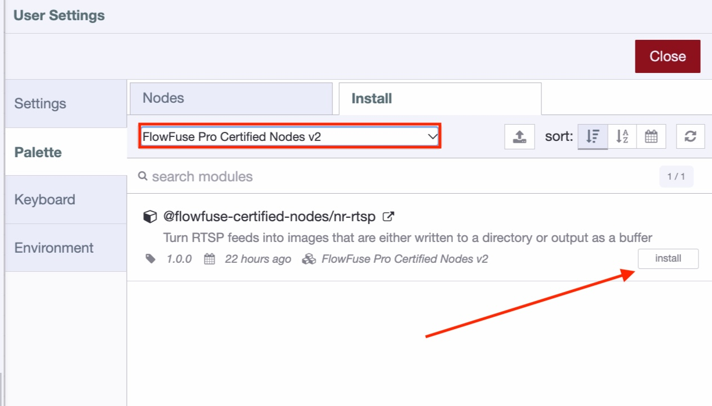
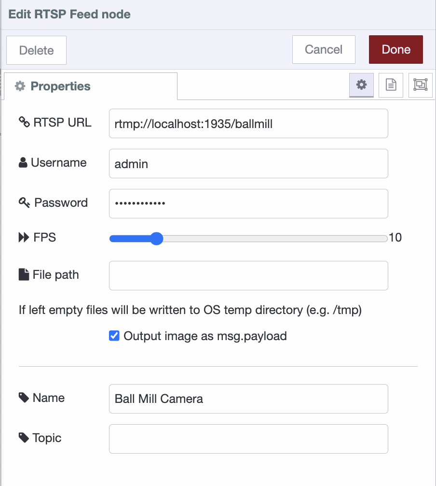
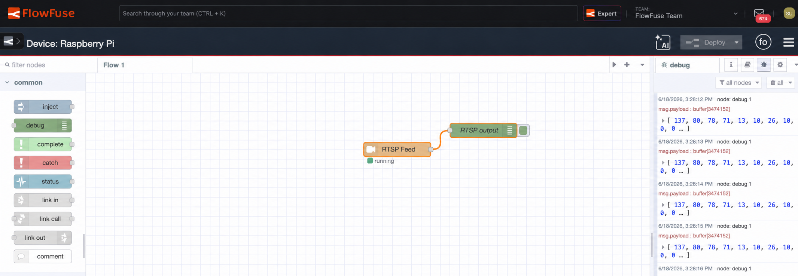
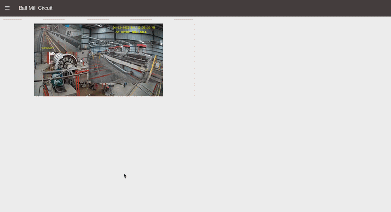

On any plant floor you'll find cameras everywhere. Now ask where that video goes. Almost always into an NVR, kept for security, looked at only after something's gone wrong.

<!--more-->

That's odd, because everything else on the floor already does real work. PLC tags, sensor readings, machine counts all flow into dashboards and trigger alerts every second of the day. Video is the exception. The camera sees more than any sensor in the building, yet it's the one source still sitting idle.

The reason is the format. A PLC tag is a number you can act on instantly. A camera gives you RTSP, a continuous video stream, and a raw stream is hard to plug into anything. So while the rest of the floor got connected, the cameras stayed in their silo.

The new **RTSP Video Feed** node, a FlowFuse Certified Node added in [2.31](/blog/2026/06/flowfuse-release-2-31/), closes that gap. It turns the stream into still frames you can work with, routed and analyzed right at the edge. In this post we'll get a camera's frames flowing into your applications, the same way every other signal on the floor already does.

## Prerequisites

Before you start, make sure the FlowFuse Device Agent is running on the edge device where the camera is reachable, with a FlowFuse instance deployed to it. That instance is where you'll install the node and build the flow. If you haven't set this up yet, follow the [Device Agent quickstart](/docs/device-agent/quickstart/#setup-%26-installation) first, then come back.

## Why this has to happen at the edge

The obvious question is why not just send the video to the cloud and process it there. On a plant floor, that falls apart fast.

A single camera streaming continuously can push tens of gigabytes a day. Multiply that by every camera in the building and you're paying to haul raw video off-site around the clock, most of it showing nothing worth keeping. Plant networks are usually segmented too, with the camera VLAN walled off from anything facing the internet, so that footage often can't leave the site even if you wanted it to. And in plenty of cases it legally shouldn't, with people and processes in frame that fall under privacy or compliance rules.

The fix is to stop moving video and start moving decisions. Pull a frame where the camera lives, act on it there, and send out only what matters: a count, a status, an alert. That's what processing at the edge means here. The **RTSP Video Feed** node runs right next to the line, turning a stream nobody watches into frames your flows can use the moment they're captured.

## How the node works

The **RTSP Video Feed** node does one job well: it connects to a camera and pulls still frames out of the stream as PNG images. It drives `ffmpeg` under the hood, which does the heavy decoding off the main event loop, so even a high frame-rate camera won't bog down your flows. In most setups `ffmpeg` installs automatically, so there's nothing extra to set up.

You give it an RTSP URL, credentials if the camera needs them, and a capture rate. By default each frame comes out as a message with the PNG in `msg.payload`, ready to wire into anything that takes an image. Turn that output off instead and it writes a numbered sequence of PNGs straight to disk, handy when you just want plain on-site recording. We'll use the default mode here, since we want the frames in the flow.

## Build it: a live line view

Let's turn a camera into something an operator can actually watch, without ever opening the NVR.

> Note: Certified Nodes are part of the FlowFuse Enterprise tier. If you're on Starter or Pro, you'll need to upgrade to Enterprise to install them. [Talk to us](/contact-us/) if you'd like access or want to see it in action first.

### Installing the node

1. In the FlowFuse editor, open the Palette Manager from the top-right menu.
2. Switch to the Install tab and find the FlowFuse Pro Certified Nodes V2.
3. Locate the `@flowfuse-certified-nodes/nr-rtsp` and click install. ffmpeg is pulled in automatically, so there's nothing else to set up.


*Installing the RTSP Video Feed node from the FlowFuse Certified Nodes catalogue in the Palette Manager.*

Once it's installed, you'll find the **RTSP Feed** node in the left palette sidebar, ready to drag onto your canvas.

### Configuring the node

1. Drag the **RTSP Feed** node onto your canvas and double-click to open its settings.
2. In the RTSP URL field, enter your camera's stream address, for example `rtsp://192.168.1.50:554/ballmill-a2`.
3. If the camera requires a login, fill in Username and Password. These are stored as credentials and are never written into the flow file.
4. Set FPS to 10. Ten frames a second is smooth enough to watch a line in near real time. If your use case doesn't need that, lower it to ease the load: 1 is plenty for periodic monitoring. You can always raise it later.
5. Leave Output image as `msg.payload` enabled so each frame is emitted as a message.

> You'll also see a File path field. In this mode the node keeps a single working image there, falling back to the OS temp directory like `/tmp` if you leave it blank, so you can ignore it for now. It only matters in disk-writing mode, covered in [Recording frames to disk](#recording-frames-to-disk).


_The RTSP Feed node settings panel showing the RTSP URL, optional Username and Password credential fields, the FPS selector set to 10, and the Output image as msg.payload option enabled_

6. Click Done, name the node **RTSP Feed**, wire a debug node to the output, and deploy.

Once the node connects, it shows a green Running status underneath it on the canvas. Capturing begins the moment the flow is deployed, and within a second PNG buffers start arriving in the debug sidebar, confirming the camera is connected and frames are flowing.


*A buffer per frame in the debug sidebar. The feed is connected and the frames are now inside the flow.*

### Putting the feed on a dashboard

A buffer in the debug sidebar confirms the feed works, but it's no use to an operator. Let's get the frame onto a screen anyone can open in a browser.

This assumes you have FlowFuse Dashboard 2.0 installed. If you don't, follow the [Getting Started guide](https://dashboard.flowfuse.com/getting-started.html#installation) to add it and set up your first page, then come back.

FlowFuse Dashboard has no built-in widget that takes a raw image buffer, so we turn each PNG into a base64 data URI and render it with a standard image tag.

1. Add a **base64** node after the **RTSP Feed** node. With its default action, it converts the incoming PNG buffer into a base64 string.

2. Add a **change** node after it. The payload is now a string, so this expression simply prepends the data URI prefix the browser needs:

   ```
   "data:image/png;base64," & payload
   ```

3. Add a **ui-template** node and assign it to a dashboard group and page. Set its Type to *Widget* and drop in a single image element bound to the payload:

   ```html
   <template>
     
   </template>
   ```

4. Deploy and open your dashboard. If you're working on the edge device, browse to `http://<flowfuse-agent-ip>:<port>/dashboard/`, using the IP and port your instance runs on. The view refreshes with every new frame.

That's a live line view anyone can pull up in a browser, with no NVR login and no separate video client.


*FlowFuse Dashboard 2.0 page showing a live frame from the  mill camera, with the grinding mill, feed conveyor and flotation line visible*

> **Watch the message size.** FlowFuse Dashboard sends data over a socket connection capped at about 1 MB per message by default, and a full-resolution frame can exceed that. When it does, the message is silently dropped and the image just doesn't appear. If that happens, lower the camera resolution, keep the FPS low, or raise [`maxHttpBufferSize`](https://dashboard.flowfuse.com/user/settings.html#maxhttpbuffersize) in your instance settings.

## From a view to a decision

A live view is a real win, but notice what you have now: the camera's output is a PNG buffer moving through your flow, one message per frame. Once a frame is just another message, you can do more than display it. You can ask what's in it.

That's what the [**FlowFuse AI** nodes](https://flowfuse.com/node-red/flowfuse/ai/) are for. They run vision models locally, inside your flow, with nothing sent to an outside service. The **Object Detection** node takes a PNG buffer as its input, which is exactly what the camera node outputs, so you wire the camera straight into it, no conversion step in between. From there the flow stops watching and starts acting: counting material on the conveyor, flagging a person near the flotation cells, or catching a stopped belt before the line backs up. Each detection comes back as structured data, a label, a confidence score, and a position, which you handle like any other signal in FlowFuse.

## Recording frames to disk

One last mode worth knowing. Sometimes you don't need frames in the flow at all, just a local record of what the camera saw. Turn off **Output image as `msg.payload`** and the node stops emitting messages. Instead `ffmpeg` writes a continuous numbered sequence of PNGs (`rtsp-<node-id>-<counter>.png`) straight to disk.

Where they land is set by the **File path** field. Point it at a directory you control and the frames are written there. Leave it empty and the node falls back to the OS temp directory, typically `/tmp`, which is fine for a quick test but gets cleared on reboot, so don't use it for anything you need to keep. This mode is handy for on-site recording where the footage shouldn't leave the building.

## Wrapping up

Camera feeds don't have to sit in a silo while the rest of the floor gets connected. With the **RTSP Video Feed** node, a stream becomes still frames; with a dashboard, those frames become a live view; and with the **FlowFuse AI** nodes, they become decisions, all at the edge, with nothing leaving the plant.