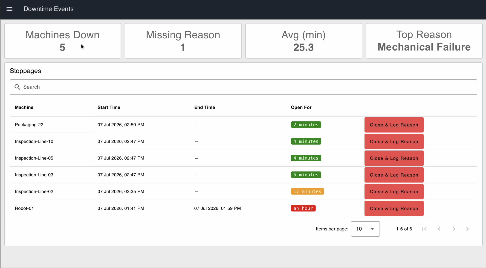
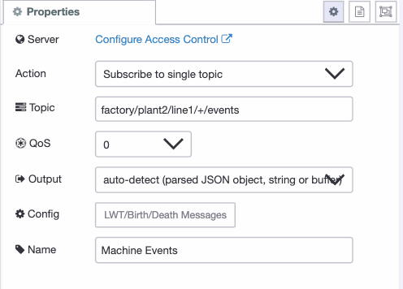
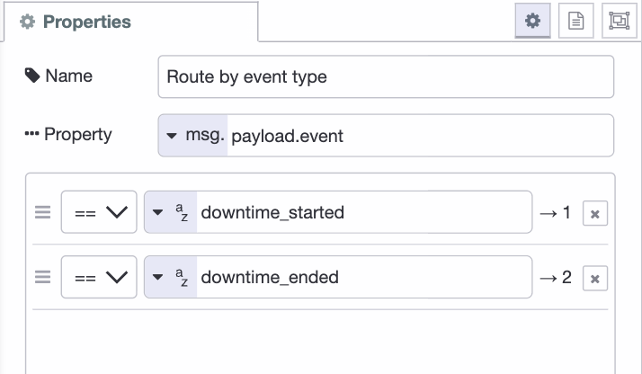
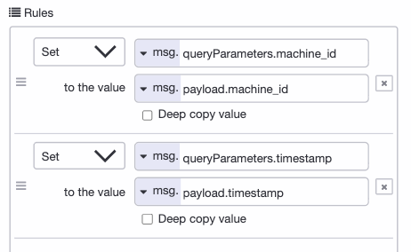
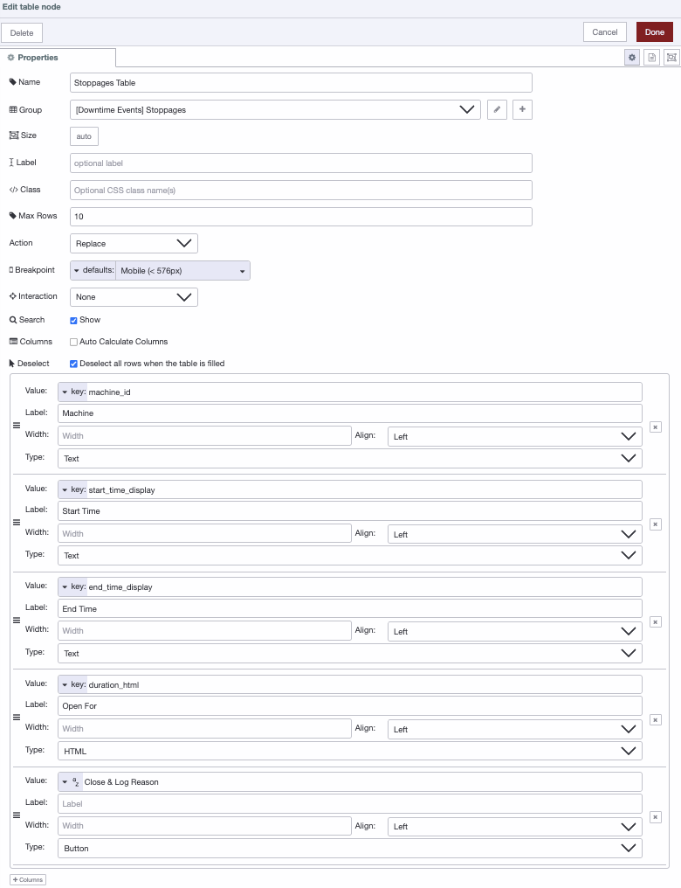
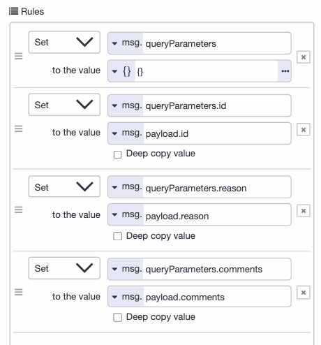
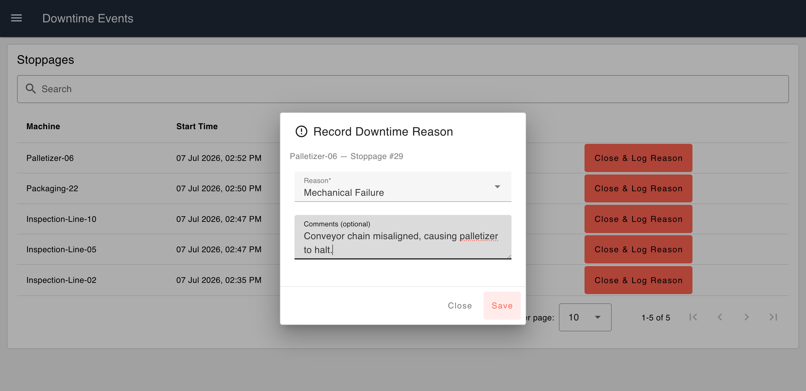
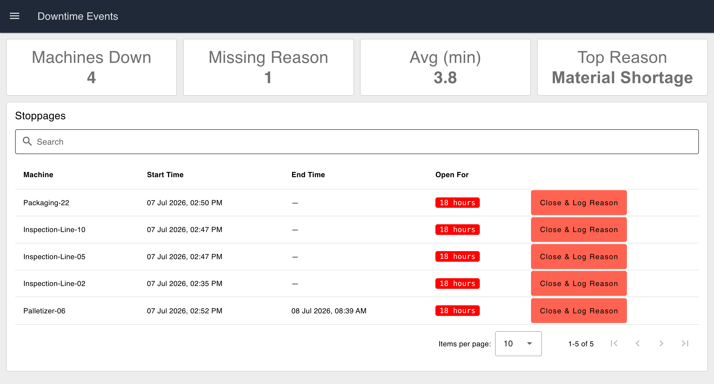

Production lines in manufacturing and automotive facilities experience planned and unplanned downtime every day. Tracking when a machine stops, how long it stays down, and why it happened helps production and maintenance teams identify recurring issues and improve operations.

<!--more-->

Many factories still record downtime on paper or in spreadsheets. Others rely on PLC alarms without keeping a centralized history that teams can review and analyze later.

In this tutorial, you'll build a machine downtime tracking application using FlowFuse. The application records machine stop and start events, calculates downtime duration, lets operators assign downtime reasons, and displays a live dashboard with unresolved events and key metrics. Following the steps below, you can have this application built and deployed in about 10-15 minutes.


_The finished dashboard: KPI cards on top, unresolved stoppages below._

You can interact with the live demo here: <a href="https://cheerful-western-sandpiper-1404.flowfuse.cloud/dashboard/downtime-events" onclick="if (typeof capture !== 'undefined') { capture('blog-live-demo', { reference: 'Blog: {{ title | escape }}' }); }">Try the Machine Downtime Tracking Demo</a>.

By the end, you'll have a foundation you can extend into OEE, production reporting, maintenance dashboards, or MES integrations.

## What You'll Need

Before you start building, get these ready:

- **A FlowFuse account.** Sign up for FlowFuse Cloud, or use a self-hosted instance.
- **A FlowFuse instance up and running.** If you don't have one yet, create a new instance from your FlowFuse Platform.
- **FlowFuse Dashboard installed.** This tutorial uses `@flowfuse/node-red-dashboard` nodes (`ui-button`, `ui-table`, `ui-chart`) to build the operator interface. Install it from the Palette Manager if it isn't already in your instance.
- **The Humanizer node installed.** This is what turns raw downtime into readable text like "12 minutes." It comes from the `node-red-contrib-moment` package, install it from the Palette Manager.

You won't need a PLC or any real hardware for this tutorial. We'll simulate machine stop and start events with inject nodes, and the same flow logic applies later when you connect real signals.

## How the Application Works

Before we build anything, let's first walk through what it should do and how the flow will look:

1. **Machine stops.** A signal comes in and a new downtime record opens for that machine.
2. **Machine starts again.** The record closes on its own, and the duration gets calculated.
3. **Operator logs a reason.** From the dashboard, closing it manually too if it wasn't already.
4. **The table shows what's unresolved.** Anything open, or anything closed without a reason, stays visible with the clock still running next to it.
5. **The KPI cards keep score.** Machines down now, missing reasons, average downtime, and the most common reason.

Once you see these five pieces working together, the rest of the tutorial is just wiring them up.

## Setting Up the Database Table

Everything in this application reads from and writes to a single table, so that's where we start.

> Note: [FlowFuse Tables](/docs/user/ff-tables/) is currently in beta and available to Enterprise tier teams on FlowFuse Cloud, as well as Enterprise licensed self hosted teams running on Kubernetes. If you're on a different tier, you can follow along using any external database instead, Postgres, MySQL, or whatever you already have, with the standard database nodes from the palette. The SQL and flow logic in this tutorial will work the same either way.

1. Add a Query node to your canvas. This lets you run SQL queries directly against your FlowFuse managed database.

2. Set its query to create the table:

```sql
CREATE TABLE IF NOT EXISTS downtime_events (
    id SERIAL PRIMARY KEY,
    machine_id TEXT NOT NULL,
    status TEXT NOT NULL DEFAULT 'Open',
    reason TEXT,
    comments TEXT,
    start_time TIMESTAMPTZ NOT NULL,
    end_time TIMESTAMPTZ,
    duration_seconds INTEGER,
    created_at TIMESTAMP DEFAULT CURRENT_TIMESTAMP
);
```

3. Wire an inject node into the Query node. This is what triggers the query to run.

4. Add a debug node after the Query node. This lets you confirm the table was created successfully.

5. Click the inject node once, then check the debug sidebar. You should see a confirmation that the query ran.

Each row in this table represents one stoppage. Status tracks whether it's open or closed, reason and comments stay empty until an operator fills them in, and duration_seconds gets calculated the moment a stoppage closes.

With the table in place, the application has somewhere to write to. Next, we'll set up the event that opens a record the moment a machine stops.

## Capturing Stop and Start Events

With the table ready, the next step is getting machine events into it, using MQTT.

Note: this tutorial uses the FlowFuse [built in broker](/docs/user/teambroker/), available to Pro and Enterprise tier teams on FlowFuse Cloud. If you're on a different tier, contact us to get access, or use your own broker with the standard MQTT nodes instead, they work the same way here.

The event names used here, `downtime_started` and `downtime_ended`, are just an example. Your source may use different tags or a boolean instead of a string. What matters is the pattern, one signal opens a record and one closes it, so adjust to match your actual data.

1. Add an ff-mqtt-in node to the canvas, name it "Machine Events In", and set the topic to `factory/plant2/line1/+/events`, with QoS 0. Once you deploy this node, it will automatically pick up the connection and credentials for your team's broker, no config node needed.


_The Machine Events In node subscribed to the wildcard topic._

2. Add a switch node checking payload.event, with two rules, downtime_started and downtime_ended.


_Routing incoming events by type before they reach the database._

3. For downtime_started, add a change node before the Query node with two rules: set `queryParameters.machine_id` to `payload.machine_id` (msg), and set `queryParameters.timestamp` to `payload.timestamp` (msg).


_Both sides of each rule set to msg, this is the step most likely to get mistyped._

4. Add the Query node itself:

```sql
INSERT INTO downtime_events (machine_id, start_time)
SELECT $machine_id, $timestamp
WHERE NOT EXISTS (
    SELECT 1 FROM downtime_events
    WHERE machine_id = $machine_id AND status = 'Open'
);
```

5. For downtime_ended, add the same kind of change node, `queryParameters.machine_id` and `queryParameters.timestamp` mapped the same way, then a separate Query node:

```sql
UPDATE downtime_events
SET status = 'Closed',
    end_time = $timestamp,
    duration_seconds = EXTRACT(EPOCH FROM ($timestamp::timestamptz - start_time))
WHERE machine_id = $machine_id AND status = 'Open';
```

To test without hardware, import the following flow:


[{"id":"bfc643d98eb10bb6","type":"group","z":"454731c79b51b360","style":{"stroke":"#b2b3bd","stroke-opacity":"1","fill":"#f2f3fb","fill-opacity":"0.5","label":true,"label-position":"nw","color":"#32333b"},"nodes":["4b50bf631b33bc25","c5c148db3ebd75ec","6e840436690af375","94a7e426af3a534c"],"x":214,"y":959,"w":752,"h":122},{"id":"4b50bf631b33bc25","type":"ff-mqtt-out","z":"454731c79b51b360","g":"bfc643d98eb10bb6","name":"","topic":"","qos":"0","retain":"false","respTopic":"","contentType":"","userProps":"","correl":"","expiry":"","lwt":"58936bbe1460d6be","x":870,"y":1020,"wires":[]},{"id":"c5c148db3ebd75ec","type":"inject","z":"454731c79b51b360","g":"bfc643d98eb10bb6","name":"Simulate: Downtime Started","props":[{"p":"payload.machine_id","v":"Robot-01","vt":"str"},{"p":"payload.event","v":"downtime_started","vt":"str"}],"repeat":"","crontab":"","once":false,"onceDelay":0.1,"topic":"","x":380,"y":1000,"wires":[["94a7e426af3a534c"]]},{"id":"6e840436690af375","type":"inject","z":"454731c79b51b360","g":"bfc643d98eb10bb6","name":"Simulate: Downtime Ended","props":[{"p":"payload.machine_id","v":"Robot-01","vt":"str"},{"p":"payload.event","v":"downtime_ended","vt":"str"}],"repeat":"","crontab":"","once":false,"onceDelay":0.1,"topic":"","x":370,"y":1040,"wires":[["94a7e426af3a534c"]]},{"id":"94a7e426af3a534c","type":"function","z":"454731c79b51b360","g":"bfc643d98eb10bb6","name":"Build Event Payload","func":"const p = msg.payload || {};\n\nconst machine_id = p.machine_id || \"unknown\";\nconst event = p.event || \"unknown_event\";\n\nmsg.topic = `factory/plant2/line1/${machine_id}/events`;\n\nmsg.payload = {\n    machine_id,\n    event,\n    timestamp: new Date().toISOString()\n};\n\nreturn msg;","outputs":1,"timeout":0,"noerr":0,"initialize":"","finalize":"","libs":[],"x":660,"y":1020,"wires":[["4b50bf631b33bc25"]]},{"id":"58936bbe1460d6be","type":"ff-mqtt-conf","birthTopic":"","birthQos":"0","birthRetain":"false","birthPayload":"","birthMsg":{},"closeTopic":"","closeQos":"0","closeRetain":"false","closePayload":"","closeMsg":{},"willTopic":"","willQos":"0","willRetain":"false","willPayload":"","willMsg":{}},{"id":"8c6c2d9875462a7f","type":"global-config","env":[],"modules":{"@flowfuse/nr-mqtt-nodes":"0.3.0"}}]


This gives you two buttons, one that simulates a machine stopping, one that simulates it starting again, wired through a function node that builds the topic and payload, then out over MQTT just like a real device would.

Deploy, click Simulate: Downtime Started, then check your table, a new open record should appear. Click Simulate: Downtime Ended and it should close with a duration.

Next, the dashboard table and the reason form operators use to close and explain a stoppage.

## Building the Dashboard Table and Reason Form

With events flowing into the database, the next step is showing them to the operator, and giving them a way to log why a machine stopped. Before starting, add a ui-page named "Downtime Events" and a ui-group named "Stoppages" on that page, this is where the table will live.

1. Go back to your event flow from the last section, after both Query nodes, downtime_started and downtime_ended, add a link out node. Give it a name like "event processed" so it's easy to find later.

2. In this new part of the flow, add a link in node and connect it to that same link out node. This is what lets the dashboard react any time a record opens or closes, without wiring long lines across the canvas.

3. There's one gap to close before moving on. The table only refreshes when an event comes in, so if a machine stays down for an hour with no new signal, "Open For" will sit frozen instead of counting up. Add an inject node set to repeat every 30 seconds, with its own link out wired to the same link in from step 2. This keeps the table and KPI cards refreshing on their own, even when nothing else is happening.

4. After the link in node, add a Query node that pulls every stoppage that's either still running or missing a reason. This is a triage table, so it only ever shows what still needs attention, once a stoppage is closed and explained, it drops off:

```sql
SELECT *,
       EXTRACT(EPOCH FROM start_time) AS start_epoch,
       TO_CHAR(start_time, 'DD Mon YYYY, HH12:MI AM') AS start_time_display,
       COALESCE(TO_CHAR(end_time, 'DD Mon YYYY, HH12:MI AM'), '-') AS end_time_display,
       COALESCE(reason, 'Not logged') AS reason_display,
       CASE WHEN reason IS NULL THEN true ELSE false END AS needs_review
FROM downtime_events
WHERE status = 'Open' OR reason IS NULL
ORDER BY CASE WHEN status = 'Open' THEN 0 ELSE 1 END, start_time DESC;
```

This formats the timestamps into something readable, like `07 Jul 2026, 02:45 PM`, sorts open stoppages to the top, and falls back to a dash or "Not logged" instead of a blank cell wherever a value is missing.

5. Add a split node after it, to break the result set into individual rows so each one can be processed on its own.

6. Add a change node that computes how long each stoppage has been open, using JSONata. Set the rule to `payload.elapsed_seconds`, type JSONata:

```
$floor($millis() / 1000 - $number(payload.start_epoch))
```

7. Add a humanizer node after that, set to read from elapsed_seconds. This turns the raw number into something readable, like "12 minutes" instead of "720".

8. Add a function node named **Colorize Duration**. This wraps the humanized value in a colored badge, so a stoppage that's dragged on stands out without anyone having to read the number:

> Tip: You don't have to write this JavaScript yourself. Use [FlowFuse Expert](/docs/user/expert/node-red-embedded-ai/#function-code-generation) and describe the logic in plain English. It will generate the code for you.

```javascript
const seconds = msg.payload.elapsed_seconds || 0;
let color = "green";

if (seconds >= 1800) {
    color = "red";
} else if (seconds >= 300) {
    color = "orange";
}

msg.payload.duration_html = `<span style="background:${color}; color:white; padding:2px 8px; border-radius:4px;">${msg.payload.humanized}</span>`;

return msg;
```

Under five minutes shows green, under thirty shows orange, anything longer shows red. Adjust the thresholds to whatever counts as concerning on your floor.

9. Add a join node set to rebuild the rows back into a single array, so the table gets the full list at once instead of one row at a time.

10. Add a ui-table node, assign it to the Stoppages group you created earlier, and wire it to the join node. Set up the following columns:

- **Machine**, key `machine_id`, type Text
- **Start Time**, key `start_time_display`, type Text
- **End Time**, key `end_time_display`, type Text
- **Open For**, key `duration_html`, type HTML
- a button column labeled something like "Close & Log Reason"

The HTML type on Open For is what renders the colored badge instead of showing raw tags. The query also computes `reason_display` and `needs_review`, these aren't shown as columns here, but stay available in the row data if you want to add them to the table later.


_Column setup for the Stoppages table, including the HTML type on Open For._

11. Wire the table's button output to a ui-template node. Leave its group field empty and set its page to the same "Downtime Events" page, since this needs to render as a popup dialog over the whole page, not sit inside the table's group. This is where the reason form lives, a small custom dialog with a dropdown for reason and a text field for optional comments, built with a bit of Vue, since there's no default form node for this exact popup-on-row-click pattern:

> Tip: You don't have to write the Vue code yourself. Use [FlowFuse Expert](/docs/user/expert/node-red-embedded-ai/#css-and-html-generation-for-flowfuse-dashboard) and describe the interface in plain English. It will generate the ui-template code for you.

```html
<template>
  <v-dialog v-model="show" max-width="420">
    <v-card prepend-icon="mdi-alert-circle-outline" title="Record Downtime Reason">
      <v-card-subtitle>{{ machine_id }}, Stoppage #{{ id_value }}</v-card-subtitle>
      <v-card-text>
        <v-select v-model="reason" :items="reasonOptions" label="Reason*" required></v-select>
        <v-textarea v-model="comments" label="Comments (optional)" rows="2"></v-textarea>
      </v-card-text>
      <v-divider></v-divider>
      <v-card-actions>
        <v-spacer></v-spacer>
        <v-btn text="Close" variant="plain" @click="handleClose"></v-btn>
        <v-btn color="primary" text="Save" variant="tonal" :loading="submitting" :disabled="!reason || !id_value || submitting" @click="confirmSubmit"></v-btn>
      </v-card-actions>
    </v-card>
  </v-dialog>
</template>

<script>
export default {
  data() {
    return {
      show: false,
      id_value: null,
      machine_id: '',
      reason: null,
      comments: '',
      submitting: false,
      reasonOptions: [
        'Mechanical Failure',
        'Electrical Fault',
        'Material Shortage',
        'Changeover',
        'Operator Break',
        'Quality Issue',
        'Other'
      ]
    }
  },
  mounted() {
    this.socketHandler = (msg) => {
      if (msg?.payload?.id) {
        this.id_value = msg.payload.id;
        this.machine_id = msg.payload.machine_id;
        this.reason = null;
        this.comments = '';
        this.submitting = false;
        this.show = true;
      }
    };
    this.$socket.on('msg-input:' + this.id, this.socketHandler);
  },
  beforeUnmount() {
    this.$socket.off('msg-input:' + this.id, this.socketHandler);
  },
  methods: {
    handleClose() {
      if (this.reason || this.comments) {
        if (!confirm('Discard the reason you entered?')) return;
      }
      this.show = false;
    },
    confirmSubmit() {
      if (!confirm(`Close this stoppage on ${this.machine_id} with reason "${this.reason}"?`)) return;
      this.submitReason();
    },
    submitReason() {
      if (!this.id_value || this.submitting) return;
      this.submitting = true;
      this.send({
        payload: {
          id: this.id_value,
          reason: this.reason,
          comments: this.comments
        }
      });
      this.show = false;
    }
  }
}
</script>
```

This includes a confirmation step before closing or discarding, and disables Save while a submission is in progress, so an operator can't lose data or submit the same close twice.

12. Wire the template's output to a change node that maps the submitted fields into query parameters. Set four rules: first set `queryParameters` to `{}` (JSON), then set `queryParameters.id` to `payload.id` (msg), `queryParameters.reason` to `payload.reason` (msg), and `queryParameters.comments` to `payload.comments` (msg).


_Resetting queryParameters first, then mapping each submitted field from the reason form._

13. Add a final Query node to close the record and save the reason:

```sql
UPDATE downtime_events
SET reason = $reason,
    comments = $comments,
    status = 'Closed',
    end_time = NOW(),
    duration_seconds = EXTRACT(EPOCH FROM (NOW() - start_time))
WHERE id = $id;
```

14. Add a link out node after this last query too, wired to the same link in you used in step 2. This way closing a record manually refreshes the table just like an automatic close would.

Deploy, and open your dashboard. You should see the table populate with any open stoppages from the last section. Click "Close & Log Reason" on one, pick a reason, confirm, and it should disappear from the unresolved list right away.


_The reason form popping up after clicking Close & Log Reason on a stoppage._

Next, the KPI cards that summarize all of this into a few numbers at a glance.

## Adding the KPI Cards

With the table and reason form working, the last piece is a quick summary an operator or supervisor can glance at without reading every row. Add three more ui-groups on the same "Downtime Events" page, one for each card, so they can sit side by side across the top of the dashboard.

1. In the same part of the flow as your table's link in, add a Query node that calculates four numbers at once:

```sql
SELECT
  (SELECT COUNT(*) FROM downtime_events WHERE status = 'Open')::int AS open_count,
  (SELECT COUNT(*) FROM downtime_events WHERE status = 'Closed' AND reason IS NULL)::int AS missing_reason_count,
  (SELECT COALESCE(ROUND(AVG(duration_seconds) / 60.0, 1), 0)::float8
     FROM downtime_events
     WHERE status = 'Closed' AND start_time::date = CURRENT_DATE) AS avg_downtime,
  (SELECT COALESCE(
     (SELECT reason
      FROM downtime_events
      WHERE status = 'Closed' AND start_time::date = CURRENT_DATE AND reason IS NOT NULL
      GROUP BY reason
      ORDER BY COUNT(*) DESC
      LIMIT 1),
     'None yet'
  )) AS top_reason;
```

These four numbers cover different things on purpose, machines down right now, stoppages already closed but still missing a reason, average downtime in minutes today, and today's most common reason.

2. Wire this Query node to the same link in you already have from the event flow, so the cards refresh the moment a record opens or closes, same as the table.

3. Add four ui-text nodes, each assigned to its own group from the groups you just created:

- **Machines Down** → `payload[0].open_count`
- **Missing Reason** → `payload[0].missing_reason_count`
- **Avg (min)** → `payload[0].avg_downtime`
- **Top Reason** → `payload[0].top_reason`

4. Set each group's width so the four sit side by side across the dashboard page.

Deploy and check your dashboard. As you open, close, and log reasons on stoppages, all four numbers should update right along with the table.


_The finished dashboard: KPI cards on top, unresolved stoppages below._

That completes the application. You now have a working pipeline: a stoppage gets recorded the moment it happens, stays visible until someone accounts for it, and rolls up into numbers that mean something to a supervisor walking the floor. From here, this same table is the foundation for OEE calculations, shift reports, or feeding a maintenance dashboard, the hard part, capturing clean downtime data, is already done.
