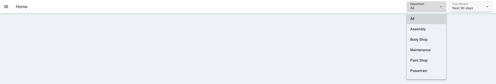
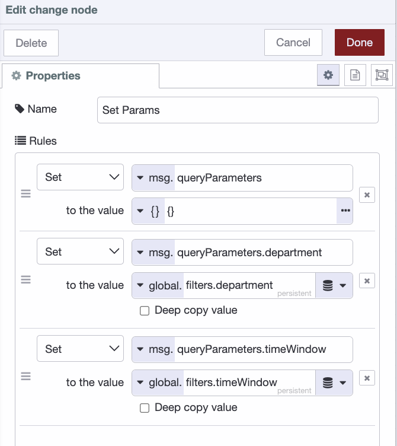
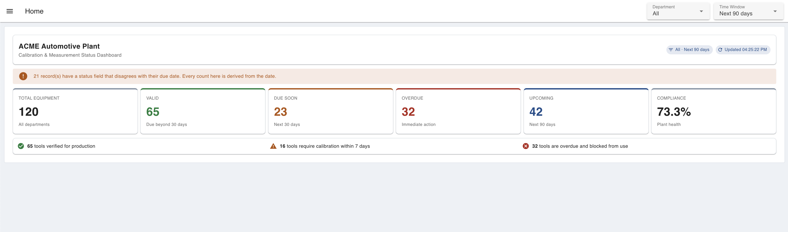
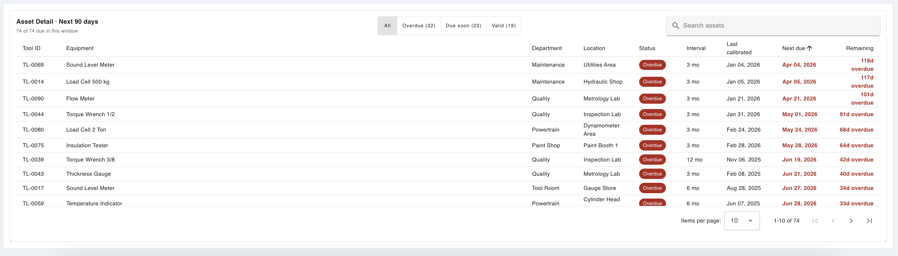
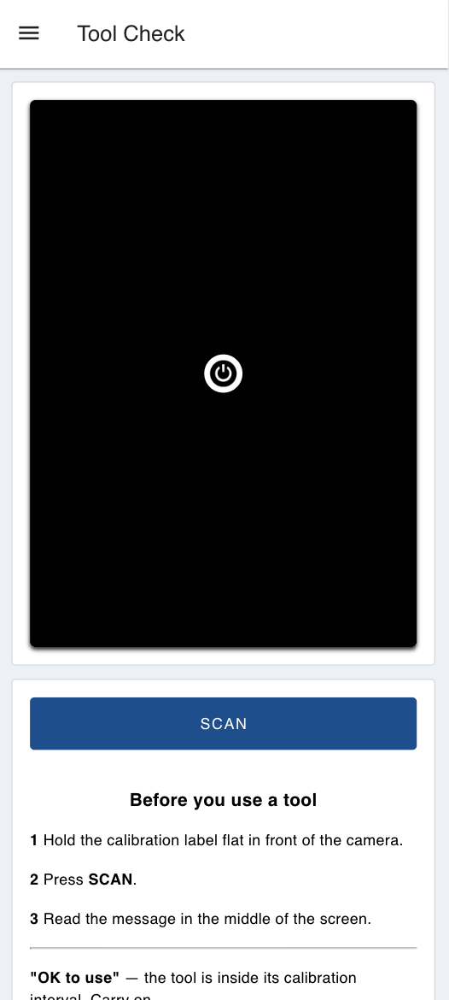

Most plants know their calibration status at two moments: when someone updates the spreadsheet, and when an auditor asks. The records already hold enough to do better than that: a last calibration date, an interval, and a next due date for every instrument.

<!--more-->

Most registers also have a status field next to those dates, and reading it seems like the obvious move. But whatever writes that field can fall behind. Then the dashboard reports a compliant plant while due dates quietly pass. This build works out every figure from the due date instead, and counts how often the stored status disagrees with it.

For background on calibration records, including what they should contain, how calibration intervals are determined, and why overdue instruments matter, see [What Is Instrument Calibration (Equipment Calibration)?](/blog/2026/07/what-is-instrument-calibration/).

A screen in the quality office is only half the job, though. The moment that matters is when someone picks up a torque wrench, and that person isn't looking at a dashboard. So the same check also runs behind a camera at the station: scan the label, get a verdict.

 *The finished dashboard: filters in the app bar, KPI row, and asset detail table on one page.*

In this article, we'll build a calibration application in FlowFuse. It will show plant-level compliance figures, let you filter by department and time window, give an asset-level view of what's due and when, and offer a camera-based tool check for the shop floor.

> **Note:** This tutorial reads from a `calibration_assets` table in FlowFuse Tables, filled with sample instruments. Everything here works the same against a real calibration register, a CMMS, or an ERP endpoint. Only the query nodes change.

You can interact with the live demo here: <a href="https://clever-garden-warbler-2554.flowfuse.cloud/dashboard/home" onclick="if (typeof capture !== 'undefined') { capture('blog-live-demo', { reference: 'Blog: {{ title | escape }}' }); }">Try the Calibration Status Dashboard Demo</a>.

## What You'll Need

Before you start building, get these ready:

- **A FlowFuse account.** [Sign up]() for FlowFuse Cloud, or use a self-hosted instance.
- **A FlowFuse instance up and running.** If you don't have one yet, create a new instance from your FlowFuse Platform.
- **FlowFuse Dashboard installed.** This tutorial uses `@flowfuse/node-red-dashboard` nodes (`ui-template`, `ui-event`, `ui-button`, `ui-markdown`, `ui-notification`, `ui-page`, `ui-group`, `ui-theme`) to build both pages. Install it from the Palette Manager if it isn't already in your instance.
- **A webcam node and an OCR node.** The Tool Check page uses `@sumit_shinde_84/node-red-dashboard-2-ui-webcam` to capture the label and `@sumit_shinde_84/node-red-contrib-simple-ocr` to read it. Install both from the Palette Manager.
- **A device with a camera** for the Tool Check page, since the scanner works through the browser.

> **Note:** [FlowFuse Tables](/docs/user/ff-tables/) is available to Enterprise tier teams on FlowFuse Cloud, and to Enterprise licensed self-hosted teams running on Kubernetes. If you're on a different tier, use any external database instead, such as Postgres or MySQL, with the standard database nodes from the palette. The SQL here is standard PostgreSQL, and the widgets only care about the shape of the rows, not where they came from.

## How the Application Works

Before we build anything, let's walk through what the application does. There are two pages, and one idea holding them together.

1. **Home.** A quality engineer picks a department and how far ahead to look. Six figures across the top show how much equipment there is, and how much of it is valid, due soon, overdue, coming up in the chosen window, and compliant overall. Below that is a list of instruments due inside that window, most urgent first, each with its status, due date, and days remaining. The cards describe the whole register for the chosen department. Only the **Upcoming** figure and the table below respond to the time window.
2. **Tool Check.** An operator holds a calibration label up to the camera and presses **SCAN**. The app reads the tool ID off the label, looks it up, and shows an answer in the middle of the screen: **OK to use**, **Do not use**, **Not in register**, or **Label not readable**. No numbers to interpret and no dashboard to search through.

The due date is the single source of truth for the whole application. Every KPI figure, every status chip in the table, and the scanner's verdict all come from comparing that date to the current time. That is what stops the office screen and the station gate from ever telling two different stories about the same tool.

## Importing the Simulated Flow

Instead of pointing the application at a live calibration register, we'll generate one.

1. Import the following flow into FlowFuse and click **Deploy**.
2. Click the trigger on **Create Table**, then the trigger on **Generate & Insert Automotive Calibration Dataset**. **Drop Table** is there for when you want to start over from scratch.

::render-flow{:height="300"}
```json
[{"id":"8a0785431b6b7a69","type":"group","z":"673ee3520831d89e","style":{"stroke":"#b2b3bd","stroke-opacity":"1","fill":"#f2f3fb","fill-opacity":"0.5","label":true,"label-position":"nw","color":"#32333b"},"nodes":["45bd6920b3f0f449","842c753f842b71e6","996c79e5aab802e7","d127e13f8fd0dd03","625821abbf04b74c","7b0b7067116ee8a1","8cc39dc849a910fa","e572d03e9887ce33","82643d26e04f2f09","365ee7bcc61d7f58"],"x":54,"y":79,"w":892,"h":242},{"id":"45bd6920b3f0f449","type":"debug","z":"673ee3520831d89e","g":"8a0785431b6b7a69","name":"Result","active":true,"tosidebar":true,"console":false,"tostatus":false,"complete":"payload","targetType":"msg","statusVal":"","statusType":"auto","x":850,"y":280,"wires":[]},{"id":"842c753f842b71e6","type":"tables-query","z":"673ee3520831d89e","g":"8a0785431b6b7a69","name":"Create Table","query":"CREATE TABLE IF NOT EXISTS calibration_assets (\n    tool_id TEXT PRIMARY KEY,\n    equipment_name TEXT NOT NULL,\n    location TEXT NOT NULL,\n    department TEXT NOT NULL,\n    serial_number TEXT NOT NULL,\n    calibration_interval_months INTEGER NOT NULL,\n    last_calibration_ts TIMESTAMP NOT NULL,\n    next_due_ts TIMESTAMP NOT NULL,\n    status TEXT NOT NULL,\n    calibration_lab TEXT,\n    certificate_no TEXT,\n    created_at TIMESTAMP DEFAULT CURRENT_TIMESTAMP\n);","split":false,"rowsPerMsg":1,"x":330,"y":180,"wires":[["d127e13f8fd0dd03"]]},{"id":"996c79e5aab802e7","type":"inject","z":"673ee3520831d89e","g":"8a0785431b6b7a69","name":"Trigger","props":[{"p":"payload"}],"repeat":"","crontab":"","once":false,"onceDelay":0.1,"topic":"","payload":"","payloadType":"date","x":150,"y":180,"wires":[["842c753f842b71e6"]]},{"id":"d127e13f8fd0dd03","type":"debug","z":"673ee3520831d89e","g":"8a0785431b6b7a69","name":"Result","active":true,"tosidebar":true,"console":false,"tostatus":false,"complete":"payload","targetType":"msg","statusVal":"","statusType":"auto","x":850,"y":180,"wires":[]},{"id":"625821abbf04b74c","type":"function","z":"673ee3520831d89e","g":"8a0785431b6b7a69","name":"Generate & Insert Automotive Calibration Dataset","func":"// Generate realistic automotive calibration dataset\nconst departments = [\n  { name: 'Assembly', locations: ['Engine Line 1', 'Engine Line 2', 'Transmission Line', 'Final Assembly A', 'Final Assembly B'] },\n  { name: 'Body Shop', locations: ['BIW Cell 1', 'BIW Cell 2', 'Weld Cell 3', 'Robot Cell 5'] },\n  { name: 'Paint Shop', locations: ['Pretreatment', 'E-Coat', 'Paint Booth 1', 'Paint Booth 2'] },\n  { name: 'Powertrain', locations: ['Engine Test Cell', 'Dynamometer Area', 'Cylinder Head Line'] },\n  { name: 'Quality', locations: ['Inspection Lab', 'Metrology Lab', 'Chassis Inspection', 'Audit Room'] },\n  { name: 'Tool Room', locations: ['Tool Crib', 'Tool Room', 'Gauge Store'] },\n  { name: 'Maintenance', locations: ['Hydraulic Shop', 'Electrical Shop', 'Utilities Area'] },\n  { name: 'R&D', locations: ['NVH Lab', 'Prototype Shop', 'Validation Lab'] }\n];\n\nconst equipment = [\n  'Torque Wrench 1/2', 'Torque Wrench 3/8', 'Digital Torque Tester',\n  'Micrometer 0-25 mm', 'Micrometer 25-50 mm', 'Vernier Caliper 150 mm',\n  'Height Gauge 300 mm', 'Dial Gauge', 'Bore Gauge',\n  'Thread Plug Gauge M10', 'Thread Plug Gauge M12', 'Thread Ring Gauge M12',\n  'Pressure Gauge 0-10 bar', 'Pressure Gauge 0-25 bar', 'Digital Pressure Transducer',\n  'Thermocouple Calibrator', 'Temperature Indicator', 'Infrared Thermometer',\n  'Sound Level Meter', 'Sound Level Calibrator',\n  'CMM Probe', 'CMM Reference Sphere', 'Surface Roughness Tester',\n  'Digital Multimeter', 'Insulation Tester', 'Clamp Meter',\n  'Flow Meter', 'Mass Flow Controller', 'Load Cell 500 kg',\n  'Load Cell 2 Ton', 'Force Gauge 1000 N', 'Force Gauge 5000 N',\n  'Thickness Gauge', 'Coating Thickness Gauge', 'Paint Viscosity Cup'\n];\n\nconst labs = [\n  'ABC Calibration Lab',\n  'Metro Metrology',\n  'Precision Labs',\n  'National Metrology Services',\n  'Industrial Calibration Centre'\n];\n\nfunction rand(arr) {\n  return arr[Math.floor(Math.random() * arr.length)];\n}\n\nfunction randomTimestamp(startDate, endDate) {\n  const start = startDate.getTime();\n  const end = endDate.getTime();\n  const d = new Date(start + Math.random() * (end - start));\n\n  // Working hours 07:00-17:00\n  d.setHours(7 + Math.floor(Math.random() * 10));\n  d.setMinutes(Math.floor(Math.random() * 60));\n  d.setSeconds(Math.floor(Math.random() * 60));\n  d.setMilliseconds(0);\n\n  return d.toISOString().slice(0, 19).replace('T', ' ');\n}\n\nfunction addMonths(ts, months) {\n  const d = new Date(ts.replace(' ', 'T'));\n  d.setMonth(d.getMonth() + months);\n  return d.toISOString().slice(0, 19).replace('T', ' ');\n}\n\nconst today = new Date('2026-07-28T10:00:00');\n\nlet values = [];\n\nfor (let i = 1; i <= 120; i++) {\n\n  const dept = rand(departments);\n  const location = rand(dept.locations);\n  const equip = rand(equipment);\n  const interval = rand([3, 6, 6, 6, 12, 12]);\n\n  // Status distribution\n  const r = Math.random();\n  let status;\n  if (r < 0.10) status = 'Overdue';\n  else if (r < 0.30) status = 'DueSoon';\n  else status = 'Valid';\n\n  let lastCal;\n  let nextDue;\n\n  if (status === 'Valid') {\n    lastCal = randomTimestamp(new Date('2026-01-01'), new Date('2026-06-30'));\n    nextDue = addMonths(lastCal, interval);\n\n  } else if (status === 'DueSoon') {\n\n    lastCal = randomTimestamp(new Date('2026-01-01'), new Date('2026-05-31'));\n\n    const d = new Date(today);\n    d.setDate(d.getDate() + Math.floor(Math.random() * 14));\n    d.setHours(8 + Math.floor(Math.random() * 8));\n    d.setMinutes(Math.floor(Math.random() * 60));\n    d.setSeconds(0);\n\n    nextDue = d.toISOString().slice(0, 19).replace('T', ' ');\n\n  } else {\n\n    lastCal = randomTimestamp(new Date('2025-01-01'), new Date('2025-12-31'));\n\n    const d = new Date(today);\n    d.setDate(d.getDate() - (1 + Math.floor(Math.random() * 45)));\n    d.setHours(8 + Math.floor(Math.random() * 8));\n    d.setMinutes(Math.floor(Math.random() * 60));\n    d.setSeconds(0);\n\n    nextDue = d.toISOString().slice(0, 19).replace('T', ' ');\n  }\n\n  const toolId = 'TL-' + String(i).padStart(4, '0');\n  const serial = 'SN' + (100000 + i);\n  const cert = 'CAL-2026-' + String(1000 + i);\n  const lab = rand(labs);\n\n  values.push(\n    `('${toolId}','${equip}','${location}','${dept.name}','${serial}',${interval},'${lastCal}','${nextDue}','${status}','${lab}','${cert}')`\n  );\n}\n\nmsg.query = `\nINSERT INTO calibration_assets\n(tool_id, equipment_name, location, department, serial_number,\n calibration_interval_months, last_calibration_ts, next_due_ts,\n status, calibration_lab, certificate_no)\nVALUES\n${values.join(',\\n')};\n`;\n\nreturn msg;","outputs":1,"timeout":0,"noerr":0,"initialize":"","finalize":"","libs":[],"x":430,"y":280,"wires":[["8cc39dc849a910fa"]]},{"id":"7b0b7067116ee8a1","type":"inject","z":"673ee3520831d89e","g":"8a0785431b6b7a69","name":"Trigger","props":[{"p":"payload"}],"repeat":"","crontab":"","once":false,"onceDelay":0.1,"topic":"","payload":"","payloadType":"date","x":150,"y":280,"wires":[["625821abbf04b74c"]]},{"id":"8cc39dc849a910fa","type":"tables-query","z":"673ee3520831d89e","g":"8a0785431b6b7a69","name":"Query","query":"","split":false,"rowsPerMsg":1,"x":710,"y":280,"wires":[["45bd6920b3f0f449"]]},{"id":"e572d03e9887ce33","type":"tables-query","z":"673ee3520831d89e","g":"8a0785431b6b7a69","name":"Drop Table","query":"DROP TABLE IF EXISTS calibration_assets;\n","split":false,"rowsPerMsg":1,"x":330,"y":120,"wires":[["365ee7bcc61d7f58"]]},{"id":"82643d26e04f2f09","type":"inject","z":"673ee3520831d89e","g":"8a0785431b6b7a69","name":"Trigger","props":[{"p":"payload"}],"repeat":"","crontab":"","once":false,"onceDelay":0.1,"topic":"","payload":"","payloadType":"date","x":150,"y":120,"wires":[["e572d03e9887ce33"]]},{"id":"365ee7bcc61d7f58","type":"debug","z":"673ee3520831d89e","g":"8a0785431b6b7a69","name":"Result","active":true,"tosidebar":true,"console":false,"tostatus":false,"complete":"payload","targetType":"msg","statusVal":"","statusType":"auto","x":850,"y":120,"wires":[]},{"id":"993b160c135046a2","type":"global-config","env":[],"modules":{"@flowfuse/nr-tables-nodes":"0.2.2"}}]
```
::

That gives you 120 instruments with IDs from `TL-0001` to `TL-0120`, spread across eight departments: roughly 70% valid, 20% due soon, and 10% overdue. The eight department names are the same ones the filter dropdown offers later.

Everything we build reads from these columns:

| Column | What the application does with it |
| --- | --- |
| `tool_id` | Primary key, and the ID printed on the calibration label that the scanner matches against |
| `next_due_ts` | Every status figure, chip, and scanner verdict comes from comparing this against the current time |
| `status` | The stored label. We deliberately don't trust it, and use it only to spot drift from the dates |
| `department` | Drives the Department filter on the dashboard |
| `equipment_name` | Names the instrument in the table and in the scanner verdict |
| `location`, `calibration_interval_months`, `last_calibration_ts` | Table columns |
| `serial_number`, `calibration_lab`, `certificate_no`, `created_at` | Kept for reference; nothing in this build shows them |

> **Note:** Your register will likely name these columns differently. Alias your columns in the `SELECT` list, as in `SELECT gauge_ref AS tool_id, cal_due_date AS next_due_ts, ...`, and every widget will still work. Only the due-date column is essential.

Before running the generator, set its reference date near the top of the function, `const today = new Date('2026-07-28T10:00:00')`, to roughly today's date. Otherwise everything will land relative to a date in the past.

## Setting Up the Dashboard Layout

The application has two pages and four groups. Most widgets sit inside a named group. The filter bar is scoped to the page instead, because it appears in the app bar rather than in the grid. See the [Dashboard layout docs](https://dashboard.flowfuse.com/getting-started) if you're new to how pages, groups, and bases relate.

1. Create two **ui-page** nodes. The Dashboard automatically creates a base dashboard the first time you add a Dashboard node to the canvas.

   - **Home** (path: `/home`): the calibration status dashboard. Set the layout to **Grid**.
   - **Tool Check** (path: `/tool-check`): the scanner. Set the layout to **Notebook**.

2. On the **Home** page, create two **ui-group** nodes, both **12 columns** wide with **Show title** turned off:

   - **KPIs** (order 1)
   - **Asset Detail** (order 2)

3. On the **Tool Check** page, create two more **ui-group** nodes, also **12 columns** wide with titles off:

   - **Scanner** (order 1)
   - **Verdict** (order 2)

4. Open the **ui-base** node and set **Header Content** to **page**. This shows the app bar, which the filter widget needs.
5. Set up the ui-theme to suit your needs. The dashboard already comes with a default theme, which you can use for now.

## Building the Filter Bar

Two controls drive the page: which department, and how far ahead to look. Both sit in the app bar rather than the grid, so no row of the page is used up by a dropdown.

The department list is read from the register itself, not typed in by hand, so adding a department next year doesn't mean editing a flow. The time windows are fixed, because "next 30 days" is a choice this application makes rather than something the data tells you.

1. Add a `ui-event` node named "Page Load / Refresh Event" and select your "My Dashboard" ui-base. It fires whenever a page loads.

2. Add a `tables-query` node named "Load Departments":

> **Tip:** You don't have to write the SQL yourself either. Use [FlowFuse Expert](/blog/2025/09/ai-assistant-flowfuse-tables/) and describe what you want the query to return in plain English, and it will generate the SQL for you.

```sql
SELECT DISTINCT department
FROM calibration_assets
WHERE department IS NOT NULL
  AND btrim(department) <> ''
ORDER BY department;
```

1. Import the **App Header Filters** `ui-template` below, set its type to **Widget (Page-Scoped)**, select the **Home** page, and turn off **Pass through messages from input to output**. The complete component is provided below, so there's no need to build it yourself. It shows two dropdowns in the header using Vue's [Teleport](/blog/2024/08/customise-theming-in-your-dashboards/#adding-elements-in-the-header): **Department**, filled from the query above, and **Time Window**. It opens on *All* departments and *Next 90 days*, sends `{ department, timeWindow }` on every change, and sends the same on load so the dropdowns and the data always agree.

> **Tip:** Whenever you need a custom Dashboard widget, you don't have to write the Vue code yourself. Use [FlowFuse Expert](/docs/user/expert/node-red-embedded-ai/#css-and-html-generation-for-flowfuse-dashboard) and describe the widget in plain English, and it will generate the `ui-template` for you.

::render-flow{:height="300"}
```json
[{"id":"e263486a1e3ea8ea","type":"ui-template","z":"1c5b2364213044a7","g":"c619d111b9911c0b","group":"","page":"89515a0645eddeee","ui":"","name":"App Header Filters","order":1,"width":0,"height":0,"head":"","format":"<template>\n  <Teleport v-if=\"mounted\" to=\"#app-bar-actions\">\n    <div class=\"filter-bar\">\n\n      <!-- Department: options come from the register, not from this file -->\n      <v-select v-model=\"department\" :items=\"departments\" label=\"Department\" density=\"compact\" variant=\"solo-filled\"\n        hide-details style=\"width: 180px\" @update:model-value=\"sendFilters\"></v-select>\n\n      <!-- Time Window -->\n      <v-select v-model=\"timeWindow\" :items=\"timeWindows\" label=\"Time Window\" density=\"compact\" variant=\"solo-filled\"\n        hide-details style=\"width: 200px\" @update:model-value=\"sendFilters\"></v-select>\n\n    </div>\n  </Teleport>\n</template>\n\n<script>\n  export default {\n    data() {\n      return {\n        mounted: false,\n\n        // Filters reset to these on every page load. Nothing is remembered.\n        // 90 days is deliberate: at 30 the Upcoming card would just repeat\n        // Due soon, and the control would look like it does nothing.\n        department: 'All',\n        timeWindow: 'Next 90 days',\n\n        // Replaced by the list read from the register. Starts as just 'All'\n        // so the control is usable before the query comes back.\n        departments: ['All'],\n\n        // Fixed: these are windows the app defines, not data.\n        timeWindows: [\n          'Next 7 days',\n          'Next 30 days',\n          'Next 90 days',\n          'All future'\n        ]\n      }\n    },\n\n    watch: {\n      msg: {\n        handler(msg) { this.applyMsg(msg) },\n        deep: true\n      }\n    },\n\n    mounted() {\n      this.mounted = true;\n      this.applyMsg(this.msg);\n      this.$socket.on('msg-input:' + this.id, this.applyMsg);\n\n      // A refresh resets the dropdowns to their defaults, so push those\n      // defaults out once. Without this the queries keep reading the previous\n      // selection from context, and the numbers wouldn't match the dropdowns.\n      this.sendFilters();\n    },\n\n    unmounted() {\n      this.$socket.off('msg-input:' + this.id, this.applyMsg);\n    },\n\n    methods: {\n      // Receives the Load Departments rows exactly as the database returns\n      // them: [{ department: 'Assembly' }, { department: 'Quality' }, ...]\n      applyMsg(msg) {\n        const rows = msg && msg.payload;\n        if (!Array.isArray(rows)) return;\n\n        const names = rows\n          .map(r => (r && typeof r === 'object') ? r.department : r)\n          .filter(d => typeof d === 'string' && d.trim() !== '');\n\n        // 'All' is ours, not a row in the table.\n        if (names.length) {\n          this.departments = ['All', ...new Set(names)];\n        }\n      },\n\n      sendFilters() {\n        this.send({\n          payload: {\n            department: this.department,\n            timeWindow: this.timeWindow\n          }\n        });\n      }\n    }\n  }\n</script>\n\n<style>\n  .filter-bar {\n    display: flex;\n    align-items: center;\n    gap: 12px;\n    padding-right: 12px;\n  }\n\n  /* Make controls compact in the app bar */\n  .filter-bar .v-input {\n    margin-top: 0 !important;\n  }\n</style>","storeOutMessages":true,"passthru":false,"resendOnRefresh":true,"templateScope":"widget:page","className":"","x":810,"y":80,"wires":[["b9c34ba932fa101c"]]},{"id":"89515a0645eddeee","type":"ui-page","name":"Home","ui":"6481b1c613ec9a93","path":"/home","icon":"home","layout":"grid","theme":"faac104f34962f3e","breakpoints":[{"name":"Default","px":"0","cols":"3"},{"name":"Tablet","px":"576","cols":"6"},{"name":"Small Desktop","px":"768","cols":"9"},{"name":"Desktop","px":"1024","cols":"12"}],"order":1,"className":"","visible":"true","disabled":"false"},{"id":"6481b1c613ec9a93","type":"ui-base","name":"My Dashboard","path":"/dashboard","appIcon":"","includeClientData":true,"acceptsClientConfig":["ui-notification","ui-control","ui-number-input","ui-file-input","ui-button","ui-button-group","ui-dropdown","ui-radio-group","ui-slider","ui-switch","ui-text","ui-table","ui-gauge","ui-chart","ui-template","ui-markdown","ui-progress","ui-webcam"],"showPathInSidebar":false,"headerContent":"page","navigationStyle":"default","titleBarStyle":"default","showReconnectNotification":true,"notificationDisplayTime":1,"showDisconnectNotification":true,"allowInstall":false},{"id":"faac104f34962f3e","type":"ui-theme","name":"Default Theme","colors":{"surface":"#ffffff","primary":"#1e4e8c","bgPage":"#eef1f5","groupBg":"#ffffff","groupOutline":"#d3dae3"},"sizes":{"density":"default","pagePadding":"12px","groupGap":"12px","groupBorderRadius":"4px","widgetGap":"12px"}},{"id":"6f4ad536fc64beb9","type":"global-config","env":[],"modules":{"@flowfuse/node-red-dashboard":"1.30.2"}}]
```
::

4. Add a `change` node named "Save Filters to Global Context" and set the persistent global `filters` to `msg.payload`.

5. Add a `link out` node named "Filters Changed". This is what makes the page respond right away. Changing a dropdown writes the new selection to context, but nothing would redraw until the next poll tick, so the operator would be looking at stale numbers for up to fifteen seconds. The link carries the change straight into the next flow, which re-runs its query and refreshes the page.

6. Wire the nodes: **Page Load / Refresh Event → Load Departments → App Header Filters → Save Filters to Global Context → Filters Changed**.

 *The Department and Time Window dropdowns shown in the app bar, with departments read from the register.*

## Working Out the KPI Figures from the Due Dates

This is where we stop using the register's `status` column. Every figure on the page comes from comparing `next_due_ts` against the current time, and one extra count reports how often the stored status disagrees with that comparison.

1. Add an `inject` node named "Poll Data (15 sec)", set it to repeat every **15** seconds and to fire once shortly after deploy, so the page has data before the first tick.

2. Add a `link in` node named "Filters Changed" and point it at the link out from the filter bar.

3. Add a `change` node named "Set Params". This maps the saved filters onto the `$department` and `$timeWindow` parameters the SQL reads. Set three rules, in order:

   - Set `queryParameters` to `{}` (JSON): starts clean so old values don't linger.
   - Set `queryParameters.department` to `filters.department` (global persistent).
   - Set `queryParameters.timeWindow` to `filters.timeWindow` (global persistent).

 *The "Set Params" change node open in the edit panel, all three rules visible.*

1. Add a `tables-query` node named "KPI Query":

```sql
SELECT
    -- Sent back so the cards label themselves from the data on screen,
    -- not from whatever the dropdowns happen to show. COALESCE covers the
    -- first poll after deploy, before any browser has sent a selection.
    COALESCE($department::text, 'All')          AS filter_department,
    COALESCE($timeWindow::text, 'Next 90 days') AS filter_window,

    COUNT(*) AS total_assets,

    -- Buckets worked out from next_due_ts instead of the stored status column,
    -- which drifts whenever whatever writes it falls behind. These three
    -- don't overlap, and add up to total_assets. The 30-day threshold is a
    -- policy decision, not a view setting: it does not change with the dropdown.
    COUNT(*) FILTER (
        WHERE next_due_ts > NOW() + INTERVAL '30 days'
    ) AS valid_assets,

    COUNT(*) FILTER (
        WHERE next_due_ts >= NOW()
          AND next_due_ts <= NOW() + INTERVAL '30 days'
    ) AS due_soon_assets,

    COUNT(*) FILTER (
        WHERE next_due_ts < NOW()
    ) AS overdue_assets,

    -- The only figure the Time Window dropdown affects. It sends a label, so
    -- it maps to an interval here; ELSE also catches an unrecognised label.
    COUNT(*) FILTER (
        WHERE next_due_ts >= NOW()
          AND next_due_ts <= NOW() + (
              CASE COALESCE($timeWindow::text, 'Next 90 days')
                  WHEN 'Next 7 days'  THEN INTERVAL '7 days'
                  WHEN 'Next 30 days' THEN INTERVAL '30 days'
                  WHEN 'Next 90 days' THEN INTERVAL '90 days'
                  WHEN 'All future'   THEN INTERVAL '100 years'
                  ELSE INTERVAL '90 days'
              END
          )
    ) AS due_in_window,

    COUNT(*) FILTER (
        WHERE next_due_ts BETWEEN NOW()
                            AND NOW() + INTERVAL '7 days'
    ) AS due_next_7_days,

    -- Compliance means "inside its calibration interval", which includes
    -- tools due soon, since they have not expired yet.
    ROUND(
        COUNT(*) FILTER (WHERE next_due_ts >= NOW()) * 100.0
        / NULLIF(COUNT(*), 0),
        1
    ) AS valid_percentage,

    -- Counts records where the stored status and the live date disagree, so
    -- the drift shows up on the dashboard instead of staying hidden.
    COUNT(*) FILTER (
        WHERE (status = 'Overdue') <> (next_due_ts < NOW())
    ) AS stale_status_count

FROM calibration_assets
-- Driven by the Department dropdown; 'All' turns the filter off.
WHERE (COALESCE($department::text, 'All') = 'All'
       OR department = $department::text);
```

`stale_status_count` is the figure worth watching. It counts the rows where the stored status and the due date disagree, which is the number that justifies leaving the status column out of every other calculation.

5. Add a `link out` node named "Refresh Asset Table" and wire it from **Set Params**, so the table below runs on the same selection instead of working it out again.

6. Import the **KPI Cards** `ui-template` below and assign it to the **KPIs** group. The complete component is provided below, so there's no need to build it yourself. It shows a header with the active filter and a last-updated time, six cards for total equipment, valid, due soon, overdue, upcoming and compliance, and a three-line summary strip. When `stale_status_count` is above zero it also shows a warning banner naming the number of drifted records.

::render-flow{:height="300"}
```json
[{"id":"1e9b85cd8f2fdc3c","type":"ui-template","z":"1c5b2364213044a7","g":"3ed935d02285b78b","group":"05fdb0d422eb75af","page":"","ui":"","name":"KPI Cards","order":1,"width":0,"height":0,"head":"","format":"<template>\n    <v-container fluid class=\"pa-2\">\n\n        <!-- Header -->\n        <v-card class=\"pa-4 mb-3\" elevation=\"1\" rounded=\"lg\">\n            <v-row align=\"center\">\n                <v-col cols=\"12\" md=\"7\">\n                    <div class=\"text-h6 font-weight-bold\">ACME Automotive Plant</div>\n                    <div class=\"text-body-2 text-medium-emphasis\">\n                        Calibration &amp; Measurement Status Dashboard\n                    </div>\n                </v-col>\n\n                <v-col cols=\"12\" md=\"5\" class=\"text-md-right\">\n                    <v-chip v-if=\"filters.department\" color=\"primary\" variant=\"tonal\" size=\"small\" class=\"mr-2\">\n                        <v-icon start size=\"16\">mdi-filter-variant</v-icon>\n                        {{ filters.department }} &middot; {{ filters.window }}\n                    </v-chip>\n                    <v-chip v-if=\"updatedAt\" color=\"primary\" variant=\"tonal\" size=\"small\">\n                        <v-icon start size=\"16\">mdi-refresh</v-icon>\n                        Updated {{ updatedAtText }}\n                    </v-chip>\n                </v-col>\n            </v-row>\n        </v-card>\n\n        <!-- Loading state until the first query result arrives -->\n        <v-alert v-if=\"!loaded\" type=\"info\" variant=\"tonal\" density=\"compact\" class=\"mb-3\">\n            Waiting for calibration data...\n        </v-alert>\n\n        <!-- Data quality: the stored status column has drifted from the dates -->\n        <v-alert v-if=\"kpi.stale_status_count > 0\" type=\"warning\" variant=\"tonal\"\n            density=\"compact\" class=\"mb-3\">\n            {{ kpi.stale_status_count }} record(s) have a status field that disagrees with\n            their due date. Every count here is derived from the date.\n        </v-alert>\n\n        <!-- KPI Cards -->\n        <v-row dense>\n\n            <v-col cols=\"12\" sm=\"6\" md=\"2\">\n                <v-card class=\"pa-4 h-100 border-neutral\" elevation=\"1\" rounded=\"lg\">\n                    <div class=\"text-caption text-medium-emphasis\">TOTAL EQUIPMENT</div>\n                    <div class=\"text-h4 font-weight-bold mt-2\">{{ show(kpi.total_assets) }}</div>\n                    <div class=\"text-caption text-medium-emphasis mt-2\">\n                        {{ filters.department === 'All' ? 'All departments' : filters.department }}\n                    </div>\n                </v-card>\n            </v-col>\n\n            <v-col cols=\"12\" sm=\"6\" md=\"2\">\n                <v-card class=\"pa-4 h-100 border-success\" elevation=\"1\" rounded=\"lg\">\n                    <div class=\"text-caption text-medium-emphasis\">VALID</div>\n                    <div class=\"text-h4 font-weight-bold mt-2 text-success\">{{ show(kpi.valid_assets) }}</div>\n                    <div class=\"text-caption text-medium-emphasis mt-2\">Due beyond 30 days</div>\n                </v-card>\n            </v-col>\n\n            <v-col cols=\"12\" sm=\"6\" md=\"2\">\n                <v-card class=\"pa-4 h-100 border-warning\" elevation=\"1\" rounded=\"lg\">\n                    <div class=\"text-caption text-medium-emphasis\">DUE SOON</div>\n                    <div class=\"text-h4 font-weight-bold mt-2 text-warning\">{{ show(kpi.due_soon_assets) }}</div>\n                    <div class=\"text-caption text-medium-emphasis mt-2\">Next 30 days</div>\n                </v-card>\n            </v-col>\n\n            <v-col cols=\"12\" sm=\"6\" md=\"2\">\n                <v-card class=\"pa-4 h-100 border-danger\" elevation=\"1\" rounded=\"lg\">\n                    <div class=\"text-caption text-medium-emphasis\">OVERDUE</div>\n                    <div class=\"text-h4 font-weight-bold mt-2 text-error\">{{ show(kpi.overdue_assets) }}</div>\n                    <div class=\"text-caption text-medium-emphasis mt-2\">Immediate action</div>\n                </v-card>\n            </v-col>\n\n            <v-col cols=\"12\" sm=\"6\" md=\"2\">\n                <v-card class=\"pa-4 h-100 border-info\" elevation=\"1\" rounded=\"lg\">\n                    <div class=\"text-caption text-medium-emphasis\">UPCOMING</div>\n                    <div class=\"text-h4 font-weight-bold mt-2 text-info\">{{ show(kpi.due_in_window) }}</div>\n                    <div class=\"text-caption text-medium-emphasis mt-2\">{{ filters.window }}</div>\n                </v-card>\n            </v-col>\n\n            <v-col cols=\"12\" sm=\"6\" md=\"2\">\n                <v-card class=\"pa-4 h-100 border-neutral\" elevation=\"1\" rounded=\"lg\">\n                    <div class=\"text-caption text-medium-emphasis\">COMPLIANCE</div>\n                    <div class=\"text-h4 font-weight-bold mt-2\">{{ show(kpi.valid_percentage) }}%</div>\n                    <div class=\"text-caption text-medium-emphasis mt-2\">Plant health</div>\n                </v-card>\n            </v-col>\n\n        </v-row>\n\n        <!-- Status Strip -->\n        <v-card class=\"pa-3 mt-3\" elevation=\"1\" rounded=\"lg\">\n            <v-row dense align=\"center\">\n                <v-col cols=\"12\" md=\"4\">\n                    <div class=\"d-flex align-center\">\n                        <v-icon color=\"success\" class=\"mr-2\">mdi-check-circle</v-icon>\n                        <span class=\"text-body-2\">\n                            <strong>{{ show(kpi.valid_assets) }}</strong> tools verified for production\n                        </span>\n                    </div>\n                </v-col>\n\n                <v-col cols=\"12\" md=\"4\">\n                    <div class=\"d-flex align-center\">\n                        <v-icon color=\"warning\" class=\"mr-2\">mdi-alert</v-icon>\n                        <span class=\"text-body-2\">\n                            <strong>{{ show(kpi.due_next_7_days) }}</strong> tools require calibration within 7 days\n                        </span>\n                    </div>\n                </v-col>\n\n                <v-col cols=\"12\" md=\"4\">\n                    <div class=\"d-flex align-center\">\n                        <v-icon color=\"error\" class=\"mr-2\">mdi-close-circle</v-icon>\n                        <span class=\"text-body-2\">\n                            <strong>{{ show(kpi.overdue_assets) }}</strong> tools are overdue and blocked from use\n                        </span>\n                    </div>\n                </v-col>\n            </v-row>\n        </v-card>\n\n    </v-container>\n</template>\n\n<script>\n    export default {\n        data() {\n            return {\n                loaded: false,\n                updatedAt: null,\n\n                // Echoed back from the query so the cards always describe\n                // the data actually on screen, not the pending selection.\n                filters: {\n                    department: '',\n                    window: ''\n                },\n\n                kpi: {\n                    total_assets: null,\n                    valid_assets: null,\n                    due_soon_assets: null,\n                    overdue_assets: null,\n                    due_in_window: null,\n                    due_next_7_days: null,\n                    stale_status_count: null,\n                    valid_percentage: null\n                }\n            }\n        },\n\n        computed: {\n            updatedAtText() {\n                if (!this.updatedAt) return ''\n                return this.updatedAt.toLocaleTimeString([], {\n                    hour: '2-digit',\n                    minute: '2-digit',\n                    second: '2-digit'\n                })\n            }\n        },\n\n        // Catches the message that Dashboard replays on page load / refresh,\n        // which can arrive before the socket listener below is registered.\n        watch: {\n            msg: {\n                handler(msg) { this.applyMsg(msg) },\n                immediate: true,\n                deep: true\n            }\n        },\n\n        mounted() {\n            this.applyMsg(this.msg)\n            this.$socket.on('msg-input:' + this.id, this.applyMsg)\n        },\n\n        unmounted() {\n            this.$socket.off('msg-input:' + this.id, this.applyMsg)\n        },\n\n        methods: {\n            applyMsg(msg) {\n                const payload = msg && msg.payload\n                if (!payload) return\n\n                // The Query node returns an ARRAY of rows unless \"Split results\"\n                // is on with 1 row per message. Take the first row either way.\n                const row = Array.isArray(payload) ? payload[0] : payload\n                if (!row || typeof row !== 'object') return\n\n                if (row.filter_department) this.filters.department = row.filter_department\n                if (row.filter_window) this.filters.window = row.filter_window\n\n                const next = {}\n                for (const key of Object.keys(this.kpi)) {\n                    if (row[key] === undefined || row[key] === null) continue\n                    // COUNT() is BIGINT and ROUND() is NUMERIC - pg returns both\n                    // as strings, so coerce to Number for display and maths.\n                    const num = Number(row[key])\n                    next[key] = Number.isFinite(num) ? num : row[key]\n                }\n\n                this.kpi = { ...this.kpi, ...next }\n                this.loaded = true\n                this.updatedAt = new Date()\n            },\n\n            show(value) {\n                return (value === null || value === undefined) ? '-' : value\n            }\n        }\n    }\n</script>\n\n<style>\n    /* The ui-theme node only carries the four structural colours, so the\n       semantic ones are redefined here. This block is unscoped, so it\n       applies to every widget on the page. */\n    :root,\n    [class*=\"v-theme--\"] {\n        --v-theme-success: 21, 128, 61 !important;\n        --v-theme-warning: 180, 83, 9 !important;\n        --v-theme-error: 179, 38, 30 !important;\n        --v-theme-info: 30, 78, 140 !important;\n\n        /* Text and icons sitting on top of a filled chip or button. */\n        --v-theme-on-success: 255, 255, 255 !important;\n        --v-theme-on-warning: 255, 255, 255 !important;\n        --v-theme-on-error: 255, 255, 255 !important;\n        --v-theme-on-info: 255, 255, 255 !important;\n    }\n\n    .border-neutral {\n        border-top: 4px solid #8894a6;\n    }\n\n    .border-success {\n        border-top: 4px solid rgb(var(--v-theme-success));\n    }\n\n    .border-warning {\n        border-top: 4px solid rgb(var(--v-theme-warning));\n    }\n\n    .border-danger {\n        border-top: 4px solid rgb(var(--v-theme-error));\n    }\n\n    .border-info {\n        border-top: 4px solid rgb(var(--v-theme-info));\n    }\n</style>","storeOutMessages":true,"passthru":true,"resendOnRefresh":true,"templateScope":"local","className":"","x":800,"y":240,"wires":[[]]},{"id":"05fdb0d422eb75af","type":"ui-group","name":"KPIs","page":"89515a0645eddeee","width":"12","height":1,"order":1,"showTitle":false,"className":"","visible":"true","disabled":"false","groupType":"default"},{"id":"89515a0645eddeee","type":"ui-page","name":"Home","ui":"6481b1c613ec9a93","path":"/home","icon":"home","layout":"grid","theme":"faac104f34962f3e","breakpoints":[{"name":"Default","px":"0","cols":"3"},{"name":"Tablet","px":"576","cols":"6"},{"name":"Small Desktop","px":"768","cols":"9"},{"name":"Desktop","px":"1024","cols":"12"}],"order":1,"className":"","visible":"true","disabled":"false"},{"id":"6481b1c613ec9a93","type":"ui-base","name":"My Dashboard","path":"/dashboard","appIcon":"","includeClientData":true,"acceptsClientConfig":["ui-notification","ui-control","ui-number-input","ui-file-input","ui-button","ui-button-group","ui-dropdown","ui-radio-group","ui-slider","ui-switch","ui-text","ui-table","ui-gauge","ui-chart","ui-template","ui-markdown","ui-progress","ui-webcam"],"showPathInSidebar":false,"headerContent":"page","navigationStyle":"default","titleBarStyle":"default","showReconnectNotification":true,"notificationDisplayTime":1,"showDisconnectNotification":true,"allowInstall":false},{"id":"faac104f34962f3e","type":"ui-theme","name":"Default Theme","colors":{"surface":"#ffffff","primary":"#1e4e8c","bgPage":"#eef1f5","groupBg":"#ffffff","groupOutline":"#d3dae3"},"sizes":{"density":"default","pagePadding":"12px","groupGap":"12px","groupBorderRadius":"4px","widgetGap":"12px"}},{"id":"057822a3ade579c5","type":"global-config","env":[],"modules":{"@flowfuse/node-red-dashboard":"1.30.2"}}]
```
::

7. Wire the nodes: **Poll Data (15 sec) → Set Params → KPI Query → KPI Cards**, and **Filters Changed → Set Params**.

Deploy and open `/home`. The six cards fill in, and on the seeded data the drift banner should appear right away, because the generator creates records whose stored status no longer matches their due date.

 *Six figures worked out from the due dates, with the active filter and refresh time shown in the header.*

## Listing Every Instrument with Days Remaining

The cards tell a supervisor how much is overdue. This table tells them which tools, so someone can actually go and collect them. It's a worklist rather than a full register dump, which is why the time window scopes it down.

1. Add a `link in` node named "Refresh Asset Table" and point it at the link out from the KPI flow. Taking the filters from that message instead of reading context again is what keeps the table and the cards working from the same selection.

2. Add a `tables-query` node named "Asset Rows":

```sql
SELECT
    -- Sent back so the table can state its own scope in the header.
    COALESCE($timeWindow::text, 'Next 90 days') AS filter_window,

    tool_id,
    equipment_name,
    department,
    location,
    serial_number,

    -- Same 30-day policy threshold as the KPI buckets, so a tool never reads
    -- one status here and another elsewhere. The bare column name still
    -- refers to the table column.
    CASE
        WHEN next_due_ts < NOW() THEN 'Overdue'
        WHEN next_due_ts <= NOW() + INTERVAL '30 days' THEN 'DueSoon'
        ELSE 'Valid'
    END AS status,
    status AS stored_status,

    last_calibration_ts,
    next_due_ts,
    calibration_interval_months,
    calibration_lab,
    certificate_no,

    -- Negative for anything already past due, which the widget shows as
    -- "12d overdue" rather than "-12d".
    (next_due_ts::date - CURRENT_DATE) AS days_remaining

FROM calibration_assets

-- This is a worklist, not the whole register: the window scopes it to what
-- needs attention. Overdue tools have a past due date, so the upper bound
-- already includes them; no separate clause needed.
WHERE (COALESCE($department::text, 'All') = 'All'
       OR department = $department::text)
  AND next_due_ts <= NOW() + (
      CASE COALESCE($timeWindow::text, 'Next 90 days')
          WHEN 'Next 7 days'  THEN INTERVAL '7 days'
          WHEN 'Next 30 days' THEN INTERVAL '30 days'
          WHEN 'Next 90 days' THEN INTERVAL '90 days'
          WHEN 'All future'   THEN INTERVAL '100 years'
          ELSE INTERVAL '90 days'
      END
  )

ORDER BY next_due_ts ASC
LIMIT 500;
```

Sorting by due date ascending puts the worst offenders at the top, which is the only order that makes a calibration list useful. `stored_status` is included but not used by the widget, so it's there when you want to see exactly which records have drifted rather than just how many.

3. Import the **Asset Table** `ui-template` below and assign it to the **Asset Detail** group. The complete component is provided below, so there's no need to build it yourself. It shows a Vuetify data table with a status chip per row, formatted dates, and days remaining shown as "12d overdue" or "due today". Its header names the active window, so it's clear the list is scoped rather than the full register. Above the table sit a search box and a status toggle with live counts for Overdue, Due soon and Valid, filtering the rows already on the page without hitting the database again. The Department column hides itself when every row belongs to the same department, since a single-department view makes it a fixed value.

::render-flow{:height="300"}
```json
[{"id":"9bb12e97685f0e01","type":"ui-template","z":"1c5b2364213044a7","g":"e7cdada1bef716e5","group":"13c06e7c625a1885","page":"","ui":"","name":"Asset Table","order":1,"width":0,"height":0,"head":"","format":"<template>\n    <v-card class=\"pa-4\" elevation=\"1\" rounded=\"lg\">\n\n        <!-- Toolbar -->\n        <v-row dense align=\"center\" class=\"mb-2\">\n            <v-col cols=\"12\" md=\"5\">\n                <div class=\"text-subtitle-1 font-weight-bold\">\n                    Asset Detail<span v-if=\"windowLabel\"> &middot; {{ windowLabel }}</span>\n                </div>\n                <div class=\"text-caption text-medium-emphasis\">\n                    {{ filteredRows.length }} of {{ rows.length }} due in this window\n                </div>\n            </v-col>\n\n            <v-col cols=\"12\" md=\"4\">\n                <v-btn-toggle v-model=\"statusFilter\" density=\"compact\" variant=\"outlined\" divided mandatory>\n                    <v-btn value=\"All\" size=\"small\">All</v-btn>\n                    <v-btn value=\"Overdue\" size=\"small\" color=\"error\">\n                        Overdue ({{ counts.Overdue }})\n                    </v-btn>\n                    <v-btn value=\"DueSoon\" size=\"small\" color=\"warning\">\n                        Due soon ({{ counts.DueSoon }})\n                    </v-btn>\n                    <v-btn value=\"Valid\" size=\"small\" color=\"success\">\n                        Valid ({{ counts.Valid }})\n                    </v-btn>\n                </v-btn-toggle>\n            </v-col>\n\n            <v-col cols=\"12\" md=\"3\">\n                <v-text-field v-model=\"search\" label=\"Search assets\" density=\"compact\" variant=\"solo-filled\"\n                    hide-details clearable prepend-inner-icon=\"mdi-magnify\"></v-text-field>\n            </v-col>\n        </v-row>\n\n        <v-data-table :headers=\"visibleHeaders\" :items=\"filteredRows\" :search=\"search\" :sort-by=\"sortBy\"\n            :items-per-page=\"10\" density=\"compact\" item-value=\"tool_id\" fixed-header height=\"420\" hover>\n\n            <template #item.status=\"{ item }\">\n                <v-chip :color=\"cell(item).status_color\" size=\"small\" variant=\"flat\">\n                    {{ cell(item).status }}\n                </v-chip>\n            </template>\n\n            <template #item.last_calibration_ts=\"{ item }\">\n                {{ cell(item).last_cal_text }}\n            </template>\n\n            <template #item.next_due_ts=\"{ item }\">\n                <span :class=\"cell(item).days_remaining < 0 ? 'text-error font-weight-bold' : ''\">\n                    {{ cell(item).next_due_text }}\n                </span>\n            </template>\n\n            <template #item.days_remaining=\"{ item }\">\n                <span :class=\"cell(item).days_remaining < 0 ? 'text-error font-weight-bold' : ''\">\n                    {{ cell(item).days_text }}\n                </span>\n            </template>\n\n            <template #item.calibration_interval_months=\"{ item }\">\n                {{ cell(item).calibration_interval_months }} mo\n            </template>\n\n            <template #no-data>\n                <div class=\"pa-6 text-center text-medium-emphasis\">\n                    No assets match the current filters.\n                </div>\n            </template>\n\n        </v-data-table>\n    </v-card>\n</template>\n\n<script>\n    export default {\n        data() {\n            return {\n                rows: [],\n                windowLabel: '',\n                search: '',\n                statusFilter: 'All',\n                sortBy: [{ key: 'next_due_ts', order: 'asc' }],\n                headers: [\n                    { title: 'Tool ID', key: 'tool_id', width: '110px' },\n                    { title: 'Equipment', key: 'equipment_name' },\n                    { title: 'Department', key: 'department', width: '130px' },\n                    { title: 'Location', key: 'location', width: '140px' },\n                    { title: 'Status', key: 'status', width: '120px' },\n                    { title: 'Interval', key: 'calibration_interval_months', width: '100px' },\n                    { title: 'Last calibrated', key: 'last_calibration_ts', width: '140px' },\n                    { title: 'Next due', key: 'next_due_ts', width: '140px' },\n                    { title: 'Remaining', key: 'days_remaining', align: 'end', width: '120px' }\n                ]\n            }\n        },\n\n        computed: {\n            filteredRows() {\n                if (this.statusFilter === 'All') return this.rows\n                return this.rows.filter(r => r.status === this.statusFilter)\n            },\n\n            // A single-department view makes that column a constant, so drop it.\n            visibleHeaders() {\n                const depts = new Set(this.rows.map(r => r.department))\n                if (depts.size > 1) return this.headers\n                return this.headers.filter(h => h.key !== 'department')\n            },\n\n            counts() {\n                const c = { Overdue: 0, DueSoon: 0, Valid: 0 }\n                for (const r of this.rows) {\n                    if (c[r.status] !== undefined) c[r.status]++\n                }\n                return c\n            }\n        },\n\n        watch: {\n            msg: {\n                handler(msg) { this.applyMsg(msg) },\n                immediate: true,\n                deep: true\n            }\n        },\n\n        mounted() {\n            this.applyMsg(this.msg)\n            this.$socket.on('msg-input:' + this.id, this.applyMsg)\n        },\n\n        unmounted() {\n            this.$socket.off('msg-input:' + this.id, this.applyMsg)\n        },\n\n        methods: {\n            applyMsg(msg) {\n                const payload = msg && msg.payload\n                if (!Array.isArray(payload)) return\n\n                // Constant across rows; used to caption the table's scope.\n                if (payload[0] && payload[0].filter_window) {\n                    this.windowLabel = payload[0].filter_window\n                }\n\n                this.rows = payload\n                    .filter(r => r && typeof r === 'object')\n                    .map(r => {\n                        const days = (r.days_remaining === null || r.days_remaining === undefined)\n                            ? null\n                            : Number(r.days_remaining)\n                        return {\n                            ...r,\n                            days_remaining: days,\n                            last_cal_text: this.fmtDate(r.last_calibration_ts),\n                            next_due_text: this.fmtDate(r.next_due_ts),\n                            days_text: this.daysText(days),\n                            status_color: this.statusColor(r.status)\n                        }\n                    })\n            },\n\n            // Vuetify 3 passes the raw item on some minors and a wrapper on\n            // others, so normalise before reading fields.\n            cell(item) {\n                return (item && item.raw) ? item.raw : item\n            },\n\n            fmtDate(value) {\n                if (!value) return '-'\n                const d = new Date(value)\n                if (isNaN(d.getTime())) return value\n                return d.toLocaleDateString([], { day: '2-digit', month: 'short', year: 'numeric' })\n            },\n\n            daysText(days) {\n                if (days === null) return '-'\n                if (days < 0) return Math.abs(days) + 'd overdue'\n                if (days === 0) return 'due today'\n                return days + 'd'\n            },\n\n            statusColor(status) {\n                if (status === 'Overdue') return 'error'\n                if (status === 'DueSoon') return 'warning'\n                if (status === 'Valid') return 'success'\n                return 'grey'\n            }\n        }\n    }\n</script>","storeOutMessages":true,"passthru":false,"resendOnRefresh":true,"templateScope":"local","className":"","x":590,"y":400,"wires":[[]]},{"id":"13c06e7c625a1885","type":"ui-group","name":"Asset Detail","page":"89515a0645eddeee","width":"12","height":1,"order":2,"showTitle":false,"className":"","visible":"true","disabled":"false","groupType":"default"},{"id":"89515a0645eddeee","type":"ui-page","name":"Home","ui":"6481b1c613ec9a93","path":"/home","icon":"home","layout":"grid","theme":"faac104f34962f3e","breakpoints":[{"name":"Default","px":"0","cols":"3"},{"name":"Tablet","px":"576","cols":"6"},{"name":"Small Desktop","px":"768","cols":"9"},{"name":"Desktop","px":"1024","cols":"12"}],"order":1,"className":"","visible":"true","disabled":"false"},{"id":"6481b1c613ec9a93","type":"ui-base","name":"My Dashboard","path":"/dashboard","appIcon":"","includeClientData":true,"acceptsClientConfig":["ui-notification","ui-control","ui-number-input","ui-file-input","ui-button","ui-button-group","ui-dropdown","ui-radio-group","ui-slider","ui-switch","ui-text","ui-table","ui-gauge","ui-chart","ui-template","ui-markdown","ui-progress","ui-webcam"],"showPathInSidebar":false,"headerContent":"page","navigationStyle":"default","titleBarStyle":"default","showReconnectNotification":true,"notificationDisplayTime":1,"showDisconnectNotification":true,"allowInstall":false},{"id":"faac104f34962f3e","type":"ui-theme","name":"Default Theme","colors":{"surface":"#ffffff","primary":"#1e4e8c","bgPage":"#eef1f5","groupBg":"#ffffff","groupOutline":"#d3dae3"},"sizes":{"density":"default","pagePadding":"12px","groupGap":"12px","groupBorderRadius":"4px","widgetGap":"12px"}},{"id":"563dc603fb7848c5","type":"global-config","env":[],"modules":{"@flowfuse/node-red-dashboard":"1.30.2"}}]
```
::

4. Wire the nodes: **Refresh Asset Table → Asset Rows → Asset Table**.

Deploy and open `/home`. The table fills in below the cards, most urgent first, with its header naming the window it covers. Change a dropdown and both halves of the page update together.

 *Instruments due inside the selected window, soonest due first, with status chips and days remaining.*

> **Note:** The toggle counts describe the table, not the register, so they will read lower than the cards above. That's the point of the split: the cards answer "how are we doing," and the table answers "what needs collecting." Select *All future* and the two match.

## Checking a Tool at the Station

A dashboard in the quality office doesn't reach the person about to pick up a torque wrench. This page does: hold the calibration label to a camera, press one button, get one answer.

1. Add a `ui-button` node named "Scan Label Button" in the **Verdict** group, order 1. Set the label to `SCAN` and the payload to the string `capture`, which tells the webcam to take a frame.

2. Add a `ui-webcam` node in the **Scanner** group, with **Pass through** and **QR detection** both off. Leave image width, height and quality blank to use the camera's defaults.

3. Add a `change` node that sets `msg.payload` to `msg.payload.image`. The webcam outputs an object; the OCR node just needs the image.

4. Add a `simple-ocr` node, then a `link out` / `link in` pair to carry the result down to the next row of the canvas.

> **Tip:** OCR keeps this tutorial hardware-free, but if your labels have a barcode or QR code, scanning one is faster and far more reliable than reading printed text. Swap the camera and OCR nodes for a [barcode scanner](/node-red/peripheral/barcodescanner/) and feed the decoded ID straight into "Set Tool ID," and everything downstream will keep working. You can also drop "Extract Tool ID" and "Scan Valid?", since a scanner either returns an ID or nothing.

5. Add a `function` node named "Extract Tool ID":

> **Tip:** The same goes for function node logic. Describe what you want the function to do in plain English, and [FlowFuse Expert](/docs/user/expert/node-red-embedded-ai/#function-node-creation) will generate the code for you.

```javascript
// Stickers read TL followed by four digits. OCR loses the hyphen and swaps
// look-alike characters, so normalise before matching.
const text = String(msg.payload?.text || msg.payload || '');
const flat = text.toUpperCase().replace(/[^A-Z0-9]/g, '');

const FIXES = { O: '0', Q: '0', I: '1', L: '1', S: '5', B: '8', Z: '2', G: '6' };

const m = flat.match(/T[L1I]([A-Z0-9]{4})/);
const digits = m ? m[1].replace(/[A-Z]/g, c => FIXES[c] || c) : '';
const toolId = /^\d{4}$/.test(digits) ? 'TL-' + digits : null;

msg.payload = {
    success: !!toolId,
    toolId,
    // Shows what OCR actually read when a scan fails.
    rawText: text.replace(/\s+/g, ' ').trim()
};
return msg;
```

Wire a `debug` node to this as well and leave it enabled. When a scan fails, `rawText` shows what the camera actually read, which is the difference between fixing the label and guessing at it.

> **Note:** The pattern above expects `TL` followed by four digits, because that's what the seeded data uses. Your labels almost certainly look different: a different prefix, more digits, a plant code, or no letters at all. Change the regex and the length check to match your own sticker format before you test this on real tools, or every scan will come back as **Label not readable**.

6. Add a `switch` node named "Scan Valid?" on `payload.success`, with **is true** on the first output and **otherwise** on the second. A failed read skips the database entirely.

7. Add a `change` node named "Set Tool ID" on the true branch, with two rules:

   - Set `queryParameters` to the JSONata `{ "toolId": $trim(payload.toolId) }`
   - Set `scannedId` to the JSONata `$trim(payload.toolId)`, so the ID survives to the verdict even when no row comes back

8. Add a `tables-query` node named "Look Up Tool":

```sql
SELECT
    tool_id,
    equipment_name,

    -- The safety answer comes from the date, not the stored status flag,
    -- which can go stale if whatever recalculates it falls behind.
    (next_due_ts >= NOW()) AS ok_to_use

FROM calibration_assets

-- Deliberately NOT filtered by department or time window: a scan is a
-- lookup of one tool, not a view. Case, padding and hyphens are all
-- normalised away, at the cost of the index, which is fine at register size.
WHERE replace(upper(btrim(tool_id)), '-', '')
    = replace(upper(btrim($toolId)), '-', '');
```

9. Add a `function` node named "Build Verdict". Wire **both** the query output and the switch's second output into it:

```javascript
// Two paths feed this node: a completed lookup, and a failed scan routed
// straight past the query. Tell them apart by payload shape.
const p = msg.payload;

if (p?.success === false) {
    msg.payload = { state: 'scan_failed' };
    return msg;
}

const row = Array.isArray(p) ? p[0] : p;

if (!row?.tool_id) {
    msg.payload = { state: 'not_found', scannedId: msg.scannedId };
    return msg;
}

msg.payload = {
    state: row.ok_to_use ? 'ok' : 'blocked',
    tool: row
};
return msg;
```

Four states come out of it, and they're the only four an operator ever sees:

| State | When | Verdict |
| --- | --- | --- |
| `ok` | Due date in the future | **OK to use**, green |
| `blocked` | Due date has passed | **Do not use**, red |
| `not_found` | ID read, no matching row | **Not in register**, amber |
| `scan_failed` | No `TL-####` pattern found | **Label not readable**, amber |

10. Add a `function` node named "Format Notification". It shows what was scanned, the verdict, and what to do about it:

```javascript
const v = msg.payload || {};
const t = v.tool;

// timeout 0 on 'blocked' is deliberate: an expired-tool verdict must be
// dismissed by a person, not fade out while nobody is watching.
const VERDICTS = {
    ok:          { text: 'OK to use',          do: 'Carry on.',                        color: '#15803d', timeout: 8 },
    blocked:     { text: 'Do not use',         do: 'Tag it and tell your supervisor.',  color: '#b3261e', timeout: 0 },
    not_found:   { text: 'Not in register',    do: 'Tell your supervisor.',             color: '#b45309', timeout: 12 },
    scan_failed: { text: 'Label not readable', do: 'Wipe the label and scan again.',    color: '#b45309', timeout: 8 }
};

const cfg = VERDICTS[v.state] || VERDICTS.scan_failed;

// ui-notification renders raw HTML, so escape what came from the register.
const esc = s => String(s ?? '').replace(/[<>&"]/g,
    c => ({ '<': '&lt;', '>': '&gt;', '&': '&amp;', '"': '&quot;' }[c]));

const scanned = t
    ? esc(t.tool_id) + ' - ' + esc(t.equipment_name)
    : esc(v.scannedId || 'No ID read');

msg.payload = `<div style="font-size:1rem;opacity:.85">${scanned}</div>`
    + `<div style="font-size:2rem;font-weight:700;margin:4px 0">${cfg.text}</div>`
    + `<div style="font-size:1rem">${cfg.do}</div>`;

msg.color = cfg.color;
msg.timeout = cfg.timeout;
return msg;
```

11. Add a `ui-notification` node named "Verdict" and select your ui-base. Set **Position** to **center center**, turn off **Use default colour**, turn on **Show countdown**, **Allow dismiss** and **Allow raw HTML**. The display time and colour on the node are only fallbacks; `msg.timeout` and `msg.color` override them for each verdict.

12. Add a `ui-markdown` node named "Tool Check Instructions" in the **Verdict** group, order 2:

```markdown
<div style="text-align: center">

### Before you use a tool

</div>

**1** Hold the calibration label flat in front of the camera.

**2** Press **SCAN**.

**3** Read the message in the middle of the screen.

---

**"OK to use"**: the tool is inside its calibration interval. Carry on.

**"Do not use"**: set the tool aside, tag it, and tell your supervisor. If you have already used it on parts today, say so; those measurements need checking.

**"Not in register"** or **"Label not readable"**: wipe the label and scan again. If it fails twice, tell your supervisor.

---

Anything other than **"OK to use"** means the tool stays out of production.
```

13. Wire the nodes: **Scan Label Button → ui-webcam → change → simple-ocr → Extract Tool ID → Scan Valid?**, then **Scan Valid? (true) → Set Tool ID → Look Up Tool → Build Verdict**, and **Scan Valid? (otherwise) → Build Verdict → Format Notification → Verdict**.

Deploy and open `/tool-check` on a device with a camera. Hold a label reading `TL-0007`, or one in whatever format you configured above, in front of it and press **SCAN**. Whatever the seeded data says about that tool is what comes back. Because the verdict compares the date instead of reading the status column, it will always agree with the Home page.

 *The scanner page: camera preview, one button, and the operator instructions below it.*

## What Next

You've built a calibration application that answers two different questions from the same data. The office screen tells a quality engineer how the plant stands and what needs collecting this week. The station screen tells an operator whether the tool in their hand is fit to use. Both read the due date, so neither can drift from the other.

Right now it runs on generated data. To go live, remove the simulator flow and point the queries at your own register. Just alias your column names in the `SELECT` lists, and everything downstream keeps working. If your records sit in a CMMS or ERP behind an API, swap the query nodes for `http request` nodes and nothing else changes. From there, the obvious next steps are ones the register already supports: email the overdue list to the calibration lab each Monday, or [notify](/node-red/notification/) someone the moment a critical gauge goes overdue instead of waiting for a screen to be looked at. The same approach works for [defect tracking](/blog/2026/07/defect-and-quality-monitoring/) and [downtime](/blog/2026/07/build-downtime-logger/) too. See how manufacturers are using it on our [automotive solutions page](/industries/automotive/).
