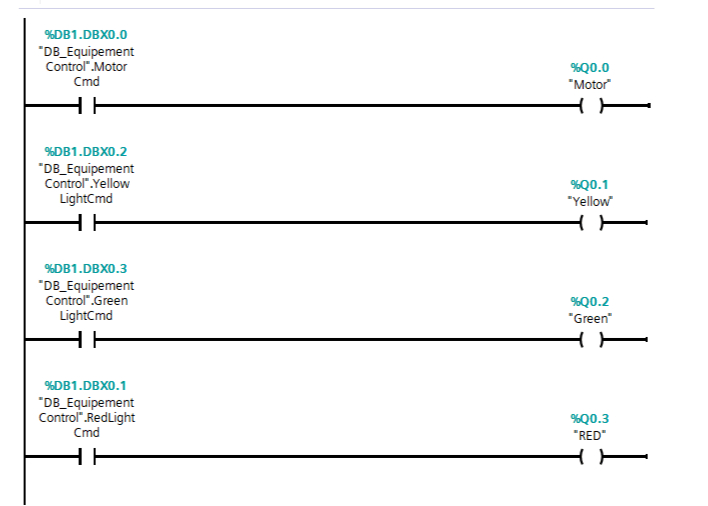
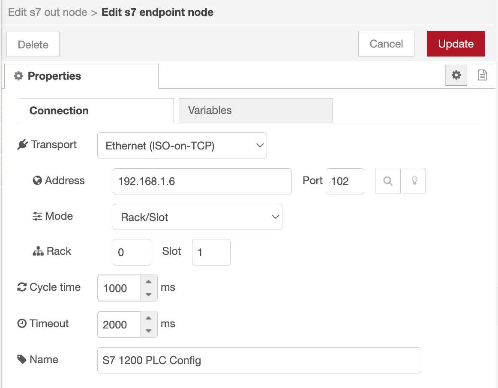
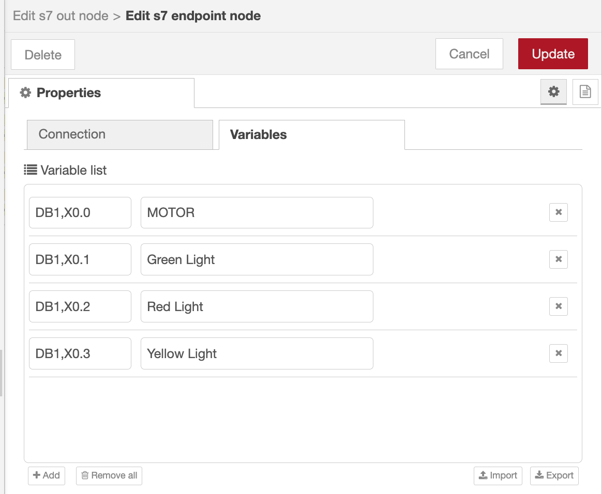
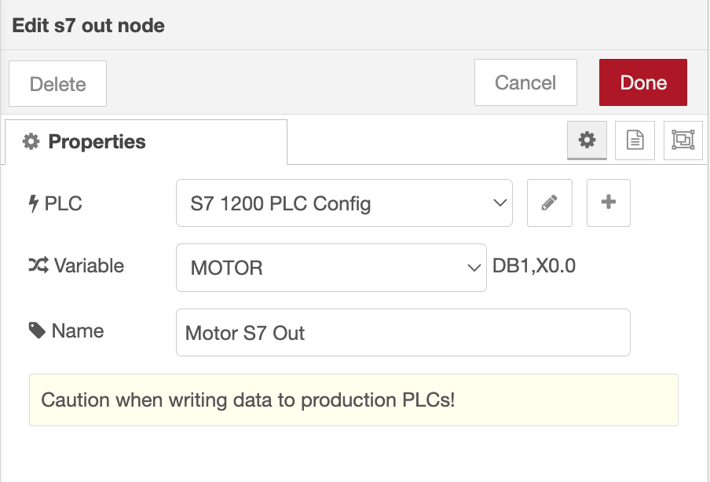
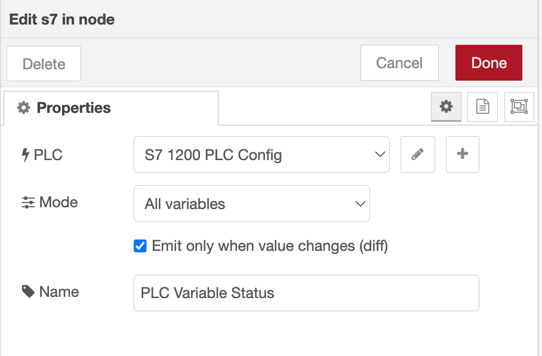
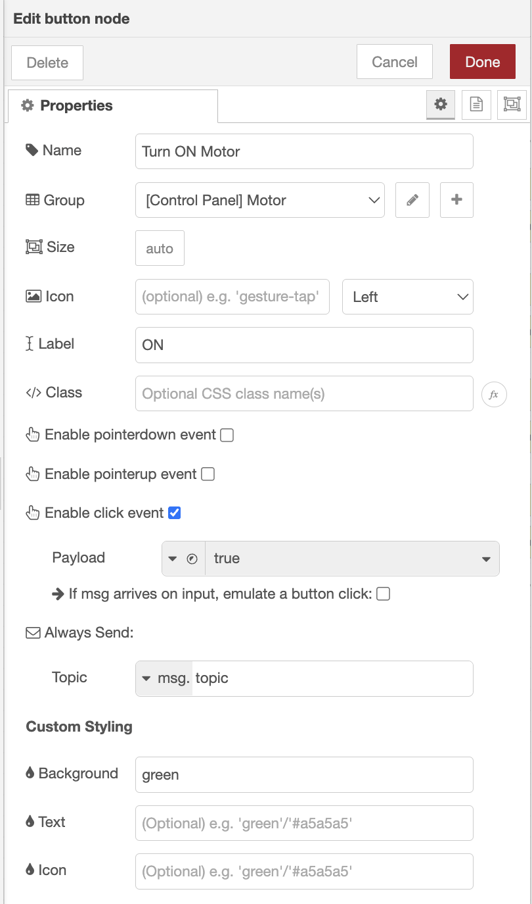
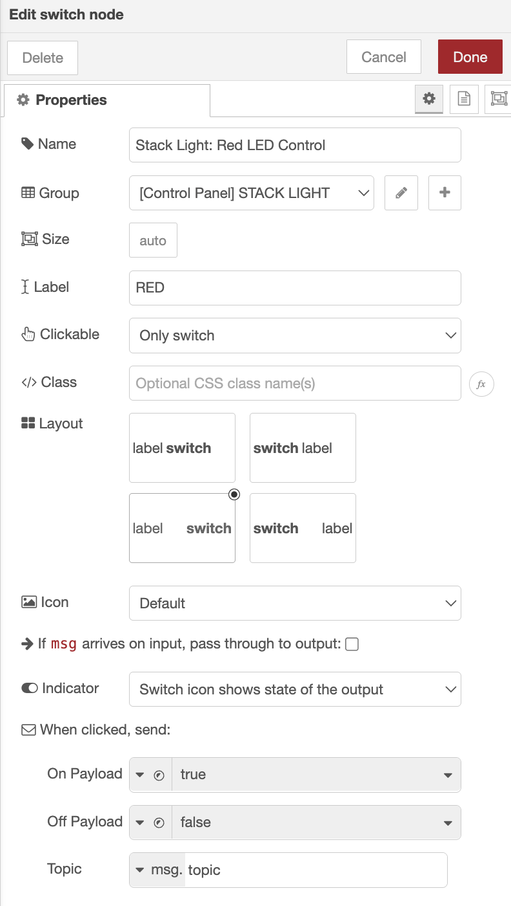
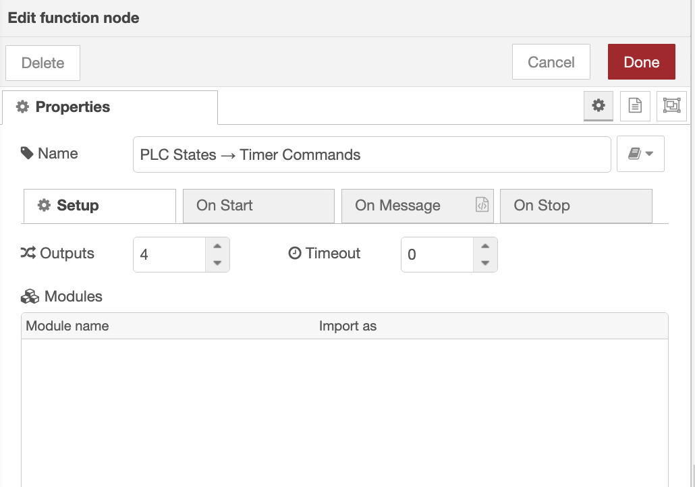
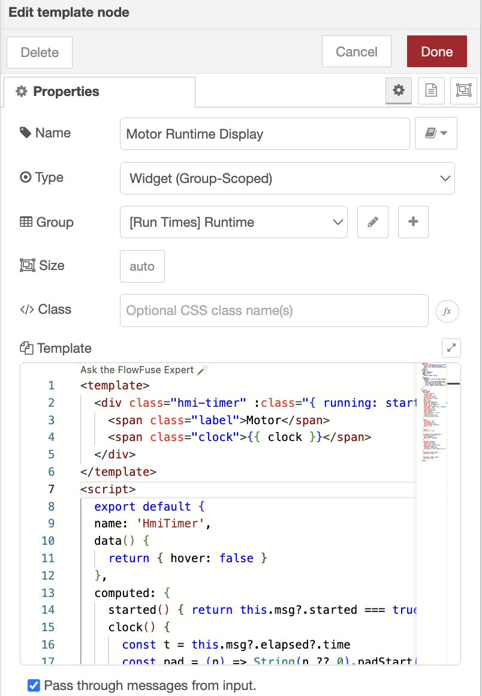

Operators need more than buttons to control machines - they also need visibility into what's actually happening on the factory floor. Knowing whether a motor is running is useful, but knowing how long it has been running helps with maintenance, production tracking, and troubleshooting.

<!--more-->

In this tutorial, you'll connect FlowFuse to a Siemens S7 PLC, build an operator dashboard to control a motor and stack light, and automatically track the runtime of each device. By the end, you'll have a dashboard that not only sends commands to the PLC but also displays live operating time for every connected device.

<lite-youtube
  videoid="kiOufj0ghxg"
  style="width: 100%; aspect-ratio: 16/9; background-image: url('/blog/2026/07/images/demo-thumbnail.jpg'); background-size: cover; background-position: center;"
  title="Control and Track the Shopfloor Machines">
</lite-youtube>

## Prerequisites

Before you begin, make sure you have the following:

- A Siemens S7 PLC, or **S7-PLCSIM** if you're using a simulated PLC.
- A FlowFuse instance running on your edge device with the Device Agent installed. If you don't already have one, [sign up]() and follow the [Device Agent Quick Start guide](/docs/device-agent/quickstart/) to connect your first device.
- The following packages installed:
  - `@flowfuse/node-red-dashboard`
  - `node-red-contrib-s7`
  - `node-red-contrib-hourglass`
- A motor and stack light connected to the PLC, or simulated outputs.

> Note: This tutorial uses a Siemens S7 PLC and the node-red-contrib-s7 package, but FlowFuse isn't limited to S7 PLCs. It has community nodes for most major PLC brands and protocols, including Allen-Bradley/Rockwell (EtherNet/IP), Modbus, OPC UA, Mitsubishi, and more, so you can follow the same pattern with whichever PLC and connection node matches your hardware.

## Example PLC Logic

The demo above uses a simple example PLC program with four normally open contacts stored inside a data block, each controlling a PLC output:

- Motor
- RedLightCmd
- YellowLightCmd
- GreenLightCmd

Whenever one of these data block values is set to `TRUE`, the PLC energizes the corresponding output. Setting the value back to `FALSE` turns the output off again.

Throughout this tutorial, FlowFuse writes to these data block variables whenever an operator interacts with the dashboard. At the same time, it continuously reads those same variables so it always knows the current state of each device. We'll later use those live values to calculate runtime automatically.

If your PLC program is structured differently, that's fine: you just need to know which data block(s) and addresses correspond to the outputs you want to control, and adjust the variable configuration in the following sections accordingly.

The example ladder logic used in this tutorial is shown below.


*The example ladder logic used in this tutorial: four contacts controlling the motor and the three stack light colors.*

## Connecting FlowFuse to the PLC

With an example PLC program in mind, let's establish communication between FlowFuse and the controller.

We'll use the `node-red-contrib-s7` package to communicate with the PLC. The first task is creating an S7 endpoint, which stores the connection details that every S7 node in the flow will reuse.

### Configure the S7 Endpoint

Drag either an **S7 In** or **S7 Out** node onto the workspace and create a new **S7 Endpoint**.

Configure it as follows:

1. Select **Ethernet (ISO on TCP)** as the transport.
2. Enter the PLC's IP address.
3. Leave the port set to **102**.
4. Set the connection mode to **Rack**.
5. Enter the appropriate **Rack** and **Slot** values for your PLC.
6. Set the **Cycle Time** and **Timeout** values according to your application's requirements.

Your configuration should look similar to the example below.


*S7 Endpoint configuration used to connect FlowFuse to the PLC over Ethernet (ISO on TCP).*

The endpoint now manages communication with the PLC, allowing every S7 node in the flow to reuse the same connection rather than creating multiple independent PLC connections.

### Add the PLC Variables

Next, tell the endpoint which PLC variables it should read and write.

1. Open the **Variables** tab.
2. Add the following variables.

| Variable     | Address    |
|--------------|------------|
| Motor        | `DB1,X0.0` |
| Red Light    | `DB1,X0.1` |
| Yellow Light | `DB1,X0.2` |
| Green Light  | `DB1,X0.3` |

These addresses correspond to the example ladder logic used in this tutorial. Replace them with the data block and address values that match the outputs on your own PLC. If you'd like to learn more about how variable addresses are defined for the S7 nodes, see our guide on [Addressing Scheme for Variables in FlowFuse with the S7 Node](/blog/2025/01/integrating-siemens-s7-plcs-with-node-red-guide/#addressing-scheme-for-variables-in-node-red-with-the-s7-node).

After adding them, your configuration should resemble the following.


*The four PLC variables mapped to their data block addresses in the S7 Endpoint.*

### Add the Output Nodes

The dashboard will control each PLC output independently, so we'll create one **S7 Out** node per Output.

1. Drag four **S7 Out** nodes onto the workspace.
2. Configure each node to use the endpoint created earlier.
3. Assign one PLC variable to each node:
   - Motor
   - Red Light
   - Yellow Light
   - Green Light

All four nodes are configured the same way: only the assigned variable changes. For reference, here's the configuration for the **Motor** node; configure the other three the same way, assigning **Red Light**, **Yellow Light**, and **Green Light** respectively.


*Reference configuration for the Motor S7 Out node. Repeat this setup for Red Light, Yellow Light, and Green Light, changing only the assigned variable.*

Each node is now responsible for updating a single PLC variable whenever it receives a new value.

### Read the PLC Status

Writing values to the PLC is only half of the solution. We also need to monitor the current output states so the dashboard always reflects what's happening inside the controller.

1. Drag an **S7 In** node onto the workspace.
2. Select the same S7 Endpoint.
3. Set the node to **All Variables** mode.
4. Connect a **Debug** node to its output.
5. Deploy the flow.

Whenever one of the configured variables changes, the S7 In node publishes the latest state of every PLC variable as a single object.

```javascript
{
    "Motor": true,
    "Red Light": false,
    "Yellow Light": false,
    "Green Light": true
}
```

This message represents the live state of the PLC. Later in the tutorial we'll use these values to synchronize the dashboard and determine when each runtime timer should start or stop.


*S7 In node reading all PLC variables at once and publishing the combined state to a Debug node.*

### Verify the Connection

Once everything has been configured, deploy the flow one final time.

If the connection is successful, every S7 node should display an **Online** status.

At this point, FlowFuse can both control the PLC outputs and continuously monitor their current state. In the next section, we'll use these S7 nodes to build an operator dashboard for controlling the motor and stack light.

## Building the Dashboard

With communication to the PLC established, we can now build the operator interface.

For this tutorial, the dashboard provides controls for both the motor and the stack light. The motor uses two buttons: one to start it and another to stop it, while each stack light color is controlled using its own switch.

The finished dashboard will contain the following widgets.

| Widget | Purpose      |
|--------|--------------|
| Button | Start Motor  |
| Button | Stop Motor   |
| Switch | Red Light    |
| Switch | Yellow Light |
| Switch | Green Light  |

### Control the Motor

Let's start by creating the controls for the motor.

1. Add two **Button** widgets to the dashboard.
2. Configure the first button with:
   - **Label:** Start Motor
   - **Payload:** `true`
3. Configure the second button with:
   - **Label:** Stop Motor
   - **Payload:** `false`
4. Connect both buttons to the **Motor** S7 Out node.

Whenever an operator presses one of these buttons, the corresponding Boolean value is written to the PLC. Writing `true` starts the motor, while writing `false` stops it.

Configure each button the same way, changing only the label and payload. For example, here's the configuration for the **Start Motor** button:


*Example Button widget configuration for Start Motor. Use the same setup for Stop Motor, with the payload set to `false`.*

### Control the Stack Light

Next, create controls for each color of the stack light.

Rather than using buttons, switches are a better choice because they clearly indicate whether each light is currently enabled or disabled.

1. Add three **Switch** widgets to the dashboard.
2. Label them:
   - Red Light
   - Yellow Light
   - Green Light
3. Configure each switch with:
   - **ON Payload:** `true`
   - **OFF Payload:** `false`
4. Connect each switch to its corresponding **S7 Out** node.

When a switch changes state, FlowFuse immediately writes the updated value to the PLC, turning the selected light on or off.

Configure each switch the same way, changing only the label and connected node. For example, here's the configuration for the **Red Light** switch:


*Example Switch widget configuration for Red Light. Use the same setup for Yellow Light and Green Light.*

### Test the Dashboard

At this point the dashboard is fully wired to the PLC.

Deploy the flow and open the dashboard in your browser. Verify that:

- Pressing **Start Motor** starts the motor.
- Pressing **Stop Motor** stops it.
- Each switch controls the correct stack light output.
- Changes made from the dashboard are immediately reflected in the PLC.

You now have a functional PLC control dashboard that can operate each connected device independently.

## Tracking Device Runtime

The dashboard can now control the PLC, but it still doesn't provide any information about how long each device has been operating.

Since the **S7 In** node continuously reports the state of every PLC output, we can use those values to determine when a device starts and stops running. We'll use the **Hourglass** node to maintain an independent runtime counter for each device.

Before connecting the Hourglass nodes, we first need to convert the PLC states into the commands they expect.

### Convert PLC States into Timer Commands

The S7 In node outputs all configured variables as a single object. The Hourglass node, however, expects individual messages containing either a `start` or `stop` command.

We'll use a **Function** node to bridge this gap.

1. Drag a **Function** node onto the workspace after the **S7 In** node.
2. Configure the node with **four outputs**.
3. Replace the default code with the following:

```javascript
return [
    { command: msg.payload.Motor ? "start" : "stop" },
    { command: msg.payload["Red Light"] ? "start" : "stop" },
    { command: msg.payload["Yellow Light"] ? "start" : "stop" },
    { command: msg.payload["Green Light"] ? "start" : "stop" }
];
```

The Function node examines the current state of each PLC output and converts it into either a `start` or `stop` command. Update the field names (`msg.payload.Motor`, etc.) to match the variable names you used in your own PLC Variables configuration.

For example:

- If the motor is running (`true`), the first output sends `{ command: "start" }`.
- If the motor stops (`false`), it sends `{ command: "stop" }`.

The same logic is applied independently to each stack light.


*Function node converting the PLC's live output states into start/stop commands for the four Hourglass nodes.*

### Add the Hourglass Nodes

Now that each device has its own stream of timer commands, we can begin tracking runtime.

1. Drag four Hourglass nodes onto the workspace.
2. Configure each node to use English as the language.
3. Use one Hourglass node for each device:
   - Motor
   - Red Light
   - Yellow Light
   - Green Light

All four nodes use the same configuration: only the device they're wired to changes.

Each Hourglass node maintains its own accumulated runtime. This means every device is tracked independently, allowing the motor and each stack light to start and stop without affecting the timers for the other devices.

### Request Runtime Updates

The Hourglass node stores the elapsed time internally and only reports its current status when requested. To keep the dashboard updated in real time, we'll periodically ask each Hourglass node to publish its current runtime.

1. Add an **Inject** node to the workspace.
2. Configure it to repeat every **1 second**.
3. Set the payload type to **JSON**.
4. Use the following payload:

```json
{
    "command": "status"
}
```

5. Connect the Inject node to all four Hourglass nodes.

Every second, the Inject node sends a `status` command, prompting each Hourglass node to return its latest runtime information.

At this point, every Hourglass node is continuously tracking the runtime of its assigned device and publishing an updated status once per second. The final step is displaying that information on the dashboard.

## Displaying the Runtime

We'll use **UI Template** widgets to build a simple HMI-style runtime display for each device.

### Create the Runtime Display

1. Drag four **UI Template** widgets onto the workspace and configure each one to use the appropriate Page and Group based on your dashboard layout and type to "Widget ( Group Scoped )"
2. Connect each Hourglass node to its corresponding UI Template.
3. Give each widget an appropriate label:
   - Motor
   - Red Light
   - Yellow Light
   - Green Light

> **Note:** The dashboard layout, groups, and theme are intentionally left to your preference. You can organize the widgets in whatever way best suits your application. For guidance on pages, groups, navigation, layouts, and styling in FlowFuse Dashboard, see [FlowFuse Dashboard: Layout, Navigation & Styling](/blog/2024/05/node-red-dashboard-2-layout-navigation-styling/).


Whenever an Hourglass node publishes its status, the connected UI Template receives a message similar to the following.

```javascript
{
    started: true,
    elapsed: {
        time: {
            hours: 0,
            minutes: 12,
            seconds: 34
        }
    }
}
```

The `started` property indicates whether the device is currently running, while `elapsed.time` contains the accumulated runtime.

### Build the Runtime Widget

Paste the following code into each **UI Template** widget, updating only the device label (for example **Motor**, **Red Light**, **Yellow Light**, or **Green Light**) where required.

> **Note:** If you'd like a different design for the runtime widget, you can use **FlowFuse Expert**. Simply describe the UI you want in plain English, and it will generate the component for your dashboard. Learn more about [FlowFuse Expert](/docs/user/expert/node-red-embedded-ai).

```html
<template>
  <div class="hmi-timer" :class="{ running: started }" @mouseenter="hover = true" @mouseleave="hover = false">
    <span class="label">Motor</span>
    <span class="clock">{{ clock }}</span>
  </div>
</template>

<script>
export default {
  name: 'HmiTimer',
  data() {
    return { hover: false }
  },
  computed: {
    started() {
      return this.msg?.started === true
    },
    clock() {
      const t = this.msg?.elapsed?.time
      const pad = (n) => String(n ?? 0).padStart(2, '0')

      if (!t) return '00h:00m:00s'

      return `${pad(t.hours)}h:${pad(t.minutes)}m:${pad(t.seconds)}s`
    }
  }
}
</script>

<style scoped>
.hmi-timer {
  --accent: #2ecc71;
  display: flex;
  flex-direction: row;
  align-items: center;
  justify-content: center;
  gap: 16px;
  width: 100%;
  box-sizing: border-box;
  background: #11161d;
  border: 1px solid #2c3744;
  border-radius: 10px;
  font-family: 'Courier New', monospace;
  font-weight: 700;
  letter-spacing: 2px;
  padding: 16px 24px;
  color: #5b6675;
  transition: all .3s ease;
  transform: .95;
}

.label {
  font-size: 2.4rem;
  font-weight: 600;
}

.clock {
  font-size: 2.4rem;
}

.hmi-timer.running {
  padding: 26px 36px;
  color: var(--accent);
  border-color: var(--accent);
  background: #0d1c13;
  box-shadow: 0 0 18px rgba(46, 204, 113, .35),
              inset 0 0 12px rgba(46, 204, 113, .15);
}

.hmi-timer.running .label {
  font-size: 3.6rem;
}

.hmi-timer.running .clock {
  font-size: 5rem;
}
</style>
```

All four widgets use the same template code: only the label changes. For reference, this example uses the **Motor** label; configure the other three the same way, swapping in **Red Light**, **Yellow Light**, and **Green Light**.


*Reference result for the Motor runtime widget. Repeat this setup for Red Light, Yellow Light, and Green Light, changing only the label.*

The template formats the elapsed time into an easy-to-read `HHh:MMm:SSs` display and automatically changes its appearance while the device is running. Because each widget is connected to a separate Hourglass node, every device maintains its own independent runtime display.

Deploy the flow and open the dashboard.

Start the motor and toggle each stack light while watching the runtime displays update.
