Every production line produces defects. On their own they're easy to wave off, a bit of scrap here, an hour of rework there. But add them up and the cost is real, and that's the part most teams never see. The defects are sitting in a spreadsheet nobody sorts, or locked inside a quality system you can't get a live view out of. So the recurring problems stay invisible until someone runs a report, and by then the bad batch has already shipped.

<!--more-->

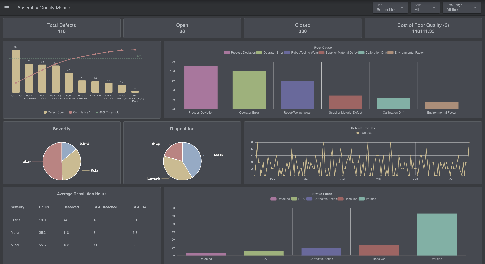
*The finished defect tracking dashboard showing stat cards, Pareto chart, and trend line*

In this tutorial, you'll build a defect tracking and quality monitoring dashboard using FlowFuse in about 30 minutes. It reads defects from a database, calculates the KPIs a quality engineer actually looks at, and renders them live, filtered by line, shift, and date range.

You can interact with the live demo here: <a href="https://defect-monitoring-dashboard.flowfuse.cloud/dashboard/defects" onclick="if (typeof capture !== 'undefined') { capture('blog-live-demo', { reference: 'Blog: {{ title | escape }}' }); }">Try the Quality Monitoring Dashboard</a>.

By the end, you'll have a foundation you can extend into broader production monitoring or OEE tracking, or a plant-wide quality report.

## What You'll Need

Before you start building, make sure you have the following ready:

- **A FlowFuse account.** [Sign up]() for FlowFuse Cloud, or use a self-hosted instance.

- **A FlowFuse instance up and running.** If you don't have one yet, create a new instance from your FlowFuse Platform.

- **FlowFuse Dashboard installed.** This tutorial uses `@flowfuse/node-red-dashboard` nodes (`ui-text`, `ui-chart`, `ui-table`, and `ui-template`) to build the interface. If it is not already installed, add it from the Node-RED Palette Manager. If you are new to FlowFuse Dashboard, follow the [Getting Started guide](https://dashboard.flowfuse.com/getting-started.html) to become familiar with the basics before continuing.

> Note: [FlowFuse Tables](/docs/user/ff-tables/) is currently in beta and available to Enterprise tier teams on FlowFuse Cloud, as well as Enterprise licensed self hosted teams running on Kubernetes. If you're on a different tier, you can follow along using any external database instead, Postgres, MySQL, or whatever you already have, with the standard database nodes from the palette. The SQL and flow logic in this tutorial will work the same either way.

## How the Application Works

This dashboard is a read layer. It doesn't capture defects itself; it sits on top of a table of them and turns that table into something a supervisor can read at a glance:

- **Defects live in one table.** Each defect is a row: where it happened, what it was, how severe, its root cause, how it was handled, and what it cost. Something else fills this table: an operator logging defects from a form, or automatic events arriving over MQTT. For the tutorial, a simulator stands in for that source.
- **One query calculates everything.** A single query filters the table once and computes every KPI on the dashboard in one pass, then splits the result across every card, chart, and table, so the whole dashboard updates from a single source of truth.
- **The header drives it all.** Line, shift, and date-range dropdowns live in the dashboard header. Change any one and every widget recalculates together.

## Importing the Simulator

You need a table and data in it before the dashboard can show anything. Rather than build that by hand, import the simulator flow; it creates the `defects` table and fills it for you.

It gives you two generators. A **historical seed** fills about six months of defects, so the charts have something to show right away. A **live feed** then inserts a fresh defect every few seconds, so the dashboard keeps updating on its own while you build.


[{"id":"fc4cfab8a41f3bdb","type":"group","z":"7f9feb3283fbb929","name":"Data Simulation","style":{"label":true},"nodes":["7ff2fe3d22e543d8","77f9a234e079a6dd","e9c9fbed2e767b9f","23504c3b0f35db82","475645219af52b5e","d978f663921063a7","d2facb93da0e58db","1188c4b2256949a3"],"x":34,"y":219,"w":812,"h":142},{"id":"7ff2fe3d22e543d8","type":"debug","z":"7f9feb3283fbb929","g":"fc4cfab8a41f3bdb","name":"Result","active":true,"tosidebar":true,"console":false,"tostatus":false,"complete":"payload","targetType":"msg","statusVal":"","statusType":"auto","x":750,"y":260,"wires":[]},{"id":"77f9a234e079a6dd","type":"inject","z":"7f9feb3283fbb929","g":"fc4cfab8a41f3bdb","name":"","props":[],"repeat":"","crontab":"","once":false,"onceDelay":0.1,"topic":"","x":130,"y":260,"wires":[["e9c9fbed2e767b9f"]]},{"id":"e9c9fbed2e767b9f","type":"function","z":"7f9feb3283fbb929","g":"fc4cfab8a41f3bdb","name":"Historical Seed","func":"// ============================================================\n// SHARED GENERATOR LOGIC (v4 — full station coverage + EV-specific defect)\n// ============================================================\n\n// ---- Helper: weighted random pick ------------------------------\nfunction weightedPick(items, weights) {\n    const r = Math.random();\n    let cumulative = 0;\n    for (let i = 0; i < items.length; i++) {\n        cumulative += weights[i];\n        if (r <= cumulative) return items[i];\n    }\n    return items[items.length - 1];\n}\n\n// ---- Convert an ARRAY of records into column-wise arrays, for a\n// single bulk INSERT ... SELECT * FROM UNNEST(...) query -----------\nfunction recordsToColumnParams(records) {\n    const cols = [\n        \"defect_id\", \"date\", \"line\", \"station\", \"shift\", \"sku\",\n        \"defect_type\", \"defect_category\", \"severity\", \"detected_stage\",\n        \"root_cause\", \"disposition\", \"status\", \"cost_impact\", \"resolution_hours\"\n    ];\n    return cols.map(col => records.map(r => r[col]));\n}\n\n\n// ---- Unique defect_id (no context store needed) ----------------\nfunction nextDefectId() {\n    const rand = Math.floor(Math.random() * 46656).toString(36).padStart(3, \"0\");\n    return \"DEF-\" + Date.now().toString(36).toUpperCase() + \"-\" + rand.toUpperCase();\n}\n\n// ---- Assembly lines: NOT equal — SUV Line has an aging robot cell\nconst LINES = [\"Sedan Line\", \"SUV Line\", \"EV Line\"];\nconst LINE_WEIGHTS = [0.30, 0.45, 0.25];   // SUV Line skewed higher\n\n// ---- Shifts: Night skewed higher (fatigue/less supervision) -----\nconst SHIFTS = [\"Morning\", \"Evening\", \"Night\"];\nconst SHIFT_WEIGHTS = [0.30, 0.25, 0.45];\n\n// ---- Trims: EV is the newest variant, has early teething defects --\nconst SKUS = [\"Base Trim\", \"Sport Trim\", \"Premium Trim\", \"EV Trim\"];\nconst SKU_WEIGHTS = [0.20, 0.20, 0.25, 0.35]; // EV = newest, higher defect rate\n\n// ---- Defect types: Pareto-shaped (80/20 rule), each with a home\n// shop, plausible root causes, and where it typically gets caught.\n// Now covers ALL 5 stations (Chassis & Powertrain and Trim were\n// previously listed as stations but had zero defect types assigned).\nconst DEFECT_TYPES = [\n    {\n        name: \"Weld Crack\", category: \"Body/Weld\", station: \"Body Shop\", weight: 0.24,\n        causes: [\"Robot/Tooling Wear\", \"Operator Error\", \"Calibration Drift\", \"Process Deviation\"],\n        causeWeights: [0.40, 0.30, 0.20, 0.10],\n        stageWeights: [0.05, 0.35, 0.50, 0.10]\n    },\n    {\n        name: \"Paint Defect\", category: \"Paint/Surface\", station: \"Paint Shop\", weight: 0.19,\n        causes: [\"Operator Error\", \"Process Deviation\", \"Environmental Factor\", \"Robot/Tooling Wear\"],\n        causeWeights: [0.35, 0.30, 0.20, 0.15],\n        stageWeights: [0.05, 0.25, 0.55, 0.15]\n    },\n    {\n        name: \"Panel Gap Deviation\", category: \"Dimensional\", station: \"Body Shop\", weight: 0.13,\n        causes: [\"Calibration Drift\", \"Robot/Tooling Wear\", \"Process Deviation\", \"Supplier Material Defect\"],\n        causeWeights: [0.40, 0.30, 0.20, 0.10],\n        stageWeights: [0.25, 0.45, 0.28, 0.02]\n    },\n    {\n        name: \"Door Misalignment\", category: \"Assembly\", station: \"Final Assembly\", weight: 0.10,\n        causes: [\"Operator Error\", \"Process Deviation\", \"Robot/Tooling Wear\"],\n        causeWeights: [0.35, 0.35, 0.30],\n        stageWeights: [0.05, 0.35, 0.55, 0.05]\n    },\n    {\n        name: \"Paint Contamination\", category: \"Material\", station: \"Paint Shop\", weight: 0.09,\n        causes: [\"Supplier Material Defect\", \"Environmental Factor\", \"Process Deviation\"],\n        causeWeights: [0.50, 0.30, 0.20],\n        stageWeights: [0.40, 0.35, 0.20, 0.05]\n    },\n    {\n        name: \"Fluid Leak\", category: \"Powertrain\", station: \"Chassis & Powertrain\", weight: 0.08,\n        causes: [\"Robot/Tooling Wear\", \"Process Deviation\", \"Supplier Material Defect\"],\n        causeWeights: [0.40, 0.35, 0.25],\n        stageWeights: [0.10, 0.40, 0.40, 0.10]\n    },\n    {\n        name: \"Missing Fastener\", category: \"Assembly\", station: \"Final Assembly\", weight: 0.06,\n        causes: [\"Operator Error\", \"Process Deviation\"],\n        causeWeights: [0.60, 0.40],\n        stageWeights: [0.05, 0.30, 0.60, 0.05]\n    },\n    {\n        name: \"Interior Trim Defect\", category: \"Trim\", station: \"Trim\", weight: 0.05,\n        causes: [\"Operator Error\", \"Supplier Material Defect\", \"Process Deviation\"],\n        causeWeights: [0.45, 0.30, 0.25],\n        stageWeights: [0.10, 0.30, 0.55, 0.05]\n    },\n    {\n        name: \"Transport Damage\", category: \"Logistics\", station: \"Final Assembly\", weight: 0.04,\n        causes: [\"Process Deviation\", \"Operator Error\", \"Environmental Factor\"],\n        causeWeights: [0.50, 0.30, 0.20],\n        stageWeights: [0.05, 0.15, 0.50, 0.30] // often only found at dealer/yard, not on-line\n    },\n    {\n        // EV-EXCLUSIVE: only EV Trim vehicles physically have a high-voltage\n        // battery/charging system, so this defect type is deterministically\n        // forced to EV Trim in generateOneDefect() below — not just skewed\n        // toward it. Rare fleet-wide, but gives the \"EV teething defects\"\n        // story an actual distinct failure mode instead of just a higher\n        // rate of the same generic defects.\n        name: \"HV Battery/Charging Fault\", category: \"Electrical\", station: \"Chassis & Powertrain\", weight: 0.02,\n        causes: [\"Supplier Material Defect\", \"Process Deviation\", \"Calibration Drift\"],\n        causeWeights: [0.45, 0.30, 0.25],\n        stageWeights: [0.20, 0.30, 0.35, 0.15]\n    }\n];\nconst DEFECT_TYPE_WEIGHTS = DEFECT_TYPES.map(d => d.weight);\n\nconst STATIONS = [\"Body Shop\", \"Paint Shop\", \"Chassis & Powertrain\", \"Trim\", \"Final Assembly\"];\n\n// ---- Severity: most defects are Minor ----------------------------\nconst SEVERITIES = [\"Critical\", \"Major\", \"Minor\"];\nconst SEVERITY_WEIGHTS = [0.15, 0.35, 0.50];\n\n// ---- Detected stage: driven per-defect-type (see stageWeights above)\nconst STAGES = [\"Incoming\", \"In-Process\", \"Final QC\", \"Field Return\"];\n\n// ---- Disposition: correlated with severity, not independent -----\nconst DISPOSITION_BY_SEVERITY = {\n    Critical: { items: [\"Scrap\", \"Rework\", \"Use-as-is\"], weights: [0.60, 0.35, 0.05] },\n    Major: { items: [\"Scrap\", \"Rework\", \"Use-as-is\"], weights: [0.25, 0.55, 0.20] },\n    Minor: { items: [\"Scrap\", \"Rework\", \"Use-as-is\"], weights: [0.05, 0.35, 0.60] }\n};\n\n// ---- Cost: driven primarily by DISPOSITION, not just severity —\n// Scrap means full material loss, Rework is labor-only, Use-as-is is\n// near-zero (paperwork/inspection). Severity still scales the range\n// within each disposition.\nconst COST_RANGES = {\n    Scrap: { Critical: [800, 2000], Major: [400, 1000], Minor: [150, 400] },\n    Rework: { Critical: [300, 800], Major: [150, 500], Minor: [50, 200] },\n    \"Use-as-is\": { Critical: [50, 150], Major: [20, 80], Minor: [5, 40] }\n};\n\n// ---- Delay likelihood: tied to ROOT CAUSE, not a flat rate — a\n// supplier reorder (Supplier Material Defect) or an infrastructure\n// fix (Environmental Factor) realistically takes far longer to close\n// out than an operator simply redoing the work.\nconst DELAY_PROB_BY_CAUSE = {\n    \"Robot/Tooling Wear\": 0.12,\n    \"Operator Error\": 0.05,\n    \"Calibration Drift\": 0.08,\n    \"Process Deviation\": 0.07,\n    \"Supplier Material Defect\": 0.30,\n    \"Environmental Factor\": 0.15\n};\n\n// ---- Status: correlated with how OLD the defect is --------------\nfunction pickStatusForAge(ageDays) {\n    if (ageDays > 90) {\n        return weightedPick(\n            [\"Verified\", \"Resolved\", \"Corrective Action\"],\n            [0.85, 0.10, 0.05]\n        );\n    } else if (ageDays > 30) {\n        return weightedPick(\n            [\"Verified\", \"Resolved\", \"Corrective Action\", \"RCA\", \"Detected\"],\n            [0.50, 0.25, 0.15, 0.07, 0.03]\n        );\n    } else if (ageDays > 7) {\n        return weightedPick(\n            [\"Corrective Action\", \"RCA\", \"Resolved\", \"Detected\", \"Verified\"],\n            [0.35, 0.30, 0.20, 0.10, 0.05]\n        );\n    } else {\n        return weightedPick(\n            [\"Detected\", \"RCA\", \"Corrective Action\", \"Resolved\"],\n            [0.50, 0.30, 0.15, 0.05]\n        );\n    }\n}\n\n// ---- Day-of-week + \"bad batch\" seasonal bump ---------------------\nfunction dayOfWeekMultiplier(date) {\n    const day = date.getDay();\n    if (day === 1) return 1.3;\n    if (day === 0 || day === 6) return 1.15;\n    return 1.0;\n}\nconst BAD_BATCH_AGE_MIN = 95;\nconst BAD_BATCH_AGE_MAX = 110;\n\n// ---- Core generator: builds ONE defect record --------------------\nfunction generateOneDefect(forcedDate, ageDays) {\n    if (ageDays === undefined || ageDays === null) ageDays = 0;\n\n    let defectTypeObj;\n    if (ageDays >= BAD_BATCH_AGE_MIN && ageDays <= BAD_BATCH_AGE_MAX && Math.random() < 0.45) {\n        // Simulated bad batch of primer/paint material from a supplier\n        defectTypeObj = DEFECT_TYPES.find(d => d.name === \"Paint Contamination\");\n    } else {\n        defectTypeObj = weightedPick(DEFECT_TYPES, DEFECT_TYPE_WEIGHTS);\n    }\n\n    const station = Math.random() < 0.8\n        ? defectTypeObj.station\n        : STATIONS[Math.floor(Math.random() * STATIONS.length)];\n\n    const rootCause = weightedPick(defectTypeObj.causes, defectTypeObj.causeWeights);\n    const severity = weightedPick(SEVERITIES, SEVERITY_WEIGHTS);\n\n    const dispoTable = DISPOSITION_BY_SEVERITY[severity];\n    const disposition = weightedPick(dispoTable.items, dispoTable.weights);\n\n    const status = pickStatusForAge(ageDays);\n\n    // Detected stage comes from THIS defect type's own distribution\n    // (e.g. Paint Contamination is caught early via incoming material\n    // inspection; Transport Damage is often only found at the dealer)\n    const stage = weightedPick(STAGES, defectTypeObj.stageWeights);\n    const stageCostMultiplier = stage === \"Field Return\" ? 2.2 : 1.0;\n\n    // Cost driven by disposition + severity (see COST_RANGES above),\n    // not just severity alone — a Scrapped part costs far more than\n    // a Use-as-is one, even at the same severity.\n    const [costMin, costMax] = COST_RANGES[disposition][severity];\n    const cost = (costMin + Math.random() * (costMax - costMin)) * stageCostMultiplier;\n\n    const resolutionHoursBase = severity === \"Critical\" ? 2 + Math.random() * 10\n        : severity === \"Major\" ? 6 + Math.random() * 24\n            : 12 + Math.random() * 48;\n\n    // Delay probability comes from the ROOT CAUSE (see\n    // DELAY_PROB_BY_CAUSE above) instead of a flat rate for everyone —\n    // e.g. waiting on a supplier reorder takes far longer than an\n    // operator simply redoing the work.\n    const delayProb = DELAY_PROB_BY_CAUSE[rootCause] ?? 0.10;\n    const isDelayed = Math.random() < delayProb;\n    const resolutionHours = isDelayed\n        ? resolutionHoursBase * (3 + Math.random() * 3)\n        : resolutionHoursBase;\n\n    // Trim/SKU: HV Battery/Charging Fault is EV-EXCLUSIVE — only EV Trim\n    // vehicles physically have a high-voltage battery/charging system,\n    // so this is deterministic, not just weighted probability.\n    const sku = defectTypeObj.name === \"HV Battery/Charging Fault\"\n        ? \"EV Trim\"\n        : weightedPick(SKUS, SKU_WEIGHTS);\n\n    return {\n        defect_id: nextDefectId(),\n        date: forcedDate,\n        line: weightedPick(LINES, LINE_WEIGHTS),\n        station: station,\n        shift: weightedPick(SHIFTS, SHIFT_WEIGHTS),\n        sku: sku,\n        defect_type: defectTypeObj.name,\n        defect_category: defectTypeObj.category,\n        severity: severity,\n        detected_stage: stage,\n        root_cause: rootCause,\n        disposition: disposition,\n        status: status,\n        cost_impact: Math.round(cost * 100) / 100,\n        resolution_hours: Math.round(resolutionHours * 10) / 10\n    };\n}\n\n// ============================================================\n// FUNCTION NODE 1: HISTORICAL SEED (v2 — realistic correlations)\n// Wire: [Inject: manual]\n//        -> [THIS Function node]\n//        -> [postgresql/FlowFuse Tables node: bulk UNNEST INSERT]\n// ============================================================\n\nconst DAYS_BACK = 180;          // ~6 months of history\nconst RECORDS_PER_DAY_AVG = 7;  // baseline volume (~1260 records before multipliers)\n\nconst records = [];\nconst today = new Date();\n\nfor (let ageDays = DAYS_BACK; ageDays >= 0; ageDays--) {\n    const day = new Date(today);\n    day.setDate(day.getDate() - ageDays);\n    const dateStr = day.toISOString().slice(0, 10);\n\n    const dowMultiplier = dayOfWeekMultiplier(day);\n    const countToday = Math.max(0, Math.round(\n        (RECORDS_PER_DAY_AVG + (Math.random() - 0.5) * 4) * dowMultiplier\n    ));\n\n    for (let i = 0; i < countToday; i++) {\n        records.push(generateOneDefect(dateStr, ageDays));\n    }\n}\n\nnode.log(`Generated ${records.length} historical defect records (with realistic skew).`);\n\nmsg.params = recordsToColumnParams(records); // FlowFuse Tables node reads params from msg.params\nreturn msg;","outputs":1,"timeout":0,"noerr":0,"initialize":"","finalize":"","libs":[],"x":340,"y":260,"wires":[["d2facb93da0e58db"]]},{"id":"23504c3b0f35db82","type":"inject","z":"7f9feb3283fbb929","g":"fc4cfab8a41f3bdb","name":"","props":[],"repeat":"5","crontab":"","once":false,"onceDelay":0.1,"topic":"","x":130,"y":320,"wires":[["475645219af52b5e"]]},{"id":"475645219af52b5e","type":"function","z":"7f9feb3283fbb929","g":"fc4cfab8a41f3bdb","name":"Live Feed","func":"// ============================================================\n// SHARED GENERATOR LOGIC (v4 — full station coverage + EV-specific defect)\n// ============================================================\n\n// ---- Helper: weighted random pick ------------------------------\nfunction weightedPick(items, weights) {\n    const r = Math.random();\n    let cumulative = 0;\n    for (let i = 0; i < items.length; i++) {\n        cumulative += weights[i];\n        if (r <= cumulative) return items[i];\n    }\n    return items[items.length - 1];\n}\n\n// ---- Convert a record object into the flat params array Postgres\n// node needs, in the exact column order of the INSERT query ------\nfunction recordToParams(r) {\n    return [\n        r.defect_id, r.date, r.line, r.station, r.shift, r.sku,\n        r.defect_type, r.defect_category, r.severity, r.detected_stage,\n        r.root_cause, r.disposition, r.status, r.cost_impact, r.resolution_hours\n    ];\n}\n\n\n// ---- Unique defect_id (no context store needed) ----------------\nfunction nextDefectId() {\n    const rand = Math.floor(Math.random() * 46656).toString(36).padStart(3, \"0\");\n    return \"DEF-\" + Date.now().toString(36).toUpperCase() + \"-\" + rand.toUpperCase();\n}\n\n// ---- Assembly lines: NOT equal — SUV Line has an aging robot cell\nconst LINES         = [\"Sedan Line\", \"SUV Line\", \"EV Line\"];\nconst LINE_WEIGHTS   = [0.30,          0.45,       0.25];   // SUV Line skewed higher\n\n// ---- Shifts: Night skewed higher (fatigue/less supervision) -----\nconst SHIFTS         = [\"Morning\", \"Evening\", \"Night\"];\nconst SHIFT_WEIGHTS  = [0.30,       0.25,      0.45];\n\n// ---- Trims: EV is the newest variant, has early teething defects --\nconst SKUS           = [\"Base Trim\", \"Sport Trim\", \"Premium Trim\", \"EV Trim\"];\nconst SKU_WEIGHTS    = [0.20,          0.20,          0.25,           0.35]; // EV = newest, higher defect rate\n\n// ---- Defect types: Pareto-shaped (80/20 rule), each with a home\n// shop, plausible root causes, and where it typically gets caught.\n// Now covers ALL 5 stations (Chassis & Powertrain and Trim were\n// previously listed as stations but had zero defect types assigned).\nconst DEFECT_TYPES = [\n    {\n        name: \"Weld Crack\", category: \"Body/Weld\", station: \"Body Shop\", weight: 0.24,\n        causes: [\"Robot/Tooling Wear\", \"Operator Error\", \"Calibration Drift\", \"Process Deviation\"],\n        causeWeights: [0.40, 0.30, 0.20, 0.10],\n        stageWeights: [0.05, 0.35, 0.50, 0.10]\n    },\n    {\n        name: \"Paint Defect\", category: \"Paint/Surface\", station: \"Paint Shop\", weight: 0.19,\n        causes: [\"Operator Error\", \"Process Deviation\", \"Environmental Factor\", \"Robot/Tooling Wear\"],\n        causeWeights: [0.35, 0.30, 0.20, 0.15],\n        stageWeights: [0.05, 0.25, 0.55, 0.15]\n    },\n    {\n        name: \"Panel Gap Deviation\", category: \"Dimensional\", station: \"Body Shop\", weight: 0.13,\n        causes: [\"Calibration Drift\", \"Robot/Tooling Wear\", \"Process Deviation\", \"Supplier Material Defect\"],\n        causeWeights: [0.40, 0.30, 0.20, 0.10],\n        stageWeights: [0.25, 0.45, 0.28, 0.02]\n    },\n    {\n        name: \"Door Misalignment\", category: \"Assembly\", station: \"Final Assembly\", weight: 0.10,\n        causes: [\"Operator Error\", \"Process Deviation\", \"Robot/Tooling Wear\"],\n        causeWeights: [0.35, 0.35, 0.30],\n        stageWeights: [0.05, 0.35, 0.55, 0.05]\n    },\n    {\n        name: \"Paint Contamination\", category: \"Material\", station: \"Paint Shop\", weight: 0.09,\n        causes: [\"Supplier Material Defect\", \"Environmental Factor\", \"Process Deviation\"],\n        causeWeights: [0.50, 0.30, 0.20],\n        stageWeights: [0.40, 0.35, 0.20, 0.05]\n    },\n    {\n        name: \"Fluid Leak\", category: \"Powertrain\", station: \"Chassis & Powertrain\", weight: 0.08,\n        causes: [\"Robot/Tooling Wear\", \"Process Deviation\", \"Supplier Material Defect\"],\n        causeWeights: [0.40, 0.35, 0.25],\n        stageWeights: [0.10, 0.40, 0.40, 0.10]\n    },\n    {\n        name: \"Missing Fastener\", category: \"Assembly\", station: \"Final Assembly\", weight: 0.06,\n        causes: [\"Operator Error\", \"Process Deviation\"],\n        causeWeights: [0.60, 0.40],\n        stageWeights: [0.05, 0.30, 0.60, 0.05]\n    },\n    {\n        name: \"Interior Trim Defect\", category: \"Trim\", station: \"Trim\", weight: 0.05,\n        causes: [\"Operator Error\", \"Supplier Material Defect\", \"Process Deviation\"],\n        causeWeights: [0.45, 0.30, 0.25],\n        stageWeights: [0.10, 0.30, 0.55, 0.05]\n    },\n    {\n        name: \"Transport Damage\", category: \"Logistics\", station: \"Final Assembly\", weight: 0.04,\n        causes: [\"Process Deviation\", \"Operator Error\", \"Environmental Factor\"],\n        causeWeights: [0.50, 0.30, 0.20],\n        stageWeights: [0.05, 0.15, 0.50, 0.30] // often only found at dealer/yard, not on-line\n    },\n    {\n        // EV-EXCLUSIVE: only EV Trim vehicles physically have a high-voltage\n        // battery/charging system, so this defect type is deterministically\n        // forced to EV Trim in generateOneDefect() below — not just skewed\n        // toward it. Rare fleet-wide, but gives the \"EV teething defects\"\n        // story an actual distinct failure mode instead of just a higher\n        // rate of the same generic defects.\n        name: \"HV Battery/Charging Fault\", category: \"Electrical\", station: \"Chassis & Powertrain\", weight: 0.02,\n        causes: [\"Supplier Material Defect\", \"Process Deviation\", \"Calibration Drift\"],\n        causeWeights: [0.45, 0.30, 0.25],\n        stageWeights: [0.20, 0.30, 0.35, 0.15]\n    }\n];\nconst DEFECT_TYPE_WEIGHTS = DEFECT_TYPES.map(d => d.weight);\n\nconst STATIONS = [\"Body Shop\", \"Paint Shop\", \"Chassis & Powertrain\", \"Trim\", \"Final Assembly\"];\n\n// ---- Severity: most defects are Minor ----------------------------\nconst SEVERITIES      = [\"Critical\", \"Major\", \"Minor\"];\nconst SEVERITY_WEIGHTS = [0.15, 0.35, 0.50];\n\n// ---- Detected stage: driven per-defect-type (see stageWeights above)\nconst STAGES = [\"Incoming\", \"In-Process\", \"Final QC\", \"Field Return\"];\n\n// ---- Disposition: correlated with severity, not independent -----\nconst DISPOSITION_BY_SEVERITY = {\n    Critical: { items: [\"Scrap\", \"Rework\", \"Use-as-is\"], weights: [0.60, 0.35, 0.05] },\n    Major:    { items: [\"Scrap\", \"Rework\", \"Use-as-is\"], weights: [0.25, 0.55, 0.20] },\n    Minor:    { items: [\"Scrap\", \"Rework\", \"Use-as-is\"], weights: [0.05, 0.35, 0.60] }\n};\n\n// ---- Cost: driven primarily by DISPOSITION, not just severity —\n// Scrap means full material loss, Rework is labor-only, Use-as-is is\n// near-zero (paperwork/inspection). Severity still scales the range\n// within each disposition.\nconst COST_RANGES = {\n    Scrap:        { Critical: [800, 2000], Major: [400, 1000], Minor: [150, 400] },\n    Rework:       { Critical: [300, 800],  Major: [150, 500],  Minor: [50, 200] },\n    \"Use-as-is\":  { Critical: [50, 150],   Major: [20, 80],    Minor: [5, 40] }\n};\n\n// ---- Delay likelihood: tied to ROOT CAUSE, not a flat rate — a\n// supplier reorder (Supplier Material Defect) or an infrastructure\n// fix (Environmental Factor) realistically takes far longer to close\n// out than an operator simply redoing the work.\nconst DELAY_PROB_BY_CAUSE = {\n    \"Robot/Tooling Wear\": 0.12,\n    \"Operator Error\": 0.05,\n    \"Calibration Drift\": 0.08,\n    \"Process Deviation\": 0.07,\n    \"Supplier Material Defect\": 0.30,\n    \"Environmental Factor\": 0.15\n};\n\n// ---- Status: correlated with how OLD the defect is --------------\nfunction pickStatusForAge(ageDays) {\n    if (ageDays > 90) {\n        return weightedPick(\n            [\"Verified\", \"Resolved\", \"Corrective Action\"],\n            [0.85, 0.10, 0.05]\n        );\n    } else if (ageDays > 30) {\n        return weightedPick(\n            [\"Verified\", \"Resolved\", \"Corrective Action\", \"RCA\", \"Detected\"],\n            [0.50, 0.25, 0.15, 0.07, 0.03]\n        );\n    } else if (ageDays > 7) {\n        return weightedPick(\n            [\"Corrective Action\", \"RCA\", \"Resolved\", \"Detected\", \"Verified\"],\n            [0.35, 0.30, 0.20, 0.10, 0.05]\n        );\n    } else {\n        return weightedPick(\n            [\"Detected\", \"RCA\", \"Corrective Action\", \"Resolved\"],\n            [0.50, 0.30, 0.15, 0.05]\n        );\n    }\n}\n\n// ---- Day-of-week + \"bad batch\" seasonal bump ---------------------\nfunction dayOfWeekMultiplier(date) {\n    const day = date.getDay();\n    if (day === 1) return 1.3;\n    if (day === 0 || day === 6) return 1.15;\n    return 1.0;\n}\nconst BAD_BATCH_AGE_MIN = 95;\nconst BAD_BATCH_AGE_MAX = 110;\n\n// ---- Core generator: builds ONE defect record --------------------\nfunction generateOneDefect(forcedDate, ageDays) {\n    if (ageDays === undefined || ageDays === null) ageDays = 0;\n\n    let defectTypeObj;\n    if (ageDays >= BAD_BATCH_AGE_MIN && ageDays <= BAD_BATCH_AGE_MAX && Math.random() < 0.45) {\n        // Simulated bad batch of primer/paint material from a supplier\n        defectTypeObj = DEFECT_TYPES.find(d => d.name === \"Paint Contamination\");\n    } else {\n        defectTypeObj = weightedPick(DEFECT_TYPES, DEFECT_TYPE_WEIGHTS);\n    }\n\n    const station = Math.random() < 0.8\n        ? defectTypeObj.station\n        : STATIONS[Math.floor(Math.random() * STATIONS.length)];\n\n    const rootCause = weightedPick(defectTypeObj.causes, defectTypeObj.causeWeights);\n    const severity = weightedPick(SEVERITIES, SEVERITY_WEIGHTS);\n\n    const dispoTable = DISPOSITION_BY_SEVERITY[severity];\n    const disposition = weightedPick(dispoTable.items, dispoTable.weights);\n\n    const status = pickStatusForAge(ageDays);\n\n    // Detected stage comes from THIS defect type's own distribution\n    // (e.g. Paint Contamination is caught early via incoming material\n    // inspection; Transport Damage is often only found at the dealer)\n    const stage = weightedPick(STAGES, defectTypeObj.stageWeights);\n    const stageCostMultiplier = stage === \"Field Return\" ? 2.2 : 1.0;\n\n    // Cost driven by disposition + severity (see COST_RANGES above),\n    // not just severity alone — a Scrapped part costs far more than\n    // a Use-as-is one, even at the same severity.\n    const [costMin, costMax] = COST_RANGES[disposition][severity];\n    const cost = (costMin + Math.random() * (costMax - costMin)) * stageCostMultiplier;\n\n    const resolutionHoursBase = severity === \"Critical\" ? 2 + Math.random() * 10\n                              : severity === \"Major\"    ? 6 + Math.random() * 24\n                              :                            12 + Math.random() * 48;\n\n    // Delay probability comes from the ROOT CAUSE (see\n    // DELAY_PROB_BY_CAUSE above) instead of a flat rate for everyone —\n    // e.g. waiting on a supplier reorder takes far longer than an\n    // operator simply redoing the work.\n    const delayProb = DELAY_PROB_BY_CAUSE[rootCause] ?? 0.10;\n    const isDelayed = Math.random() < delayProb;\n    const resolutionHours = isDelayed\n        ? resolutionHoursBase * (3 + Math.random() * 3)\n        : resolutionHoursBase;\n\n    // Trim/SKU: HV Battery/Charging Fault is EV-EXCLUSIVE — only EV Trim\n    // vehicles physically have a high-voltage battery/charging system,\n    // so this is deterministic, not just weighted probability.\n    const sku = defectTypeObj.name === \"HV Battery/Charging Fault\"\n        ? \"EV Trim\"\n        : weightedPick(SKUS, SKU_WEIGHTS);\n\n    return {\n        defect_id: nextDefectId(),\n        date: forcedDate,\n        line: weightedPick(LINES, LINE_WEIGHTS),\n        station: station,\n        shift: weightedPick(SHIFTS, SHIFT_WEIGHTS),\n        sku: sku,\n        defect_type: defectTypeObj.name,\n        defect_category: defectTypeObj.category,\n        severity: severity,\n        detected_stage: stage,\n        root_cause: rootCause,\n        disposition: disposition,\n        status: status,\n        cost_impact: Math.round(cost * 100) / 100,\n        resolution_hours: Math.round(resolutionHours * 10) / 10\n    };\n}\n\n// ============================================================\n// FUNCTION NODE 2: LIVE FEED (v2 — realistic correlations)\n// Wire: [Inject: repeat every 20s]\n//        -> [THIS Function node]\n//        -> [postgresql/FlowFuse Tables node: single row INSERT]\n//        -> (optional) [Switch: msg.critical === true] -> [ui_notification]\n// ============================================================\n\nconst todayStr = new Date().toISOString().slice(0, 10);\nconst record = generateOneDefect(todayStr, 0); // ageDays=0: fresh, mostly \"Detected\"\n\nmsg.critical = (record.severity === \"Critical\");\nmsg.params = recordToParams(record); // FlowFuse Tables node reads params from msg.params\n\nreturn msg;","outputs":1,"timeout":0,"noerr":0,"initialize":"","finalize":"","libs":[],"x":320,"y":320,"wires":[["1188c4b2256949a3"]]},{"id":"d978f663921063a7","type":"debug","z":"7f9feb3283fbb929","g":"fc4cfab8a41f3bdb","name":"Result","active":true,"tosidebar":true,"console":false,"tostatus":false,"complete":"payload","targetType":"msg","statusVal":"","statusType":"auto","x":750,"y":320,"wires":[]},{"id":"d2facb93da0e58db","type":"tables-query","z":"7f9feb3283fbb929","g":"fc4cfab8a41f3bdb","name":"Insert Historical Records","query":"-- BULK INSERT for historical seed (single query, no Split node needed)\n-- Use this in the postgresql node wired directly after the\n-- \"historical seed\" Function node.\n--\n-- msg.payload must be an array of 15 arrays (column-wise), which is\n-- exactly what recordsToColumnParams() in function-shared-logic.js\n-- produces: [ [all defect_ids], [all dates], [all lines], ... ]\n\nINSERT INTO defects (\n    defect_id, date, line, station, shift, sku,\n    defect_type, defect_category, severity, detected_stage,\n    root_cause, disposition, status, cost_impact, resolution_hours\n)\nSELECT * FROM UNNEST(\n    $1::varchar[],  $2::date[],     $3::varchar[],  $4::varchar[],\n    $5::varchar[],  $6::varchar[],  $7::varchar[],  $8::varchar[],\n    $9::varchar[],  $10::varchar[], $11::varchar[], $12::varchar[],\n    $13::varchar[], $14::numeric[], $15::numeric[]\n)\nON CONFLICT (defect_id) DO NOTHING;\n\n-- ------------------------------------------------------------\n-- LIVE FEED still uses the simple single-row query below,\n-- unchanged, fed by function-live-feed.js (one param-array per msg):\n--\n-- INSERT INTO defects (\n--     defect_id, date, line, station, shift, sku,\n--     defect_type, defect_category, severity, detected_stage,\n--     root_cause, disposition, status, cost_impact, resolution_hours\n-- )\n-- VALUES ($1, $2, $3, $4, $5, $6, $7, $8, $9, $10, $11, $12, $13, $14, $15)\n-- ON CONFLICT (defect_id) DO NOTHING;","split":false,"rowsPerMsg":1,"x":570,"y":260,"wires":[["7ff2fe3d22e543d8"]]},{"id":"1188c4b2256949a3","type":"tables-query","z":"7f9feb3283fbb929","g":"fc4cfab8a41f3bdb","name":"Insert Live Record","query":"INSERT INTO defects (\n    defect_id, date, line, station, shift, sku,\n    defect_type, defect_category, severity, detected_stage,\n    root_cause, disposition, status, cost_impact, resolution_hours\n)\nVALUES ($1, $2, $3, $4, $5, $6, $7, $8, $9, $10, $11, $12, $13, $14, $15)\nON CONFLICT (defect_id) DO NOTHING;","split":false,"rowsPerMsg":1,"x":550,"y":320,"wires":[["d978f663921063a7"]]},{"id":"d1c5372e4c488212","type":"group","z":"7f9feb3283fbb929","name":"Create Defect Table","style":{"label":true},"nodes":["f4a14ba58c9e129d","a08e0258f5c5242e","83e51297506816b4"],"x":34,"y":19,"w":812,"h":82},{"id":"f4a14ba58c9e129d","type":"inject","z":"7f9feb3283fbb929","g":"d1c5372e4c488212","name":"","props":[],"repeat":"","crontab":"","once":true,"onceDelay":0.1,"topic":"","x":130,"y":60,"wires":[["a08e0258f5c5242e"]]},{"id":"a08e0258f5c5242e","type":"tables-query","z":"7f9feb3283fbb929","g":"d1c5372e4c488212","name":"Create Defect Table","query":"CREATE TABLE IF NOT EXISTS defects (\n    defect_id         VARCHAR(20) PRIMARY KEY,\n    date              DATE NOT NULL,\n    line              VARCHAR(20),\n    station           VARCHAR(30),\n    shift             VARCHAR(20),\n    sku               VARCHAR(20),\n    defect_type       VARCHAR(50),\n    defect_category   VARCHAR(30),\n    severity          VARCHAR(10),\n    detected_stage    VARCHAR(20),\n    root_cause        VARCHAR(50),\n    disposition       VARCHAR(20),\n    status            VARCHAR(20),\n    cost_impact       NUMERIC(10,2),\n    resolution_hours  NUMERIC(6,1)\n);\n\nCREATE INDEX IF NOT EXISTS idx_defects_date ON defects(date);\nCREATE INDEX IF NOT EXISTS idx_defects_line ON defects(line);\nCREATE INDEX IF NOT EXISTS idx_defects_shift ON defects(shift);","split":false,"rowsPerMsg":1,"x":350,"y":60,"wires":[["83e51297506816b4"]]},{"id":"83e51297506816b4","type":"debug","z":"7f9feb3283fbb929","g":"d1c5372e4c488212","name":"Result","active":true,"tosidebar":true,"console":false,"tostatus":false,"complete":"payload","targetType":"msg","statusVal":"","statusType":"auto","x":750,"y":60,"wires":[]},{"id":"78a99932f3724e3e","type":"group","z":"7f9feb3283fbb929","name":"Delete All Records","style":{"label":true},"nodes":["1c3ce2ba4a766cee","e38d9a6684c6b3bb","c0c78694aa023826"],"x":34,"y":119,"w":812,"h":82},{"id":"1c3ce2ba4a766cee","type":"inject","z":"7f9feb3283fbb929","d":true,"g":"78a99932f3724e3e","name":"","props":[],"repeat":"","crontab":"","once":false,"onceDelay":0.1,"topic":"","x":130,"y":160,"wires":[["e38d9a6684c6b3bb"]]},{"id":"e38d9a6684c6b3bb","type":"tables-query","z":"7f9feb3283fbb929","g":"78a99932f3724e3e","name":"Delete All Records","query":"DELETE FROM defects;","split":false,"rowsPerMsg":1,"x":350,"y":160,"wires":[["c0c78694aa023826"]]},{"id":"c0c78694aa023826","type":"debug","z":"7f9feb3283fbb929","g":"78a99932f3724e3e","name":"Result","active":true,"tosidebar":true,"console":false,"tostatus":false,"complete":"payload","targetType":"msg","statusVal":"","statusType":"auto","x":750,"y":160,"wires":[]},{"id":"d7a304ca96634e82","type":"global-config","env":[],"modules":{"@flowfuse/nr-tables-nodes":"0.2.2"}}]


Both run automatically on deploy: no buttons to click. The table is created first, the historical seed lands a few seconds later, and the live feed takes over from there. Within moments your table holds over a thousand records and keeps growing.

### The schema it creates

You don't run this yourself; the import handles it. But it's the contract the whole dashboard depends on, so it's worth knowing what the `defects` table looks like, especially if you later point the dashboard at your own database:

```sql
CREATE TABLE IF NOT EXISTS defects (
    defect_id         VARCHAR(20) PRIMARY KEY,
    date              DATE NOT NULL,
    line              VARCHAR(20),
    station           VARCHAR(30),
    shift             VARCHAR(20),
    sku               VARCHAR(20),
    defect_type       VARCHAR(50),
    defect_category   VARCHAR(30),
    severity          VARCHAR(10),
    detected_stage    VARCHAR(20),
    root_cause        VARCHAR(50),
    disposition       VARCHAR(20),
    status            VARCHAR(20),
    cost_impact       NUMERIC(10,2),
    resolution_hours  NUMERIC(6,1)
);

CREATE INDEX IF NOT EXISTS idx_defects_date ON defects(date);
CREATE INDEX IF NOT EXISTS idx_defects_line ON defects(line);
CREATE INDEX IF NOT EXISTS idx_defects_shift ON defects(shift);
```

Each row is one defect. The columns group into where it happened (`line`, `station`, `shift`, `sku`), what it was (`defect_type`, `severity`, `detected_stage`), how it was handled (`root_cause`, `disposition`, `status`), and what it cost (`cost_impact`, `resolution_hours`). The three indexes cover the columns the dashboard filters by, so queries stay fast as the table grows.

## Building the Query

Running one query per widget means a dozen database trips on every refresh. This dashboard runs a single query instead. It returns one row where each field holds one widget's data, and every widget reads just its own field.

Two CTEs at the top do the filtering. `filtered_all` applies all three filters: line, shift, and date range. `filtered_line_and_shift` skips the date filter, so the live ticker always shows the latest defects. After that, one `json_agg` block builds the data for each widget:

> Tip: You don't have to write SQL yourself. Use [FlowFuse Expert](/blog/2025/09/ai-assistant-flowfuse-tables/) and describe the interface in plain English. It will generate the ui-template code for you.

```sql
WITH
  filtered_all AS ( -- full 3-filter set, used by almost every widget
    SELECT * FROM defects
    WHERE ($line = 'All' OR line = $line)
      AND ($shift = 'All' OR shift = $shift)
      AND date >= CURRENT_DATE - ($daysback || ' days')::interval
  ),
  filtered_line_and_shift AS ( -- ticker: "right now" view, ignores the date filter
    SELECT * FROM defects
    WHERE ($line = 'All' OR line = $line) AND ($shift = 'All' OR shift = $shift)
  )
SELECT
  -- stat cards + cost of poor quality (one pass over the filtered rows)
  (SELECT json_agg(t) FROM (
    SELECT
      COUNT(*) FILTER (WHERE status IN ('Resolved','Verified'))     AS closed_count,
      COUNT(*) FILTER (WHERE status NOT IN ('Resolved','Verified')) AS open_count,
      COUNT(*)                    AS total_count,
      ROUND(SUM(cost_impact), 2)  AS total_copq
    FROM filtered_all
  ) t) AS stat_cards_and_copq,

  -- average resolution time + SLA breach per severity
  -- (SLA targets: Critical 24h, Major 72h, Minor 168h)
  (SELECT json_agg(t) FROM (
    SELECT severity,
      ROUND(AVG(resolution_hours), 1) AS avg_resolution_hours,
      COUNT(*)                        AS resolved_count,
      COUNT(*) FILTER (WHERE resolution_hours >
        CASE severity WHEN 'Critical' THEN 24 WHEN 'Major' THEN 72 ELSE 168 END) AS sla_breached_count,
      ROUND(100.0 * COUNT(*) FILTER (WHERE resolution_hours >
        CASE severity WHEN 'Critical' THEN 24 WHEN 'Major' THEN 72 ELSE 168 END)
        / NULLIF(COUNT(*), 0), 1) AS sla_breach_pct
    FROM filtered_all WHERE status IN ('Resolved', 'Verified')
    GROUP BY severity
    ORDER BY CASE severity WHEN 'Critical' THEN 1 WHEN 'Major' THEN 2 ELSE 3 END
  ) t) AS avg_resolution_and_sla,

  -- Pareto: defect-type counts with a cumulative % (window functions)
  (SELECT json_agg(t) FROM (
    SELECT defect_type, COUNT(*) AS defect_count,
      ROUND(100.0 * COUNT(*) / SUM(COUNT(*)) OVER (), 1) AS pct_of_total,
      ROUND(SUM(COUNT(*)) OVER (ORDER BY COUNT(*) DESC) * 100.0
            / SUM(COUNT(*)) OVER (), 1) AS cumulative_pct
    FROM filtered_all GROUP BY defect_type ORDER BY defect_count DESC
  ) t) AS pareto,

  -- daily trend
  (SELECT json_agg(t) FROM (
    SELECT date, COUNT(*) AS defect_count
    FROM filtered_all GROUP BY date ORDER BY date
  ) t) AS trend,

  -- disposition breakdown
  (SELECT json_agg(t) FROM (
    SELECT disposition, COUNT(*) AS defect_count, ROUND(SUM(cost_impact), 2) AS total_cost
    FROM filtered_all GROUP BY disposition ORDER BY defect_count DESC
  ) t) AS disposition,

  -- severity breakdown
  (SELECT json_agg(t) FROM (
    SELECT severity, COUNT(*) AS defect_count
    FROM filtered_all GROUP BY severity
    ORDER BY CASE severity WHEN 'Critical' THEN 1 WHEN 'Major' THEN 2 ELSE 3 END
  ) t) AS severity,

  -- root-cause breakdown
  (SELECT json_agg(t) FROM (
    SELECT root_cause, COUNT(*) AS defect_count
    FROM filtered_all GROUP BY root_cause ORDER BY defect_count DESC
  ) t) AS root_cause,

  -- status funnel, ordered by workflow stage
  (SELECT json_agg(t) FROM (
    SELECT status, COUNT(*) AS defect_count
    FROM filtered_all GROUP BY status
    ORDER BY CASE status WHEN 'Detected' THEN 1 WHEN 'RCA' THEN 2 WHEN 'Corrective Action' THEN 3
      WHEN 'Resolved' THEN 4 WHEN 'Verified' THEN 5 END
  ) t) AS status_funnel,

  -- most recent 20 defects, for the live ticker
  (SELECT json_agg(t) FROM (
    SELECT defect_id, date, line, station, defect_type, severity, status, cost_impact
    FROM filtered_line_and_shift ORDER BY defect_id DESC LIMIT 20
  ) t) AS ticker;
```

With the query written, wire it up so it runs on a timer and its result reaches every widget.

1. Add a change node before the Query node and name it "Set Params". This maps the saved filters onto the `$line`, `$shift`, and `$daysback` parameters the SQL reads. Set four rules, in order:

   - Set `queryParameters` to `{}` (JSON): starts clean so stale values don't linger.
   - Set `queryParameters.line` to `filters.line` (global persistent).
   - Set `queryParameters.shift` to `filters.shift` (global persistent).
   - Set `queryParameters.daysback` to `filters.dateRange` (global persistent).

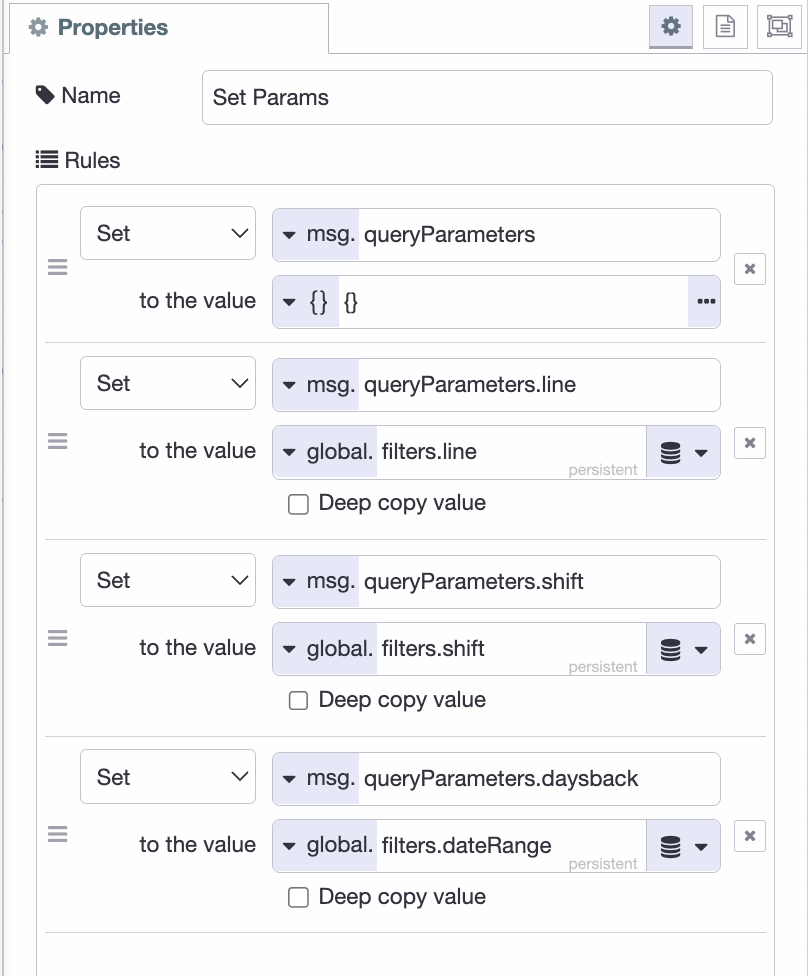
*The "Set Params" change node open in the edit panel, all four rules visible.*

1. Add an inject node named "Poll Data" and set it to repeat every 10 to 30 seconds. Wire it into "Set Params"; this re-runs the query on a timer so the dashboard keeps up as new defects arrive. Also add a link in node here, named "Refresh Trigger," and connect it to the "Set Params" change node; this will let the filter flow you build next trigger a refresh as well.

2. After the Query node, add a single link out node and name it "KPI Result". Each widget you build next will connect a link in node to it, so the one result broadcasts to every widget at once.

## Adding the Filters

The filters go in the dashboard header rather than a widget group, since they control the whole page, not one chart. Each selection saves to the global `filters` object that "Set Params" reads before every query run.

1. Add a ui-event node. It fires on page load, so a fresh browser session starts with the dropdowns populated.

2. Add a change node named "Set Filters". Set `payload` to one JSON object containing your filter options. For this tutorial it looks like the following, but update it to match your table:

```json
{
    "line": "SUV Line",
    "shift": "Night",
    "dateRange": 30,
    "lineOptions": [
        "All",
        "Sedan Line",
        "SUV Line",
        "EV Line"
    ],
    "shiftOptions": [
        "All",
        "Morning",
        "Evening",
        "Night"
    ],
    "dateRangeOptions": [
        {
            "label": "Last 7 days",
            "value": 7
        },
        {
            "label": "Last 30 days",
            "value": 30
        },
        {
            "label": "Last 90 days",
            "value": 90
        },
        {
            "label": "All time",
            "value": 100000
        }
    ]
}
```

3. Add a ui-template node named "Header Filters". Set its type to "Widget" (UI scoped) and select your UI. Ask [FlowFuse Expert](/docs/user/expert/node-red-embedded-ai/#css-and-html-generation-for-flowfuse-dashboard) to build it:

> Create a ui-template with three header dropdowns, Line, Shift, and Date Range, wrapped in <Teleport defer to="#app-bar-actions"> so they render in the header bar and survive a reload. msg.payload has the selections (line, shift, dateRange) and options (lineOptions, shiftOptions, dateRangeOptions). Line/Shift options are strings; dateRangeOptions items are {label, value} objects, so bind label as text and value as the value, not the whole object. On any change, and on load, send {line, shift, dateRange} downstream.

Below is the template it produced for us, import it directly if you prefer:


[{"id":"cb03d95bcad4cbd8","type":"ui-template","z":"b069d8356c10f58e","g":"6a002542e7c91e0e","group":"","page":"","ui":"6481b1c613ec9a93","name":"App Header Filters","order":1,"width":0,"height":0,"head":"","format":"<template>\n    <!-- Filter dropdowns, teleported into the dashboard header -->\n    <Teleport v-if=\"mounted\" to=\"#app-bar-actions\">\n        <div class=\"filter-bar\">\n            <v-select :model-value=\"line\" @update:model-value=\"val => { line = val; onFilterChange(); }\"\n                :items=\"lineOptions\" label=\"Line\" density=\"compact\" variant=\"solo\" hide-details\n                style=\"min-width: 120px\"></v-select>\n\n            <v-select :model-value=\"shift\" @update:model-value=\"val => { shift = val; onFilterChange(); }\"\n                :items=\"shiftOptions\" label=\"Shift\" density=\"compact\" variant=\"solo\" hide-details\n                style=\"min-width: 120px\"></v-select>\n\n            <v-select :model-value=\"dateRange\" @update:model-value=\"val => { dateRange = val; onFilterChange(); }\"\n                :items=\"dateRangeOptions\" item-title=\"label\" item-value=\"value\" label=\"Date Range\" density=\"compact\"\n                variant=\"solo\" hide-details style=\"min-width: 160px\"></v-select>\n        </div>\n    </Teleport>\n</template>\n\n<script>\n    export default {\n    data() {\n        return {\n            mounted: false,\n\n            // Selected values\n            line: 'All',\n            shift: 'All',\n            dateRange: 30,\n\n            // Available options\n            lineOptions: [],\n            shiftOptions: [],\n            dateRangeOptions: []\n        }\n    },\n\n    mounted() {\n        // Wait until the dashboard header exists before teleporting.\n        this.mounted = true;\n    },\n\n    watch: {\n        msg: {\n            immediate: true,\n            deep: true,\n            handler(msg) {\n                if (!msg?.payload) return;\n\n                // Selected values\n                this.line = msg.payload.line ?? this.line;\n                this.shift = msg.payload.shift ?? this.shift;\n                this.dateRange = msg.payload.dateRange ?? this.dateRange;\n\n                // Dropdown options\n                this.lineOptions = msg.payload.lineOptions ?? this.lineOptions;\n                this.shiftOptions = msg.payload.shiftOptions ?? this.shiftOptions;\n                this.dateRangeOptions = msg.payload.dateRangeOptions ?? this.dateRangeOptions;\n\n                // Send initial state downstream\n                this.onFilterChange();\n            }\n        }\n    },\n\n    methods: {\n        onFilterChange() {\n            this.send({\n                payload: {\n                    line: this.line,\n                    shift: this.shift,\n                    dateRange: this.dateRange\n                }\n            });\n        }\n    }\n}\n</script>\n\n<style>\n    .filter-bar {\n        display: flex;\n        gap: 12px;\n        align-items: center;\n        padding-right: 12px;\n    }\n</style>","storeOutMessages":true,"passthru":true,"resendOnRefresh":true,"templateScope":"widget:ui","className":"","x":450,"y":140,"wires":[["e958c99e3f1ecb94"]]},{"id":"6481b1c613ec9a93","type":"ui-base","name":"My Dashboard","path":"/dashboard","appIcon":"","includeClientData":true,"acceptsClientConfig":["ui-notification","ui-control"],"showPathInSidebar":false,"headerContent":"page","navigationStyle":"default","titleBarStyle":"default","showReconnectNotification":true,"notificationDisplayTime":1,"showDisconnectNotification":true,"allowInstall":false},{"id":"18db5e6eeee7d1d9","type":"global-config","env":[],"modules":{"@flowfuse/node-red-dashboard":"1.30.2"}}]


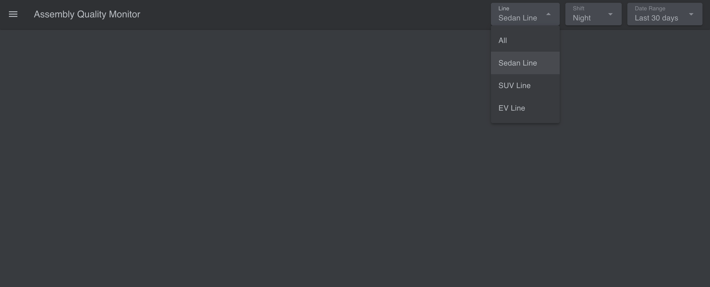
*The finished header filters. Capture the Line, Shift, and Date Range dropdowns in the live dashboard header.*

4. Add a change node named "Save Filters" that sets the persistent global `filters` to `msg.payload`, and connect its input to the "Header Filters" ui-template node.

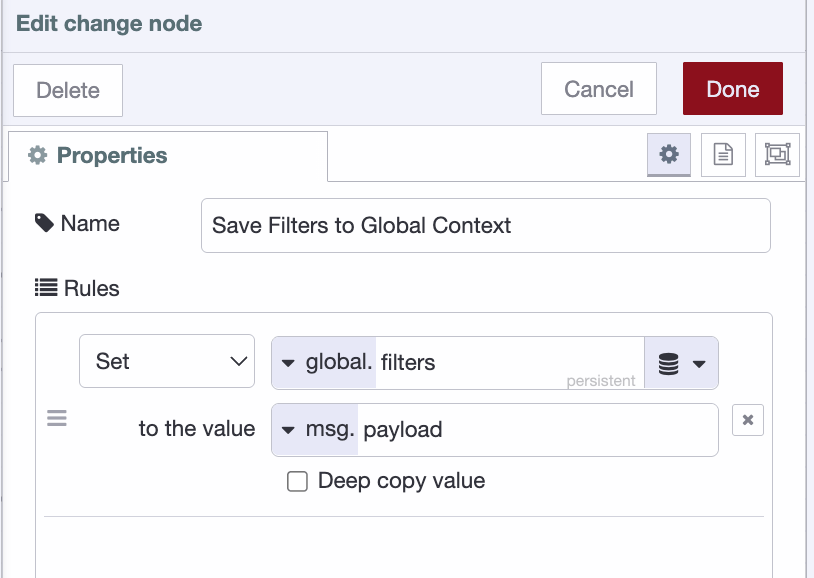
*The "Save Filters" change node, setting the persistent global `filters` to `msg.payload`.*

5. Next, add a link out node, connect its input to the "Save Filters" change node, and connect its output to the "Refresh Trigger" link in node you added earlier.

Deploy, and the dropdowns appear in the header. Change one and the next query pass redraws every widget against it.

## Building the Widgets

Everything the dashboard shows comes from the "KPI Result" broadcast, so every widget follows the same wiring: a **link in** node connected to "KPI Result", a change node that extracts that widget's field, and the display node.

Before adding widgets, create a page for the dashboard (ours is "Assembly Quality Monitor") and a ui-group for each widget. The group is what positions and sizes a widget on the grid.

### Stat cards

Start with the four numbers a supervisor checks first: total defects, open, closed, and cost of poor quality.

1. Add a link in node and connect it to "KPI Result".
2. Add a change node named "Extract KPI Summary" with one rule: set `msg.payload` to `msg.payload[0].stat_cards_and_copq` (msg). Wire the link in to it.
3. Add four ui-text nodes, one in each of the four top groups (Total Defects, Open, Closed, Cost of Poor Quality). Wire the change node to all four.
4. In each ui-text node, set the value to the matching field: `msg.payload[0].total_count`, `msg.payload[0].open_count`, `msg.payload[0].closed_count`, `msg.payload[0].total_copq`.

Open counts everything not yet Resolved or Verified; the cost figure sums `cost_impact` across the current filter, so it moves the moment you switch line or shift.

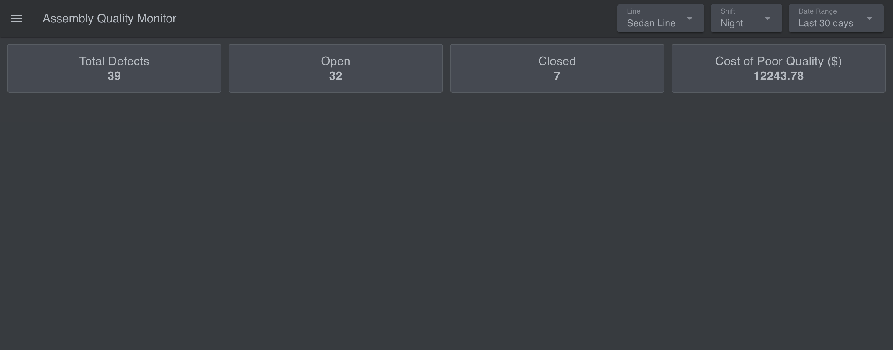
*The four stat cards populated with seeded data.*

### Pareto chart

The [Pareto chart](/blog/2025/08/pareto-chart-manufacturing-guide/) ranks defect types by count and overlays a cumulative-percentage line with an 80% marker. It is the fastest way to see which few defect types cause most of the pain. The built-in ui-chart can't combine bars and a line, so this one is a ui-template that draws the SVG itself.

1. Add a link in node connected to "KPI Result".
2. Add a change node named "Extract Pareto Data": set `msg.payload` to `msg.payload[0].pareto` (msg).
3. Add a ui-template node in the Pareto group. Ask [FlowFuse Expert](/docs/user/expert/node-red-embedded-ai/#css-and-html-generation-for-flowfuse-dashboard) to generate it:

> Create a Vue ui-template that renders a Pareto chart as responsive inline SVG. `msg.payload` is an array of `{defect_type, defect_count, cumulative_pct}`, sorted by count descending. Draw a bar per defect type with its count above and a word-wrapped label below, a cumulative-percentage line with dots over the bars, a dashed threshold line at 80%, and a small legend. Derive the rows from `msg.payload` reactively so the chart redraws on every new message.

Below is the template it produced for us, import it directly if you prefer:


[{"id":"fef40951758bc433","type":"ui-template","z":"b069d8356c10f58e","g":"54e9382e7013c157","group":"867ef11afa029061","page":"","ui":"","name":"Custom Pareto Chart","order":1,"width":0,"height":0,"head":"","format":"<template>\n    <div class=\"pareto-container\">\n        <svg :viewBox=\"`0 0 ${svgWidth} ${svgHeight}`\" preserveAspectRatio=\"xMidYMid meet\">\n            <!-- Bars -->\n            <g v-for=\"(row, i) in rows\" :key=\"'bar-' + row.defect_type\">\n                <rect\n                    :x=\"barX(i)\"\n                    :y=\"barY(row.defect_count)\"\n                    :width=\"barWidth\"\n                    :height=\"barHeight(row.defect_count)\"\n                    fill=\"#CEBA8C\"\n                    rx=\"3\"\n                />\n                <text\n                    :x=\"barX(i) + barWidth / 2\"\n                    :y=\"barY(row.defect_count) - 8\"\n                    text-anchor=\"middle\"\n                    class=\"bar-label-value\"\n                >{{ row.defect_count }}</text>\n                <text\n                    :x=\"barX(i) + barWidth / 2\"\n                    :y=\"chartAreaHeight + 16\"\n                    text-anchor=\"middle\"\n                    class=\"axis-label\"\n                >\n                    <tspan\n                        v-for=\"(line, li) in wrapLabel(row.defect_type)\"\n                        :key=\"li\"\n                        :x=\"barX(i) + barWidth / 2\"\n                        :dy=\"li === 0 ? 0 : 12\"\n                    >{{ line }}</tspan>\n                </text>\n            </g>\n\n            <!-- 80% threshold dashed line -->\n            <line\n                :x1=\"padding.left\" :x2=\"svgWidth - padding.right\"\n                :y1=\"pctToY(80)\" :y2=\"pctToY(80)\"\n                stroke=\"#74A086\" stroke-width=\"1.5\" stroke-dasharray=\"5,4\"\n            />\n            <text :x=\"svgWidth - padding.right\" :y=\"pctToY(80) - 6\" text-anchor=\"end\" class=\"threshold-label\">80%</text>\n\n            <!-- Cumulative % line -->\n            <polyline\n                :points=\"cumulativeLinePoints\"\n                fill=\"none\"\n                stroke=\"#C28181\"\n                stroke-width=\"2.5\"\n            />\n            <circle\n                v-for=\"(row, i) in rows\"\n                :key=\"'pt-' + row.defect_type\"\n                :cx=\"barX(i) + barWidth / 2\"\n                :cy=\"pctToY(row.cumulative_pct)\"\n                r=\"3.5\"\n                fill=\"#C28181\"\n            />\n        </svg>\n\n        <div class=\"legend\">\n            <span class=\"legend-item\"><span class=\"swatch\" style=\"background:#CEBA8C\"></span>Defect Count</span>\n            <span class=\"legend-item\"><span class=\"swatch\" style=\"background:#C28181\"></span>Cumulative %</span>\n            <span class=\"legend-item\"><span class=\"swatch dash\" style=\"border-color:#74A086\"></span>80% Threshold</span>\n        </div>\n    </div>\n</template>\n\n<script>\nexport default {\n    data() {\n        return {\n            svgWidth: 600,\n            svgHeight: 260,\n            padding: { top: 20, right: 40, bottom: 62, left: 10 }\n        }\n    },\n    computed: {\n        // Per the docs: `msg` is a built-in variable, automatically\n        // assigned whenever this ui-template node receives a message\n        // from Node-RED. Deriving `rows` from it directly (rather than\n        // manually managing a socket listener) means Vue's reactivity\n        // handles updates for us — any change to `msg` recomputes `rows`\n        // and re-renders the SVG automatically.\n        rows() {\n            const payload = this.msg?.payload;\n            return Array.isArray(payload) ? payload : [];\n        },\n        chartAreaHeight() {\n            return this.svgHeight - this.padding.bottom;\n        },\n        maxCount() {\n            return Math.max(1, ...this.rows.map(r => r.defect_count));\n        },\n        barWidth() {\n            const usableWidth = this.svgWidth - this.padding.left - this.padding.right;\n            const n = this.rows.length || 1;\n            return Math.min(60, (usableWidth / n) * 0.6);\n        },\n        cumulativeLinePoints() {\n            return this.rows\n                .map((row, i) => `${this.barX(i) + this.barWidth / 2},${this.pctToY(row.cumulative_pct)}`)\n                .join(' ');\n        }\n    },\n    watch: {\n        // Debug aid only — doesn't drive the chart (the `rows` computed\n        // property does that). Open the browser console (F12) to confirm\n        // messages are actually arriving and check the field names match\n        // (defect_type, defect_count, cumulative_pct).\n        msg: function () {\n            console.log('[Pareto widget] msg updated:', this.msg);\n        }\n    },\n    methods: {\n        barX(i) {\n            const usableWidth = this.svgWidth - this.padding.left - this.padding.right;\n            const n = this.rows.length || 1;\n            const slot = usableWidth / n;\n            return this.padding.left + i * slot + (slot - this.barWidth) / 2;\n        },\n        barY(count) {\n            const usableHeight = this.chartAreaHeight - this.padding.top;\n            return this.chartAreaHeight - (count / this.maxCount) * usableHeight;\n        },\n        barHeight(count) {\n            const usableHeight = this.chartAreaHeight - this.padding.top;\n            return (count / this.maxCount) * usableHeight;\n        },\n        pctToY(pct) {\n            const usableHeight = this.chartAreaHeight - this.padding.top;\n            return this.chartAreaHeight - (pct / 100) * usableHeight;\n        },\n        wrapLabel(label) {\n            // Greedy word-wrap: fits as many words as possible per line\n            // (targeting ~11 chars/line) instead of truncating with \"…\".\n            const words = label.split(' ');\n            const maxCharsPerLine = 11;\n            const lines = [];\n            let currentLine = '';\n\n            words.forEach(word => {\n                const candidate = currentLine ? `${currentLine} ${word}` : word;\n                if (candidate.length > maxCharsPerLine && currentLine) {\n                    lines.push(currentLine);\n                    currentLine = word;\n                } else {\n                    currentLine = candidate;\n                }\n            });\n            if (currentLine) lines.push(currentLine);\n\n            return lines;\n        }\n    }\n}\n</script>\n\n<style>\n.pareto-container {\n    width: 100%;\n}\n.pareto-container svg {\n    width: 100%;\n    height: 260px;\n}\n.bar-label-value {\n    font-size: 11px;\n    fill: #B6BBC1;\n    font-family: sans-serif;\n}\n.axis-label {\n    font-size: 10px;\n    fill: #B6BBC1;\n    font-family: sans-serif;\n}\n.threshold-label {\n    font-size: 10px;\n    fill: #74A086;\n    font-family: sans-serif;\n}\n.legend {\n    display: flex;\n    gap: 16px;\n    justify-content: center;\n    margin-top: 6px;\n    font-size: 12px;\n    color: #B6BBC1;\n}\n.legend-item {\n    display: flex;\n    align-items: center;\n    gap: 6px;\n}\n.swatch {\n    width: 10px;\n    height: 10px;\n    border-radius: 2px;\n    display: inline-block;\n}\n.swatch.dash {\n    background: transparent;\n    border-top: 2px dashed;\n    height: 0;\n}\n</style>","storeOutMessages":true,"passthru":true,"resendOnRefresh":true,"templateScope":"local","className":"","x":620,"y":640,"wires":[[]]},{"id":"867ef11afa029061","type":"ui-group","d":true,"name":"Pareto Chart","page":"e7cfd3329956406b","width":"4","height":"2","order":5,"showTitle":false,"className":"","visible":"true","disabled":"false","groupType":"default"},{"id":"e7cfd3329956406b","type":"ui-page","name":"Assembly Quality Monitor","ui":"6481b1c613ec9a93","path":"/defects","icon":"home","layout":"grid","theme":"faac104f34962f3e","breakpoints":[{"name":"Default","px":"0","cols":"3"},{"name":"Tablet","px":"576","cols":"6"},{"name":"Small Desktop","px":"768","cols":"9"},{"name":"Desktop","px":"1024","cols":"12"}],"order":1,"className":"","visible":"true","disabled":"false"},{"id":"6481b1c613ec9a93","type":"ui-base","name":"My Dashboard","path":"/dashboard","appIcon":"","includeClientData":true,"acceptsClientConfig":["ui-notification","ui-control"],"showPathInSidebar":false,"headerContent":"page","navigationStyle":"default","titleBarStyle":"default","showReconnectNotification":true,"notificationDisplayTime":1,"showDisconnectNotification":true,"allowInstall":false},{"id":"faac104f34962f3e","type":"ui-theme","name":"Default Theme","colors":{"surface":"#2e3134","primary":"#5a96d6","bgPage":"#383b3f","groupBg":"#454950","groupOutline":"#585d63"},"sizes":{"density":"default","pagePadding":"12px","groupGap":"12px","groupBorderRadius":"4px","widgetGap":"12px"}},{"id":"7c924e25db7a85a3","type":"global-config","env":[],"modules":{"@flowfuse/node-red-dashboard":"1.30.2"}}]


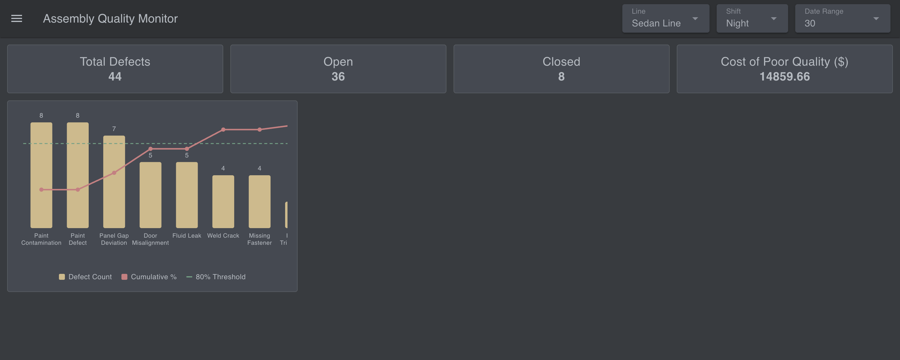
*The rendered Pareto chart. Make sure the cumulative line and the dashed 80% threshold are both visible.*

### Root cause

1. Add a link in node connected to "KPI Result".
2. Add a change node named "Extract Root Cause Data": set `msg.payload` to `msg.payload[0].root_cause` (msg).
3. Add a ui-chart node in the Root Cause group, chart type Bar, `root_cause` on the x-axis, `defect_count` on the y.

The query sorts it most-common-first, so the chart reads left to right as a priority list.

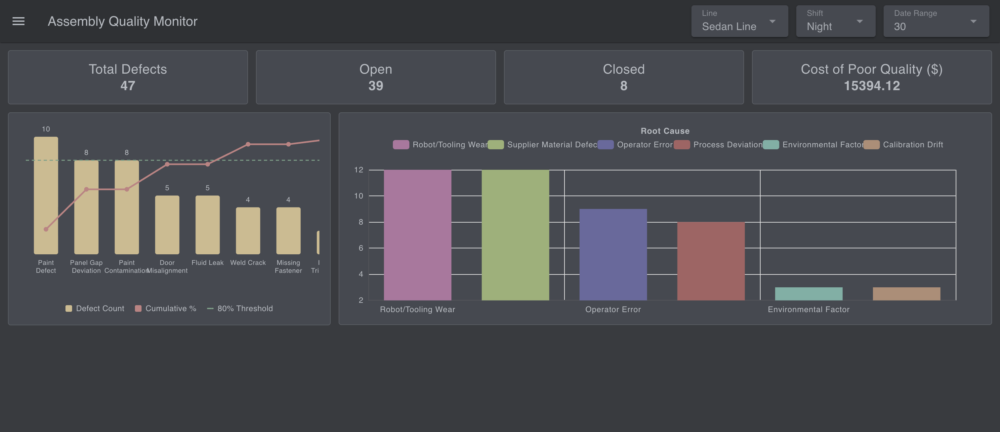
*The root cause bar chart, bars descending left to right.*

### Severity and disposition

1. Add two link in nodes connected to "KPI Result", one per chart.
2. Add two change nodes: "Extract Severity Data" sets `msg.payload` to `msg.payload[0].severity`; "Extract Disposition Data" sets `payload` to `payload[0].disposition`.
3. Add two ui-chart nodes in their groups, chart type Pie. For each, set the label to the category column (`severity` / `disposition`) and the value to `defect_count`.

Severity shows how serious the mix is; disposition shows what it's costing you: Scrap, Rework, or Use-as-is.

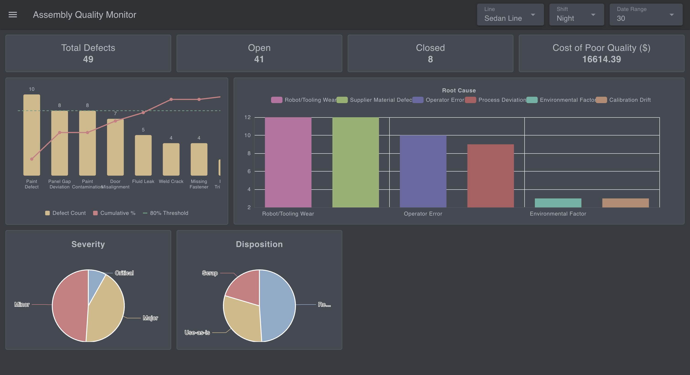
*The two pie charts. Capture Severity and Disposition together.*

### Defects per day

1. Add a link in node connected to "KPI Result".
2. Add a change node named "Extract Trend Data": set `msg.payload` to `msg.payload[0].trend` (msg).
3. Add a ui-chart node in the Defects Per Day group. Set the chart type to Line, the x-axis property to `date` (type: time), and the y-axis property to `defect_count`.

This is where a bad week, or a bad batch, shows up as a bump you can point at.

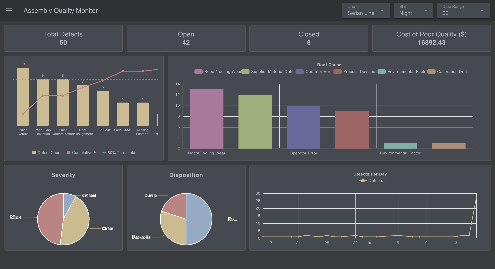
*The daily trend line chart. A date range showing a visible bump makes the point best.*

### Resolution time and SLA

1. Add a link in node connected to "KPI Result".
2. Add a change node named "Extract Resolution & SLA Data": set `msg.payload` to `msg.payload[0].avg_resolution_and_sla` (msg).
3. Add a ui-table node in the Average Resolution group. Turn off auto-columns and configure five: Severity (`severity`), Hours (`avg_resolution_hours`), Resolved (`resolved_count`), SLA Breached (`sla_breached_count`), SLA % (`sla_breach_pct`).

This is the widget that answers whether defects are being closed fast enough, not just how many exist.

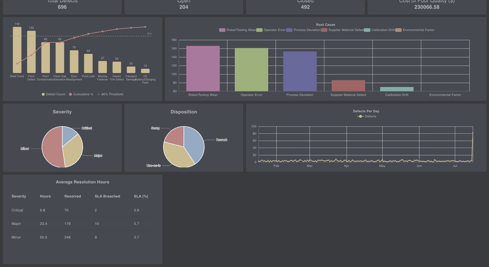
*The resolution/SLA table, all five columns per severity row.*

### Status funnel

1. Add a link in node connected to "KPI Result".
2. Add a change node named "Extract Status Funnel Data": set `payload` to `payload[0].status_funnel` (msg).
3. Add a ui-chart node in the Status Funnel group, chart type Bar, `status` on the x-axis, `defect_count` on the y.

The query orders it by workflow stage (Detected, RCA, Corrective Action, Resolved, Verified), so a pile-up at any stage is visible at a glance.

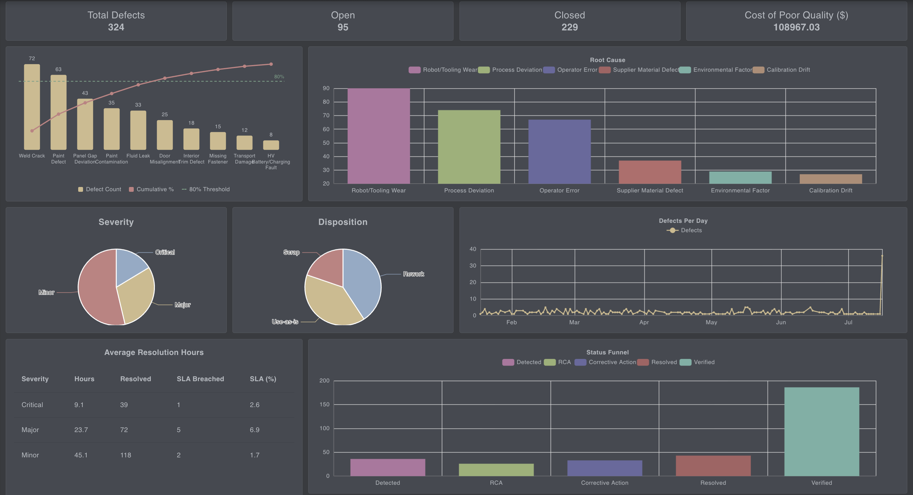
*The status funnel bar chart, bars in workflow order.*

Deploy and open the dashboard. Every widget populates from the seeded data at once. Change a filter in the header and the whole page recalculates together; leave the live feed running and the numbers keep ticking.

## What Next

You've built a working quality dashboard: a `defects` table, a single query that computes every KPI in one pass, and a page of stat cards, a Pareto chart, trend and breakdown charts, an SLA table, and a status funnel, all filtering live by line, shift, and date.

Right now it runs on the simulator, but that was only ever a stand-in for your real data. To go live, remove the simulator flow and point the query at your own `defects` table. Everything downstream keeps working, because the dashboard only ever reads from that one query. Your defects don't live in PostgreSQL? That's fine too. FlowFuse connects to MySQL, MongoDB, InfluxDB, and more, as our [database integration guides](/node-red/database/) show.

That's the real point. FlowFuse lets you build the exact application your floor needs quickly, without deep engineering knowledge or writing code, wired to the systems you already run instead of forcing your process to fit a fixed tool. This tutorial happened to build defect tracking, but the same approach covers production monitoring, OEE, and the wider quality picture. See how manufacturers are already putting it to work on our [automotive solutions page](/industries/automotive/) page.
