Operators need to know what to build, how to build it, and what to do when something breaks. Digital work instructions put that on a screen, guided steps, a checklist, buttons to finish or flag a defect, and retire the paper binder.

<!--more-->

But shared stations raise a question paper never had: who's using it? Without a way to tell operators apart, the work order, the current step, and the record of what happened all blur together. Authentication draws the line, the operator's identity becomes the thread the app hangs on.

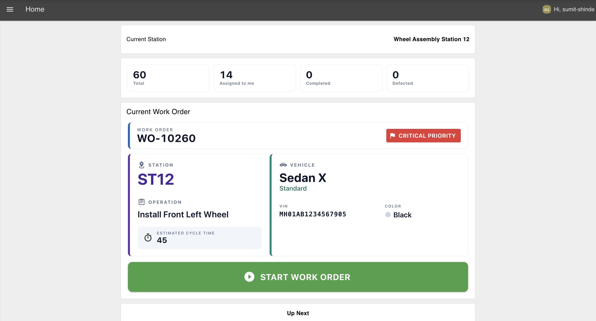
*Digital work instructions dashboard showing operator work orders, production status*

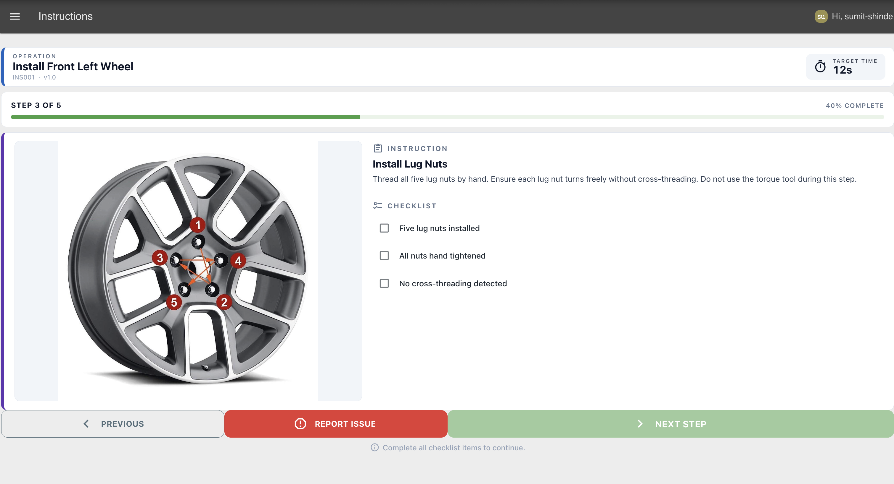
*Operator interface displaying guided work instructions with step completion and defect reporting options*

In this article, we'll build a digital work instructions app in FlowFuse: an operator interface with work orders, step-by-step assembly guidance, defect reporting, and traceability via authentication.

> **Note:** Before trying the demo, [sign up](https://app.flowfuse.com/account/create) for a FlowFuse account and start a free trial. The demo uses FlowFuse User Authentication, so you'll need to sign in to access the dashboard and see your personalized work orders and saved progress. Once logged in, wait a few seconds for the simulation flow to pick up your user and generate simulated work orders assigned to you.

You can interact with the live demo here: <a href="https://cheerful-western-sandpiper-1404.flowfuse.cloud/dashboard/downtime-events" onclick="if (typeof capture !== 'undefined') { capture('blog-live-demo', { reference: 'Blog: {{ title | escape }}' }); }">Try the Digital Work Instruction Dashboard Demo</a>.

## What You'll Need

Before you start building, get these ready:

- **A FlowFuse account.** [Sign up](https://app.flowfuse.com/account/create) for FlowFuse Cloud, or use a self-hosted instance.
- **A FlowFuse instance up and running.** If you don't have one yet, create a new instance from your FlowFuse Platform.
- **FlowFuse Dashboard installed.** This tutorial uses `@flowfuse/node-red-dashboard` nodes (`ui-template`, `ui-table`, `ui-form`, `ui-button`, `ui-control`, `ui-event`, `ui-text`) to build the operator interface. Install it from the Palette Manager if it isn't already in your instance.
- **The FlowFuse Dashboard user addon.** This is what attaches the logged-in user to every dashboard message. We'll install it in the first section.

> Note: The Multi-User addon is available to Teams and Enterprise Self-Hosted customers. If you're on a different tier, [contact us](/contact-us/) for the configuration to get started.

## How the Application Works

Before we build anything, let's walk through what the app does and how the pieces fit together. There are three pages, and one idea holding them together.

1. **Home.** After logging in, the application uses the operator's username to retrieve only the work orders assigned to them from the ERP or MES. It displays their station, production summary, the highest-priority work order, and the remaining queue. Selecting **Start Work Order** opens the instructions.
2. **Instructions.** Operators follow step-by-step instructions with images, checklists, and target cycle times. They can progress through each step, complete the operation, or report an issue at any time.
3. **Report Issue.** Operators can quickly log defects by selecting the issue type, severity, affected part, and description, with the issue automatically linked to the current work order.

The logged-in username acts as the application's lookup key. It retrieves the operator's assigned work orders and stores their active work order and current step, allowing them to resume exactly where they left off, even on shared production stations.

There are two different questions the app has to answer, and it's worth keeping them separate from the start:

- **"Where is this operator's data stored?"** — under a persistent global key named after their username, e.g. `global.get('operator1', 'persistent')`. This is a durable, shared store, and it's meant to be: it's what lets progress survive reloads and reconnects.
- **"Who is acting right now, in this message?"** — this must be read fresh from the message that triggered the flow (`msg._client.user`), not from a single shared "current user" variable. A shared variable has only one value at a time; the moment a second operator's browser connects, it overwrites the first operator's identity for the whole running flow. We'll come back to this the moment it becomes relevant, but it's the one rule that makes every "per operator" claim in this tutorial actually true when two people are logged in at once.

## Importing the Simulated Flow

Instead of connecting to a real ERP or MES, we'll use a simple simulated backend that serves sample work orders through an HTTP API.

1. Import the following flow into FlowFuse and click **Deploy**.


[{"id":"83cd1b1c4cc8e310","type":"group","z":"3012f9c2796b5b41","style":{"stroke":"#b2b3bd","stroke-opacity":"1","fill":"#f2f3fb","fill-opacity":"0.5","label":true,"label-position":"nw","color":"#32333b"},"nodes":["40f06650e63decd4","5a2c1cb7932accb9","f2334a5d527a684a","f65db363fdde0eba","cdda81f6a2701b7c","8554ad9dfdb36f54","6dd109a105da5dd5","439862e5c86675cd","9d853fad37785bec","3506d88cd094d44c","wo_stats_http_in","wo_stats_func","wo_stats_response","6d1644eabb9a5bf5"],"x":44,"y":59,"w":652,"h":482},{"id":"40f06650e63decd4","type":"inject","z":"3012f9c2796b5b41","g":"83cd1b1c4cc8e310","name":"","props":[{"p":"payload"},{"p":"topic","vt":"str"}],"repeat":"30","crontab":"","once":true,"onceDelay":"3","topic":"","payload":"","payloadType":"date","x":170,"y":100,"wires":[["6d1644eabb9a5bf5"]]},{"id":"5a2c1cb7932accb9","type":"http in","z":"3012f9c2796b5b41","g":"83cd1b1c4cc8e310","name":"GET Work Orders","url":"/workorders","method":"get","upload":false,"skipBodyParsing":false,"swaggerDoc":"","x":160,"y":300,"wires":[["f2334a5d527a684a"]]},{"id":"f2334a5d527a684a","type":"function","z":"3012f9c2796b5b41","g":"83cd1b1c4cc8e310","name":"Generate Work Orders","func":"const stationId = msg.req.query.stationId;\nconst username = msg.req.query.username;\n\nconst workOrders = global.get(\"workOrders\", \"persistent\") || [];\n\nconst result = workOrders.filter(w =>\n    w.stationId === stationId &&\n    w.assignedTo === username &&\n    w.status !== \"defect\" &&\n    w.status !== \"completed\"\n);\n\nmsg.payload = result;\n\nreturn msg;","outputs":1,"timeout":"","noerr":0,"initialize":"","finalize":"","libs":[],"x":420,"y":300,"wires":[["f65db363fdde0eba"]]},{"id":"f65db363fdde0eba","type":"http response","z":"3012f9c2796b5b41","g":"83cd1b1c4cc8e310","name":"","statusCode":"","headers":{"Content-Type":"application/json"},"x":610,"y":300,"wires":[]},{"id":"cdda81f6a2701b7c","type":"http in","z":"3012f9c2796b5b41","g":"83cd1b1c4cc8e310","name":"POST Mark Defect","url":"/workorders/defect","method":"post","upload":false,"skipBodyParsing":false,"swaggerDoc":"","x":160,"y":400,"wires":[["8554ad9dfdb36f54"]]},{"id":"8554ad9dfdb36f54","type":"function","z":"3012f9c2796b5b41","g":"83cd1b1c4cc8e310","name":"Mark Defect","func":"const { workOrderId, issueType, severity, affectedPart, description } = msg.payload || {};\n\nif (!workOrderId || !issueType || !severity || !affectedPart) {\n    msg.statusCode = 400;\n    msg.payload = { error: 'workOrderId, issueType, severity, and affectedPart are required' };\n    return msg;\n}\n\nconst workOrders = global.get('workOrders', 'persistent') || [];\nconst idx = workOrders.findIndex(w => w.workOrderId === workOrderId);\n\nif (idx === -1) {\n    msg.statusCode = 404;\n    msg.payload = { error: 'Work order not found' };\n    return msg;\n}\n\nworkOrders[idx].status = 'defect';\nworkOrders[idx].defect = {\n    issueType,\n    severity,\n    affectedPart,\n    description: description || null,\n    reportedAt: new Date().toISOString()\n};\n\nglobal.set('workOrders', workOrders, 'persistent');\n\nmsg.statusCode = 200;\nmsg.payload = { success: true, workOrder: workOrders[idx] };\nreturn msg;","outputs":1,"timeout":"","noerr":0,"initialize":"","finalize":"","libs":[],"x":390,"y":400,"wires":[["6dd109a105da5dd5"]]},{"id":"6dd109a105da5dd5","type":"http response","z":"3012f9c2796b5b41","g":"83cd1b1c4cc8e310","name":"","statusCode":"","headers":{"Content-Type":"application/json"},"x":610,"y":400,"wires":[]},{"id":"439862e5c86675cd","type":"http in","z":"3012f9c2796b5b41","g":"83cd1b1c4cc8e310","name":"POST Complete Order","url":"/workorders/complete","method":"post","upload":false,"skipBodyParsing":false,"swaggerDoc":"","x":170,"y":500,"wires":[["9d853fad37785bec"]]},{"id":"9d853fad37785bec","type":"function","z":"3012f9c2796b5b41","g":"83cd1b1c4cc8e310","name":"Complete Work Order","func":"const { workOrderId } = msg.payload || {};\n\nif (!workOrderId) {\n    msg.statusCode = 400;\n    msg.payload = { error: 'workOrderId is required' };\n    return msg;\n}\n\nconst workOrders = global.get('workOrders', 'persistent') || [];\nconst idx = workOrders.findIndex(w => w.workOrderId === workOrderId);\n\nif (idx === -1) {\n    msg.statusCode = 404;\n    msg.payload = { error: 'Work order not found' };\n    return msg;\n}\n\nworkOrders[idx].status = 'completed';\nworkOrders[idx].completedAt = new Date().toISOString();\n\nglobal.set('workOrders', workOrders, 'persistent');\n\nmsg.statusCode = 200;\nmsg.payload = { success: true, workOrder: workOrders[idx] };\nreturn msg;","outputs":1,"timeout":"","noerr":0,"initialize":"","finalize":"","libs":[],"x":410,"y":500,"wires":[["3506d88cd094d44c"]]},{"id":"3506d88cd094d44c","type":"http response","z":"3012f9c2796b5b41","g":"83cd1b1c4cc8e310","name":"","statusCode":"","headers":{"Content-Type":"application/json"},"x":620,"y":500,"wires":[]},{"id":"wo_stats_http_in","type":"http in","z":"3012f9c2796b5b41","g":"83cd1b1c4cc8e310","name":"GET Work Order Stats","url":"/workorders/stats","method":"get","upload":false,"skipBodyParsing":false,"swaggerDoc":"","x":180,"y":220,"wires":[["wo_stats_func"]]},{"id":"wo_stats_func","type":"function","z":"3012f9c2796b5b41","g":"83cd1b1c4cc8e310","name":"Compute Stats","func":"const workOrders = global.get('workOrders', 'persistent') || [];\nnode.warn(msg.req.query);\nconst stationId = msg.req.query.stationId;\nconst username = msg.req.query.username;\n\n// Filter only by station\nconst stationWorkOrders = stationId\n    ? workOrders.filter(w => w.stationId === stationId)\n    : workOrders;\n\nconst total = stationWorkOrders.length;\nconst completed = stationWorkOrders.filter(w => w.status === \"completed\").length;\nconst defected = stationWorkOrders.filter(w => w.status === \"defect\").length;\n\n// Filter by user within the station\nconst assignedToMe = username\n    ? stationWorkOrders.filter(w => w.assignedTo === username).length\n    : 0;\n\nmsg.statusCode = 200;\nmsg.payload = {\n    total,\n    completed,\n    defected,\n    assignedToMe\n};\n\nreturn msg;","outputs":1,"timeout":"","noerr":0,"initialize":"","finalize":"","libs":[],"x":400,"y":220,"wires":[["wo_stats_response"]]},{"id":"wo_stats_response","type":"http response","z":"3012f9c2796b5b41","g":"83cd1b1c4cc8e310","name":"","statusCode":"","headers":{"Content-Type":"application/json"},"x":610,"y":220,"wires":[]},{"id":"6d1644eabb9a5bf5","type":"function","z":"3012f9c2796b5b41","g":"83cd1b1c4cc8e310","name":"Generate Mock Work Orders","func":"const user = global.get(\"user\", \"persistent\");\nconst currentUser = user?.username || \"operator1\";\n\n// Pool of 5 operators (logged-in user + 4 others)\nconst operators = [\n    currentUser,\n    \"operator2\",\n    \"operator3\",\n    \"operator4\",\n    \"operator5\"\n];\n\nconst vehicles = [\n    {\n        model: \"Sedan X\",\n        variants: [\"Standard\", \"Premium\", \"Sport\"],\n        colors: [\"White\", \"Black\", \"Red\"]\n    },\n    {\n        model: \"SUV Y\",\n        variants: [\"Base\", \"Premium\", \"Sport\"],\n        colors: [\"Grey\", \"White\", \"Black\"]\n    },\n    {\n        model: \"Truck Z\",\n        variants: [\"Standard\", \"Heavy Duty\"],\n        colors: [\"Blue\", \"Green\", \"White\"]\n    },\n    {\n        model: \"Hatchback W\",\n        variants: [\"Base\", \"Sport\"],\n        colors: [\"Silver\", \"Yellow\", \"Red\"]\n    }\n];\n\nconst operations = [\n    {\n        operationId: \"OP_WHEEL_FL\",\n        name: \"Install Front Left Wheel\",\n        instructionSetId: \"INS001\",\n        estimatedCycleTime: 45\n    },\n    {\n        operationId: \"OP_WHEEL_FR\",\n        name: \"Install Front Right Wheel\",\n        instructionSetId: \"INS002\",\n        estimatedCycleTime: 45\n    }\n];\n\nconst priorities = [\"Critical\", \"High\", \"Normal\", \"Low\"];\nconst statuses = [\"Ready\", \"Waiting\", \"Queued\"];\n\nfunction random(arr) {\n    return arr[Math.floor(Math.random() * arr.length)];\n}\n\n// Read existing work orders\nconst existingWorkOrders = global.get(\"workOrders\", \"persistent\") || [];\n\n// Start IDs after the existing ones\nlet nextId = 10245 + existingWorkOrders.length;\n\n// Generate 20 new work orders\nfor (let i = 0; i < 20; i++) {\n    const vehicle = random(vehicles);\n    const operation = random(operations);\n\n    existingWorkOrders.push({\n        workOrderId: `WO-${nextId++}`,\n        stationId: \"ST12\",\n        status: random(statuses),\n        priority: random(priorities),\n        assignedTo: random(operators),\n        vehicle: {\n            vin: `MH01AB${1234567890 + existingWorkOrders.length}`,\n            model: vehicle.model,\n            variant: random(vehicle.variants),\n            color: random(vehicle.colors)\n        },\n        operation: {\n            operationId: operation.operationId,\n            name: operation.name,\n            estimatedCycleTime: operation.estimatedCycleTime,\n            instructionSetId: operation.instructionSetId\n        }\n    });\n}\n\n// Save updated list\nglobal.set(\"workOrders\", existingWorkOrders, \"persistent\");\n\nmsg.payload = existingWorkOrders;\nreturn msg;","outputs":1,"timeout":0,"noerr":0,"initialize":"","finalize":"","libs":[],"x":440,"y":100,"wires":[[]]}]


The flow initializes a set of sample work orders and exposes REST APIs that the Digital Work Instructions application uses throughout this tutorial. The `GET /workorders` endpoint returns the active work orders, while the other endpoints simulate completing a work order, reporting defects, and retrieving production statistics. This lets you build and test the application without a live ERP or MES. Later, you can replace these endpoints with calls to your production system while keeping the rest of the application unchanged.

## Setting Up the Dashboard Layout

The application consists of three pages. Most widgets are placed inside named groups, while a few are scoped differently. See the [Dashboard layout docs](https://dashboard.flowfuse.com/getting-started) if you're new to how pages, groups, and bases relate. The app bar greeting is **UI-scoped**, and the work instruction widget is **page-scoped**, allowing it to fill the entire **Instructions** page without requiring a group. Before adding any widgets, create the dashboard structure by setting up the pages and groups.

1. Create three **ui-page** nodes. The Dashboard automatically creates a base dashboard the first time you add a Dashboard node to the canvas.

   * **Home** (path: `/home`) – The operator's landing page after login. Set the layout to **Notebook** to match the demo application.
   * **Instructions** (path: `/instructions`) – Displays the step-by-step work instructions. Set the layout to **Grid**.
   * **Report Issue** (path: `/report-issue`) – Contains the defect reporting form. Set the layout to **Grid**.

2. Configure the theme for each page as desired.

3. On the **Home** page, create four **ui-group** nodes:

   * **Current Station**
   * **Stats**
   * **Current Work Order**
   * **Up Next**

4. On the **Report Issue** page, create a single **ui-group** named **Report Issue**. This group will contain the issue reporting form and its action buttons.

The **Instructions** page does not require a **ui-group** because the work instruction widget is page-scoped and automatically occupies the full page.

With this layout in place, each widget added in the following sections can be assigned to the appropriate group, or directly to the page when required.

## Enabling FlowFuse User Authentication

Everything starts with a login. Without authentication, the dashboard cannot identify who is using it, so every visitor sees the same experience.

1. Open your FlowFuse instance **Settings**.
2. Select the **Security** tab.
3. Enable **FlowFuse User Authentication**.


*Enable FlowFuse User Authentication in the instance Security settings. You'll also create a Personal Access Token here for authenticating API requests later in the tutorial.*

The first time someone opens the dashboard, they will be prompted to sign in using their FlowFuse username and password. Once authenticated, the dashboard can personalize the experience for each operator throughout the rest of this tutorial.

Because this tutorial also interacts with the FlowFuse API, you'll need to create a Personal Access Token:

4. In the same **Security** tab, click **Add Token**.
5. Enter a name for the token and choose an expiration date.
6. Click **Create**, then copy the generated token and save it somewhere secure. You will need it later in the tutorial.

> **Security note:** Every `http request` node in this tutorial authenticates with this token, and for the sake of a self-contained tutorial we reference it as a plain Bearer token on each node. Don't leave it hardcoded that way in a real deployment. Store it as an environment variable on your FlowFuse instance and reference that variable from each `http request` node's auth config instead, so the raw token never sits in exported flow JSON or version control.

## Installing the User Addon

Authentication identifies the user, but your flows also need access to that information. The FlowFuse User Addon attaches the authenticated user's details to every Dashboard message.

1. Open **Manage Palette**.
2. Go to the **Install** tab.
3. Search for `@flowfuse/node-red-dashboard-2-user-addon`.
4. Click **Install**.

After installation, every Dashboard message includes a `msg._client.user` object:

```json
{
  "userId": "",
  "username": "",
  "email": "",
  "name": "",
  "image": ""
}
```

The same information is available in a **ui-template** using `setup.socketio.auth.user` (or `this.setup.socketio.auth.user` in the script).

1. In the **FF Auth** sidebar tab, ensure **Include Client Data** is enabled.
2. Also enable **Accept Client Data** for **ui-template**, **ui-control**, **ui-event**, **ui-form**, and **ui-table** so each browser session is handled independently and operators don't affect each other's dashboard.

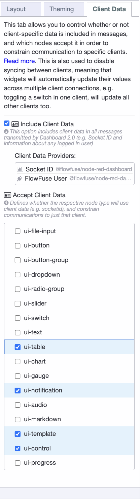
*Enable **Include Client Data** and **Accept Client Data** to make Dashboard interactions user-specific.*

This is the setting that matters most in this tutorial, and it's worth being explicit about why. With **Accept Client Data** enabled, every message a widget sends carries `msg._client.user` for the session that sent it. That's a per-session identity attached directly to the message, as opposed to a single shared variable that every session would otherwise read and overwrite. We'll use `msg._client.user` as the source of truth for "who is acting right now" in every function node from here on, rather than a global variable.

## Greeting the Logged-In Operator

The first, simplest payoff: show the operator their name and avatar in the app bar, so it's obvious who's signed in at this station. This uses Vue's [Teleport](https://dashboard.flowfuse.com/nodes/widgets/ui-template.html#teleports) to render into the header's action area from a single widget that lives on every page, so you don't have to add it per page.

1. Add a `ui-template` node and name it "App Bar User Info".
2. Set its type to **Widget (UI-Scoped)** and select your "My Dashboard" ui-base. UI-scoped widgets render on every page automatically, so one widget covers the whole app, no group needed.
3. Paste in the snippet below:

```html
<template>
    <!-- Teleport into #app-bar-actions, the action bar's right-hand corner -->
    <Teleport v-if="loaded" to="#app-bar-actions">
        <div class="user-info">
            
            <span>Hi, {{ setup.socketio.auth.user.name }}</span>
        </div>
    </Teleport>
</template>

<script>
export default {
    data() {
        return { loaded: false };
    },
    mounted() {
        // Wait for mount so #app-bar-actions exists before teleporting into it.
        this.loaded = true;
    }
}
</script>

<style>
.user-info { display: flex; align-items: center; gap: 8px; }
.user-info img { width: 24px; height: 24px; }
</style>
```

Deploy and open the dashboard. The signed-in operator's name and avatar appear in the top-right corner. You don't redeploy when a different operator logs in, the addon fetches each user's data at runtime, so everyone sees their own. This widget reads identity straight off the browser's own socket session (`setup.socketio.auth.user`), so it's already per-operator by construction, no shared state involved.

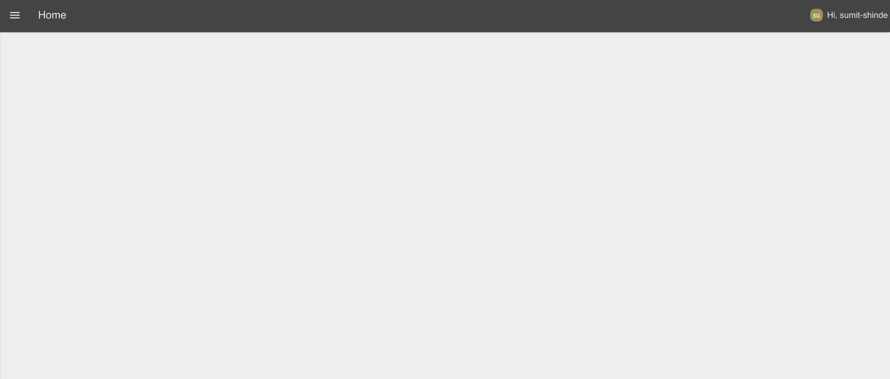 *The signed-in operator greeted by name and avatar in the app bar, rendered from a single UI-scoped widget.*

## Seeding the Operator into Context on Login

Greeting the operator is the visible half. The other half is making their identity available to every function node in the flow, not just the widgets.

It's tempting to reach for a single shared variable here, something like `global.set('user', msg._client.user, 'persistent')` on connect, then `global.get('user', 'persistent')` everywhere else. **Don't build it that way.** Global context is one shared store for the whole running flow, not one per browser session. If two operators are logged in at the same station, or at different stations on the same instance, at the same time, whichever one connects last overwrites that key for everyone. Every function node reading it afterwards would attribute the wrong operator's actions to the wrong person, exactly the bug authentication was supposed to prevent.

The move that actually works: keep using each operator's username as a durable storage key (`global.get(username, 'persistent')`, `global.set(username, ..., 'persistent')`) for their saved state, that's a fine and necessary use of global context. But for "who is acting right now," read `msg._client.user` off the message itself, since it's tagged per-session. The one place a shared global is still useful is as a bootstrap fallback: a value to fall back on for the very first tick of a page, before any client-tagged message has round-tripped through the flow.

1. Add a `ui-event` node, name it "Client connected", and select the "My Dashboard" ui-base. It fires the moment a browser session connects to the dashboard.
2. Add a `change` node and name it "Seed globals". Add these `set` rules, in order:
   - Set `user` (global, persistent) to `msg._client.user`. This is a **bootstrap fallback only**, used before a client-tagged message exists to read from. It is not the source of truth for "current operator" anywhere else in this app.
   - Set `StationContext.stationName` (global) to your station's name, e.g. `Wheel Assembly Station 12`. The Home page reads this to show the operator where they are.
   - Set `StationContext.stationId` (global, persistent) to this station's ID, e.g. `ST12`. The work-order and stats requests read this to fetch only what belongs to this station.
   - Set `Instructions` (global, persistent) to the instruction set for this station's operation, the step list, images, target times, and checklists. Caching it in context means the Instructions page loads instantly instead of re-fetching on every visit.
3. Wire "Client connected" into "Seed globals".

From here on, every function node that needs to know who's acting will use this helper pattern: prefer `msg._client?.user?.username`, and only fall back to the bootstrap global if `_client` isn't present on that particular message.

```javascript
// Shared pattern used throughout the rest of this tutorial:
// per-session identity first, shared global only as a bootstrap fallback.
const username = msg._client?.user?.username
    || global.get('user', 'persistent')?.username;
```

## Showing the Station and Stats on the Home Page

The Home page shows the current station and a quick summary of work order statistics. Both update whenever the page opens.

### Display the Station Name

1. From the **Client connected** event, add a **change** node named **Read station name** and set `msg.payload` to `global.StationContext.stationName`.
2. Connect it to a **ui-text** node named **Current Station** in the **Current Station** group. Set the value to `msg.payload`.

### Display the Stats

1. Add a **ui-control** node named **Page changed**, set its event to **change**, and select your dashboard.
2. Add a **function** node named **Build /stats request URL** and paste in the following code. **Replace `https://your-instance.flowfuse.cloud` with your own FlowFuse instance URL.**

```javascript
const StationContext = global.get('StationContext', 'persistent');
const username = msg._client?.user?.username
    || global.get('user', 'persistent')?.username;

const params = new URLSearchParams();
params.set('stationId', StationContext.stationId);
if (username) params.set('username', username);

msg.url = `https://your-instance.flowfuse.cloud/workorders/stats?${params}`;
msg.method = "GET";
return msg;
```

3. Add an **http request** node that uses `msg.method` and `msg.url`, returns a parsed JSON object, and uses **Bearer** authentication.
4. Configure the bearer token using the access token you created earlier. For production, store it as an environment variable instead of hardcoding it in the flow.
5. Add a **ui-template** named **Stats Cards** in the **Stats** group and paste in the template below.
6. Wire the nodes: **Page changed → Build /stats request URL → HTTP Request → Stats Cards**.

The request includes the logged-in username, so the **Assigned to me** count is personalized for each operator, and because `ui-control` is client-data-aware, `msg._client.user` reflects whichever operator's browser triggered the page change.

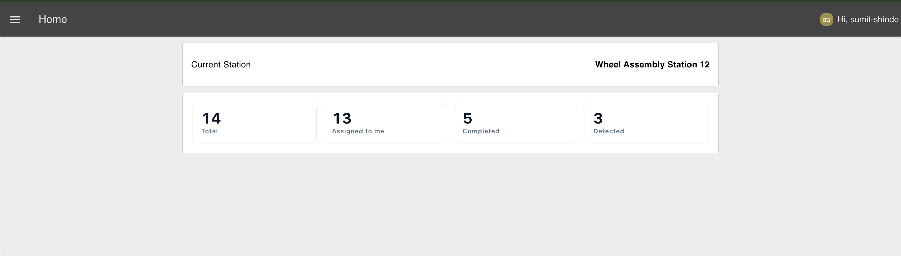
*The Home page displays station statistics, including total, assigned to me, completed, and defected work orders.*

## Loading the Operator's Work Orders

Now for the main part of the Home page: fetching and displaying the operator's work orders. Because the request includes the logged-in username, each operator only sees the work orders assigned to them at the current station.

1. Add a **ui-control** node named **Page changed**, select your dashboard, and set the event to **change**. It fires whenever the operator navigates to the Home page, triggering the work order request.

2. Add a **function** node named **Build /workorders request URL**, paste in the code below, and replace `https://your-instance.flowfuse.cloud` with your own FlowFuse instance URL.

```javascript id="8m19sv"
const StationContext = global.get('StationContext', 'persistent');
const username = msg._client?.user?.username
    || global.get('user', 'persistent')?.username;

const stationId = StationContext?.stationId;

const params = new URLSearchParams();
params.set('stationId', stationId);
if (username) params.set('username', username);

msg.url = `https://your-instance.flowfuse.cloud/workorders?${params.toString()}`;
msg.method = 'GET';
return msg;
```

3. Add an **http request** node, set the **Method** to **Use `msg.method`**, leave the **URL** field blank so it uses `msg.url`, set the **Return** type to a **parsed JSON object**, and configure **Bearer** authentication. Use the access token you created earlier as the bearer token. For production deployments, store the token as an environment variable and reference it here instead of hardcoding it in the flow.

4. Connect the **http request** node to a **link out** node named **Work Orders Out**. The widgets that display the work orders will connect to this node using their own **link in** nodes, allowing the same API response to be reused without stretching wires across the canvas.

The username in the request is what makes the dashboard personal. Two operators can open the same page at the same station, yet each receives only the work orders assigned to them, because each one's `ui-control` event carries their own `_client.user`, not a shared one.

## Splitting the Current Order From the Queue

The Home page shows one work order front and centre and the rest as a queue. A function splits the list, sorting by priority so the most urgent job is the one the operator sees first. This function also records which work order the operator is about to start, that's the record the Instructions page, the Complete Operation flow, and the Report Issue flow will all read back later, so it has to be attributed to the right operator from the start.

1. Add a `link in` node named "link in 6" and point it at the "work orders out" link.
2. Add a `function` node named "split current vs queue (by priority)" with **2 outputs**:

```javascript
const orders = Array.isArray(msg.payload) ? msg.payload : [];

// Sort by priority (Critical/Urgent -> High -> Medium -> Normal -> Low)
const priorityOrder = { critical: 0, urgent: 0, high: 1, medium: 2, normal: 3, low: 4 };
const sorted = [...orders].sort(
    (a, b) => (priorityOrder[(a.priority || '').toLowerCase()] ?? 5)
            - (priorityOrder[(b.priority || '').toLowerCase()] ?? 5)
);

const currentWorkOrder = sorted[0] || null;

// Record which work order the current operator is about to see/start.
// Identity comes from the triggering message's client data, not a shared global,
// so this is always attributed to the operator whose browser fetched this list.
const username = msg._client?.user?.username
    || global.get('user', 'persistent')?.username;

if (username && currentWorkOrder) {
    const userState = global.get(username, 'persistent') || {};
    userState.workOrderId = currentWorkOrder.workOrderId;
    global.set(username, userState, 'persistent');
}

return [
    { payload: currentWorkOrder },  // output 1: current order (for card)
    { payload: sorted.slice(1) }    // output 2: remaining orders (queue)
];
```

3. Import the Current Work Order Card ui-template below and assign it to the Current Work Order group. The complete component is provided below, so there's no need to recreate it.

> **Tip:** Whenever you need a custom Dashboard widget, you don't have to write the Vue code yourself. Use [FlowFuse Expert](https://flowfuse.com/docs/user/expert/node-red-embedded-ai/?utm_source=chatgpt.com#css-and-html-generation-for-flowfuse-dashboard) and describe the widget in plain English and it will generate the `ui-template` for you.



[{"id":"eb41d1ba8e4bfb01","type":"ui-template","z":"c50b1b501a74c081","g":"3e9b1176168ca254","group":"","page":"","ui":"","name":"Current Work Order Card","order":1,"width":0,"height":0,"head":"","format":"<template>\n  <div class=\"wi-root\">\n    <!-- Top status bar -->\n    <div class=\"wi-topbar\">\n      <div class=\"wi-topbar-left\">\n        <span class=\"wi-wo-label\">WORK ORDER</span>\n        <span class=\"wi-wo-id\">{{ msg?.payload?.workOrderId ?? '—' }}</span>\n      </div>\n      <div class=\"wi-topbar-right\">\n        <v-chip size=\"large\" variant=\"flat\" label :color=\"priorityColor\" class=\"wi-chip\">\n          <v-icon start icon=\"mdi-flag\"></v-icon>\n          {{ (msg?.payload?.priority ?? 'Normal').toUpperCase() }} PRIORITY\n        </v-chip>\n      </div>\n    </div>\n\n    <v-row no-gutters class=\"wi-body\">\n      <!-- Left: Station + Operation -->\n      <v-col cols=\"12\" md=\"5\" class=\"wi-col\">\n        <v-card flat class=\"wi-card wi-card-station\">\n          <div class=\"wi-card-head\">\n            <v-icon icon=\"mdi-map-marker-radius\" size=\"22\"></v-icon>\n            <span>STATION</span>\n          </div>\n          <div class=\"wi-station-id\">{{ msg?.payload?.stationId ?? '—' }}</div>\n\n          <v-divider class=\"wi-divider\"></v-divider>\n\n          <div class=\"wi-card-head\">\n            <v-icon icon=\"mdi-clipboard-text-outline\" size=\"22\"></v-icon>\n            <span>OPERATION</span>\n          </div>\n          <div class=\"wi-operation-name\">\n            {{ msg?.payload?.operation?.name ?? 'Awaiting operation' }}\n          </div>\n\n          <div class=\"wi-cycle\">\n            <v-icon icon=\"mdi-timer-outline\" size=\"26\"></v-icon>\n            <div class=\"wi-cycle-text\">\n              <span class=\"wi-cycle-label\">ESTIMATED CYCLE TIME</span>\n              <span class=\"wi-cycle-value\">\n                {{ msg?.payload?.operation?.estimatedCycleTime ?? '—' }}\n              </span>\n            </div>\n          </div>\n        </v-card>\n      </v-col>\n\n      <!-- Right: Vehicle -->\n      <v-col cols=\"12\" md=\"7\" class=\"wi-col\">\n        <v-card flat class=\"wi-card wi-card-vehicle\">\n          <div class=\"wi-card-head\">\n            <v-icon icon=\"mdi-car-side\" size=\"22\"></v-icon>\n            <span>VEHICLE</span>\n          </div>\n\n          <div class=\"wi-vehicle-model\">\n            {{ msg?.payload?.vehicle?.model ?? 'Unknown model' }}\n          </div>\n          <div class=\"wi-vehicle-variant\">\n            {{ msg?.payload?.vehicle?.variant ?? '' }}\n          </div>\n\n          <v-row no-gutters class=\"wi-spec-grid\">\n            <v-col cols=\"12\" sm=\"7\">\n              <div class=\"wi-spec\">\n                <span class=\"wi-spec-label\">VIN</span>\n                <span class=\"wi-spec-value wi-vin\">\n                  {{ msg?.payload?.vehicle?.vin ?? '—' }}\n                </span>\n              </div>\n            </v-col>\n            <v-col cols=\"12\" sm=\"5\">\n              <div class=\"wi-spec\">\n                <span class=\"wi-spec-label\">COLOR</span>\n                <span class=\"wi-spec-value\">\n                  <v-icon\n                    icon=\"mdi-circle\"\n                    size=\"18\"\n                    class=\"wi-color-dot\"\n                  ></v-icon>\n                  {{ msg?.payload?.vehicle?.color ?? '—' }}\n                </span>\n              </div>\n            </v-col>\n          </v-row>\n        </v-card>\n      </v-col>\n    </v-row>\n\n    <!-- Start button -->\n    <v-btn block size=\"x-large\" color=\"green-darken-1\" class=\"wi-start-btn\" :disabled=\"!msg?.payload?.workOrderId\"\n      @click=\"send({ payload: { action: 'start', workOrderId: msg?.payload?.workOrderId, stationId: msg?.payload?.stationId } })\">\n      <v-icon start icon=\"mdi-play-circle\" size=\"34\"></v-icon>\n      START WORK ORDER\n    </v-btn>\n  </div>\n</template>\n\n<script>\n  export default {\n  computed: {\n    priorityColor () {\n      const p = (this.msg?.payload?.priority ?? '').toLowerCase()\n      if (p === 'high' || p === 'urgent' || p === 'critical') return 'red-darken-1'\n      if (p === 'medium') return 'amber-darken-2'\n      return 'blue-grey-darken-1'\n    }\n  }\n}\n</script>\n\n<style>\n  .wi-root {\n    font-family: 'Roboto', system-ui, sans-serif;\n    color: #1f2933;\n    padding: 4px;\n  }\n\n  .wi-topbar {\n    display: flex;\n    align-items: center;\n    justify-content: space-between;\n    flex-wrap: wrap;\n    gap: 12px;\n    background: #ffffff;\n    border: 1px solid #e2e8f0;\n    border-left: 6px solid #1565c0;\n    border-radius: 10px;\n    padding: 14px 20px;\n    margin-bottom: 14px;\n  }\n\n  .wi-topbar-left {\n    display: flex;\n    flex-direction: column;\n    line-height: 1.1;\n  }\n\n  .wi-wo-label {\n    font-size: 12px;\n    letter-spacing: 2px;\n    color: #64748b;\n    font-weight: 600;\n  }\n\n  .wi-wo-id {\n    font-size: 30px;\n    font-weight: 700;\n    color: #0f172a;\n    font-variant-numeric: tabular-nums;\n  }\n\n  .wi-topbar-right {\n    display: flex;\n    gap: 10px;\n    flex-wrap: wrap;\n  }\n\n  .wi-chip {\n    font-weight: 700 !important;\n    letter-spacing: 0.5px;\n  }\n\n  .wi-body {\n    gap: 0;\n  }\n\n  .wi-col {\n    padding: 6px;\n  }\n\n  .wi-card {\n    background: #ffffff !important;\n    border: 1px solid #e2e8f0 !important;\n    border-radius: 10px !important;\n    padding: 20px 22px;\n    height: 100%;\n  }\n\n  .wi-card-vehicle {\n    border-left: 6px solid #00897b !important;\n  }\n\n  .wi-card-station {\n    border-left: 6px solid #5e35b1 !important;\n  }\n\n  .wi-card-head {\n    display: flex;\n    align-items: center;\n    gap: 8px;\n    font-size: 13px;\n    letter-spacing: 2px;\n    font-weight: 700;\n    color: #64748b;\n    margin-bottom: 6px;\n  }\n\n  .wi-station-id {\n    font-size: 44px;\n    font-weight: 700;\n    color: #4527a0;\n    line-height: 1;\n    margin-bottom: 6px;\n  }\n\n  .wi-divider {\n    margin: 16px 0;\n    border-color: #edf2f7 !important;\n  }\n\n  .wi-operation-name {\n    font-size: 24px;\n    font-weight: 600;\n    color: #0f172a;\n    margin-bottom: 18px;\n  }\n\n  .wi-cycle {\n    display: flex;\n    align-items: center;\n    gap: 12px;\n    background: #f1f5f9;\n    border-radius: 8px;\n    padding: 12px 16px;\n  }\n\n  .wi-cycle-text {\n    display: flex;\n    flex-direction: column;\n    line-height: 1.2;\n  }\n\n  .wi-cycle-label {\n    font-size: 11px;\n    letter-spacing: 1.5px;\n    font-weight: 600;\n    color: #64748b;\n  }\n\n  .wi-cycle-value {\n    font-size: 22px;\n    font-weight: 700;\n    color: #0f172a;\n    font-variant-numeric: tabular-nums;\n  }\n\n  .wi-vehicle-model {\n    font-size: 34px;\n    font-weight: 700;\n    color: #0f172a;\n    line-height: 1.05;\n  }\n\n  .wi-vehicle-variant {\n    font-size: 18px;\n    font-weight: 500;\n    color: #00695c;\n    margin-bottom: 20px;\n  }\n\n  .wi-spec-grid {\n    gap: 0;\n  }\n\n  .wi-spec {\n    display: flex;\n    flex-direction: column;\n    padding: 10px 0;\n  }\n\n  .wi-spec-label {\n    font-size: 11px;\n    letter-spacing: 1.5px;\n    font-weight: 600;\n    color: #64748b;\n    margin-bottom: 2px;\n  }\n\n  .wi-spec-value {\n    font-size: 20px;\n    font-weight: 600;\n    color: #0f172a;\n    display: flex;\n    align-items: center;\n    gap: 6px;\n  }\n\n  .wi-vin {\n    font-family: 'Roboto Mono', monospace;\n    font-size: 18px;\n    letter-spacing: 1px;\n  }\n\n  .wi-color-dot {\n    color: #cbd5e1;\n  }\n\n  .wi-start-btn {\n    margin-top: 16px;\n    height: 84px !important;\n    font-size: 24px !important;\n    font-weight: 700 !important;\n    letter-spacing: 1px;\n    border-radius: 12px !important;\n  }\n</style>","storeOutMessages":true,"passthru":false,"resendOnRefresh":true,"templateScope":"local","className":"","x":570,"y":620,"wires":[["455c7536a9adcfe6"]]},{"id":"77ecf88a48f8c4f0","type":"global-config","env":[],"modules":{"@flowfuse/node-red-dashboard":"1.30.2"}}]



4. Wire **output 1** to the "Current Work Order Card" `ui-template` in the **Current Work Order** group. It shows the work order ID, station, operation and estimated cycle time, the vehicle (model, variant, VIN, colour), a priority chip, and a **Start Work Order** button. On click, the button sends `{ action: 'start', workOrderId, stationId }`.

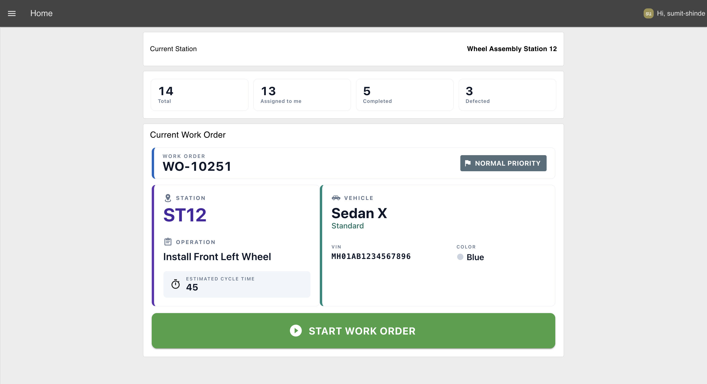 *The Current Work Order card: work order ID, priority chip, station, operation, vehicle details, and the Start button.*

5. Add a `ui-table` node and assign it to the **Up Next** group. Turn off auto-columns and add two text columns as shown below: Work Order (workOrderId) and Priority (priority). Wire output 2 of the split function into it.

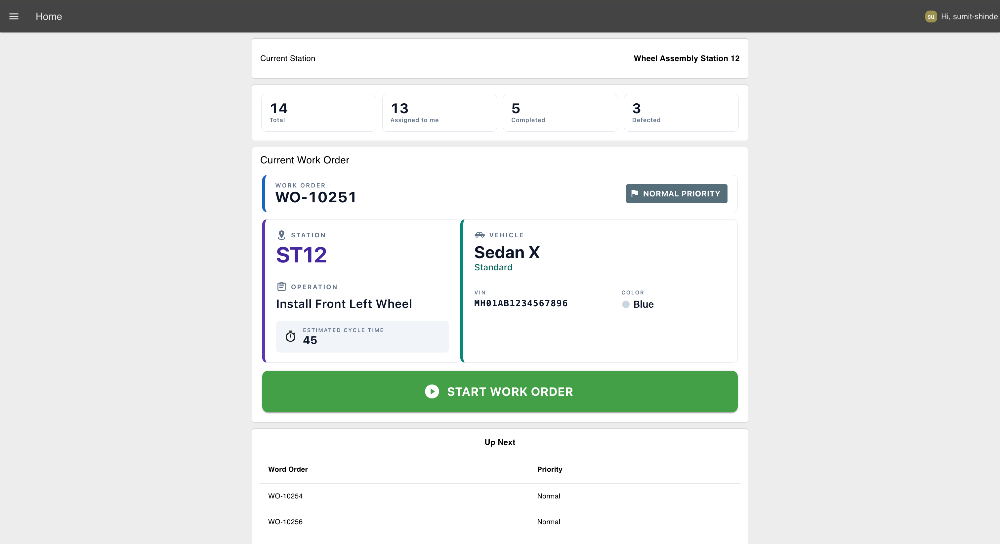 *The Up Next table showing the remaining queued work orders with their priority.*

6. From the card, wire a `change` node named "go to Instructions" that sets `payload` (msg) to `Instructions`, then into a `ui-control` node with its event set to **change** to switch the page.

When the operator taps **Start Work Order**, the card sends them to the Instructions page. Because the split function already saved this operator's `workOrderId` under their own username, the Instructions page, Complete Operation, and Report Issue flows can all look it back up correctly, even if another operator is doing the exact same thing on another screen at the same moment.

## Loading the Cached Instruction Set

The Instructions page needs the steps to show. Because the instruction set was cached in context on login, the page can paint it instantly without another round trip.

1. Add a `ui-event` node named "Page opened" for the Instructions page.
2. Add a `change` node named "Load cached instruction set". Set `payload` (msg) to the persistent global `Instructions`.
3. Wire "Page opened" into it, and its output into the "Work Instruction Widget" you build next.

## Remembering Each Operator's Step

This is something paper can't do and shared screens get wrong. If an operator completes the first two steps of a five-step wheel installation and returns later, they should resume at **step 3**, not start again at **step 1**. We achieve this by saving their progress against their username, the one they were identified as when the step was saved, not whichever username happens to be sitting in a shared global at read time.

The instruction widget emits two housekeeping actions: `save_step` whenever the operator moves between steps, and `load_step` when the page opens and needs to know where to resume. One function node handles both.

1. Import the **Work Instruction Widget** `ui-template` below, assign it to the **Instructions** page, and set its scope to **Page**. The widget displays one instruction at a time with its image, target cycle time, and checklist. Operators can't move to the next step until every checklist item is completed, and the final step changes the button to **Complete Operation**.

> **Tip:** Whenever you need a custom Dashboard widget, you don't have to write the Vue code yourself. Use [FlowFuse Expert](https://flowfuse.com/docs/user/expert/node-red-embedded-ai/?utm_source=chatgpt.com#css-and-html-generation-for-flowfuse-dashboard) and describe the widget in plain English and it will generate the `ui-template` for you.



[{"id":"d3492b9665d71f27","type":"ui-template","z":"c50b1b501a74c081","g":"96f12d35d68b430e","group":"","page":"","ui":"","name":"Work Instruction Widget","order":1,"width":0,"height":0,"head":"","format":"<template>\n  <div class=\"wi-root\">\n    <!-- Context header with live timer -->\n    <div class=\"wi-topbar\">\n      <div class=\"wi-topbar-left\">\n        <span class=\"wi-op-label\">OPERATION</span>\n        <span class=\"wi-op-name\">{{ payload?.operation ?? 'Work Instruction' }}</span>\n        <span class=\"wi-op-sub\">\n          {{ payload?.instructionSetId ?? '—' }} &nbsp;·&nbsp; v{{ payload?.version ?? '—' }}\n        </span>\n      </div>\n      <div class=\"wi-topbar-right\">\n        <div class=\"wi-timer\">\n          <v-icon icon=\"mdi-timer-outline\" size=\"26\"></v-icon>\n          <div class=\"wi-timer-text\">\n            <span class=\"wi-timer-label\">TARGET TIME</span>\n            <span class=\"wi-timer-value\">{{ currentStep?.estimatedTime ?? '—' }}s</span>\n          </div>\n        </div>\n      </div>\n    </div>\n\n    <!-- Step progress -->\n    <v-card flat class=\"wi-card wi-stepper-card\">\n      <div class=\"wi-stepper-head\">\n        <span class=\"wi-step-count\">\n          STEP {{ (currentIndex + 1) }} OF {{ steps.length }}\n        </span>\n        <span class=\"wi-step-percent\">{{ progressPercent }}% COMPLETE</span>\n      </div>\n      <v-progress-linear :model-value=\"progressPercent\" color=\"green-darken-1\" height=\"8\" rounded></v-progress-linear>\n    </v-card>\n\n    <!-- Main instruction pane: image left, instruction + checklist right -->\n    <v-card flat class=\"wi-card wi-card-instruction\">\n      <div class=\"wi-instruction-flex\">\n        <!-- Reference image (left) -->\n        <div class=\"wi-img-col\">\n          <div class=\"wi-image-wrap\">\n            \n          </div>\n        </div>\n\n        <!-- Instruction + checklist (right) -->\n        <div class=\"wi-text-col\">\n          <div class=\"wi-card-head\">\n            <v-icon icon=\"mdi-clipboard-text-outline\" size=\"20\"></v-icon>\n            <span>INSTRUCTION</span>\n          </div>\n          <div class=\"wi-step-title\">{{ currentStep?.title ?? '—' }}</div>\n          <p class=\"wi-step-instruction\">{{ currentStep?.instruction ?? '' }}</p>\n\n          <div class=\"wi-card-head wi-checklist-head\">\n            <v-icon icon=\"mdi-format-list-checks\" size=\"20\"></v-icon>\n            <span>CHECKLIST</span>\n          </div>\n          <div class=\"wi-checklist\">\n            <label\n              v-for=\"(item, i) in (currentStep?.checklist ?? [])\"\n              :key=\"i\"\n              class=\"wi-check-row\"\n              :class=\"{ 'wi-check-row-done': checkedState[i] }\"\n            >\n              <v-checkbox-btn\n                :model-value=\"checkedState[i]\"\n                color=\"green-darken-1\"\n                density=\"comfortable\"\n                @update:model-value=\"toggleCheck(i)\"\n              ></v-checkbox-btn>\n              <span>{{ item }}</span>\n            </label>\n          </div>\n        </div>\n      </div>\n    </v-card>\n\n    <!-- Controls -->\n    <v-row no-gutters class=\"wi-controls\">\n      <v-col cols=\"12\" sm=\"3\" class=\"wi-ctrl-col\">\n        <v-btn block size=\"x-large\" variant=\"outlined\" color=\"blue-grey-darken-1\" class=\"wi-nav-btn\"\n          :disabled=\"currentIndex === 0\" @click=\"prevStep\">\n          <v-icon start icon=\"mdi-chevron-left\" size=\"30\"></v-icon>\n          PREVIOUS\n        </v-btn>\n      </v-col>\n\n      <v-col cols=\"12\" sm=\"3\" class=\"wi-ctrl-col\">\n        <v-btn block size=\"x-large\" variant=\"flat\" color=\"red-darken-1\" class=\"wi-nav-btn\" @click=\"reportDefect\">\n          <v-icon start icon=\"mdi-alert-octagon-outline\" size=\"28\"></v-icon>\n          REPORT ISSUE\n        </v-btn>\n      </v-col>\n\n      <v-col cols=\"12\" sm=\"6\" class=\"wi-ctrl-col\">\n        <v-btn block size=\"x-large\" variant=\"flat\" :color=\"isLastStep ? 'green-darken-2' : 'green-darken-1'\"\n          class=\"wi-nav-btn wi-next-btn\" :disabled=\"!allChecked\" @click=\"nextStep\">\n          <v-icon start :icon=\"isLastStep ? 'mdi-check-circle' : 'mdi-chevron-right'\" size=\"30\"></v-icon>\n          {{ isLastStep ? 'COMPLETE OPERATION' : 'NEXT STEP' }}\n        </v-btn>\n      </v-col>\n    </v-row>\n\n    <div v-if=\"!allChecked\" class=\"wi-hint\">\n      <v-icon icon=\"mdi-information-outline\" size=\"18\"></v-icon>\n      Complete all checklist items to continue.\n    </div>\n  </div>\n</template>\n\n<script>\n  export default {\n  data () {\n    return {\n      currentIndex: 0,\n      checked: {},\n      assetBase: '/assets/',\n      placeholder: 'https://placehold.co/800x600/eef2f7/475569?text=Step+Reference',\n      instruction: null\n    }\n  },\n  computed: {\n    payload () {\n      return this.instruction ?? {}\n    },\n    steps () {\n      return this.instruction?.steps ?? []\n    },\n    currentStep () {\n      return this.steps[this.currentIndex] ?? null\n    },\n    isLastStep () {\n      return this.currentIndex === this.steps.length - 1\n    },\n    progressPercent () {\n      if (!this.steps.length) return 0\n      return Math.round((this.currentIndex / this.steps.length) * 100)\n    },\n    checkedState () {\n      return this.checked[this.currentIndex] ?? []\n    },\n    allChecked () {\n      const list = this.currentStep?.checklist ?? []\n      if (!list.length) return true\n      const state = this.checkedState\n      return list.every((_, i) => state[i])\n    },\n    stepImage () {\n      return this.resolveImage(this.currentStep?.image)\n    }\n  },\n  methods: {\n    resolveImage (img) {\n      if (!img) return this.placeholder\n      if (/^https?:\\/\\//.test(img) || img.startsWith('/')) return img\n      return this.assetBase + img\n    },\n    preloadImages () {\n      for (const step of this.steps) {\n        const url = this.resolveImage(step?.image)\n        if (url && url !== this.placeholder) {\n          const im = new Image()\n          im.src = url\n        }\n      }\n    },\n    saveStep () {\n      this.send({\n        payload: {\n          action: 'save_step',\n          stepIndex: this.currentIndex,\n          stepName: this.currentStep?.title ?? null,\n          stepId: this.currentStep?.stepId ?? null\n        }\n      })\n    },\n    toggleCheck (i) {\n      const arr = (this.checked[this.currentIndex] ?? []).slice()\n      arr[i] = !arr[i]\n      this.checked = { ...this.checked, [this.currentIndex]: arr }\n    },\n    onImageError (e) {\n      if (e?.target && e.target.src !== this.placeholder) {\n        e.target.src = this.placeholder\n      }\n    },\n    goToStep (i) {\n      const max = this.steps.length - 1\n      this.currentIndex = Math.min(Math.max(i, 0), Math.max(max, 0))\n      this.saveStep()\n    },\n    nextStep () {\n      if (this.isLastStep) {\n        this.send({ payload: { action: 'complete_operation', stepIndex: this.currentIndex } })\n        return\n      }\n      this.goToStep(this.currentIndex + 1)\n    },\n    prevStep () {\n      if (this.currentIndex === 0) return\n      this.goToStep(this.currentIndex - 1)\n    },\n    reportDefect () {\n      this.send({\n        payload: {\n          action: 'Report Issue',\n        }\n      })\n    }\n  },\n  watch: {\n    msg: {\n      immediate: true,\n      handler (m) {\n        const pl = m?.payload\n        if (!pl) return\n        if (Array.isArray(pl.steps)) {\n          // Instruction-set data: cache it so later messages can't wipe it.\n          this.instruction = pl\n          // Preload every step image so navigation is instant.\n          this.$nextTick(() => this.preloadImages())\n        } else if (typeof pl.stepIndex === 'number') {\n          // Resume reply from the tracker: jump to the saved step.\n          this.currentIndex = Math.min(\n            Math.max(pl.stepIndex, 0),\n            Math.max(this.steps.length - 1, 0)\n          )\n        }\n      }\n    }\n  },\n  mounted () {\n    // Ask the tracker which step this work order was left on.\n    this.send({ payload: { action: 'load_step' } })\n  }\n}\n</script>\n\n<style>\n  .wi-root {\n    font-family: 'Roboto', system-ui, sans-serif;\n    color: #1f2933;\n    padding: 2px;\n  }\n\n  /* Header */\n  .wi-topbar {\n    display: flex;\n    align-items: center;\n    justify-content: space-between;\n    flex-wrap: wrap;\n    gap: 12px;\n    background: #ffffff;\n    border: 1px solid #e2e8f0;\n    border-left: 6px solid #1565c0;\n    border-radius: 10px;\n    padding: 10px 16px;\n    margin-bottom: 10px;\n  }\n\n  .wi-topbar-left {\n    display: flex;\n    flex-direction: column;\n    line-height: 1.15;\n  }\n\n  .wi-op-label {\n    font-size: 11px;\n    letter-spacing: 2px;\n    color: #64748b;\n    font-weight: 600;\n  }\n\n  .wi-op-name {\n    font-size: 21px;\n    font-weight: 700;\n    color: #0f172a;\n  }\n\n  .wi-op-sub {\n    font-size: 12px;\n    color: #94a3b8;\n    font-weight: 500;\n    margin-top: 2px;\n  }\n\n  .wi-timer {\n    display: flex;\n    align-items: center;\n    gap: 10px;\n    padding: 8px 14px;\n    border-radius: 10px;\n    background: #f1f5f9;\n    color: #0f172a;\n  }\n\n  .wi-timer-text {\n    display: flex;\n    flex-direction: column;\n    line-height: 1.1;\n  }\n\n  .wi-timer-label {\n    font-size: 10px;\n    letter-spacing: 1.5px;\n    font-weight: 600;\n    opacity: 0.75;\n  }\n\n  .wi-timer-value {\n    font-size: 20px;\n    font-weight: 700;\n    font-variant-numeric: tabular-nums;\n  }\n\n  /* Cards */\n  .wi-card {\n    background: #ffffff !important;\n    border: 1px solid #e2e8f0 !important;\n    border-radius: 10px !important;\n    padding: 14px 18px !important;\n    height: 100%;\n    box-sizing: border-box;\n  }\n\n  .wi-card-head {\n    display: flex;\n    align-items: center;\n    gap: 8px;\n    font-size: 13px;\n    letter-spacing: 2px;\n    font-weight: 700;\n    color: #64748b;\n    margin-bottom: 8px;\n  }\n\n  /* Stepper (compact) */\n  .wi-stepper-card {\n    margin-bottom: 10px;\n    padding: 10px 16px;\n  }\n\n  .wi-stepper-head {\n    display: flex;\n    justify-content: space-between;\n    align-items: baseline;\n    margin-bottom: 8px;\n  }\n\n  .wi-step-count {\n    font-size: 14px;\n    font-weight: 700;\n    letter-spacing: 1px;\n    color: #0f172a;\n  }\n\n  .wi-step-percent {\n    font-size: 12px;\n    font-weight: 600;\n    letter-spacing: 1px;\n    color: #64748b;\n  }\n\n  /* Instruction card */\n  .wi-card-instruction {\n    border-left: 5px solid #5e35b1 !important;\n    padding: 16px 20px !important;\n    box-sizing: border-box;\n  }\n\n  /* Desktop: keep the instruction card a consistent size across every step,\n     so navigating between steps does not make the layout jump. The card\n     still grows taller when the reference image needs more room. */\n  @media (min-width: 701px) {\n    .wi-card-instruction {\n      min-height: 360px;\n    }\n  }\n\n  .wi-step-title {\n    font-size: 19px;\n    font-weight: 700;\n    color: #0f172a;\n    margin-bottom: 6px;\n    line-height: 1.15;\n  }\n\n  .wi-step-instruction {\n    font-size: 15px;\n    line-height: 1.55;\n    color: #334155;\n    margin: 0 0 16px;\n  }\n\n  .wi-checklist-head {\n    margin-top: 6px;\n    padding-top: 12px;\n    border-top: 1px solid #edf2f7;\n  }\n\n  .wi-checklist {\n    display: flex;\n    flex-direction: column;\n    gap: 4px;\n  }\n\n  .wi-check-row {\n    display: flex;\n    align-items: center;\n    justify-content: flex-start;\n    gap: 10px;\n    padding: 6px 4px;\n    border-radius: 8px;\n    font-size: 15px;\n    font-weight: 500;\n    color: #1f2933;\n    cursor: pointer;\n  }\n\n  .wi-check-row>span {\n    flex: 1;\n    line-height: 1.35;\n  }\n\n  .wi-check-row .v-selection-control {\n    flex: none;\n    min-width: 0;\n  }\n\n  .wi-check-row-done>span {\n    color: #94a3b8;\n  }\n\n  /* Instruction two-column layout (plain flexbox, no Vuetify grid) */\n  .wi-instruction-flex {\n    display: flex;\n    gap: 20px;\n    align-items: stretch;\n    width: 100%;\n    height: 100%;\n  }\n\n  .wi-img-col {\n    flex: 0 0 40%;\n    display: flex;\n    min-width: 0;\n  }\n\n  .wi-text-col {\n    flex: 1 1 60%;\n    padding-top: 4px;\n    min-width: 0;\n  }\n\n  /* Reference image (left) */\n  .wi-image-wrap {\n    border-radius: 10px;\n    overflow: hidden;\n    background: #f1f5f9;\n    border: 1px solid #e2e8f0;\n    width: 100%;\n    height: 100%;\n    min-height: 210px;\n    display: flex;\n    align-items: center;\n    justify-content: center;\n  }\n\n  /* Desktop: image box tracks a fixed aspect ratio based on its column\n     width, so the card height scales with the image. The text column\n     stretches to match via align-items: stretch on the flex container. */\n  @media (min-width: 701px) {\n    .wi-image-wrap {\n      aspect-ratio: 4 / 3;\n      height: auto;\n      align-self: flex-start;\n    }\n  }\n\n  .wi-image {\n    width: 100%;\n    height: 100%;\n    object-fit: contain;\n  }\n\n  @media (max-width: 700px) {\n    .wi-instruction-flex {\n      flex-direction: column;\n    }\n\n    .wi-img-col {\n      flex: none;\n    }\n\n    .wi-image-wrap {\n      min-height: 150px;\n    }\n  }\n\n  /* Controls */\n  .wi-controls {\n    margin-top: 12px;\n    gap: 0;\n  }\n\n  .wi-ctrl-col {\n    padding: 6px 8px;\n  }\n\n  .wi-nav-btn {\n    height: 52px !important;\n    font-size: 15px !important;\n    font-weight: 700 !important;\n    letter-spacing: 0.5px;\n    border-radius: 12px !important;\n  }\n\n  .wi-nav-btn .v-btn__content {\n    display: flex;\n    align-items: center;\n    justify-content: center;\n  }\n\n  .wi-next-btn {\n    font-size: 17px !important;\n  }\n\n  .wi-hint {\n    display: flex;\n    align-items: center;\n    justify-content: center;\n    gap: 6px;\n    margin-top: 8px;\n    font-size: 14px;\n    font-weight: 500;\n    color: #94a3b8;\n  }\n</style>","storeOutMessages":true,"passthru":true,"resendOnRefresh":true,"templateScope":"widget:page","className":"","x":670,"y":780,"wires":[["c67ea1f6c0580816","effed3f3a008aef7"]]},{"id":"e51561215326fafd","type":"global-config","env":[],"modules":{"@flowfuse/node-red-dashboard":"1.30.2"}}]



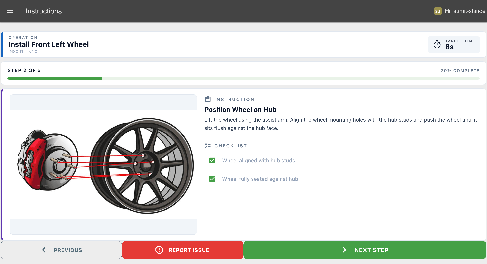 *The Instructions page: step image, checklist, target time, and Previous / Report Issue / Next controls.*

2. Add a `function` node named "Track step (save/load per user)":

```javascript
// Remembers the current step per user for the active work order.
// Handles two actions from the widget:
//   save_step - persist the step the operator is on
//   load_step - reply with the saved step so the widget can resume
const p = msg.payload || {};

// Identity comes from this message's own client data first. This is what
// keeps two operators using the widget at the same time from reading or
// writing each other's progress.
const username = msg._client?.user?.username
    || global.get('user', 'persistent')?.username;
if (!username) return null;

// Read the user's saved state
const userState = global.get(username, "persistent") || {
    workOrderId: null,
    stepIndex: 0
};

switch (p.action) {
    case "save_step":
        userState.stepIndex = p.stepIndex ?? 0;
        global.set(username, userState, "persistent");
        return null;

    case "load_step":
        msg.payload = {
            workOrderId: userState.workOrderId,
            stepIndex: userState.stepIndex ?? 0
        };
        return msg;

    default:
        return null;
}
```

3. Wire the "Work Instruction Widget" output into this node, and wire the node's output back into the widget so the `load_step` reply can jump it to the saved step.

Look at the store key: `global.get(username, ...)` and `global.set(username, ...)`. The operator's own username is the storage key, so two operators at the same station never overwrite each other, their progress lives under different keys, and because that key is now sourced from `msg._client.user` rather than a shared global, it's always the username of whoever's browser actually sent this particular `save_step` or `load_step` message.

Deploy, walk halfway through an operation, then reload the page. It reopens where you left off, because the step is filed under your name.

## Completing the Operation as the Logged-In User

When the operator completes the final instruction, the widget sends `{ action: "complete_operation" }`. The flow looks up the operator's stored work order and builds the payload that will be sent to the API.

1. Add a **link in** node and connect it to the **Work Instruction Widget** actions link.
2. Add a **switch** node named **Route by Action** and route messages where `msg.payload.action` equals `complete_operation`.
3. Add a **function** node named **Build Complete Payload** and paste in the following code.

```javascript
const username = msg._client?.user?.username
    || global.get('user', 'persistent')?.username;

if (!username) {
    node.warn('No logged-in user found — cannot complete operation');
    return null;
}

const stored = global.get(username, 'persistent') || {};
const workOrderId = stored.workOrderId || null;

msg.payload = { workOrderId };
return msg;
```

4. Add an **http request** node, set the **Method** to **POST**, configure **Bearer** authentication using your access token, and set the URL to `https://your-instance.flowfuse.cloud/workorders/complete`. Replace `https://your-instance.flowfuse.cloud` with your own FlowFuse instance URL.

5. Add a **change** node that sets `msg.payload` to `Home`, then connect it to a **link out** node. This will be used in the next step to reset the operator's state and navigate the operator back to the Home page.

Because the payload is built from the logged-in operator's stored state, keyed off that same operator's per-message identity, the API always completes the correct work order, even when multiple operators are using the dashboard at the same time.

## Reporting a Defect as the Logged-In Operator

If an operator encounters a defect, they can report it from the **Work Instruction Widget**. The report is automatically linked to the work order they're currently performing, so there's no need to enter a work order ID manually.

The **Report Issue** button sends `{ action: "Report Issue" }`. Use that action to open the report form.

1. Add a **link in** node named **Widget Action In** and connect it to the **Work Instruction Widget** actions link.

2. Add a **switch** node named **Route by Action** and route messages where `msg.payload.action` equals `Report Issue`.

3. Add a **change** node that sets `msg.payload` to `Report Issue`, then connect it to a **ui-control** node to navigate to the **Report Issue** page.

4. Add a **ui-form** node named **Report Issue Form** to the **Report Issue** group with four required fields:

   * **Issue Type** (dropdown)
   * **Severity** (dropdown)
   * **Affected Part** (text)
   * **Description** (multiline)

   Populate the dropdown fields with the issue types and severity levels used in your application.

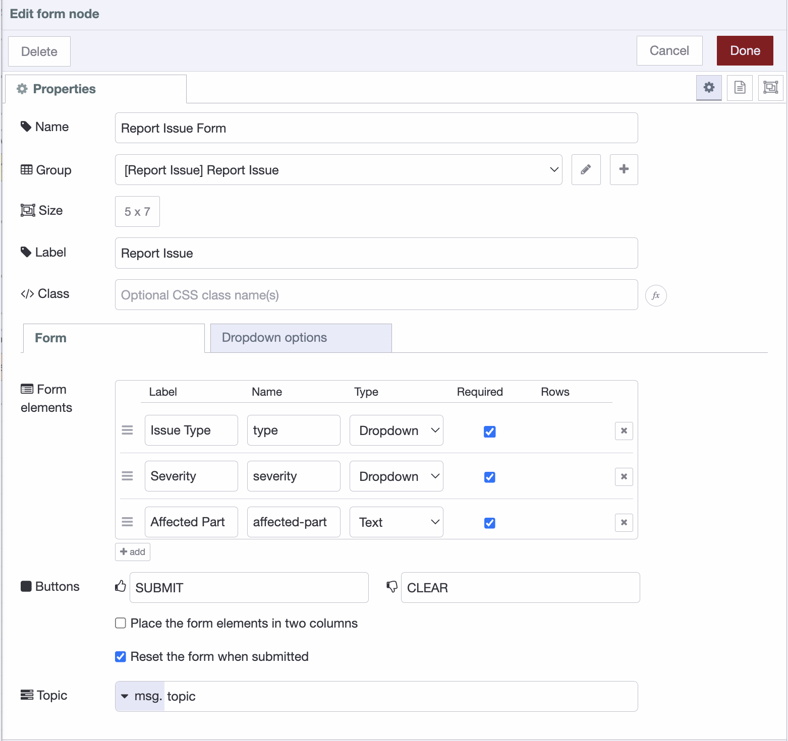
*The Report Issue form collects the defect details before submitting them against the current work order.*

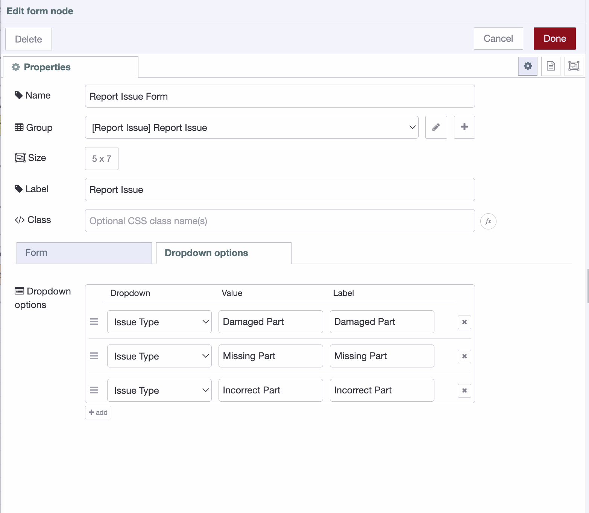
*Configure the Issue Type and Severity dropdowns with the options used in your application.*

5. Add a **function** node named **Prepare Defect Payload** and paste in the following code.

```javascript id="vbv4m6"
const p = msg.payload || {};

const username = msg._client?.user?.username
    || global.get('user', 'persistent')?.username;

if (!username) {
    node.warn('No logged-in user found — cannot report defect');
    return null;
}

const stored = global.get(username, 'persistent') || {};
const workOrderId = stored.workOrderId || null;

const issueType = p.type;
const severity = p.severity;
const affectedPart = p['affected-part'];
const description = p.description || null;

if (!workOrderId || !issueType || !severity || !affectedPart) {
    node.warn('Missing required defect fields — defect not sent');
    return null;
}

msg.payload = {
    workOrderId,
    issueType,
    severity,
    affectedPart,
    description
};

return msg;
```

6. Add an **http request** node, set the **Method** to **POST**, configure **Bearer** authentication using your access token, and set the URL to `https://your-instance.flowfuse.cloud/workorders/defect`. Replace `https://your-instance.flowfuse.cloud` with your own FlowFuse instance URL, then connect the request to a **link out** node so the flow continues to the reset step.

7. Add a **ui-button** named **Back to Work Instructions** to the same group and connect it to a **ui-control** node that navigates back to the **Instructions** page. Since the operator's progress is stored against their username, they return to the same instruction they left.

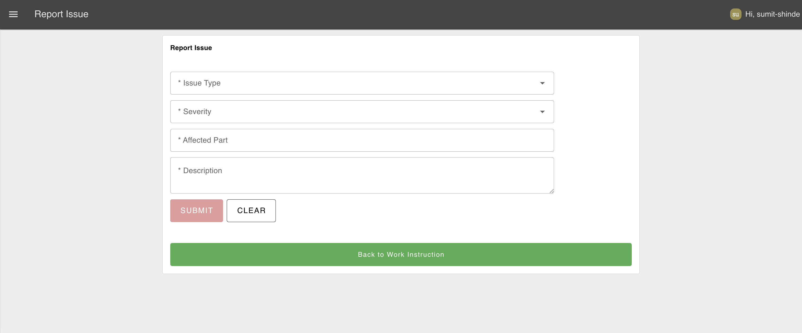
*The completed Report Issue page where operators can submit a defect or return to the work instructions.*

The work order ID is retrieved from the logged-in operator's stored state, ensuring every defect report is associated with the correct work order, and the lookup key for that state again comes from this message's own client data, not a value that could have been overwritten by someone else's login in the meantime.

## Clearing State When Work Ends

When an operation is completed or a defect is reported, clear the operator's saved progress so the next work order starts from **step 1** instead of resuming a finished one.

1. Add a **link in** node named **Complete / Defect Result In** and connect it to the **link out** nodes from the **Complete Operation** and **Report Defect** flows.
2. Add a **switch** node that checks `msg.statusCode` equals `200`, so the state is only cleared after a successful API response.
3. Add a **function** node named **Clear User Step State** and paste in the following code.

```javascript id="6ej1v5"
const username = msg._client?.user?.username
    || global.get('user', 'persistent')?.username;

if (!username) return null;

global.set(username, {}, 'persistent');

msg.payload = "Home";
return msg;
```

4. Connect the function node to a **ui-control** node to navigate the operator back to the **Home** page.

Because the state is stored and cleared by username, and that username is read from the message that carried the successful API response rather than a shared global, resetting one operator's progress never affects anyone else, even if a second operator has logged in on another screen in between.

Deploy the flow and open the dashboard. After signing in, operators see only the work orders assigned to them. If they leave and return, they resume from the same instruction. Once they complete the operation or report a defect, their progress is cleared and they're returned to the Home page, ready for the next work order.

## Where to Go Next

You've built a personalized digital work instructions application that knows who the operator is, what work they're assigned, and where they left off, correctly, even when several operators are on the dashboard at once. Replacing the simulator with a real ERP or MES is simply a matter of pointing the HTTP Request nodes to your production `/workorders`, `/workorders/complete`, and `/workorders/defect` endpoints.

From there, you can extend the application with production history, quality tracking, role-based experiences, and OEE dashboards—all powered by the same operator identity. If you're looking to build a complete connected shop floor, To see how FlowFuse fits into modern automotive manufacturing, explore the [Automotive solutions page](/industries/automotive/).
