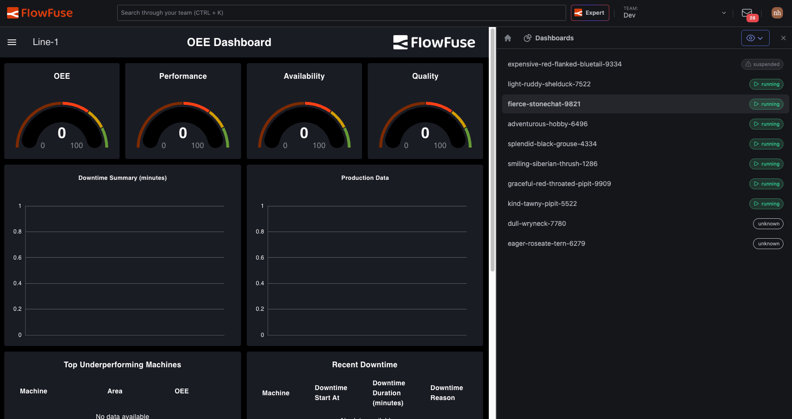

FlowFuse 2.33 is about trust. The FlowFuse Expert can now take real action on your instances, and this release adds the controls that make that safe: every action leaves an audit trail, and access tokens carry only the permissions you grant them.

## Every MCP Action, on the Record

FlowFuse now keeps an audit trail of MCP activity. When an AI client reads data or invokes a tool through FlowFuse, the action is logged: what happened, when, and under whose authority.

If you answer to an OT security team or an auditor, "the AI did it" is not an acceptable line in an incident report. The audit trail turns AI activity into the same kind of accountable, reviewable record you already expect from human operators.

*Availability: [CONFIRM tier] from v2.33.*

## Scoped Personal Access Tokens

Personal Access Tokens now carry scopes. Create a token that can do exactly what its integration needs and nothing more.

Previously a PAT carried the full permissions of the user who created it. If you generated a token for a read-only dashboard integration, that token could still modify your instances. Scoped tokens close that gap and follow the least-privilege pattern your security team already applies everywhere else.

**Getting started:** [CONFIRM: Team Settings path and scope options]

*Availability: [CONFIRM tier] from v2.33.*

## Manage Granular RBAC Through Your Identity Provider

SSO admins can now map SAML groups to FlowFuse's granular roles. When someone joins the "Plant Floor Operators" group in your identity provider, they get the matching FlowFuse permissions automatically. No manual role assignment, no drift between your IdP and your platform.

*Availability: Enterprise [CONFIRM] from v2.33.*

## Your Dashboards, All in One Place

Dashboards now have a home. A new **Dashboards** entry in your team navigation lists every dashboard across your hosted instances, and opens each one right inside FlowFuse instead of a separate browser tab. Each application also has its own **Dashboards** tab, showing just the dashboards from that application's instances. A drawer lets you switch between dashboards in a single click, without going back to a list.

Until now, dashboards were reachable only through an "Open Dashboard" button on individual instance pages: fine if you knew where to look, a dead end if you didn't. Dashboard-only users had it worst, landing on a bare list of instances with nowhere to go. Now dashboards are a first-class part of the product, with a home scoped to exactly what each user can access.

{data-zoomable style="border: 2px solid #E5E7EB;"}

*Availability: all users of FlowFuse Cloud and all Self Hosted users from v2.33.*

## Modbus Certified Node

FlowFuse Hub customers can now install a FlowFuse-certified Modbus node straight from the palette manager in their editor. It covers Modbus TCP and Serial — including RTU and ASCII — in a single package.

Modbus is one of the most common protocols on the factory floor, but the community package most teams rely on depends on volunteer maintainers. We forked node-red-contrib-modbus and now maintain our own version, backed by FlowFuse testing, SLA-backed security patching, and a long-term maintenance commitment. A node sitting at the center of your production flows no longer carries supply-chain risk.

*This feature is available exclusively to FlowFuse Hub customers, on both FlowFuse Cloud and Self Hosted, from v2.33.*

## Smoother Edge Onboarding Starts Here

Getting a device from unboxed to running its first flow is getting an overhaul, and 2.33 ships the first pieces. When the Device Agent can't reach the FlowFuse platform, it now tells you exactly why instead of failing silently. Connection problems that used to mean digging through logs are now diagnosed at the source.

More of the from-scratch onboarding experience lands in upcoming releases.

## Also in This Release

- The Expert is better at telling when you want it to act versus when you want guidance. [CONFIRM #411 landed]
- MCP server enumeration is much faster for teams with many instances.
- Fixed dropdown inputs rejecting values that matched the start of a suggestion.
- Plus dependency updates and smaller fixes.

For detailed breakdowns of each feature with additional visuals, visit our [changelog](/changelog/). For the complete list of everything included in FlowFuse 2.32, check out the [release notes](https://github.com/FlowFuse/flowfuse/releases).

If something in this release improves your workflow, or if there is still friction we can remove, please [share feedback or report issues regarding this release](mailto:contact@flowfuse.com?subject=Feedback%20on%202.32) to us.

## Try FlowFuse

### FlowFuse Cloud

The fastest way to get started is with FlowFuse Cloud.
[Get started for free]() and have your Node-RED instances running in minutes.

### Self-Hosted

Run FlowFuse locally using [Docker](/docs/install/docker/) or [Kubernetes](/docs/install/kubernetes/).

## What's Next

2.33 closes out the 2.x line. Something bigger arrives in August. 📈
