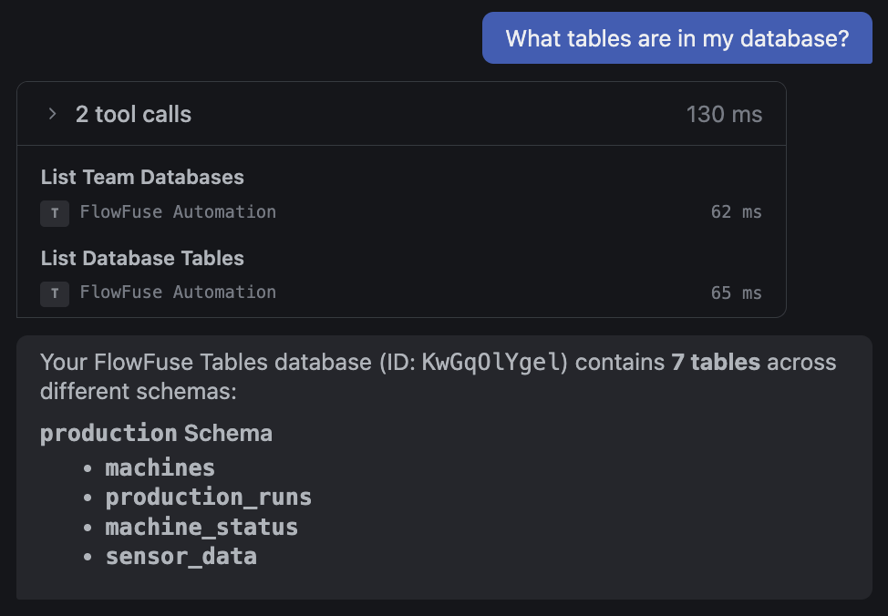
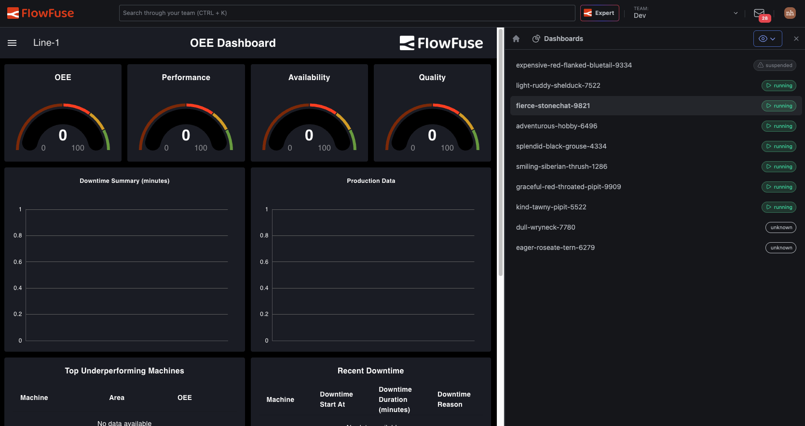

Most releases sharpen one corner of the platform. 2.33 follows the whole journey your data takes — from the moment hardware powers on to the moment someone reads a dashboard built on it. Bringing a machine online no longer means starting in the platform and working backwards, a certified Modbus package speaks the factory floor's most common protocol, and dashboards finally have somewhere of their own to live. And as more of that journey gets automated, the release tightens the guardrails around the clients and AI agents touching your systems.

## Set Up Your Plant Floor Hardware Straight From the Terminal

Getting your own hardware into FlowFuse meant working backwards. You signed up, found the remote instance section, learned what the Device Agent was, created the instance in the platform, copied its connection details, and only then ran the installer with that code in hand.

Now you can start where the hardware already is. Run the installer from your terminal and it walks you through registering — including setting up an account if you need one — ending with your machine registered as a remote instance and ready to build on. If something's in the way — like port 1880 already being in use — the installer tells you up front instead of failing partway through.



You can grab the install command for your platform on the [Device Agent page](/platform/device-agent/#install-from-your-terminal) and have a machine online in a few minutes. More of the from-scratch onboarding experience lands in upcoming releases.

## Modbus Certified Node

FlowFuse Edge customers can now install a FlowFuse-certified Modbus node straight from the palette manager in their editor. It covers Modbus TCP and Serial — including RTU and ASCII — in a single package.

Modbus is one of the most common protocols on the factory floor, but the community package most teams rely on depends on volunteer maintainers. The FlowFuse-certified node is backed by our own testing, SLA-backed security patching, and a long-term maintenance commitment.

*This feature is available exclusively to FlowFuse Edge customers, on both FlowFuse Cloud and Self Hosted, from v2.33.*

## Ask the Expert About Your Tables

Until now, checking on your Tables data meant leaving the chat panel and opening the Tables view yourself. Now you can just ask the Expert: which tables exist, what a table's columns look like, or for a quick peek at the data, and it answers right there. For real analysis, like filtering, sorting, or making changes, the Expert can build that for you too, as a flow using the `tables-query` node.

This release also closes a rough edge in Tables itself: databases with tables outside the default schema now behave correctly throughout, and the UI shows you which schema each table belongs to.

{data-zoomable style="border: 2px solid #E5E7EB;"}

*Availability: This feature is available to FlowFuse Hub and Edge customers on FlowFuse Cloud and Self Hosted from v2.33.*

## Your Dashboards, All in One Place

Dashboards now have a home. A new **Dashboards** entry in your team navigation lists every dashboard across your hosted instances, and opens each one right inside FlowFuse instead of a separate browser tab. Each application also has its own **Dashboards** tab, showing just the dashboards from that application's instances. A drawer lets you switch between dashboards in a single click, without going back to a list.

Until now, dashboards were reachable only through an "Open Dashboard" button on individual instance pages: fine if you knew where to look, a dead end if you didn't. Dashboard-only users had it worst, landing on a bare list of instances with nowhere to go. Now dashboards are a first-class part of the product, with a home scoped to exactly what each user can access.

{data-zoomable style="border: 2px solid #E5E7EB;"}

*Availability: all users of FlowFuse Cloud and all Self Hosted users from v2.33.*

## Tighter Control Over Who and What Reaches Your Systems

The more of your platform that automated clients and AI agents can reach, the more the question shifts: not just what they are allowed to do, but what you can prove they did afterwards, and how narrowly you can scope their access up front. 2.33 adds three controls that answer it.

### Platform MCP Tools & API Actions Audit Trail

FlowFuse now logs actions performed through the supported platform MCP tools for AI agents such as our own first class AI agent the FlowFuse Expert. Each log entry records the action, when it occurred, and the user that performed it through it's dependency on the user's Personal Access Token. These logs do not capture activity related to MCP server nodes with which you can build your own MCP tooling and is part of our FlowFuse Expert Insights offering.

If you answer to an OT security team or an auditor, "the AI did it" is not an acceptable line in an incident report. The audit trail turns AI activity into the same kind of accountable, reviewable record you already expect from human operators.

*Availability: Hub and Edge from v2.33.*

### Scoped Personal Access Tokens

Personal Access Tokens can now be scoped to specific teams and include read or write permissions. Create a token that can do exactly what its integration needs and nothing more. This is especially important for AI use cases.

Previously a PAT carried the full permissions of the user who created it. If you generated a token for a read-only dashboard integration, that token could still modify your instances. Scoped tokens close that gap and follow the least-privilege pattern your security team already applies everywhere else.

You can easily navigate towards your [personal settings](https://app.flowfuse.com/account/security/tokens) to setup a new personal access token and configure it with the right scope and permissions.

{data-zoomable style="border: 2px solid #E5E7EB;"}

*Availability: Hub and Edge from v2.33.*

### Manage Granular RBAC Through Your Identity Provider

SSO admins can now map SAML groups to FlowFuse's granular roles. When someone joins the "Plant Floor Operators" group in your identity provider, they get the matching FlowFuse permissions automatically. No manual role assignment, no drift between your IdP and your platform.

*Availability: Hub and Edge from v2.33.*

## Also in This Release

- The Expert is better at telling when you want it to act versus when you want guidance.
- MCP server enumeration is much faster for teams with many instances.
- Fixed dropdown inputs rejecting values that matched the start of a suggestion.
- Plus dependency updates and smaller fixes.

For detailed breakdowns of each feature with additional visuals, visit our [changelog](/changelog/). For the complete list of everything included in FlowFuse 2.33, check out the [release notes](https://github.com/FlowFuse/flowfuse/releases).

If something in this release improves your workflow, or if there is still friction we can remove, please [share feedback or report issues regarding this release](mailto:contact@flowfuse.com?subject=Feedback%20on%202.33) to us.

## Try FlowFuse

### FlowFuse Cloud

The fastest way to get started is with FlowFuse Cloud.
[Get started for free]() and have your Node-RED instances running in minutes.

### Self-Hosted

Run FlowFuse locally using [Docker](/docs/install/docker/) or [Kubernetes](/docs/install/kubernetes/).

## What's Next

2.33 closes out the 2.x line. Something bigger arrives in August. 📈
