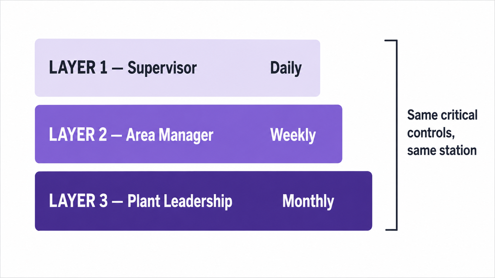

Manufacturing problems are often found after production rather than where they start. A machine setting may be wrong, a process step may be skipped, or a critical control may no longer be followed.

A **Layered Process Audit (LPA)** helps manufacturers catch these problems earlier by regularly checking critical process controls while production is running.

This guide explains what an LPA is, how the layers work, and how manufacturers use them on the shop floor. As LPA programs grow, digitizing audits can make it easier to capture findings, track corrective actions, and connect audit results with production data.

::cta-image{src="/blog/2026/08/images/lpa-cta-1.png" alt="Turn Shop-Floor Audits Into Actionable Data" cta="sign-up"}
::

<!--more-->

## What Is a Layered Process Audit?

A **Layered Process Audit (LPA)** is a structured, process-focused audit in which personnel at different levels of an organization systematically verify that critical manufacturing processes, controls, and work practices conform to defined requirements and standards.

Instead of inspecting finished parts, an LPA checks the process itself. An auditor observes the operation and verifies selected controls such as machine settings, standard work, tooling, materials, or error-proofing.

The **layers** are different levels of management. A supervisor may check a process daily, an area manager weekly, and plant leadership monthly.

The layers are not different stages of production. They are different levels of oversight.

LPAs are widely used in [automotive manufacturing](/industries/automotive/) and other industries where consistent process control is important. They complement formal process and product audits rather than replacing them.

## How Do LPA Layers Work?

Each layer checks important process controls at a different frequency.

| Layer   | Typical role             | Typical frequency |
| ------- | ------------------------ | ----------------- |
| Layer 1 | Supervisor / Team leader | Daily             |
| Layer 2 | Area manager             | Weekly            |
| Layer 3 | Plant manager / Director | Monthly           |

These frequencies are common starting points, not universal requirements. Manufacturers can adjust them based on process risk.

{data-zoomable}

Layer 1 is closest to the operation and focuses on whether the process is being followed as defined.

Layer 2 provides broader oversight across production areas and can identify recurring findings or problems that were not resolved.

Layer 3 looks across the plant to identify patterns and verify that important issues are being addressed.

The same critical controls can therefore be checked regularly by people with different levels of responsibility.

## Layered Process Audit Example

Consider an automotive assembly station where a component must be tightened to a defined torque.

During a Layer 1 audit, the supervisor checks the fastening process and finds that the torque tool is set outside the approved range.

The supervisor corrects the setting and records the finding. During a later Layer 2 audit, the area manager checks the same control and confirms that the tool is still being used within the required range.

If similar findings appear on other stations, plant leadership can identify a wider problem with tool settings or process control.

This illustrates the purpose of an LPA: **find process deviations close to where they happen and use different management layers to keep critical controls in place.**

## How to Run a Layered Process Audit

An LPA can be straightforward when it focuses on the controls that matter most.

### Identify the Process

Start with a process where regular verification is valuable, such as one with recurring defects, high scrap or rework, customer complaints, or critical process parameters. A [Pareto chart](/blog/2025/08/pareto-chart-manufacturing-guide/) can help identify where problems are concentrated.

### Define What to Verify

Use information from the PFMEA, [control plan](/blog/2026/08/control-plans), [work instructions](/blog/2026/07/digital-work-instruction/), and previous quality problems to identify the critical controls. Our [LPA checklist template](/blog/2026/09/layered-process-audit-checklist-template/) has example questions to help you get started.

### Assign the Layers

Decide which management level will perform the audit and how often. Higher-risk processes may need more frequent checks.

### Perform the Audit at the Workstation

The auditor observes the actual operation and records whether the defined requirements are being followed.

### Correct and Follow Up

Simple problems can be corrected immediately. Other findings should have an owner and due date, with a later audit confirming that the issue has been resolved.

An LPA should be short enough to fit into normal shop-floor activity. If it becomes a lengthy inspection, its scope is probably too broad.

## Common LPA Problems

An LPA program can lose its value when the audit becomes a paperwork exercise.

Pencil-whipping is one common problem: an audit is marked complete without the auditor actually checking the process.

Another is repeat findings. If the same problem appears in every audit but nothing changes, the organization is recording the problem without solving it.

Missed management layers can also weaken the program. If higher-level managers stop performing their audits, the additional oversight disappears.

Finally, the audit criteria can become outdated when the process changes. LPA questions should be reviewed periodically to make sure they still focus on current process risks.

## LPA vs. Process Audit

An LPA and a process audit both examine manufacturing processes, but they are used differently.

|           | Layered Process Audit        | Process Audit               |
| --------- | ---------------------------- | --------------------------- |
| Frequency | Frequent                     | Usually less frequent       |
| Scope     | Selected critical controls   | Broader process             |
| Auditors  | Multiple management levels   | Typically trained auditors  |
| Purpose   | Routine process verification | Detailed process evaluation |

An LPA provides frequent checks of important controls, while a process audit provides a deeper assessment of the overall process.

## Digitizing Layered Process Audits

Manufacturers can start an LPA program with paper forms or spreadsheets, but managing audits and findings becomes harder as the program grows.

A digital LPA can help schedule audits, record findings, notify responsible people, and track actions through closure.

Connecting the audit with production data provides another benefit. With FlowFuse, manufacturers can connect an LPA application to machines, [PLCs](/landing/plc/), sensors, [databases](/node-red/database/), and other industrial systems.

This allows audit results to be viewed alongside production information such as downtime, machine states, or process parameters. Instead of only recording that a process failed, teams can investigate what was happening around the failure.

With [FlowFuse Dashboard](/platform/dashboard), manufacturers can build applications to record audit results, track findings, and visualize them alongside operational data.
