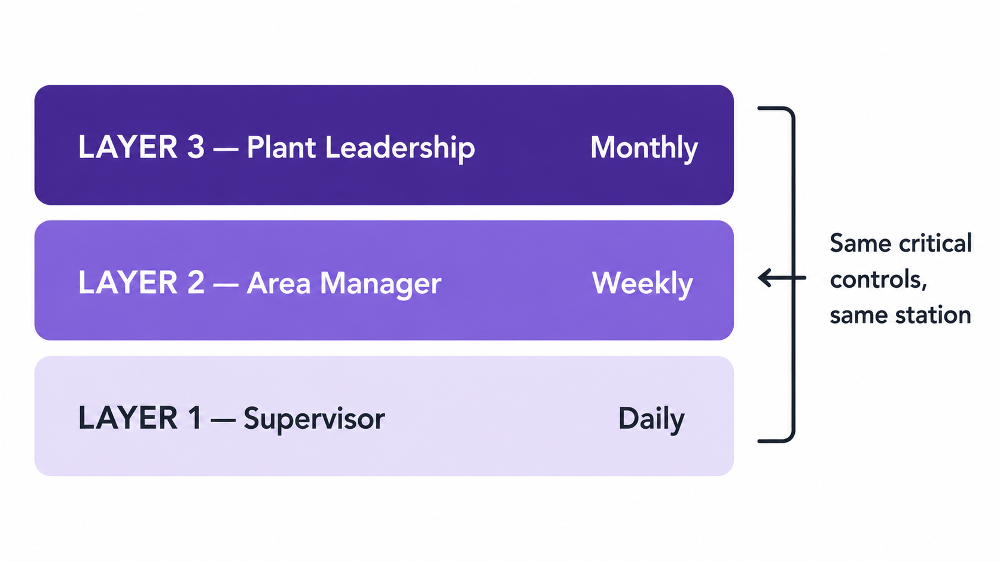
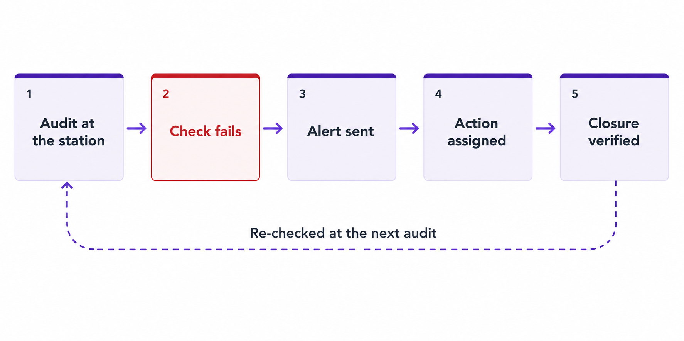

Most plants discover process problems after the parts are made. A defect appears at final inspection, a customer reports an issue, and the plant begins sorting, rework, and investigation.

<!--more-->

A Layered Process Audit works earlier than that. Supervisors, engineers, and managers check the process while production is running and while they are standing at the workstation. These short, regular audits help catch problems before defects are produced, reinforce standard work, and keep communication active between shifts and departments.

This guide explains what an LPA is, how manufacturers use it, how to run one, and includes a practical checklist you can use on the shop floor.

## Layered Process Audit (LPA): Definition and Meaning

A Layered Process Audit (LPA) is a structured manufacturing audit used to verify that a process is being performed according to the defined standard. The audit focuses on how the work is done, not on inspecting finished parts.

In practice, an LPA is performed at the workstation. The auditor observes the operation, asks a small set of standard questions, and records whether each requirement is being followed. The same process is checked repeatedly by different levels of management, which is where the term layered comes from.

The layers are organizational levels, not stages of production. A typical program includes:

- **Layer 1:** Supervisor or team leader
- **Layer 2:** Area manager
- **Layer 3:** Plant leadership

All three may audit the same station, but at different frequencies.

A useful way to think about an LPA is as a routine health check for production. Final inspection tells you a part is bad; an LPA is intended to find the missing setup check, incorrect material, bypassed [error-proofing device](/blog/2025/09/poka-yoke-mistake-proofing/), or [out-of-calibration tool](/blog/2026/07/what-is-instrument-calibration/) before bad parts are made.

LPAs are common in automotive manufacturing and other industries with strict quality requirements. They do not replace product audits, process audits, or the plant's quality management system; they add a frequent, practical layer of process verification where the work happens.

::cta-image{src="/images/cta/power-workplace-book-demo.png" alt="Power Workplace relies on FlowFuse for scalability, reliability and security audits - book a demo" cta="demo"}
::

## Why Manufacturers Run LPAs

LPAs spread through automotive manufacturing on the back of OEM supplier requirements. The common approach was developed by DaimlerChrysler and General Motors under the auspices of the Automotive Industry Action Group, which published the first edition of the [CQI-8 Layered Process Audit Guideline](https://www.aiag.org/training-and-resources/manuals/details/CQI-8) in 2005 and a second edition in 2014. Today those requirements reach suppliers through customer-specific documents from OEMs such as General Motors and Stellantis, and CQI-8 remains the guidance most plants reference.

The purpose is simple: verify that critical process controls are being followed while production is running. Finding a bypassed sensor today is far less expensive than sorting suspect parts weeks later.

LPAs support the intent of [IATF 16949](https://www.iatfglobaloversight.org/), but they do not replace the internal, process, or product audits required by the quality management system.

Manufacturers typically use LPAs to reinforce standard work, verify critical process settings, reduce repeat quality problems, improve accountability, and increase management presence on the shop floor.

The value of an LPA comes from consistent observation and quick correction, not from the checklist itself.

## How the Layers Work

The same process is checked by different levels of management at different frequencies. Lower layers audit more often and in greater detail; higher layers audit less often and across a broader area.

The table below is a common starting point rather than a rule. CQI-8 deliberately leaves audit frequency and question topics to each organization, so set yours based on process risk and expect them to change as you learn which stations need more attention.

| Layer   | Typical role             | Typical frequency |
| ------- | ------------------------ | ----------------- |
| Layer 1 | Supervisor / Team leader | Daily             |
| Layer 2 | Area manager             | Weekly            |
| Layer 3 | Plant manager / Director | Monthly           |

### Layer 1: Supervisor Audit

The supervisor audits the station or line they manage. The focus is operator practice, standard work, tooling, materials, and immediate process controls. Simple problems are usually corrected immediately.

### Layer 2: Manager Audit

The area manager audits across several lines. In addition to the checklist itself, they verify that Layer 1 audits are being completed and that previous findings have been closed.

### Layer 3: Plant Leadership Audit

Plant leadership audits less often and across a wider scope. The focus is whether the LPA system is functioning: audits completed, repeat issues addressed, and no critical controls quietly abandoned.

A practical rule is: the higher the layer, the wider the scope and the lower the frequency. That overlap creates accountability across the organization.

## How to Run a Layered Process Audit

1. **Select the process.** Start with a high-risk operation such as one with customer complaints, scrap, rework, safety exposure, or critical process parameters. A [Pareto chart](/blog/2025/08/pareto-chart-manufacturing-guide/) is a useful way to identify the stations causing the largest share of defects.
2. **Create the checklist.** Use the [PFMEA](https://www.aiag.org/quality/automotive-core-tools/fmea), control plan, work instructions, and recent quality issues. Ten to fifteen objective questions is usually enough.
3. **Define the schedule.** Decide which layer audits each area and how often.
4. **Train the auditors.** Auditors should observe the process, ask factual questions, and record evidence rather than opinions.
5. **Perform the audit at the station.** Watch the operation and record answers while standing at the workstation.
6. **Correct immediate issues.** Fix simple problems during the audit whenever possible.
7. **Assign corrective actions.** Give each finding an owner and a due date.
8. **Verify closure.** Confirm that the action was completed and remains effective during the next audit cycle.

Most LPAs take 5 to 15 minutes. If an audit takes much longer, the checklist is usually too large for a routine layered audit.

Many plants start LPAs with paper checklists or spreadsheets. As the program expands, they often [digitize the same workflow](#layered-process-audit-software-moving-lpas-off-paper) so audits can be scheduled automatically, findings can trigger alerts, and corrective actions can be tracked across shifts and plants.

## What to Put on the LPA Checklist

An LPA checklist should verify the few process controls that matter most. Keep it short and focused.

Good questions usually come from:

- PFMEA high-risk items
- Control plan checks
- Customer complaints
- Scrap and rework data
- Past audit findings

Write questions so they can be answered *Yes* or *No* by observing the process.

| Avoid                                    | Better question                                                      |
| ---------------------------------------- | -------------------------------------------------------------------- |
| "Is quality good?"                       | "Is the approved work instruction available at the station?"          |
| "Are tools OK?"                          | "Is the torque tool within calibration date?"                        |
| "Is the operator following the process?" | "Is the operator performing step 4 as defined in the standard work?" |

### Example LPA Questions

**Standard work**

- Is the latest work instruction displayed?
- Is the operator following the defined sequence?
- Is the correct revision of the process sheet in use?

**Materials**

- Is the material label correct and readable?
- Is [FIFO](https://en.wikipedia.org/wiki/FIFO_(computing_and_electronics)) being followed?
- Is the approved material being used?

**Tooling and equipment**

- Is the torque tool within calibration date?
- Is the machine parameter within the approved range?
- Is the gauge identified and available at the station?

A calibration date on a checklist is only as good as the record behind it. For what that record should contain and how intervals are set, see [What Is Instrument Calibration (Equipment Calibration)?](/blog/2026/07/what-is-instrument-calibration/); for turning that register into overdue and due-soon status the auditor can check in seconds, see [Tracking Instrument Calibration with a Digital Dashboard](/blog/2026/07/calibration-management-dashboard/).

**Error-proofing**

- Is the poka-yoke device active and not bypassed?
- Does the sensor stop the process when a fault is introduced?

**Traceability**

- Is the batch or serial number recorded correctly?
- Can the current part be traced to its material lot?

**Safety and workplace condition**

- Are required PPE items being worn?
- Is the workstation free from oil, scrap, and obstructions?
- Are safety guards in place?

A useful checklist usually fits on one page and can be completed while standing at the station.

The workplace-condition questions overlap with [5S](/blog/2025/09/what-is-5s-checklist/). Keep only the few conditions that affect the process directly and handle broader housekeeping through a separate 5S audit.

## Download the LPA Checklist Template

Download the [one-page Layered Process Audit checklist template](https://drive.google.com/file/d/19plwlUo8vKPunGl7LRF1TMFjqGBZoih4/view?usp=sharing) and use it on the shop floor as a starting point for your LPA program. The sample questions can be adapted to your own PFMEA, control plan, and process requirements.

## Layered Process Audit Software: Moving LPAs Off Paper

Paper LPAs are easy to start, but they become difficult to manage as the program grows. Finding repeat issues, overdue actions, or missed audits usually means searching through forms or spreadsheets.

A digital LPA keeps the same audit process while making results immediately available. Auditors can complete checklists on a phone or tablet, attach photos, trigger alerts for failed checks, and assign corrective actions from the workstation.

The bigger advantage is connecting LPA results with **production data**. With FlowFuse, audit applications can connect to machines, PLCs, sensors, databases, and other industrial systems. This lets teams compare failed audit checks with downtime, scrap, machine states, or process parameters to understand what was happening on the line.

With [FlowFuse Dashboard](/blog/2024/03/dashboard-getting-started/), plants can build LPA forms, track findings and corrective actions, and visualize audit results alongside production data.

A useful starting point is the [5S Checklist Blueprint](/blueprints/manufacturing/5s-checklist/), which can be adapted for an LPA program by replacing the 5S questions with LPA questions.

## Where LPA Programs Break Down

Most LPA programs do not fail suddenly; they become mechanical.

A common problem is pencil-whipping, where audits are marked complete without anyone visiting the workstation. Another is that higher management layers gradually stop performing their scheduled audits, so the layered system weakens over time.

Plants also struggle with findings that remain open for too long and checklists that are not updated when the process changes.

A healthy LPA program stays short, focused, and regularly reviewed. If audits become long and repetitive, people will eventually rush through them or skip them.

## Measure the Program, Not Just the Audits

Treat the LPA as a managed program, not just a checklist activity. Review it monthly by checking whether each layer completed its audits, how quickly findings were closed, whether the same issue is appearing repeatedly at the same station, and whether corrective actions were documented and verified.

If a finding keeps returning, use a structured method such as a [Five Whys analysis](/blog/2025/12/five-whys-root-cause-analysis-definition-examples/) to investigate the root cause rather than repeating the same corrective action.