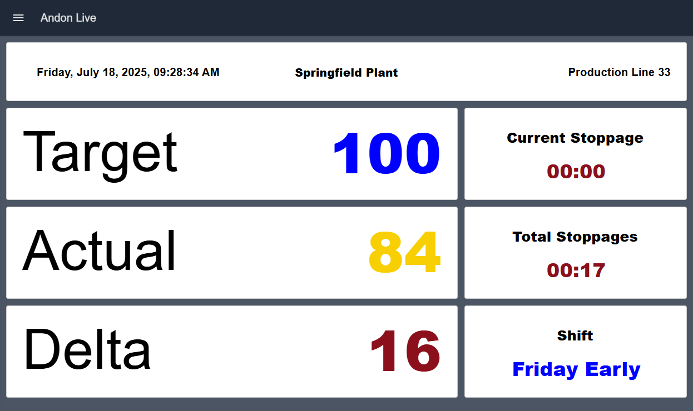
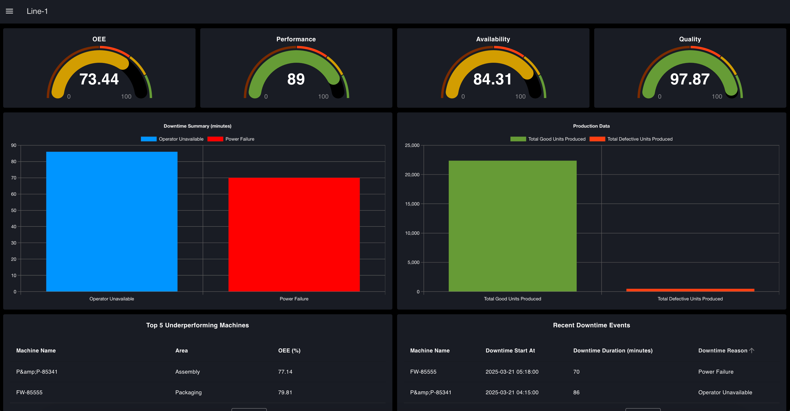
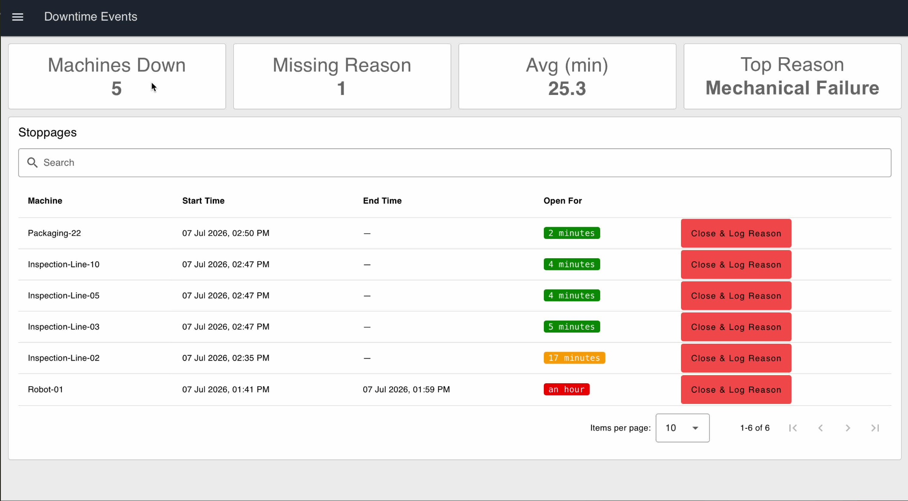
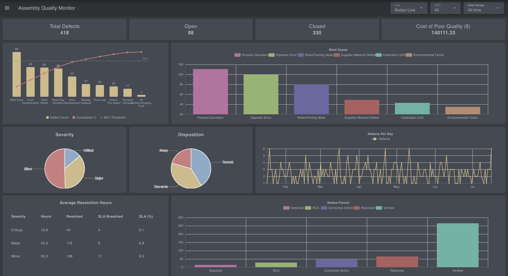
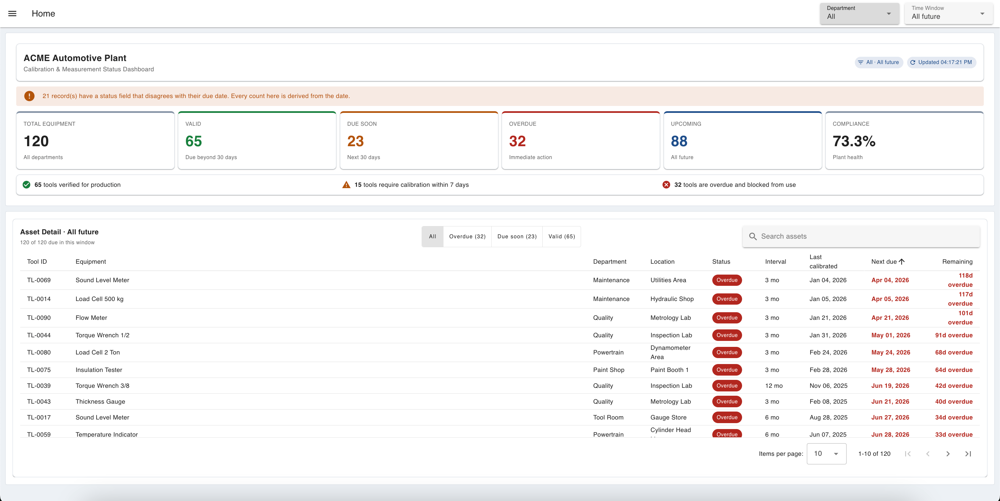
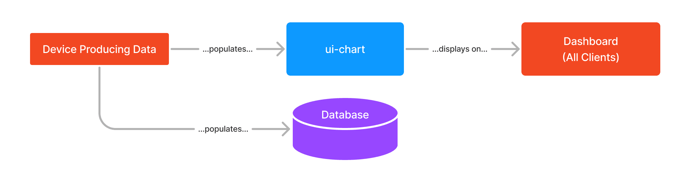
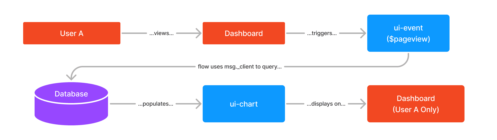

A manufacturing dashboard brings machine data, production metrics, downtime, and quality information into one real-time view, so teams can understand what's happening on the shop floor and act on it.

<!--more-->

This guide covers what manufacturing dashboards do, the metrics they should track, and five dashboard examples, for production, OEE, downtime, quality, and calibration, built with [FlowFuse](/).

## What Is a Manufacturing Dashboard?

A manufacturing dashboard is a visual interface for monitoring production performance in real time. It pulls data from factory equipment and business systems ([PLCs](/blog/2025/12/what-is-plc/), [SCADA](/use-cases/scada/), [MES](/blog/2025/06/what-is-mes/), [ERP](/blog/2025/06/connect-shop-floor-to-odoo-erp-flowfuse/), [databases](/blog/2025/08/getting-started-with-flowfuse-tables/), sensors, or operator input) into a single view built around production output, machine status, downtime, OEE, quality, and targets. FlowFuse's own [Dashboard platform](/platform/dashboard/) is built specifically for assembling these views without writing custom front-end code.

The key difference between a dashboard and a report is timing. A report tells you what happened after the shift ends. A dashboard shows you what's happening now, while there's still time to change the outcome.

That's also what separates a good dashboard from a cluttered one: it doesn't try to show everything. It shows the specific person using it what they need in order to act, which is exactly why dashboards have become so central to how manufacturers run production.

## Why Dashboards Matter in Manufacturing

Production problems get expensive when they stay invisible. A machine that stops, a line falling behind target, or a defect that goes unnoticed can quietly erode throughput, cost, and delivery schedules before anyone catches it.

A shared dashboard closes that gap. Operators see production status as it happens, supervisors track performance across the line, and maintenance teams spot equipment issues sooner. The value isn't the dashboard itself; it's the time saved between a problem occurring and someone responding to it. That's the shift FlowFuse is built to support: turning raw factory data into faster decisions on the floor, whether the source is an MES system or a SCADA historian.

Knowing dashboards matter is one thing. Knowing what belongs on them is another, and that comes down to the metrics behind the view.

## Key Metrics Every Manufacturing Dashboard Should Track

The right KPIs depend on the role and the goal, but most production dashboards center on [four categories: output, equipment performance, downtime, and quality](/blog/2025/06/shop-floor-kpis-for-mes/).

- **Production output:** actual output against the planned target
- **OEE:** equipment effectiveness across availability, performance, and quality
- **Downtime:** lost production time and its biggest contributing causes
- **Cycle time:** whether machines and processes are running at expected speed
- **Quality performance:** defects, scrap, rework, and first-pass yield
- **WIP levels:** where bottlenecks are forming in the production flow

These metrics exist to answer a small set of operational questions: Are we producing at the required rate? Are machines running effectively? Where is time being lost? Are we producing quality parts? If a dashboard can't answer those quickly, it's showing too much, or the wrong things.

What that looks like in practice varies by where the metrics are applied. Here's how these same building blocks show up across five common manufacturing dashboards.

## Manufacturing Dashboard Examples

Dashboards work best when they're designed around a specific decision, not a general audience. A production team needs visibility into output and downtime; quality and maintenance teams need a different lens entirely. The five examples below show common patterns, all built with FlowFuse using data from machines, production systems, databases, and industrial protocols, but for using it purpose it uses demo data

### 1. Production Dashboard (Andon Live)

A production dashboard answers one question in real time: is the line hitting its target? FlowFuse's **Andon Live Dashboard** gives operators and supervisors a shop-floor view of actual output against target, shift progress, and current line status, so a gap can be caught and addressed before it grows.

*FlowFuse Andon Live dashboard showing a target of 100 against an actual count of 84, a delta of 16, stoppage timers, and the current shift for Production Line 33*

It typically shows actual production count, target vs. actual output, shift progress, and stoppage information, the same building blocks behind FlowFuse's [Andon Task Manager](/blog/2025/06/building-andon-task-manager-dashboard-with-ff/). Because every production environment is different, FlowFuse connects this same dashboard pattern to whatever data sources are already in place, including PLCs, MES systems, production counters, [MQTT](/blog/2024/06/how-to-use-mqtt-in-node-red/), and [OPC UA](/blog/2025/07/reading-and-writing-plc-data-using-opc-ua/).

**Ready to deploy:** [Andon Live Dashboard](/blueprints/manufacturing/andon-live/)

### 2. OEE Dashboard

Where a production dashboard tells you whether output is on target, an OEE dashboard explains *why* it isn't. FlowFuse's **OEE Dashboard** combines production and downtime data into one view covering OEE, availability losses, performance losses, quality losses, and trend data over time.

*FlowFuse OEE dashboard with gauges for OEE, performance, availability and quality above a downtime summary, production totals, and a table of underperforming machines*

That breakdown matters because a low OEE score can come from very different root causes, frequent stops, slow cycle times, or defect rates, and each one needs a different fix. Separating them lets teams target the actual source of the loss instead of [chasing a misleading number](/blog/2026/05/fixing-oee-measurement-in-manufacturing/).

**Ready to deploy:** [OEE Dashboard](/blueprints/manufacturing/oee-dashboard/)

### 3. Downtime Dashboard

Availability losses are usually the biggest piece of that OEE picture, which is why they tend to warrant a dedicated view of their own. Downtime is the single biggest drain on production capacity, and the real question isn't just *when* machines stop, it's *why*. FlowFuse's **Downtime Tracking Dashboard** captures stop events as they happen and turns them into a live view of downtime duration, causes, and impact on availability, rather than [something pieced together from manual spreadsheets after the fact](/blog/2026/06/event-driven-downtime-escalation-workflow/).

*FlowFuse downtime tracking dashboard listing open stoppages by machine with start times, how long each has been open, and a button to close the event and log a reason*

That shift, from reviewing downtime after a shift to tracking it in real time, is what lets teams move from reacting to failures toward reducing what causes them.

**Build it:** [Build a Machine Downtime Tracking Application](/blog/2026/07/build-downtime-logger/)

### 4. Quality Dashboard (Defect & Quality Monitoring)

Quality losses need the same treatment. A quality dashboard shows where defects are happening and what's driving them. FlowFuse's **Defect & Quality Monitoring Dashboard** combines defect data, production information, and quality KPIs, including defect trends, defect categories, first-pass yield, cost of poor quality, and a Pareto breakdown of causes, into one view.

*FlowFuse defect and quality monitoring dashboard with a Pareto chart of defect types, a root cause breakdown, severity and disposition splits, and SLA resolution times*

The [Pareto view](/blog/2025/09/creating-pareto-chart/) tends to be the most useful part: it isolates the small number of issues responsible for most of the quality loss, so improvement effort goes where it actually pays off, instead of spreading thin across every defect type. Pairing it with [statistical process control](/blog/2025/07/quality-control-automation-spc-charts/) catches quality drift before it produces a defect at all.

**Build it:** [Build a Defect Tracking and Quality Monitoring Dashboard](/blog/2026/07/defect-and-quality-monitoring/)

### 5. Calibration Dashboard

Defects aren't always caused by the process itself; sometimes the measurement equipment used to catch them is the problem. Where measurement accuracy affects product quality and compliance, [instrument calibration](/blog/2026/07/what-is-instrument-calibration/) tracking can't run on spreadsheets. FlowFuse's **Calibration Management Dashboard** gives teams a live view of measurement equipment status (what's ready, what's due, what's overdue) along with calibration history and compliance status, cutting the risk of equipment running outside its required window.

*FlowFuse calibration management dashboard showing 120 instruments split into valid, due soon and overdue, a 73.3% compliance rate, and a table of overdue tools by department*

**Build it:** [Tracking Instrument Calibration with a Digital Dashboard](/blog/2026/07/calibration-management-dashboard/)

## Manufacturing Dashboard Design Best Practices

Having the right dashboard type for the job is only half the equation. How it's designed determines whether anyone actually uses it. A manufacturing dashboard should make decisions easier, not add more information to review, and the best dashboards are designed around the people using them and the actions they need to take.

Key principles include:

- **Design for the user:** operators, supervisors, and managers need different views based on their responsibilities
- **Focus on actionable metrics:** every KPI should help identify a problem, measure progress, or support a decision
- **Keep important information visible:** production status, downtime, and quality issues should be clear without searching through multiple screens
- **Avoid unnecessary complexity:** too many charts and metrics make important information harder to find
- **Support drill-downs:** start with a clear overview, then allow users to investigate the details behind an issue

A successful manufacturing dashboard is not the one with the most data. It is the one that helps the right person understand the situation and act quickly.

One design decision worth calling out on its own is timing: not every dashboard should show the same moment in time.

## Real-Time vs. Historical Manufacturing Dashboards

Not every manufacturing decision requires the same type of dashboard:

- **Real-time dashboards** are built for immediate action, showing what is happening on the shop floor right now, such as current production output, machine status, downtime events, and quality issues
- **Historical dashboards** are [built for analysis](/blog/2025/08/time-series-dashboard-flowfuse-postgresql/), helping teams identify trends, compare performance over time, and understand recurring problems

Manufacturers often need both. Real-time dashboards keep production running today, while historical dashboards help improve how production runs tomorrow.

Timing is one axis a dashboard can vary on. Who it's built for is another, and that's a separate design decision entirely.

## Single Source of Truth vs. User-Specific Dashboards

Manufacturing dashboards can follow two common [design patterns](https://dashboard.flowfuse.com/getting-started#design-patterns) depending on how they are used.

A **single source of truth dashboard** gives everyone the same operational view. This works well for Andon boards, production displays, and OEE dashboards, where teams need a shared understanding of factory performance.

*Single source of truth pattern: a device populates both a ui-chart and a database, and the chart displays the same dashboard to all clients*

A **user-specific dashboard** provides different information based on the user's role or workflow. Operators, for example, may see production status and tasks, while maintenance teams see equipment issues and service information. This pattern relies on the dashboard knowing who's looking at it, which is what FlowFuse's [multi-user addon](https://flows.nodered.org/node/@flowfuse/node-red-dashboard-2-user-addon) is built to support.

*User-specific pattern: opening the dashboard fires a ui-event that queries the database using the viewer's client ID, so the chart displays data for that user only*

The right approach depends on the decision the dashboard needs to support. Some manufacturing applications use one shared view; others combine shared visibility with role-specific information. Either way, someone has to actually connect the underlying data and build the thing, which is where FlowFuse comes in.

## Building Manufacturing Dashboards with FlowFuse

The challenge in manufacturing is rarely a lack of data. Most factories already generate information from machines, PLCs, sensors, and business systems. The real challenge is connecting that data and turning it into something teams can use, whether that's a single shared view or a set of role-specific ones.

FlowFuse helps manufacturers build operational dashboards by connecting industrial data sources, processing production information, and creating applications for the shop floor. A typical workflow includes:

- **Connect data:** bring in data from PLCs, machines, databases, and protocols such as MQTT, OPC UA, and [Modbus](/blog/2023/05/integrating-modbus-with-node-red/)
- **Process data:** convert production events, downtime, and quality records into useful metrics
- **Build dashboards:** create views for operators, supervisors, and managers

Once a dashboard is built, teams can manage and deploy it across multiple lines, or facilities without rebuilding it from scratch, to keep every deployment in sync. The goal is simple: turn factory data into [reusable applications that improve operational visibility](/platform/features/).

## Conclusion

Manufacturing dashboards give teams a shared view of what is happening on the shop floor. They help operators respond faster, supervisors understand performance, and engineers identify opportunities for improvement.

From production tracking and OEE monitoring to downtime analysis, quality management, and calibration control, the right dashboard connects operational data with the decisions teams need to make, whether that decision needs a real-time or historical view, a shared display or a role-specific one.

The goal is not to create more screens. It is to create better visibility into production and give teams the information they need to keep improving. With [FlowFuse](/platform/why-flowfuse/), manufacturers can connect existing factory data, build operational applications, and scale successful dashboards across machines, lines, and facilities.