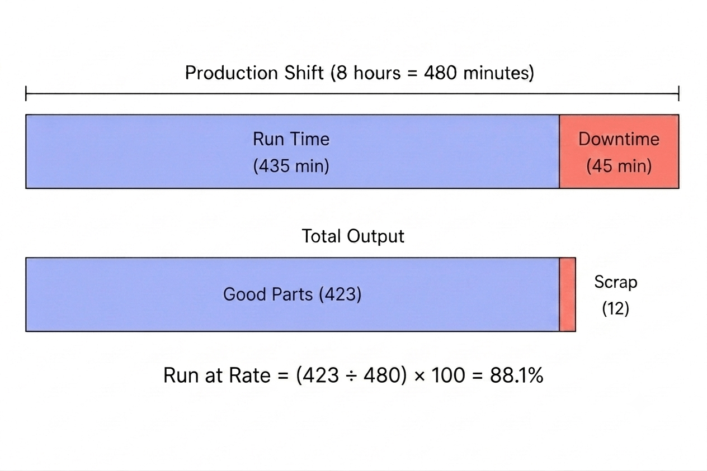
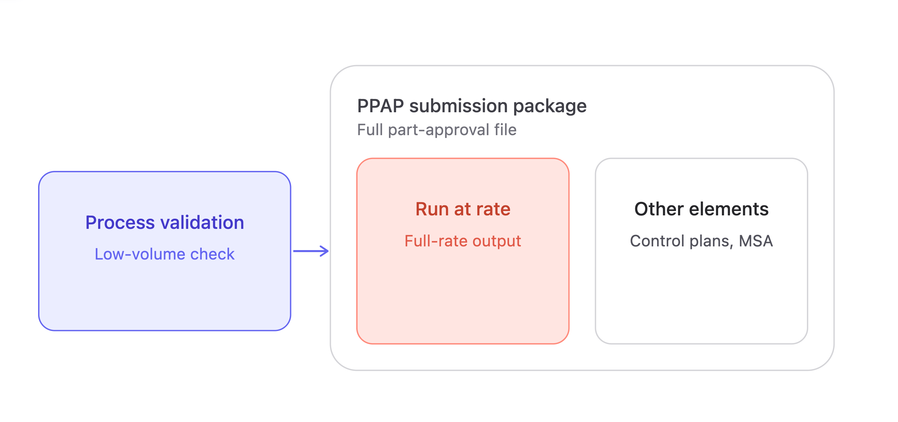

*Run at rate is a timed production run, performed at the actual target cycle time with production tooling and production staffing, meant to confirm a line can hold both quality and output over a real shift, not just a handful of closely watched parts.*

<!--more-->

The distinction matters because process validation alone doesn't prove it. A supplier can pass validation with every checked part coming back within spec, launch, and still miss its shift target three weeks in, at which point it's a customer problem instead of an engineering one. Run at rate is the check meant to catch that before launch happens, not after.

::cta-image{src="/blog/2026/08/images/run-at-rate-cta-2.png" alt="Need to prove production capacity before launch?" cta="demo"}
::

## Where the requirement comes from

General Motors formalized the requirement in its [GM Global APQP Supplier Quality Manual (GM 1927\)](https://www.scribd.com/document/572952029/GM-1927-35-Run-at-Rate-Procedure-Rev-2-EG), performed after PPAP approval as confirmation of the rate claimed on the supplier's warrant. Ford builds it into the PPAP submission itself, through the capacity evaluation section of the official [AIAG Production Part Approval Process (PPAP) Manual](https://www.aiag.org/training-and-resources/manuals). Stellantis standardizes its version via the [Stellantis Supplier Portal](https://www.google.com/search?q=https://www.supplier.stellantis.com) Capacity Assessment Tool (CAT) framework. German OEMs execute a two-day trial called 2 Tagesproduktion (2TP), governed by the [VDA QMC Volume 2 PPA Standard](https://webshop.vda.de/qmc/volume-2-ppa).

The paperwork varies by customer. The question underneath it doesn't: can this line, with this tooling and these operators, actually produce at the rate that was quoted.

## Requirements for a valid run

A few conditions have to hold.

The setup has to match real production, not a demo. Production tooling, production gauges, trained operators, standard work as documented. Auditors specifically watch for stand-ins, an engineer hovering over a fixture, hand-picked material, extra staff who wouldn't be on the floor during a normal shift. Any of that and the result doesn't count.

The run has to cover enough time to mean something. A line can hold [takt time](/blog/2025/09/what-is-takt-time/) for twenty minutes and still drift once fixtures heat up and operators settle into a real pace instead of a rehearsed one. That's why most programs require a full shift or a defined multi-hour window rather than a short burst at rate.

And everything counts against the result, not just the good parts. [Downtime](/blog/2026/07/build-downtime-logger/), changeovers, scrap, and rework all subtract from the demonstrated rate.

## How to calculate run at rate

The math only needs two numbers: what the line was supposed to produce, and what it actually produced as good parts.

**Theoretical output** \= run duration ÷ target cycle time 

**Run at rate %** \= (net good output ÷ theoretical output) × 100

Take an 8-hour shift, or 480 minutes, against a 60-second target cycle time. The theoretical output for that window is 480 units.

During the run, 45 minutes are lost to downtime, leaving 435 minutes of actual production time. At the target cycle time, the line produces 435 units, but 12 are scrapped, leaving 423 good parts.

**Run at rate = (423 ÷ 480) × 100 = 88.1%**

Downtime and scrap don't get calculated separately and added back in. They show up as fewer good parts against the theoretical output, which is why a line can be running most of the shift and still post a rate well under target..

::cta-image{src="/blog/2026/08/images/run-at-rate-cta-1.png" alt="Tracking run-at-rate data manually?" cta="sign-up"}
::

## What Does Pass or Fail Look Like?

The customer or program team sets the required run-at-rate threshold before the test, based on the production capacity that was quoted or required. The threshold varies by customer and program, so 95% is an example rather than a universal requirement.

If the agreed threshold is 95%, a result of 95% or higher passes. In the example above, the line achieved **88.1%**, so it fails to demonstrate the required capacity. That restarts the clock rather than ending the program: trace the shortfall to downtime, scrap, or cycle drift, fix it, and run again. Until a run passes, the quoted capacity stays unproven, and launch approval waits with it.

**Pass:** ≥ required threshold  
**Fail:** \< required threshold

## Run at rate vs. process validation vs. PPAP

Process validation confirms a process can hold tolerance, usually at reduced volume with an engineer watching each unit come off the line. That's a different test than holding tolerance for 400 consecutive cycles at full speed with nobody intervening, which is what runs at rate checks.

PPAP is the larger documentation package: control plans, measurement system analysis, part approval as a whole. Run at rate is one piece of that package, specific to volume. It isn't a substitute for the rest of the file, and the rest of the file isn't a substitute for it.

## Why capacity gaps still show up after launch

Changeover time gets estimated instead of measured live, and the real changeover, with new operators and no rehearsal, runs longer than planned. A station that tested fine on its own turns out to be the actual bottleneck once the full line runs together, starved for parts or backed up behind a slower neighbor. [Quality](/blog/2026/07/defect-and-quality-monitoring) that looked stable during a short trial drifts once tooling wears across a full shift, a failure mode a short run wouldn't catch.

Some of the challenge comes down to how run-at-rate data is collected. During a live run, cycle times, downtime, production counts, and rejects are often recorded manually, making it difficult to capture every event accurately. Much of this data is already available from the equipment through [PLC](/landing/plc/) tags and machine states. A platform like [FlowFuse](/) can connect to that equipment to automatically collect the data, calculate the demonstrated production rate, and visualize the results as the run progresses, giving teams a clearer view of how the line is performing against its target.

## Why it matters

Process validation proves a line can make a good part. Run at rate proves it can make good parts fast enough, for long enough, to hit the number in the launch plan. With production data collected directly from your equipment, FlowFuse helps [automotive manufacturers](/industries/automotive/) monitor production counts, cycle time, downtime, and quality in real time, making capacity gaps visible before they become launch problems.
