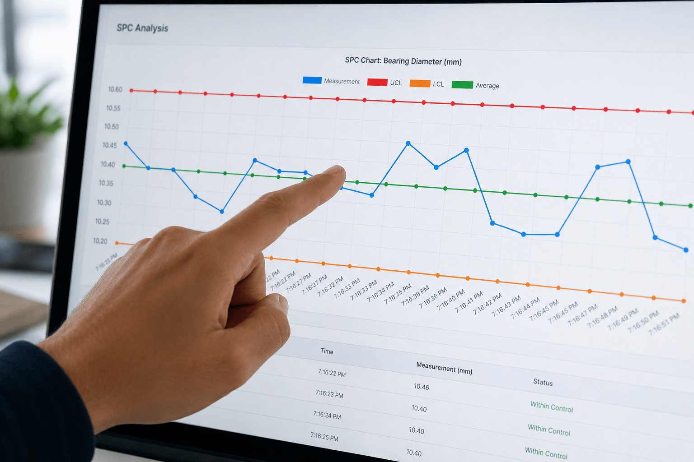
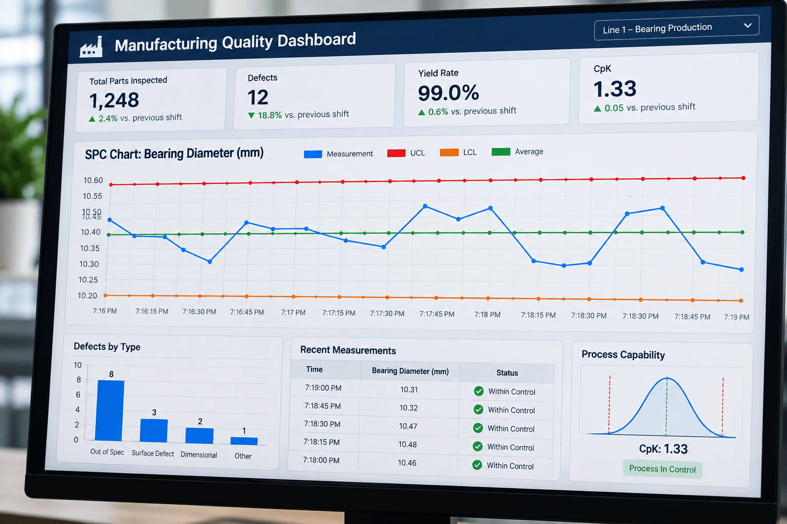

A quality engineer flags a batch of parts three shifts after the process drifted. By then, the scrap is already built. The operational logic that drives throughput and quality still lives in custom code, isolated scripts, and one-off solutions, so problems often surface in a quality report long after they could have been caught.

<!--more-->

FlowFuse is an industrial application platform that works with manufacturers who face this daily. Bosch, Cargill, Moderna, Worthington Steel, and 25+ other enterprise manufacturers use FlowFuse to build and standardize operational applications across sites, including the real-time monitoring that makes statistical process control practical at scale. Customers have documented a 50% reduction in scrap rate, and the platform is SOC 2 Type 1 and Type 2 certified.

This article covers what statistical process control is, how SPC charts and control charts work, how SPC applies across manufacturing sites, and where Six Sigma SPC and SPC software fit in.

_SPC control chart with a table of measurements_

## How Statistical Process Control Works: SPC Charts And Control Charts Explained

Statistical process control is a method for monitoring a manufacturing process using data collected while it runs, rather than waiting to inspect the finished product. It works by plotting measurements from the process, such as part dimensions, temperature, or pressure, onto a control chart over time. That chart includes a center line at the process average and upper and lower control limits placed three sigma either side of it, derived from the short-term variation within the process itself rather than from a fixed specification. Control limits and specification limits are not the same thing: a process can run entirely inside its control limits and still make parts outside spec, which is why an SPC signal means the process changed, not that a given part is bad.

The right control chart depends on how the data is collected. X-bar R and X-bar S charts are built from sample subgroups, small batches of readings pulled close together in time, and plot the subgroup average alongside its range (R) or standard deviation (S). When it isn't practical to pull parts into subgroups, an I-MR chart plots individual readings and the moving range between consecutive points instead. Picking the chart that matches how the data is actually collected is one of the more common places SPC implementations go wrong.

SPC charts make it possible to see the difference between common cause variation, which is expected and should not be adjusted for point by point, and special cause variation, which signals something has changed and needs investigation. A single point falling outside the control limits is one signal to intervene, but a non-random pattern building up over several points, such as a run drifting steadily in one direction or a cluster of points hugging one side of the center line, is also a signal. Quality teams formalize these checks using the Western Electric Rules or Nelson Rules, which pair the out-of-limit test with additional tests for runs, trends, and points clustering in the outer bands of the chart. Most of those tests fire on a sequence of points that are each individually inside the limits, which is why charts running these rules divide the space into one and two sigma bands rather than just plotting the outer limits. This is the core discipline behind statistical process control: catching drift while it is still correctable, not after a batch has already failed inspection.

Building and reading control charts by hand across dozens of machines and lines is slow and does not scale well across multiple sites. For a deeper look at how these charts are typically built and interpreted in practice, see [Statistical Process Control (SPC): Benefits and Implementation Guide](/blog/2025/07/quality-control-automation-spc-charts/).

_Manufacturing quality dashboard showing an SPC chart for bearing diameter and process capability metrics._

## SPC In Manufacturing: Turning Shop Floor Data Into Process Control

Statistical process control only works if it has a steady stream of accurate data from the process it is monitoring. In most plants, that data lives across [PLCs](/blog/2025/12/what-is-plc/), sensors, [MES systems](/blog/2025/06/what-is-mes/), and manual entry points that were never designed to talk to each other. Getting SPC to work at scale depends on solving that connectivity problem.

### Where SPC Data Actually Comes From

Process data for SPC charts typically comes from PLCs, edge devices, and sensors tracking variables like temperature, torque, or dimensional tolerances. Pulling that data into a usable chart requires IT/OT connectivity that moves it securely from the shop floor to wherever it is analyzed, without brittle point-to-point integrations that break every time equipment changes. FlowFuse provides that layer. It reads from PLCs, sensors, and MES over OPC UA, MQTT, or Modbus, so the chart updates from live process data rather than from manual entry.

### Deploying SPC Across Multiple Sites Without Rebuilding

What works on one line will not scale to fifty unless the underlying logic can be standardized. FlowFuse customers deploy SPC monitoring using a build once, run everywhere approach, standardizing a proven workflow on one machine and rolling it out across 20+ manufacturing sites from a single platform, without rebuilding it at each new location.

### Working With Brownfield Systems Instead Of Replacing Them

Most plants run a mix of legacy PLCs, older MES installations, and newer edge hardware. Rather than requiring a full system replacement, SPC monitoring can extend a brownfield environment as-is. This staged approach avoids the all-or-nothing rollout risk described in [All-or-Nothing Manufacturing Software Is Killing Your Agility](/blog/2026/05/manufacturing-software-built-in-stages/).

## Six Sigma SPC And Modern SPC Software: Choosing The Right Tools

Statistical process control does not exist in isolation. It works alongside broader quality methodologies and depends on the right software to make the data usable at scale. Choosing how SPC fits into your quality program and which tools support it are two separate decisions that shape how much value you get from the practice.

### SPC's Role In Six Sigma Methodology

Six Sigma SPC refers to using control charts within the Six Sigma framework, particularly during the Control phase of DMAIC. The chart provides the ongoing measurement that shows whether an improvement is holding, rather than a one-time check to declare the project complete.

### What To Look For In SPC Software

SPC software should connect directly to the data sources already on your shop floor rather than requiring manual data entry. Look for real-time monitoring, support for brownfield environments with existing PLCs and MES systems, and a way to deploy the same setup across multiple sites without reconfiguring it at each one. FlowFuse covers all three: connect the measurement over [OPC UA](/blog/2025/07/reading-and-writing-plc-data-using-opc-ua/), [MQTT](/blog/2024/06/how-to-use-mqtt-in-node-red/), or [Modbus](/blog/2025/09/using-modbus-with-flowfuse/), chart it with calculated limits and alerts on a dashboard at the line, then roll that same setup out everywhere else.

### SPC Alongside Other Root Cause Tools

Control charts show you when a process has drifted, but they do not always explain why. Pairing SPC with other root cause analysis tools helps close that gap. For a breakdown of one commonly used tool for identifying the biggest contributors to a quality issue, see [Pareto Chart & Diagram for Manufacturing](/blog/2025/08/pareto-chart-manufacturing-guide/).

## Final Thoughts

Statistical process control gives manufacturers a way to catch problems while they are still cheap to fix, but only if the underlying data actually reaches the people and systems that need it. That is often the harder part. Most plants already have the sensors and PLCs generating the right signals; what is missing is a reliable way to move that data from the shop floor into a usable chart, consistently, across every line and every site.

This is where an industrial application platform like FlowFuse fits. It connects the equipment, and your team builds the chart and the alerts on top of that data by dragging nodes, not writing code. It runs on the line, and you deploy the same setup at the next plant instead of rebuilding it. For manufacturers managing quality across dozens of sites, that difference determines whether SPC becomes a routine part of operations or another initiative that never quite scales past the pilot line.

## Sources

- American Society for Quality (ASQ). ["What Is Statistical Process Control? SPC Quality Tools."](https://asq.org/quality-resources/statistical-process-control)
- American Society for Quality (ASQ). ["Understanding Variation."](https://asq.org/quality-progress/articles/understanding-variation?id=3415f81b6f9444c4a30e6bb03aff7903)
- American Society for Quality (ASQ). ["Control Chart – Statistical Process Control Charts."](https://asq.org/quality-resources/control-chart)
- International Organization for Standardization. ["ISO 7870-2:2023 — Control Charts, Part 2: Shewhart Control Charts."](https://www.iso.org/standard/78859.html)
- NIST/SEMATECH e-Handbook of Statistical Methods. ["Shewhart X-bar and R and S Control Charts."](https://www.itl.nist.gov/div898/handbook/pmc/section3/pmc321.htm)
- NIST/SEMATECH e-Handbook of Statistical Methods. ["Individuals Control Charts."](https://www.itl.nist.gov/div898/handbook/pmc/section3/pmc312.htm)
