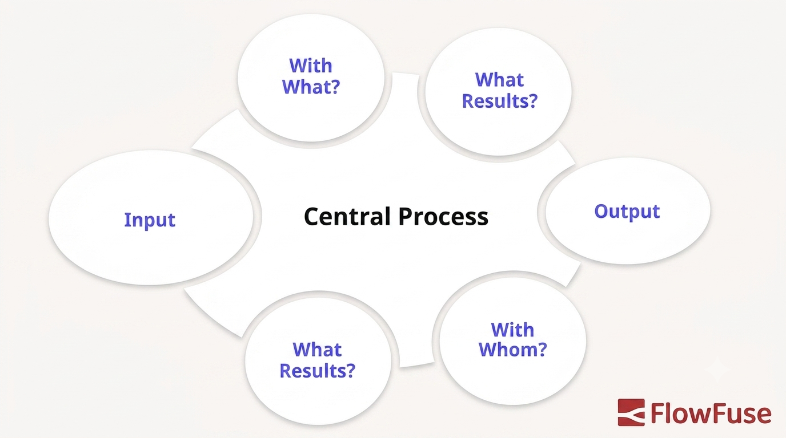

VDA 6.3 is a process audit standard used across the German automotive supply chain. It evaluates whether a manufacturing process can consistently produce conforming parts.

<!--more-->

Unlike a quality management system audit, VDA 6.3 focuses on how a specific process works in practice. This guide explains the seven process elements, scoring system, audit evidence, common findings, and how to prepare.

::cta-image{src="/blog/2026/08/images/vda-6-3.cta.png" alt="make process data easier to access during audits - book a demo" cta="demo"}
::

## What VDA 6.3 audits

VDA 6.3 was developed by the Verband der Automobilindustrie (VDA). It evaluates process performance across the product and process lifecycle. The [VDA QMC]([https://vda-qmc.de/en/education/vda-6-3-process-audit-at-a-glance-id-380/]%28https://vda-qmc.de/en/education/vda-6-3-process-audit-at-a-glance-id-380/%29) describes it as a reference manual for process audits across the supply chain.

VDA 6.3 is different from [IATF 16949]([https://www.iatfglobaloversight.org/]%28https://www.iatfglobaloversight.org/%29). IATF 16949 focuses on the quality management system, while VDA 6.3 examines whether a specific process is planned, controlled, and capable of producing the required output. VDA 6.5, by comparison, focuses on the product itself.

Auditors review documented procedures, inspect the production floor, question process owners, and compare records with actual conditions. Having IATF 16949 certification does not guarantee a strong VDA 6.3 result.

## When is VDA 6.3 used?

VDA 6.3 can be used at different stages of the supplier and production lifecycle. A potential supplier may be assessed before a contract is awarded, while established suppliers may be audited during product development or series production.

Process audits can also be triggered by major process changes, recurring quality problems, or customer requirements. The scope depends on the purpose of the audit, so an audit does not necessarily cover every process element from P1 to P7.

## The seven process elements

VDA 6.3 divides the audit into seven process elements:

| Element | Name                                            | What it covers                                            |
| ------- | ----------------------------------------------- | --------------------------------------------------------- |
| P1      | Potential Analysis                              | Capability of a prospective supplier before awarding work |
| P2      | Project Management                              | Planning, scheduling, and control of development projects |
| P3      | Planning of Product and Process Development     | Requirements, feasibility, and risk analysis              |
| P4      | Carrying Out Product and Process Development    | Development, FMEA, validation, and release                |
| P5      | Supplier Management                             | Selection, evaluation, and monitoring of sub-suppliers    |
| P6      | Process Analysis / Production                   | Production inputs, controls, resources, and outputs       |
| P7      | Customer Care / Customer Satisfaction / Service | Complaints, field performance, and corrective actions     |

P1 is generally used when assessing a potential supplier or new location and is not scored with P2–P7. For established production, the audit typically covers P2–P7.

P6 focuses on the production process and examines six areas: process inputs, work carried out, personnel resources, material resources, effectiveness, and process outputs. These areas cover everything from incoming materials and process instructions to operator qualifications, equipment, process controls, and the quality of the finished output.

## How a VDA 6.3 audit works

A VDA 6.3 audit starts with preparation and definition of the audit scope. The auditor reviews relevant information and identifies the processes and personnel to be assessed.

Before the audit, potential process risks should be identified so they can be assessed during the audit. VDA 6.3 uses the **Turtle Model** as one way to structure this risk analysis. It examines what enters and leaves the process, how the work is performed, which personnel and resources support it, and how process effectiveness is measured. The model can be applied to different process elements, including P6.

_Turtle diagram for VDA 6.3 process audits, showing a central process surrounded by six questions covering input, output, resources used, personnel involved, and process results_

During the audit, the auditor examines documents, observes the process, asks employees questions, and reviews objective evidence. Findings are recorded and the applicable questions are scored.

The audit ends with a closing meeting where the results and identified weaknesses are discussed. Corrective actions may then be assigned, followed by a review of whether those actions have addressed the findings.

## How VDA 6.3 scoring works

Audit questions are scored according to how well the requirement is met:

| Score | Meaning                      |
| ----- | ---------------------------- |
| 10    | Requirement fully met        |
| 8     | Requirement largely met      |
| 6     | Requirement partially met    |
| 4     | Requirement inadequately met |
| 0     | Requirement not met          |

The auditor bases the score on objective evidence from the process. Individual question scores are then used to calculate the result for the relevant process elements and the overall audit.

The classification is:

* **A:** 90% or higher — capable
* **B:** 80–89% — conditionally capable
* **C:** Below 80% — not capable

Specific downgrade rules can also affect the classification when serious weaknesses are identified. The overall percentage should therefore not be considered in isolation. The A/B/C classification and 10-8-6-4-0 scoring model remain part of VDA 6.3:2023.

## What auditors look for

Auditors compare documented requirements with what is happening on the production floor.

They may check control plans against the current process, FMEA and [control plan](/blog/2026/08/control-plans) linkage, [SPC](/blog/2026/08/statistical-process-control) data and capability values such as Cp and Cpk, reaction plans for out-of-control conditions, operator training records, corrective actions and their effectiveness, and production and inspection records.

The main risk is a gap between documentation and actual production.

For example, a control plan may identify a bore diameter as a critical characteristic, while the measurement system stores that value under a different name with different limits. If the systems are not connected, proving that the characteristic was checked correctly can require manual data matching.

Connecting production systems can make this evidence easier to access. Manufacturers can collect data from PLCs, sensors, [MES](/blog/2025/06/what-is-mes), and industrial protocols such as [OPC UA](/blog/2025/07/reading-and-writing-plc-data-using-opc-ua/), [Modbus](/node-red/protocol/modbus/), and [MQTT](/blog/2024/06/how-to-use-mqtt-in-node-red/), then display current process data in a dashboard.

[FlowFuse](/) can connect these systems and provide a live view of production data. This does not replace required quality documentation, but it can make process evidence easier to access during an audit.

## Common reasons suppliers lose points

Common findings include outdated control plans after process changes, missing links between FMEAs and control plans, capability values below requirements without an effective reaction plan, weak oversight of sub-suppliers, corrective actions closed without effectiveness evidence, training records that do not match the current process, and production data that cannot be traced to the relevant characteristic or operation.

These issues often develop when process changes are not reflected across documents, systems, and training records.

[Layered process audits](/blog/2026/08/layered-process-audit) can help identify these gaps between formal VDA 6.3 audits. Short, regular checks on the production floor can catch bypassed controls, outdated work instructions, and missing records earlier.

## How to prepare for a VDA 6.3 audit

Run an internal audit against the applicable VDA 6.3 requirements before the external audit. Focus on evidence from the current production process.

1. **Check process documentation.** Make sure control plans, [work instructions](/blog/2026/07/digital-work-instruction), and FMEAs match the current process.

2. **Review production data.** Check SPC charts, capability values, inspection records, and deviation logs. Make sure the data can be retrieved quickly.

3. **Check the production floor.** Verify that equipment, materials, process parameters, identification, and controls match the documented process.

4. **Review corrective actions.** Confirm that open and recently closed actions include evidence that the corrective action was effective.

5. **Prepare process owners and operators.** Make sure the people involved can explain their processes and understand the controls that apply to their work.

The best preparation is to keep process documentation, production data, training, and corrective actions aligned throughout the year rather than preparing only before the audit.