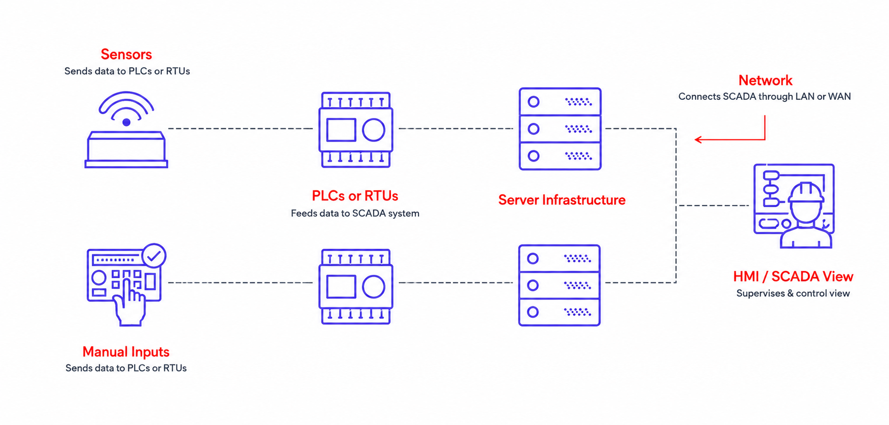

A production line goes down and the first alarm appears on a screen minutes before anyone on the floor notices. For teams managing multiple plants, that screen is often the only real-time view into what is happening across PLCs, sensors, and equipment scattered across dozens of sites. Understanding what SCADA is matters more than ever, especially with unplanned downtime costing industrial manufacturers an estimated [$50 billion](https://www.eng.auburn.edu/~szm0001/papers/GC23-technology.pdf) a year.

<!--more-->

FlowFuse, an industrial application platform, works directly inside the environments where SCADA systems operate, connecting to PLCs, sensors, and edge devices as part of building operational applications across plants and production lines. The platform is SOC 2 Type 1 and Type 2 certified and is trusted by manufacturers including Bosch, Cargill, Moderna, and 25 or more other enterprise customers to standardize workflows across hundreds of sites without rebuilding from scratch.

This article breaks down what SCADA is, how it works, how it compares to related systems like PLCs and HMIs, and why it still matters in brownfield environments today.

::cta-image{src="/images/cta/arch-systems-book-demo.png" alt="Arch Systems scales automation across complex manufacturing environments with FlowFuse - book a demo" cta="demo"}
::

## How Does SCADA Work? The Core Components

SCADA, which stands for Supervisory Control and Data Acquisition, is a system that collects data from equipment across a plant and gives operators a centralized view to monitor and control that equipment in real time. A simple definition covers what the system does, while the SCADA meaning points to its core function beyond just the acronym, supervising and gathering data across distributed equipment. Any basic SCADA system definition includes four layers working together: field devices, controllers, communication networks, and the software that displays and stores the data. Each of these layers works together as follows:

_The four layers of a SCADA system: field devices, controllers, communication networks, and the software operators use to monitor and control equipment._

### Field Devices And Sensors

Sensors and field devices sit closest to the physical process, measuring variables like temperature, pressure, flow rate, and machine status. These devices generate the raw data that everything else in the system depends on. Without accurate field-level data, supervisory dashboards and historical trends built on top of a [SCADA](/use-cases/scada/) system lose their value almost immediately.

### PLCs And RTUs

Programmable Logic Controllers and Remote Terminal Units take the raw signals from field devices and convert them into structured data. PLCs typically run more complex local control logic and keep equipment operating safely between supervisory updates, while RTUs are more common in geographically spread-out environments, like pipelines or remote wellheads, where they focus more on data acquisition and communication over long distances. Most industrial environments rely on PLCs as the layer directly beneath SCADA, translating physical inputs into a format the rest of the system can use.

### Communication Networks

Communication networks carry data between field devices, controllers, and the central SCADA software, using protocols like [Modbus](/node-red/protocol/modbus/), [OPC UA](/blog/2025/07/reading-and-writing-plc-data-using-opc-ua), [MQTT](/blog/2024/06/how-to-use-mqtt-in-node-red/), or [Ethernet/IP](/blog/2025/10/using-ethernet-ip-with-flowfuse/) depending on the equipment and environment. This layer determines how reliably and securely data moves across a facility, and it becomes especially important when connecting older equipment to newer IT/OT platforms.

### HMI And Central Monitoring Software

The Human-Machine Interface, or HMI, is where operators view live data, alarms, and trends pulled from PLCs and RTUs. Central SCADA software aggregates this information across multiple lines or sites, storing historical data for reporting and analysis. This layer is what turns raw signals into the visibility manufacturers depend on to catch problems early.

## SCADA vs. PLC, HMI, And MES: Where It Fits In The Stack

Anyone asking what is SCADA usually runs into overlapping terminology almost immediately, since PLCs, HMIs, and MES platforms all touch the same data at different points. Each system serves a distinct purpose, and confusing them leads to gaps in coverage or duplicated effort across sites. Getting the distinctions right matters for anyone responsible for architecture decisions across multiple plants:

### SCADA vs. PLC

A PLC executes control logic directly on the equipment it is connected to, reacting to inputs in real time without needing a central system. SCADA, by contrast, supervises multiple PLCs at once, pulling their data into a single view for monitoring and historical analysis, and sending supervisory commands like setpoint changes back down to the equipment. For a full breakdown of how PLCs function on their own, see [What Is PLC](/blog/2025/12/what-is-plc/).

### SCADA vs. HMI

An HMI is the interface operators interact with directly, usually tied to a single machine or line. SCADA software aggregates data from many HMIs and PLCs across a facility or multiple sites, giving a broader operational picture than any single interface can provide. Guidance on setting up interfaces at the equipment level is covered in [Building HMI for Equipment Control](/blog/2025/11/building-hmi-for-equipment-control/).

### SCADA vs. MES

MES platforms manage production scheduling, quality records, and traceability at a business process level, while SCADA focuses on real-time equipment data and control. These systems are meant to work together, not replace each other, though many manufacturers still rely on tools like [Kepware](/vs/kepware/) to bridge the gap between SCADA data and [MES](/blog/2025/06/what-is-mes/) or [ERP](/blog/2025/06/connect-shop-floor-to-odoo-erp-flowfuse/) systems. This is a core part of what SCADA is often used for in practice.

## Why SCADA Still Matters In Modern Brownfield Environments

SCADA systems are not going anywhere in most industrial facilities, and understanding why requires looking at how much infrastructure is built around them. Many plants run SCADA installations that are ten or twenty years old, tied directly to equipment that still works fine and would be expensive or risky to replace. Ripping out a functioning brownfield environment rarely makes sense when the goal is better visibility, not a full overhaul.

The real challenge is connecting older SCADA systems to newer IT and OT tools without breaking what already works. Protocol choice plays a large role here, and manufacturers evaluating how to move data between legacy equipment and modern platforms often need SCADA explained in the context of specific protocols like OPC UA and MQTT. The comparison in [OPCUA vs MQTT](/blog/2026/01/opcua-vs-mqtt/) covers how each protocol handles that kind of connectivity differently.

_Extending a brownfield SCADA system with an IT/OT layer rather than replacing it._

Extending a brownfield SCADA system, rather than replacing it, lets manufacturers keep proven equipment logic in place while adding the [IT/OT connectivity](/use-cases/it-ot-middleware/) needed for enterprise-wide visibility. That approach protects existing investment and reduces the operational risk that comes with large-scale system replacement.

## Final Thoughts

SCADA remains one of the most important systems on any plant floor, giving operators and engineers the visibility needed to catch issues before they turn into costly downtime. Knowing how the pieces fit together, from field devices up through PLCs, HMIs, and central monitoring software, makes it easier to spot where gaps exist and where legacy equipment can be extended rather than replaced.

For manufacturers managing SCADA across multiple sites, the harder problem is often not the system itself but everything built around it: custom scripts, one-off integrations, and workflows that get rebuilt at every new plant. An industrial application platform like FlowFuse addresses that layer directly, letting teams take a proven operational workflow and deploy it across every site instead of starting over each time. Build once, run everywhere is not just a convenience. It is what breaks the rebuild cycle for good.