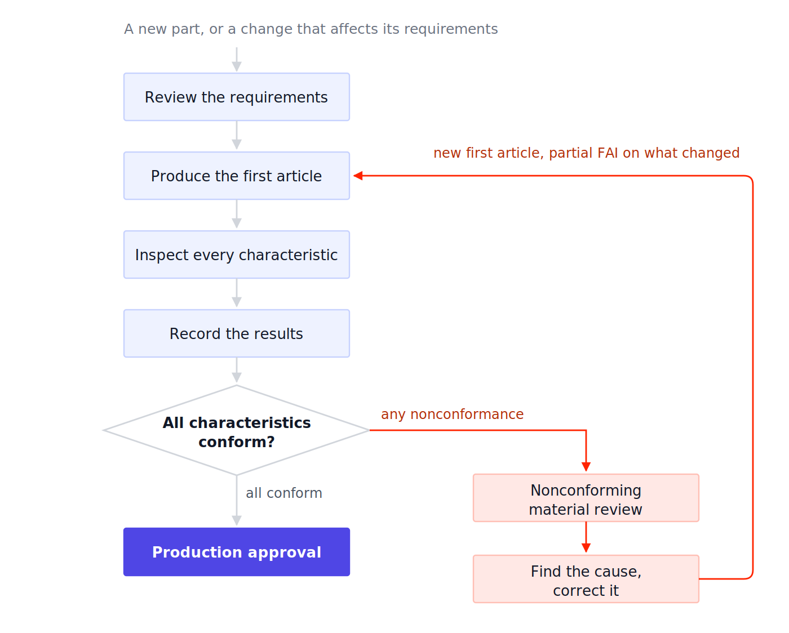

Before full-scale production, [automotive manufacturers](/landing/automotive/) need to verify that a part can be produced according to its engineering requirements. First Article Inspection (FAI) provides documented evidence that a part produced using the intended manufacturing process conforms to its engineering drawing, specifications, and other applicable requirements.

Much of this still runs on paper checklists and spreadsheets, which makes it easy for inspection results to drift away from the production data that explains them.

::cta-image{src="/blog/2026/09/images/fai-process-cta2.png" alt="Use FlowFuse to connect production data, build digital inspection workflows, and get better visibility into your quality processes - start your free trial" cta="sign-up"}
::

## What Is First Article Inspection (FAI)?

First Article Inspection (FAI) is a planned, complete, independent, and documented physical and functional inspection process used to verify that production processes can produce an item that meets specified requirements.

That definition comes from [SAE AS9102](https://saemobilus.sae.org/standards/as9102c-aerospace-series-first-article-inspection-requirements), the standard that establishes the requirements for performing and documenting FAI. AS9102 originated in aerospace, but its terminology and report structure now shape how many customers outside aerospace, including automotive customers, define FAI in their own purchase documents.

Inspectors check dimensions, tolerances, materials, surface finishes, and other specified characteristics against the engineering drawing, specifications, and applicable requirements.

The goal is to confirm that the manufacturing process can produce a part that meets the defined requirements before or during production approval.

## FAI Example: Inspecting an Automotive Part

Consider a supplier manufacturing a machined mounting bracket. Its drawing specifies:

| Characteristic | Requirement     | Actual Result | Status |
| -------------- | --------------- | ------------- | ------ |
| Overall length | 120 ± 0.5 mm    | 120.2 mm      | Pass   |
| Hole diameter  | 10 ± 0.1 mm     | 10.04 mm      | Pass   |
| Hole position  | ±0.2 mm         | 0.15 mm       | Pass   |
| Material       | Specified alloy | Verified      | Pass   |

If the hole position measured 0.35 mm against a ±0.2 mm requirement, it would fail. The supplier would document the nonconformance, determine the cause, take the required corrective action, and reinspect the affected characteristic.

## When Is FAI Required?

FAI requirements vary by customer, industry, and quality procedures. It is typically performed when a new part or a change could affect the part's requirements.

In automotive, the specifics usually come from the customer rather than from a single industry-wide FAI standard. IATF 16949 requires suppliers to run a product and manufacturing process approval process that conforms to requirements the customer defines, and each OEM publishes its own [customer-specific requirements](https://www.iatfglobaloversight.org/oem-requirements/customer-specific-requirements/) through the IATF. Check the applicable purchase document and customer-specific requirements before deciding what to inspect and submit.

Common triggers include:

- New part introduction
- Significant design or engineering changes
- New tooling or equipment
- Manufacturing process changes
- New manufacturing location or supplier
- Production restart after a significant interruption

Depending on the applicable requirements, a change may require a **full or partial FAI**. A partial FAI focuses on the characteristics affected by the change rather than repeating the entire inspection.

## How Does the FAI Process Work?

{data-zoomable}

### 1. Review the requirements

Use the latest engineering drawing, specifications, and revision. Identify the characteristics that require inspection and any applicable customer requirements.

### 2. Produce the first article

Manufacture the part using the intended materials, tooling, equipment, and production process. The objective is to inspect a part representative of the manufacturing process being evaluated.

### 3. Inspect the part

Measure the required characteristics using appropriate inspection equipment. Compare each result with the specified requirement and acceptance criteria.

### 4. Record the results

Document the requirements, measurements, inspection equipment, and other required information in the FAI report.

### 5. Address failures

If a characteristic does not conform, document the nonconformance, determine the cause and required corrective action, and reinspect the affected characteristic after correction.

### 6. Maintain traceability

Maintain records that connect the inspection results to the part, drawing revision, production run, tooling, equipment, and measurement equipment where required. This is the same [traceability](/blog/2026/08/automotive-traceability/) backbone that makes it easier to determine what was inspected and investigate issues later.

## What Does an FAI Report Include?

An FAI report documents the requirements that were inspected and the results obtained. Depending on the applicable requirements, it may include:

- Part number and name
- Drawing number and revision
- Characteristic or feature identification
- Nominal dimensions and tolerances
- Actual measurement results
- Material and process information
- Inspection and measurement equipment
- Inspection date and personnel
- Nonconformities and disposition
- Supporting documentation and traceability information

For example, a dimensional characteristic might be recorded with its drawing requirement, actual measurement, inspection method or equipment, and pass/fail result. This creates a traceable record showing whether the inspected part met the specified requirements.

The exact contents and format of an FAI report depend on the applicable customer, industry, and quality requirements. Customers that work to AS9102 expect the results on its three standard forms: part number accountability, product accountability for material and special processes, and the characteristic-level results.

## FAI vs. PPAP

FAI and Production Part Approval Process (PPAP) both help verify that manufactured parts meet requirements, but they serve different purposes. PPAP is defined in the [PPAP manual published by AIAG](https://www.aiag.org/training-and-resources/manuals), and most North American OEMs name that manual directly in their customer-specific requirements.

|                             | FAI                                                   | PPAP                                                                                |
| --------------------------- | ----------------------------------------------------- | ----------------------------------------------------------------------------------- |
| Main focus                  | Verifying a part against its engineering requirements | Demonstrating that the production process can consistently produce conforming parts |
| Dimensional inspection      | Yes                                                   | Typically included                                                                  |
| Material/process records    | May be included                                       | May be required                                                                     |
| [Control Plan](/blog/2026/08/control-plans/) | Not inherently part of FAI                            | Common PPAP element                                                                 |
| PFMEA                       | Not inherently part of FAI                            | Common PPAP element                                                                 |
| Process capability          | Not the main focus                                    | May be required                                                                     |
| Measurement system analysis | May be applicable                                     | May be required                                                                     |

FAI primarily demonstrates that the inspected part conforms to the defined design requirements. PPAP provides broader evidence that the supplier's production process and supporting quality systems are capable of consistently producing conforming parts. AIAG publishes the supporting core tool manuals, including MSA and SPC, that PPAP submissions draw on.

FAI can support a PPAP submission, but it does not replace PPAP when a customer requires it. PPAP approval also isn't the end of the story — most OEMs require a [safe launch](/blog/2026/08/safe-launch/) monitoring period once production starts.

## Common First Article Inspection Mistakes

Common FAI errors include using an outdated drawing or specification, [uncalibrated inspection equipment](/blog/2026/07/what-is-instrument-calibration/), inspecting a part made with the wrong production process, missing characteristics, and incomplete measurement records.

Calibration is where inspection records most often lose their weight. Calibration by a laboratory accredited to [ISO/IEC 17025](https://www.iso.org/standard/66912.html) ties a measurement result back to recognized measurement standards through a documented chain, which is what makes the number on the FAI report defensible during a customer review or an investigation.

Using the correct drawing revision, appropriate and calibrated inspection equipment, the intended production process, and traceable inspection records helps avoid these errors. Tracking calibration status against due dates in a [live dashboard](/blog/2026/07/calibration-management-dashboard/) makes it easier to catch an overdue instrument before it ends up on an FAI report.

::cta-image{src="/blog/2026/09/images/fai-process-cta-1.png" alt="Use FlowFuse to connect your equipment data, track calibration status and due dates, and build a dashboard around your calibration workflow - build a calibration dashboard" cta="sign-up"}
::

## Improving First Article Inspection With Digital Data

Traditional FAI can rely on inspection sheets, spreadsheets, and manual data entry. This can leave inspection results disconnected from the production data associated with the part.

[FlowFuse](/) connects machines, inspection systems, databases, and other factory systems so manufacturers can collect and process data in one workflow.

For example, an FAI workflow can associate inspection results with a part, machine, production run, tooling, material batch, or work order. If a hole diameter repeatedly approaches its tolerance, manufacturers can compare inspection results with machine and production data to investigate whether tooling, equipment, material, or a specific production run is contributing to the issue.

FlowFuse does not replace the FAI process. It connects the production data around it, reducing manual data handling and making inspection results easier to use for [quality analysis and investigation](/blog/2026/07/defect-and-quality-monitoring/).