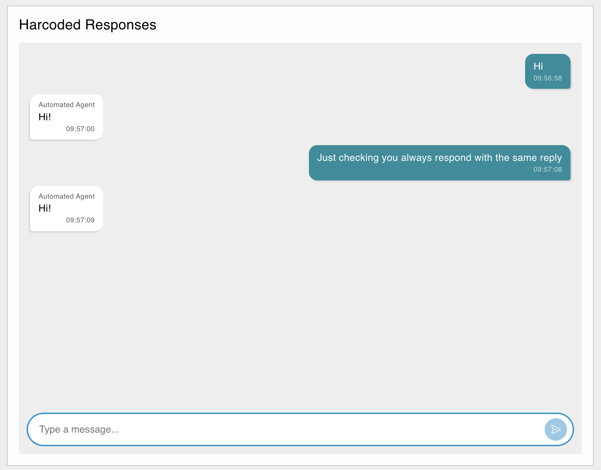
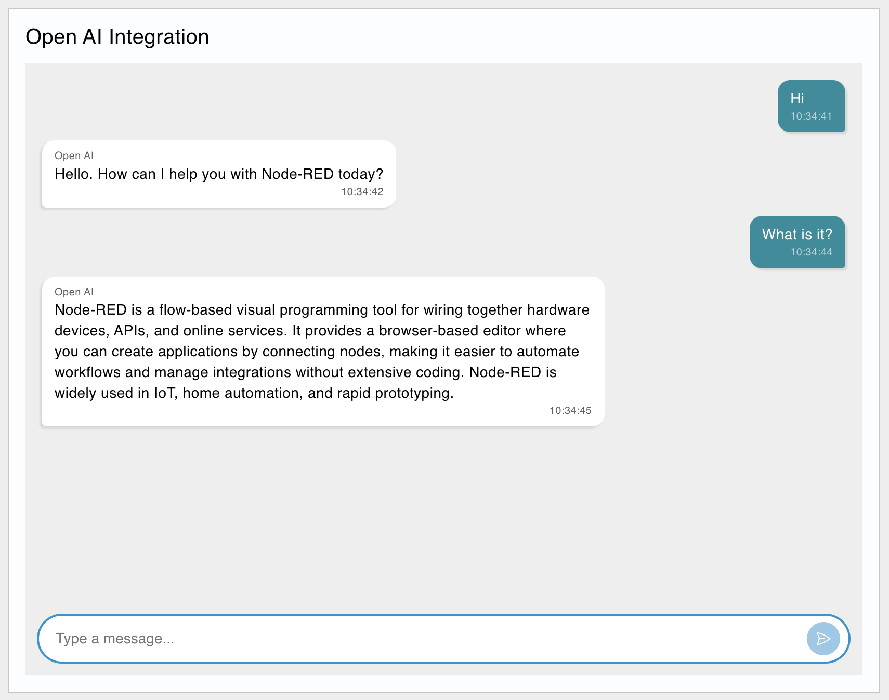
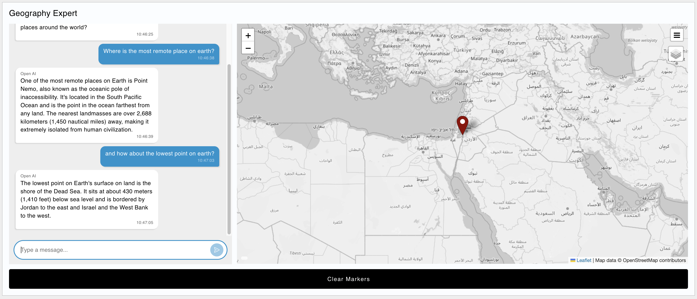

<video src="https://website-data.s3.eu-west-1.amazonaws.com/Blueprint+-+Open+AI+Chat.mp4" controls></video>

A collection of starter flows to help you get up and running with training and running your own LLM chat agents within Node-RED.

## Setup

### OpenAI API Key

The OpenAI API key is required to use the OpenAI agent. To get an API key, you can sign up to OpenAI and create a new API key [here](https://platform.openai.com/api-keys).

Once you have an API key, double-click on the "OpenAI: Get Reply" node in the "Chat - Open AI" flow, then "Edit" the "Service Host" field. Paste your API Key into the "API Key" field.

### OpenAI Organization ID

You will also need your Organization ID, which you can find in the [Open AI Organization Settings](https://platform.openai.com/settings/organization/general). Paste this into the "Organization ID" field in the "Service Host" config node.

## Examples

The examples included are as follows:

### Hardcoded Responses

{data-zoomable}
_Screenshot of the Data Visualisation example_

The intention of this example is to get your familiar with the workflow of data in and out of the Chat Widget. it does not use OpenAI or any LLM Agent to reply, but provides you with some simple examples with which you can control the state of the conversational interface.

### Open AI Integration

{data-zoomable}
_Screenshot of a Dashboard with a Chat Widget to interface with an OpenAI Agent_

This demonstration show how you can use setup "prompts" to train an OpenAI Agent. In this case, we have prompted the agent with:

```
You are an assistant that is an expert in Node-RED
You do not use emojis
You should only reply with plain text
```

As such, the agent will only reply with plain text, not use emojis, and reply with the context that questions should be about Node-RED.

You can overwrite the setup prompts in the "Define Setup Prompts" template node in order to prime the agent as you wish.

### Worldmap Integration

{data-zoomable}
_Screenshot of a Dashboard with a Chat interface to an OpenAI Agent, which integrates with a Worldmap to display location information_

In this example we demonstrate how you can use the OpenAI agent to respond with more than just text in a chat interface. This flow utilises the power of Node-RED's flow editor to wire OpenAi responses to other widgets, specifically a Worldmap, which can be used to show geographical data based on the response from the OpenAI agent.

## Customizing the Agents

For both the "Open AI Integration" and "Worldmap Integration" examples, the agent is "trained" with prompts. These prompts are defined in the "Define Setup Prompts" template node found in each flow.

For example, the worldmap example uses the following prompt:

```
You are an assistant that provides information about places around the world.
When you respond, you should provide a JSON message.
The JSON message should ahve two properties: 'text' and 'location'.
The 'text' property should include a text-based response to the user's query.
If your answer includes information about a location, then include the latitude (as the property 'lat') and longitude (as the property 'lon') of that place in the 'location' field, with a 'name' field detailing the name of that location, if there is no location mentioned then leave it null.
```

The rest of the "Setup" flow parses this template, and formats them for the OpenAI API, and stores the prompt in `flow.prompts`. These prompts are then merged with the user's conversation in the "Add Message to History" function node.