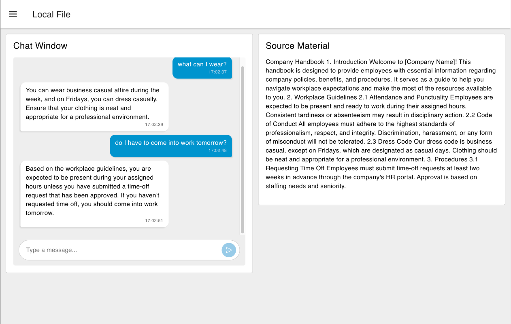
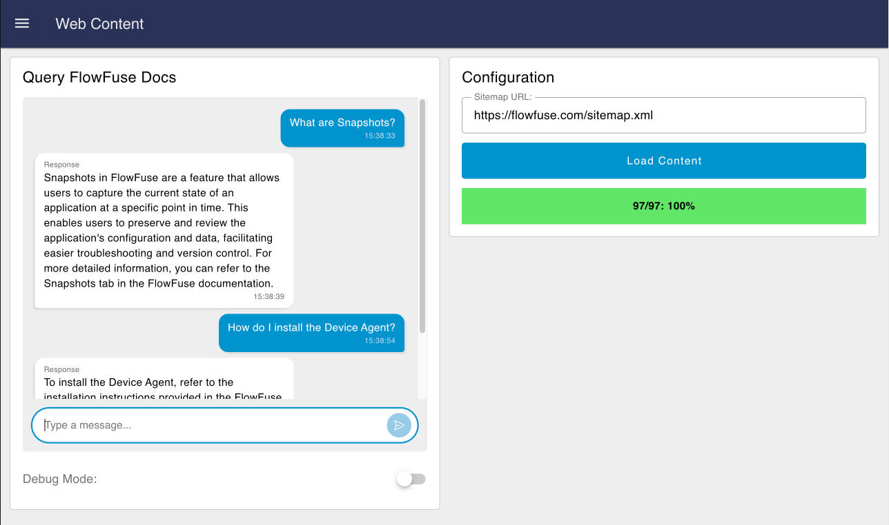

<video src="https://website-data.s3.eu-west-1.amazonaws.com/Blueprint+-+Open+AI+RAG.mp4" controls></video>

Train your own LLM Agents by parsing text-based content with Node-RED, and feeding it to an OpenAI Agent in a Retrieval Augmented Generation (RAG) workflow.

This Blueprint contains two example flows:

1. **Text-Based Source Material:** We chunk and store hardcoded text into Node-RED's flow context store, and use it to train an OpenAI Agent, enabling natural language querying on it's content.
2. **Website Scraping:** We scrape a website, using it's `sitemap.xml` to find all the pages to scrape, and then use the content to train an OpenAI Agent, enabling natural language querying on it's content.

## Prerequisites

### OpenAI API Key

This Blueprint uses [OpenAI](https://platform.openai.com/docs/overview) to run and train an LLM. An OpenAI API key is required to use the OpenAI agent. To get an API key, you can sign up to OpenAI and create a new API key [here](https://platform.openai.com/api-keys).

Once you have an API key, set an environment variable called `OPENAI_API_KEY` with your API key. To do this in FlowFuse, you can go to `Instance` > `Settings` > `Environment Variables`, and add a new variable with the name `OPENAI_API_KEY` and the value of your API key.

## How RAG Works

Retrieval Augmented Generation (RAG) is a technique that allows you to use external data sources to provide context to your LLM Agents, such that the information provided can be used when responding to user queries.

### Loading Content

In order for the LLM to be aware of the external data, we need to parse and store our own data. This is done by:

1. Parsing the text-based content into "chunks", i.e. smaller pieces of information that are easier to digest in their own right.
2. Saving the chunks to a vector database, which is a database that stores the chunks in a way that allows us to retrieve them later. In Node-RED, we can use the Node-RED flow context store.

### Handling User Queries

1. When receiving a query, we ***retrieve*** relevant chunks from the vector database, which we call our _"context"_.
2. This context is then provided, along with the user's query, to an OpenAI Agent. The agent then ***generates*** a response, which can then be sent back to the user. Where appropriate, the agent will use the context to help it respond to the user's query.

## Examples

The two examples included in this Blueprint are as follows:

### Example 1: Text Parsing

{data-zoomable}
_Screenshot of the local text example_

#### Ingesting Text

In this case, we parse a piece of text that is provided in a `template` node. This text could be loaded from a file, or anywhere else, but for this simple example, we have hardcoded it.

The text is then "chunked" into smaller pieces. This is stored into an in-memory vector database, which in this case is the Node-RED flow context store.

#### Retrieving Context

When a user query is received, we retrieve the most relevant chunks from the vector database. This is done by running a `similaritySearch` query on the vector database, which returns the most relevant chunks. These chunks are then provided as "context" to the OpenAI Agent, along with the query defined by the user.

#### Handling User Queries

The user's query, along with the generated context is sent to the OpenAI agent. The agent then generates a response, which is then sent back to the user and displayed using the FlowFuse Dashboard chat widget.

### Example 2: Website Scraping

{data-zoomable}
_Screenshot of the chat interface for the AI agent trained on FlowFuse documentation_

#### Ingesting Website Content

In this example, we scrape a website, using it's `sitemap.xml` to find all the pages to scrape. The content of each page is then parsed and stored into an in-memory vector database, which in this case is the Node-RED flow context store.

You can type or paste in the URL to the relevant `sitemap.xml`, and click "Load Content". Alternatively, you can click the Inject node at the start of the Node-RED flow to automatically load FlowFuse's `sitemap.xml`.

Please note that if you do load your own `sitemap.xml`, you may need to remove the `/docs` filter in the flow, as this is specific to FlowFuse's (or any other site) documentation.

#### Handling Questions

When a user query is received, the flow logic is as follows:

- Conduct a "Similarity Search" on the vector database. This returns the most relevant document chunks from the ingested documentation, in this case the content from [https://flowfuse.com/docs](https://flowfuse.com/docs).
- Provide this context, along with the system prompt and the user's query, to the OpenAI Agent.
- The agent then generates a response, which is sent back to the user and displayed using the FlowFuse Dashboard chat widget.

## Improving the Agent's Performance

Once you have a lot of documents ingested, you may find your agent's performance lacking in some areas. In this case, there may be some actions you can take to improve the agent's performance.

### Improving Vector Store Retrieval

The vector store retrieval process is a key part of the RAG workflow, as it provides the content to the LLM with which to make a generated response. The more relevant the chunks are to the user's query, the better the agent's response will be.

In this case, we are using the `similaritySearch` function to retrieve the most relevant chunks from the vector database. A simple experiment could be to increase the number of documents retrieved (e.g. `similaritySearch(query, 10)` would return 10 documents; the default is 4), or to use a different similarity search algorithm. This does however have a knock-on effect on the performance of the agent, as it will take longer to send the relevant chunks to the LLM.

### Alternative Chunking Methods

We could also improve how documents are put into "chunks". This would have a knock-on effect on how the algorithm retrieves the most relevant chunks, providing more relevant context to the LLM will immediately improve performance.

Under the covers here we are using LangChain.js, which provides a number of different chunking methods. The Python variant of LangChain provides more advanced alternative methods, such as the [HTML Semantic Preserving Splitter](https://python.langchain.com/docs/how_to/split_html/#using-htmlsemanticpreservingsplitter) which is designed to split HTML content into manageable chunks while preserving the semantic structure of important elements like tables, lists, and other HTML components.

## Build on FlowFuse

FlowFuse empowers teams to integrate digital systems with their physical ecosystems, to create and automate workflows through a low-code, end-to-end platform. Get started with this Blueprint (just clicking "Deploy" on the right-side), or check out the [FlowFuse documentation](https://flowfuse.com/docs) for more information.