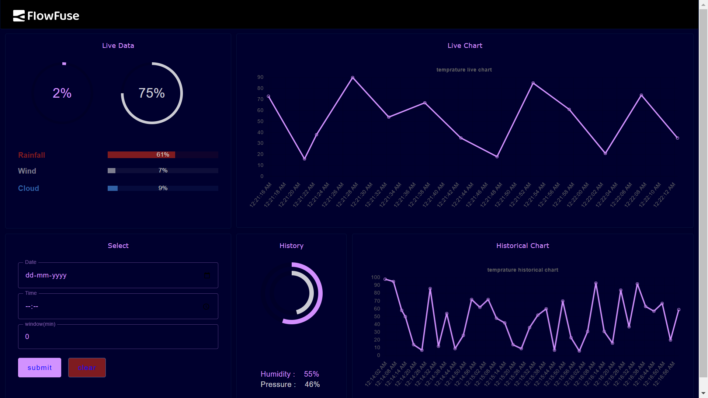

# Historical Data Dashboard with InfluxDB

This dashboard demonstrates the utilization of InfluxDB for retrieving and displaying both real-time and historical data with timestamp series.

## [Start now](https://app.flowfuse.com/deploy/blueprint?blueprintId=6EbLVbLa9j)

This blueprint is available during the creation of a FlowFuse instance.
For more information on setting up InfluxDB, please read our [blog post](https://flowfuse.com/blog/2023/07/influxdb-historical-data/#setting-up-serverless-influxdb-in-the-cloud).
