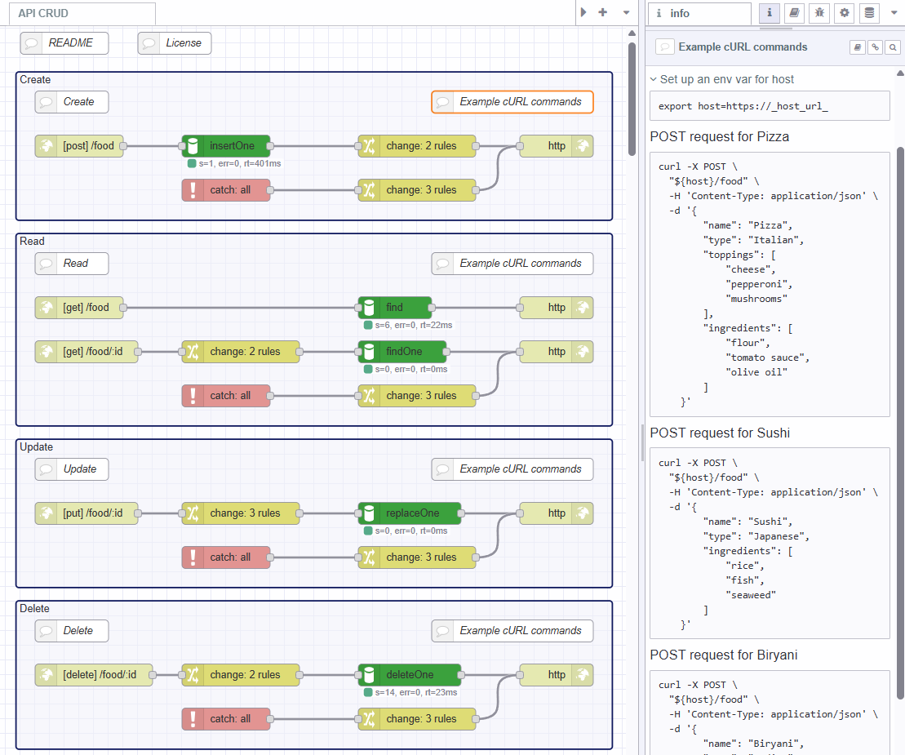

A demonstration of how to implement a basic CRUD datastore API with MongoDB.
This store is backed by a MongoDB instance, you will need to supply connection details for your database.
To start with you can make use of a free [MongoDB Instance](https://www.mongodb.com/pricing) using the "Shared" plan.

To get you up and running quickly, the Blueprint includes a pre-configured config node, all you need to do is provide values
via Envronment Variables - See the README inside the flow for details. 

