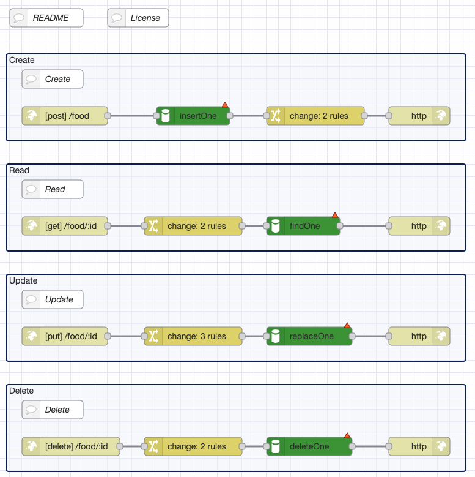

# Basic MongoDB CRUD implementation

A demonstration of how to implement a basic CRUD datastore API with MongoDB.
This store is backed by a MongoDB instance, you will need to supply connection details for your database.
To start with you can make use of a free [MongoDB Instance](https://www.mongodb.com/pricing) using the "Shared" plan.

## [Start now](https://app.flowfuse.com/)
This blueprint is available during the creation of a FlowFuse instance.