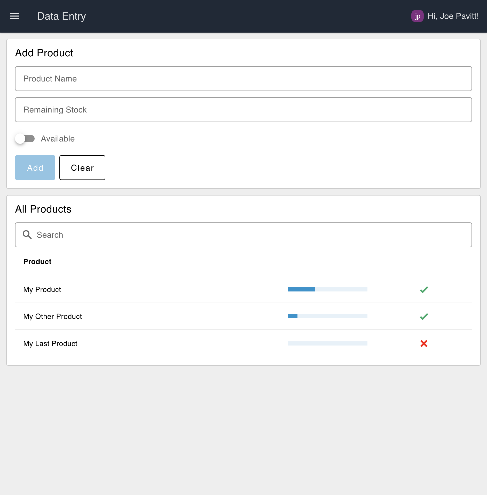

A collection of small examples for how to use FlowFuse Dashboard (Node-RED Dashboard 2.0). Each example is rendered to a standalone page on Dashboard, which can be navigated to via the side menu. 

{data-zoomable}
_Screenshot of the Node-RED flow used to generate the dashboard_

## Setup

In order to show the logged in user, you should enable the "[FlowFuse User Authentication](https://flowfuse.com/blog/2024/04/displaying-logged-in-users-on-dashboard/#enabling-flowfuse-user-authentication)" setting on your Instance.

## Examples

The examples included are as follows:

### Data Visualisation

{data-zoomable}
_Screenshot of the Data Visualisation example_

The example demonstrates how to use the `chart` widget and `gauge` widget to render data. In this simple flow, a `slider` is connected to the respective elements to show how interactive and live data can be displayed.
### Data Entry Form

{data-zoomable}
_Screenshot of the Data Entry Form example_
The examples renders a form with text, number and switch data types. Upon submission, the form data is appended to a table.

The table has had its columns manually defined such that it renders the "Remaining Stock" column as a progress bar, and the "Available" column as a tick/cross.
### User Tracking & Audit Log

{data-zoomable}
_Screenshot of the User Tracking & Audit Log example_
This example demonstrates how you can track which user is interacting with a Dashboard, utilizing the [FlowFuse User Addon](https://github.com/FlowFuse/node-red-dashboard-2-user-addon).

The flow uses Dashboard's `event` node, which emits when user's view or leave pages in your Dashboard. 

## Setup

In order to show the logged in user, you should enable the "FlowFuse User Authentication" setting on your Instance:

{data-zoomable}

This will add a `msg._client.user` object to the global context, which can be accessed by your Dashboard. You will need to restart your Node-RED instance for this to take effect.