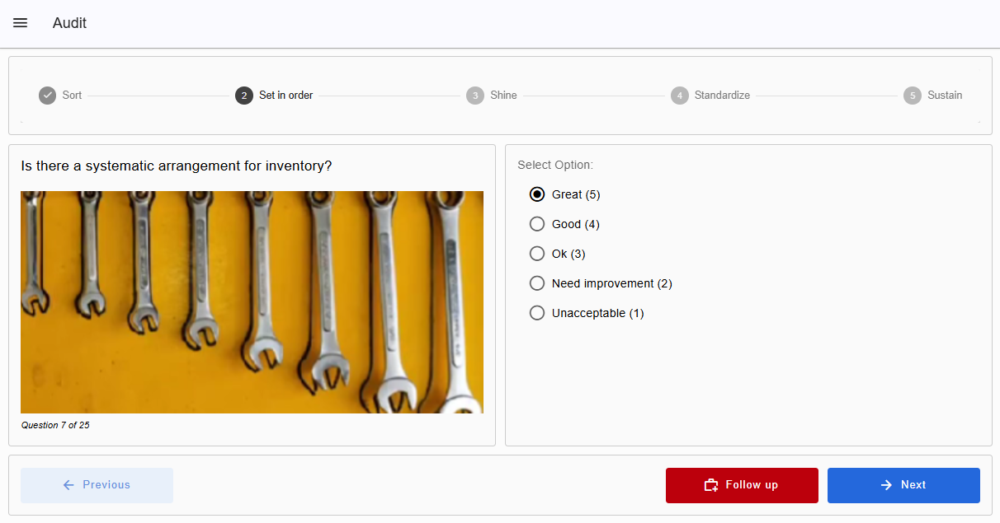
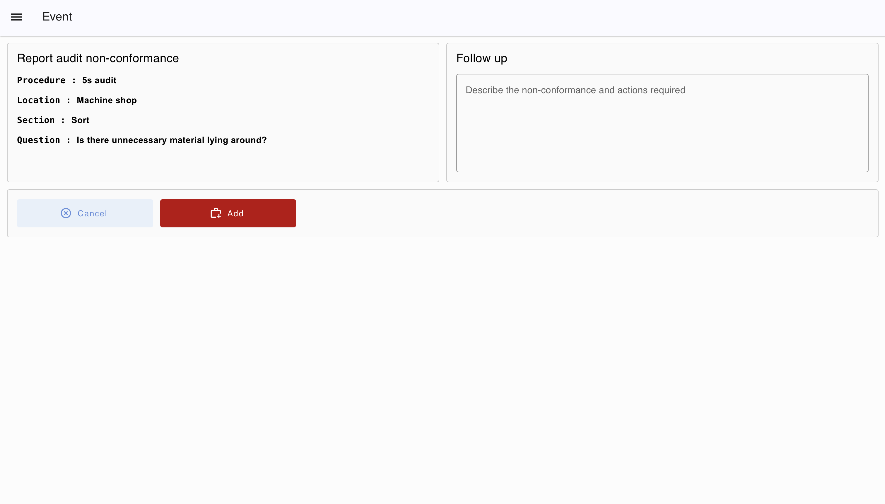
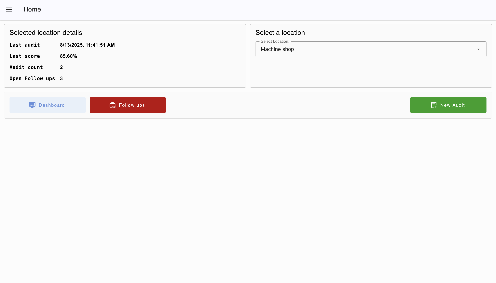
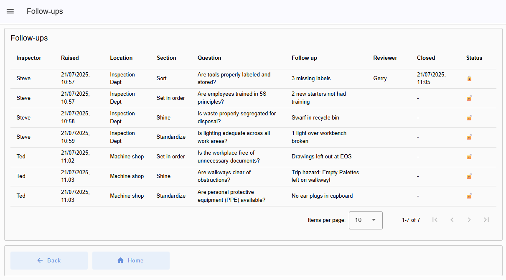

Continuous improvement is key to manufacturing efficiency, and the 5S methodology provides a practical framework to achieve it. The 5S principles help organize and maintain a productive, safe workspace by focusing on the following:

- **Sort (Seiri):** Remove unnecessary items from the workspace, keeping only essential tools and equipment.  
- **Set in Order (Seiton):** Assign clear, designated storage locations to ensure quick and easy access to everything.  
- **Shine (Seiso):** Maintain a clean and clutter-free environment to promote safety and well-being.  
- **Standardize (Seiketsu):** Implement consistent procedures to maintain the 5S practices across all teams.  
- **Sustain (Shitsuke):** Embed 5S into the company culture through ongoing evaluation and commitment.

The 5S Checklist dashboard makes it easy to capture detailed 5S audit data and analyze results for meaningful insights. Users are guided through 25 customizable audit checks tailored to your operational needs.

## Getting Started with 5S Checklist Blueprint

### Prerequisites

Before moving forward, ensure you have the following prepared:

- A FlowFuse account with the Starter, Team, or Enterprise tier.

This 5S Checklist Blueprint does not require configuring any nodes, as they are already pre-configured.

### Setting Up the Blueprint

1. To get started with the blueprint, click the "Start" button at the bottom. This will redirect you to the FlowFuse platform instance creation interface with the blueprint pre-selected.
2. Select the appropriate settings based on your preferences, such as instance type, application, and Node-RED version.
3. Click the “Create Instance” button.

Once the instance is successfully created, you can:

- Click the “Dashboard” button in the top-right corner to test the 5S Checklist Blueprint.
- Click the “Open Editor” button in the top-right corner to navigate to the Node-RED Editor.

### How to Use the 5S Checklist Dashboard

#### Starting a New Audit

1. Open the dashboard, select the location where the audit will be performed, and click the **New Audit** button.
2. Enter your name to begin the audit.

#### Completing the Audit

1. Each question will appear on the screen with an accompanying image and five options. Select the status or rating that best reflects your observations.
2. Click **Next** to move to the next question, or **Previous** to review or update an earlier answer. The audit is organized into 5S category groups, with a progress line at the top showing your current group and the question number (1–25) displayed below the image.
3. If a question requires a follow-up, click the **Follow Up** button. A window will open displaying the current question, its group, and location. Enter your note and click **Add** to save the follow-up.

Once all 25 questions are answered, you will be redirected to the home screen. At the top, you can view details of the last audit you performed, including the date and time, score, total audits completed, and any open follow-ups.

#### Viewing the Dashboard

1. Click **Dashboard** to view a detailed summary of your audits.

* At the top, bar charts display the average score for all 5S categories side by side for the areas you manage.
* Below the charts, you can select a specific area to see its total average score, along with the number of pending and closed follow-ups.

#### Managing Follow-ups

1. Click the **Follow Up** button. A new window will open, showing all follow-ups—both open and closed—with detailed information, including:

   * Raised at (date/time)
   * Location where raised
   * 5S section
   * Question
   * Reviewer who closed the issue
   * Closing time
   * Status

2. To close a follow-up, double-click it, enter your name, and click **Complete**.

#### Customizing and Extending the Blueprint

Currently, the 5S Checklist Blueprint stores audit information in the **FlowFuse persistent context store**. If you prefer, you can store the data in **FlowFuse tables** for easier access and reporting. For more information, see the article: [FlowFuse's New Database: The Easiest Way to Store Industrial IoT Data](https://flowfuse.com/blog/2025/08/getting-started-with-flowfuse-tables/).

To add more areas or locations, use the **"Setup Locations"** template node in the flow. Here, you can add additional areas as needed.
