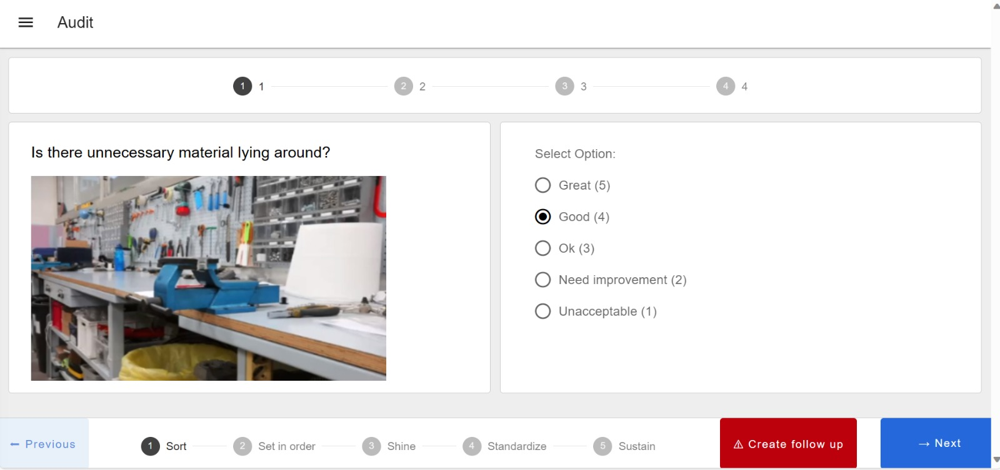

Manufacturing efficiency is improved through constant iterations. The 5S checklist is a tool that can help provide insight into what to improve.
The 5Ss:
* Sort (Seiri): Eliminate unnecessary items from your workspace, ensuring only essential tools and equipment remain.
* Set in Order (Seiton): Designate specific, well-defined storage locations for everything, making it easy to locate and access items quickly.
* Shine (Seiso): Keep your workplace spotless, free from dirt, debris, and clutter. This promotes a safe and healthy environment.
* Standardize (Seiketsu): Establish clear and consistent procedures for implementing the 5S principles, ensuring everyone follows the same guidelines.
* Sustain (Shitsuke): Make 5S an integral part of your company culture. Regularly evaluate and maintain the implementation of these practices.

## Blueprint

The 5S Checklist dashboard makes it quick and easy to capture and analyze 5S audit data for reporting. End users are guided through 25 checks that can be configured to meet your operational needs. This leans app allows you to store data automatically and view it in an included dashboard.

