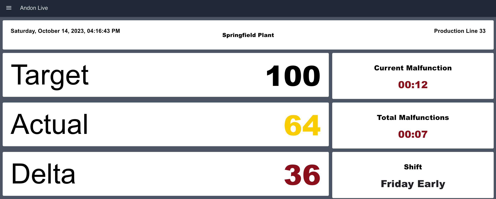

# Andon Live Dashboard

Andon Live serves as both a real-time shift status and an informational board. 
Directly in the production zone, it exhibits not only the actual and target quantities 
but also other vital key figures, providing a clear visualization of the progress during the current shift.

## Accessing the Dashboard

To access the dashboard:
1. Click on the right navigation bar in Dashboard 2.0.
2. Select "Open Dashboard."
3. The Dashboard will launch in a new pop-up window.

For further details about the Dashboard, visit: [FlowFuse Dashboard](https://dashboard.flowfuse.com/)

## Andon Live - Flow Structure

The flow's structure mirrors that of the dashboard. In the Node-RED Editor, 
each group corresponds to a group on the Node-RED Dashboard. 
Every group comes with a headline that is prominently displayed on the Dashboard itself.

## Data Integration: Simulation vs. Live Data

Before integrating the Dashboard into your environment:
1. Familiarize yourself with the provided data simulation. 
It helps users understand the expected input and offers guidance on how to adjust data sources and streams within Node-RED.
2. Modify the flows to connect to your live data sources. Before making any changes, it's crucial to:
   - **Create a Snapshot**: This step ensures that you have a backup to revert to. 
   If any issues arise while adjusting the flows, you can effortlessly revert to a previous state.

For comprehensive details on utilizing Snapshots, 
refer to: [FlowFuse Snapshots Documentation](https://flowfuse.com/docs/user/snapshots/).
