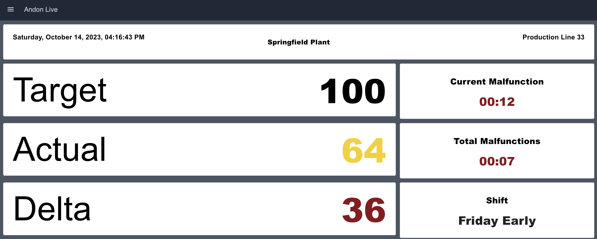

# Andon Live Dashboard

Andon Live serves as both a real-time shift status and an informational board. 
Directly in the production zone, it exhibits not only the actual and target quantities 
but also other vital key figures, providing a clear visualization of the progress during the current shift.

## [Start now](https://app.flowfuse.com/deploy/blueprint?blueprintId=34oNeYNwXG)
This blueprint is available during the creation of a FlowFuse instance.