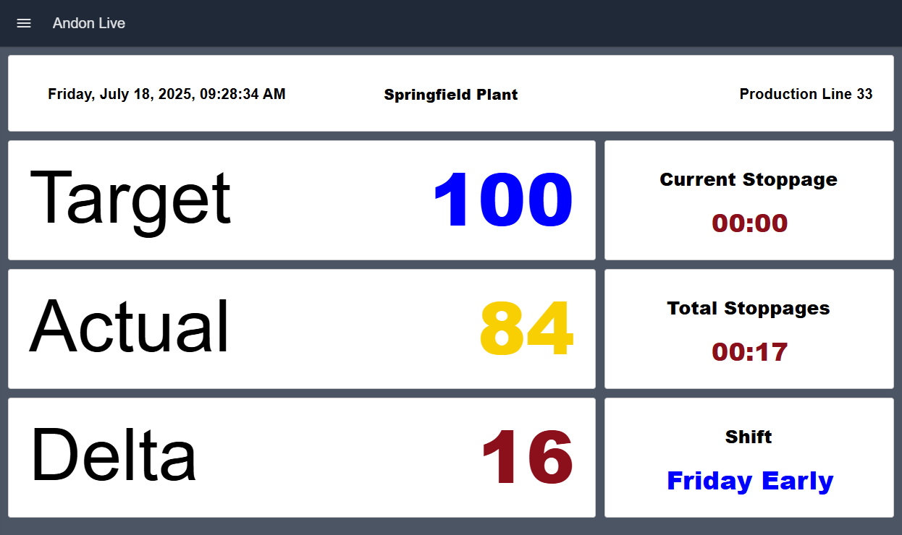

Andon Live serves as both a real-time shift status and an informational board. Located directly in the production zone, it displays not only actual and target quantities but also other vital key figures, providing a clear visualization of the progress during the current shift.

## What Problem Does It Solve?

Production teams need immediate visibility into shift performance to maintain productivity and meet targets. The Andon Live Dashboard provides real-time visibility into current shift performance directly on the production floor, allowing teams to see if they're on track to meet targets and identify when intervention is needed to stay on schedule.

## Understanding the Dashboard Sections

### Shift Information

This section displays the current shift details. It provides context for all performance metrics shown on the dashboard and helps teams understand which shift's data they're viewing.

### Actual vs Target Quantities

The dashboard prominently displays both actual production quantities achieved and target quantities expected for the current shift. This side-by-side comparison allows teams to assess whether production is on pace to meet goals.

### Delta

This section shows the difference between actual and target quantities, clearly indicating whether production is ahead of or behind schedule. A positive delta means production is exceeding targets, while a negative delta signals the need for corrective action.

### Current Stoppage

Displays the duration of the current stoppage event if the line is down. This helps teams understand how long equipment has been idle and the urgency of resolving the issue.

### Total Stoppages

Shows the cumulative stoppage time for the current shift. This metric helps identify patterns and calculate the impact of downtime on overall shift productivity.

### Production Context

The dashboard displays contextual information such as plant name, line number, and current time and date. This ensures operators know exactly which production line or cell they're monitoring, particularly useful in facilities with multiple lines.

## Getting Started with Andon Live Dashboard

### Prerequisites

Before moving forward, ensure you have the following prepared:

- A FlowFuse account with the Starter, Pro, or Enterprise tier.

### Setting Up the Blueprint

1. Click the **Deploy** button on the right. You will be redirected to the FlowFuse platform's instance creation interface with the blueprint pre-selected.
2. Select the appropriate settings based on your preferences, such as instance type, application, and Node-RED version.
3. Click the **Create Instance** button.

Once the instance is successfully created, you can:

- Click the **Dashboard** button in the top-right corner to test the Andon Live Dashboard Blueprint.
- Click the **Open Editor** button in the top-right corner to navigate to the Node-RED Editor.

### Replacing Simulated Data

Currently, the blueprint uses inject nodes and function nodes to simulate data for demonstration purposes. Before use in production, replace these nodes with your actual data source nodes. The dashboard is designed to accept real-time production data from your manufacturing execution system (MES), shop floor control systems, or production counters.

To replace the simulated data:

1. Open the Node-RED Editor by clicking the **Open Editor** button.
2. Locate the inject nodes and function nodes that are generating simulated data.
3. Replace these nodes with your source nodes (e.g., MQTT, OPC-UA, HTTP request, Database, or Modbus nodes).
4. Ensure your source nodes output data in the same format expected by the dashboard flows.
5. Deploy your changes and verify the dashboard displays your live data correctly.
