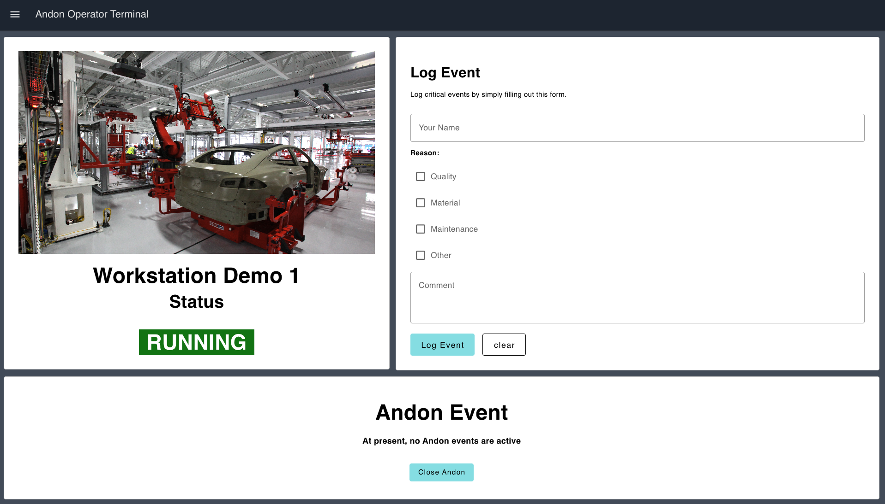
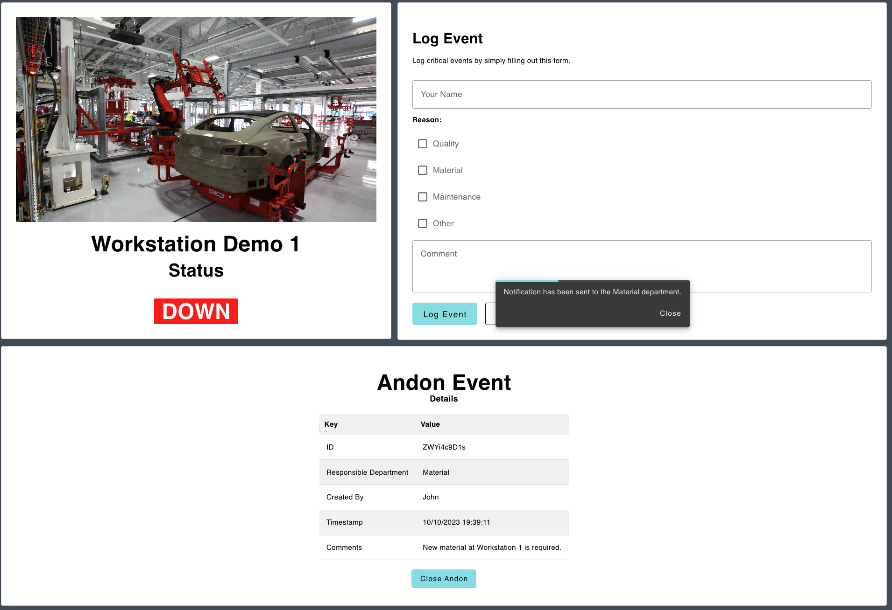

# ANDON Operator Terminal

This application is designed to enhance the functionality of the existing events module, particularly focusing on improving communication between operators and managers during an andon event. In manufacturing, minimizing downtime is crucial for maintaining productivity. This tool aims to bridge the gap between operators and their teams, equipping them with necessary resources to quickly resume operations. FlowFuse offers ready-to-use blueprints that can be easily integrated into your system.

## [Start now](https://app.flowfuse.com/deploy/blueprint?blueprintId=e85N3lmyX6)
This blueprint is available during the creation of a FlowFuse instance.