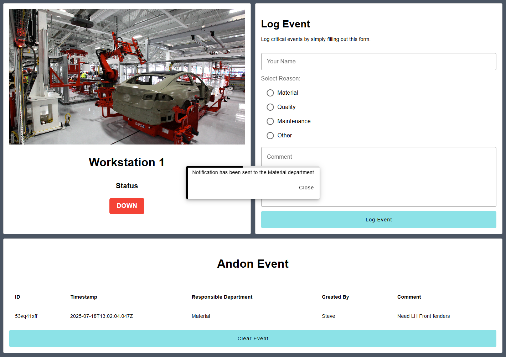

The Andon Operator Terminal is a digital interface that empowers factory floor operators to instantly report production issues. When problems arise—whether equipment malfunctions, quality defects, or material shortages—operators can quickly alert supervisors and support teams through this terminal.

## What Problem Does It Solve?

In traditional manufacturing environments, operators encountering production issues often waste valuable time trying to locate supervisors, making phone calls, or leaving their workstations to report problems. These delays can result in:

* Extended equipment downtime
* Quality issues going unnoticed
* Production bottlenecks
* Operator frustration due to delayed assistance
* Lost productivity and increased costs

The Andon Operator Terminal removes these communication barriers by providing operators with an immediate, standardized way to escalate issues. With just a few taps on the terminal, operators can raise issues that become visible across the team.

## Getting Started with Andon Operator Terminal

### Prerequisites

Before moving forward, ensure you have the following prepared:

* A FlowFuse account with the Starter, Pro, or Enterprise tier.
* FlowFuse User Authentication enabled for your instance. For more information, refer to [FlowFuse User Authentication](/blog/2024/04/displaying-logged-in-users-on-dashboard/#enabling-flowfuse-user-authentication).

This Andon Operator Terminal Blueprint does not require configuring any nodes, as they are already pre-configured.

### Setting Up the Blueprint

1. Click the **Deploy** button on the right. You will be redirected to the FlowFuse platform’s instance creation interface with the blueprint pre-selected.
2. Select the appropriate settings based on your preferences, such as instance type, application, and Node-RED version.
3. Click the **Create Instance** button.

Once the instance is successfully created, you can:

* Click the **Dashboard** button in the top-right corner to test the Andon Operator Terminal Blueprint.
* Click the **Open Editor** button in the top-right corner to navigate to the Node-RED Editor.

### Replacing Simulated Data

Currently, the dashboard displays the status and image of the workstation, which are simulated. Before use, replace these with your actual workstation image and real-time status. The status helps users correlate issues with workstation downtime and enables immediate action.

### How Operators Can Use It

Using the dashboard is simple:

1. Open the dashboard and enter your name.
2. Select the reason related to the issue.
3. Add any additional comments.
4. Click the **Log Event** button to notify the relevant department based on the selected reason.

Once an issue is logged, it will appear in the Andon Event for visibility.

A responsible team member will review the reported issue and take appropriate action. After resolving the problem, they can mark it as resolved by clicking the **Clear Event** button.

Currently, these logs are stored in the FlowFuse context, but you can replace this with a FlowFuse PostgreSQL table for better storage and management. For more information, refer to the article: [FlowFuse's New Database: The Easiest Way to Store Industrial IoT Data](https://flowfuse.com/blog/2025/08/getting-started-with-flowfuse-tables/).
