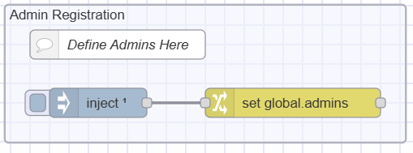

Have you encountered bottlenecks in your manufacturing operations due to delayed support requests or unresolved issues across various departments and production lines? The Andon System Blueprint is designed to address these challenges by streamlining the management and resolution of support requests. This framework ensures every issue is handled promptly and effectively, minimizing downtime and improving overall operational efficiency.

  
*The Andon System Blueprint: Admin view*

  
*The Andon System Blueprint: Normal user view*

## What is the Andon System Blueprint?

The Andon System Blueprint is a structured framework for managing and streamlining support requests within manufacturing environments. It provides a standardized process for submitting, tracking, and resolving issues across different departments and production lines, such as Maintenance, Quality, Stores, and Logistics.

This blueprint includes forms to add new production lines and departments, offering flexibility to tailor the system to your specific manufacturing setup. For each production line, dedicated forms allow users to submit support requests for specific departments, making it easier to manage support needs by production line.

The blueprint also provides an intuitive interface to view all support requests, organized by production line and department. Each request is detailed with essential information, such as the production line involved, the time the request was made, and action buttons to:

- **Acknowledge**: Mark the request as acknowledged.
- **Resolve**: Mark the request as resolved.

Additionally, the blueprint includes visual and audio alerts for older requests, which can be configured with customizable thresholds. This ensures that no request goes unnoticed, even if it has been pending for a while.

## What Problem Does It Solve?

In manufacturing environments, inefficiencies often arise due to disorganization and delays in handling support requests. The Andon System Blueprint addresses several key problems:

- **Delayed Response Times**: Delays in addressing support requests can lead to prolonged downtime and production delays. This blueprint streamlines the process, ensuring that requests are handled promptly and efficiently.
- **Lack of Visibility**: Without a centralized system, tracking the status of support requests across different departments and production lines can be challenging. The blueprint provides a clear and intuitive interface to view and manage all requests, organized by production line and department.
- **Inconsistent Handling**: Different departments might have varying procedures for managing support requests, leading to inconsistency and confusion. This blueprint standardizes the process, ensuring that all requests are managed in a uniform manner.
- **Communication Gaps**: Poor communication between departments can result in unresolved issues and misunderstandings. The blueprint facilitates better communication by providing detailed request forms and action buttons to acknowledge and resolve issues.
- **Inefficient Tracking**: Tracking and documenting support requests manually can be cumbersome and error-prone. The blueprint automates this process, storing detailed notes and tracking the progress of each request, helping to maintain accurate records.

By solving these problems, the Andon System Blueprint enhances operational efficiency, reduces downtime, and improves coordination across various departments and production lines.

## Getting Started with Andon System Blueprint

### Prerequisites

Before moving forward, ensure you have the following prepared:

- A FlowFuse account with the Starter, Team, or Enterprise tier.
- FlowFuse User Authentication enabled for your instance. For more information, refer to [FlowFuse User Authentication](/blog/2024/04/displaying-logged-in-users-on-dashboard/#enabling-flowfuse-user-authentication).

This Andon System Blueprint does not require configuring any nodes, as they are already pre-configured.

### Setting Up the Blueprint

1. To get started with the blueprint, click the "Start" button at the bottom. This will redirect you to the FlowFuse platform instance creation interface with the blueprint pre-selected.
2. Select the appropriate settings based on your preferences, such as instance type, application, and Node-RED version.
3. Click the “Create Instance” button.

Once the instance is successfully created, you can:

- Click the “Dashboard” button in the top-right corner to test the Andon System Blueprint.
- Click the “Open Editor” button in the top-right corner to navigate to the Node-RED Editor.

### Testing Blueprint with Simulated Data

This blueprint does not require simulated request data to operate. However, to work properly, you must have the production line and department added. Demo production lines and departments are automatically populated upon deployment if they are not already present. To view the flow that does this, switch to "Populate with Demo Support Areas and Lines." Once deployed, you can begin submitting support requests immediately.

The blueprint utilizes the SQLite node, which runs an SQL database within your Node-RED container. This means there is no need to set up a separate database or configure additional nodes for it to function.

### Setting Up the Blueprint in the Real World

To implement the blueprint in a production environment, you may need to store relevant data in a dedicated database hosted separately. By default, the blueprint uses an SQLite database set up by the SQLite node within the FlowFuse Node-RED instance. While this can handle a reasonable amount of data, you may need a more robust database for larger datasets. Node-RED supports various databases, including MySQL, PostgreSQL, InfluxDB, MongoDB, and more.

To switch to a different SQL-based database, install the appropriate Node-RED node for your chosen database and configure it accordingly. Replace the SQLite nodes in your flows with nodes for the new database. Since the operations are SQL-based, the transition to a different SQL database is straightforward.

For detailed instructions, refer to [how to set up and use different databases with Node-RED](/node-red/database/).

### How to Use This Blueprint

#### Adding Users to the Admin List:

The Blueprint provides two user interfaces: one for normal users and one for admin users. Normal users can view and submit requests for production lines and departments, but they cannot access the interface directly. Instead, they must access it via a URL with specific query parameters. Admin users, however, can create new production lines and departments, and access both the department and production line interfaces directly, without needing query parameters.

To define yourself as an admin:

  
*Flow to define admin user list*

1. Switch to the "configuration" flow tab and locate the "Admin Registration" flow.
2. Click on the Change node, where you will see the global.admin array.
3. Add your FlowFuse username as a string to this array.
4. Deploy the flow.
5. You will now be able to access the admin dashboard as a registered user.

#### Creating a New Production Line and Department:

  
*Form to add a new production line and department*

1. Navigate to the admin page of the support request dashboard.
2. On the left side of the dashboard, enter the name of the new production line and department in their respective fields.
3. Click the "Add" button.
4. After clicking the "Add" button, the production line and department will be added. You can confirm this by checking the top menu, where you will see all available production lines and departments.

#### Requesting Support:

  
*Select a production line to request support*

1. Select the production line for which you want to request support from the top header menu.
2. You will be redirected to the support request page, where you will see all requests submitted for that specific line in the table.
3. Below the table, you will find the support request form. Select the department, enter a detailed note, and click the “Request Support” button.
4. Once you click the button, the new request will appear in the table. This table only shows requests for the selected production line. To view all requests, visit the admin page.

#### Visual Alerts

The blueprint includes two types of visual alerts, each with different colors for non-acknowledged requests. The first request will override others, ensuring no requests go unnoticed. You can define threshold durations for these visual alerts:

  
*Visual Alerts showing non-acknowledged old requests*

1. Switch to the **"Configuration"** flow tab.
2. Locate the **"Define the threshold duration for considering a request as old (in minutes)"** flow.
3. Click the **"Change"** node, where you will find two configuration options:
    - **Old Request Threshold**: Defines the duration (in minutes) for considering a request as old. By default, it is set to 0 minutes, but you can adjust this to your preference. Requests that reach this threshold will trigger a light yellow visual alert.
    - **Older Request Threshold**: Defines the duration (in minutes) for considering a request as "older." When this threshold is reached, a stronger visual alert will be triggered.

#### Audio Alerts

The blueprint also includes an audio alert feature. When a non-acknowledged request exceeds the specified threshold duration, it will play an audio alert. You can define the duration threshold and set your preferred audio:

1. Switch to the **"Configuration"** flow tab.
2. Locate the **"Define the duration threshold (in minutes) to trigger the alert"** flow.
3. Click the **"Change"** node named **"Set the duration threshold (in minutes) to trigger the alert"** and set the duration in minutes.
4. To set the audio according to your preference, click the **"Change"** node named **"Set the URL for the alert sound"** and provide the URL for the audio file.

#### Marking a Request as Acknowledged:

  
*Button to mark a request as acknowledged*

1. In the table where all requests are listed, click the “Acknowledge” button next to the request.

  
*Timestamp indicating when the request was acknowledged*

2. After clicking the "Acknowledge" button, it will be replaced with the time when the request was acknowledged.

#### Marking a Request as Resolved:

  
*Button to mark a request as resolved*

1. Locate the request in the table where all requests are listed.
2. Click the “Resolved” button next to the request.
3. Once clicked, the request will be removed from the table and will no longer be visible.

#### Viewing Requests by Department:

  
*Select a department to view related requests*

1. To view requests for a specific department, click on the department name from the top header menu.

  
*Requests associated with the selected department*

2. You will see the requests associated with that department displayed on the page.

#### Accessing the Support Request Dashboard with URL:

The support request dashboard has two pages: one for the admin and another for users handling specific production lines and departments. To access it, you need to add a query parameter to the URL:

- To access the dashboard for production line T1, navigate to:  
  `https://<instance-name>.flowfuse.cloud/dashboard/support-request?line=T1`

- To view requests by department, replace the line query with department.

If the specified production line or department doesn't exist, you will be redirected to a "Not Found" page.

  
*Page displayed if the specified production line or department is not found*

#### Exporting Historical Data

The blueprint provides an API to export historical request data (requests that have been resolved). The API endpoint is `/history`. The flow to create and export history is available under the "API" flow tab.

#### Deleting Requests

  
*Flow that allows deleting 30-day old records*

1. To delete requests stored in the database, find the flow named "Delete records older than 30 days."
2. Click the inject button. Once clicked, it will delete the records. To edit the query, click the template node in the flow and make necessary changes.

#### Deleting Added Departments and Production Lines

1. When a department or production line is added, it is stored in [FlowFuse’s persistent storage](https://flowfuse.com/docs/install/file-storage/).
2. To delete it, go to the Node-RED sidebar, switch to the "Context Data" tab, and click the delete buttons next to "lines" and "departments" context variables to delete them.

## Conclusion

The Andon System Blueprint helps you manage support requests more efficiently, ensuring timely resolution and minimizing production delays. By implementing this blueprint, you can streamline communication between departments, maintain better visibility over support requests, and improve overall operational efficiency.
