# Manufacturing Support Request Blueprint 

Have you ever encountered bottlenecks in your manufacturing operations due to delayed support requests or unresolved issues across various departments of different production lines? The Manufacturing Support Request Blueprint is here to solve that problem. Designed to streamline the process of managing and resolving support requests, this blueprint ensures that every issue is addressed promptly and effectively, minimizing downtime and improving overall efficiency.

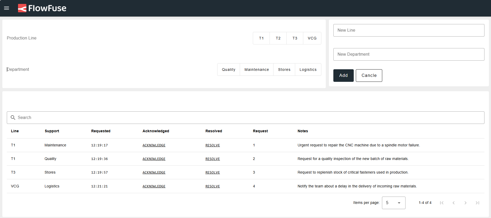  
*The Manufacturing Support Request Blueprint*

## What is the Manufacturing Support Request Blueprint?

The Manufacturing Support Request Blueprint is a structured framework designed to manage and streamline the handling of support requests within manufacturing environments. It provides a standardized process for submitting, tracking, and resolving issues that arise across various departments and production lines, such as Maintenance, Quality, Stores, and Logistics.

This blueprint includes forms to add new production lines and departments, providing the flexibility to tailor the system to your specific manufacturing setup. For each production line, there are dedicated forms to submit support requests for specific departments, which makes it easy to request and manage support requests by production line.

The blueprint also provides an intuitive interface to view all support requests, organized by production line and department. Each request is detailed with essential information, such as the production line involved, the time the request was made, detailed notes, and action buttons to:

- **Acknowledge:** Mark the request as acknowledged.
- **Resolve:** Mark the request as resolved.

## What Problem Does It Solve?

In manufacturing environments, inefficiencies often arise from the disorganization and delays in handling support requests. The Manufacturing Support Request Blueprint addresses several key problems:

- **Delayed Response Times:** Delays in addressing support requests can lead to prolonged downtime and production delays. This blueprint streamlines the process, ensuring that requests are handled promptly and efficiently.
- **Lack of Visibility:** Without a centralized system, tracking the status of support requests across different departments and production lines can be challenging. The blueprint provides a clear and intuitive interface to view and manage all requests, organized by production line and department.
- **Inconsistent Handling:** Different departments might have varying procedures for managing support requests, leading to inconsistency and confusion. This blueprint standardizes the process, ensuring that all requests are managed in a uniform manner.
- **Communication Gaps:** Poor communication between departments can result in unresolved issues and misunderstandings. The blueprint facilitates better communication by providing detailed request forms and action buttons to acknowledge and resolve issues.
- **Inefficient Tracking:** Tracking and documenting support requests manually can be cumbersome and error-prone. The blueprint automates this process, storing detailed notes and tracking the progress of each request, which helps in maintaining accurate records.

By solving these problems, the Manufacturing Support Request Blueprint enhances operational efficiency, reduces downtime, and improves coordination across various departments and production lines.

## Getting Started with Manufacturing Support Request Blueprint

### Prerequisite

Before moving forward, ensure you have the following prepared:

- Ensure you have a FlowFuse account with the Starter, Team, or Enterprise tier.

Starting with this Manufacturing Support Request Blueprint, note that the blueprint does not require configuring any nodes, as they are already pre-configured.

### Setting Up the Blueprint

1. To get started with the blueprint, click the bottom-most "Start" button. This will redirect you to the FlowFuse platform instance creation interface with the blueprint pre-selected.
2. Select the appropriate settings according to your preferences, such as instance type, application, and Node-RED version.
3. Click the “Create Instance” button.

Once the instance is successfully created, you can:

- Click the “Dashboard” button in the top-right corner to test the 5S checklist.
- Click the “Open Editor” button in the top-right corner to navigate to the Node-RED Editor.

### Testing Blueprint with Simulated Data

This blueprint does not require simulated data to operate. You can begin submitting support requests immediately. The blueprint utilizes the SQLite node, which runs an SQL database within your Node-RED container once you deploy the flow. This means you do not need to set up a separate database or configure additional nodes for it to function.

### Setting Up the Blueprint in the Real World

To implement the blueprint in a production environment, you may need to store relevant data in a dedicated database hosted separately. By default, the blueprint uses an SQLite database set up by the SQLite node within the FlowFuse Node-RED instance. While this can handle a reasonable amount of data, you might need a more robust database for larger datasets. Node-RED supports various databases, including MySQL, PostgreSQL, InfluxDB, MongoDB, and more.

To switch to a different SQL-based database, you simply need to install the appropriate Node-RED node for your chosen database and configure it accordingly. Replace the SQLite nodes in your flows with nodes for the new database. Since the operations are SQL-based, the transition to a different SQL database is straightforward.

For detailed instructions refer to how to set up and use different databases with Node-RED.

### How to Use This Blueprint

#### Creating a New Production Line and Department:

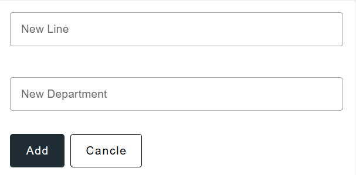  
*Form to add a new production line and department*

1. Navigate to the admin page of the support request dashboard.
2. On the left side of the dashboard, you will find a form. Enter the name of the new production line and department into their respective input fields.
3. Click the "Add" button.
4. After clicking the "Add" button, the production line and department will be added. You can confirm this by checking the top menu, where you will see all available production lines and departments.

#### Requesting Support:

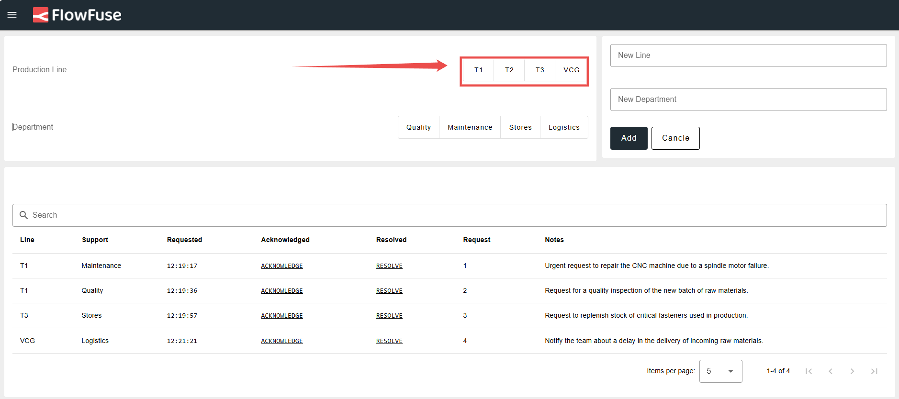  
*Select a production line to request support*

1. Select the production line for which you want to request support from the top header menu.
2. You will be redirected to the support request page, where you will see all requests submitted for that specific line in the table.
3. Below the table, you will find the support request form. Select the department for which you want to request support, enter a detailed note related to the request, and click the “Request Support” button.
4. Once you click the button, the new request will appear in the table above. This table only shows requests related to the selected production line. To view all requests, visit the admin page.

#### Marking a Request as Acknowledged:

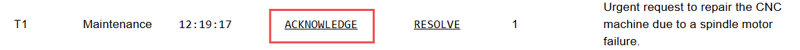  
*Button to mark a request as acknowledged*

To mark a request as acknowledged, indicating that someone has picked it up and is working on it, follow these steps:

1. In the table where all requests are listed, click the “Acknowledge” button next to the request.

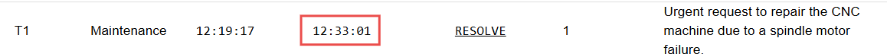  
*Timestamp indicating when the request was acknowledged*

2. Once you click the "Acknowledge" button, it will be replaced with the time when the request was marked as acknowledged.

#### Marking a Request as Resolved:

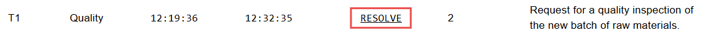  
*Button to mark a request as resolved*

To mark a request as resolved, indicating that it has been satisfied or completed, locate the request in the table where all requests are listed.

1. Click the “Resolved” button next to the request.

2. Once you click the "Resolved" button, the request will be removed from the table and will no longer be visible.

#### Viewing Requests by Department:

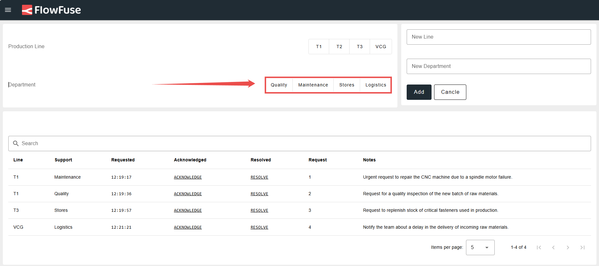  
*Select a department to view related requests*

1. To view requests for a specific department, click on the department name from the top header menu.

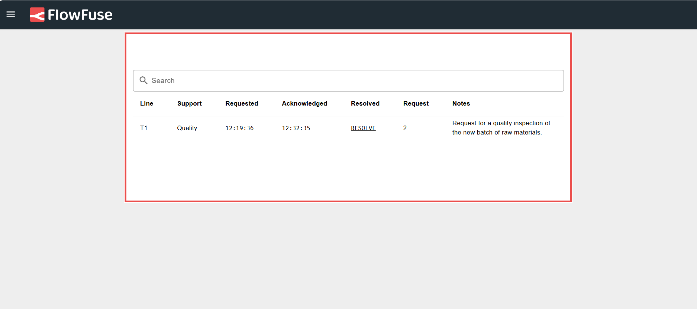  
*Requests associated with the selected department*

2. Once you click, you will see the requests associated with that department displayed on the page.

#### Accessing the Support Request Dashboard with URL:

The support request dashboard has two pages: one for the admin and another for users handling specific production lines and departments. To access it, you need to add a query parameter to the URL.

- For example, if you want to access the support request dashboard for production line T1, navigate to:
  `https://<instance-name>.flowfuse.cloud/dashboard/support-request?line=T1`

- To view requests by department, replace the line query with department.

Ensure that the production line or department you specify in the query exists; otherwise, you will be redirected to a "Not Found" page.

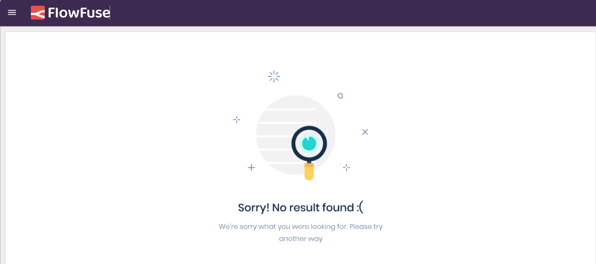  
*Page displayed if the specified production line or department is not found*

#### Adding Users to the Admin List:

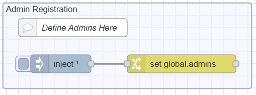  
*Flow to define admin user list*

1. To add users to the admin list, locate the "Admin Registration" flow.
2. Click on the Change node, and within the node, you will see it setting `global.admin` to an array.
3. Add your FlowFuse username as a string to this array.
4. Deploy the flow.
5. You will now be able to access the admin dashboard as a registered user.

#### Deleting Requests

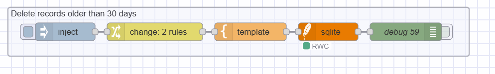  
*Flow that allows to delete the 30 days old records*

1. To delete requests stored in the database, find the flow named "Delete records older than 30 days."
2. Click on the inject button. Once clicked, it will delete the records. If you need to edit the query, click on the template node in the flow and make the necessary changes.

#### Deleting Added Departments and Production Lines

1. When a department or production line is added, it is stored in [FlowFuse’s persistent storage](https://flowfuse.com/docs/install/file-storage/).
2. To delete it, go to the Node-RED sidebar, switch to the "Context Data" tab, and click the delete buttons next to each context variable to remove the entries.

## Conclusion

The Manufacturing Support Request Blueprint helps you manage support requests more efficiently, ensuring timely resolution and minimizing production delays. By implementing this blueprint, you can streamline communication between departments, maintain better visibility over support requests, and improve overall operational efficiency.

## [Start now](https://app.flowfuse.com/deploy/blueprint?blueprintId={{ blueprintId }})
This blueprint is available during the creation of a FlowFuse instance.
