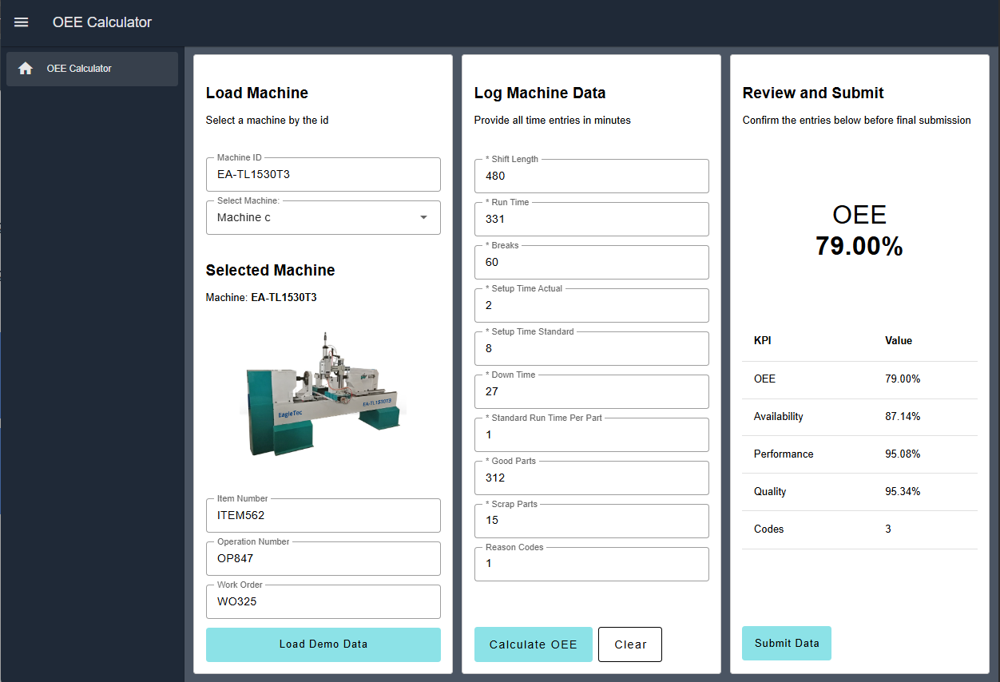

The OEE (Overall Equipment Effectiveness) Calculator Blueprint is a user-friendly solution designed for manual OEE tracking and calculation. This tool is ideal for manufacturing environments where automatic data collection from machinery is not available or practical. Operators can quickly input production data through an intuitive dashboard to calculate availability, performance, quality, and overall OEE metrics in real-time.

*OEE Calculator Dashboard*

## OEE Calculation Method

The blueprint uses the following standard OEE calculation formulas:

- **Availability** = Run Time / (Shift Length - Breaks)
- **Performance** = (Standard Run Time Per Part × Good Parts) / Run Time
- **Quality** = Good Parts / (Good Parts + Scrap Parts)
- **OEE** = Availability × Performance × Quality

All metrics are displayed as percentages. You can modify these formulas in the "Calculate KPIs" function node to align with your specific operational requirements.

## Getting Started with OEE Calculator Blueprint

### Prerequisites

Before moving forward, ensure you have the following prepared:

- A FlowFuse account with the Starter, Team, or Enterprise tier.

### Setting Up the Blueprint

1. To get started with the blueprint, click the "Start" button at the bottom. This will redirect you to the FlowFuse platform instance creation interface with the blueprint pre-selected.
2. Select the appropriate settings based on your preferences, such as instance type, application, and Node-RED version.
3. Click the "Create Instance" button.

Once the instance is successfully created, you can:

- Click the "Open Editor" button in the top-right corner to navigate to the Node-RED Editor.

### Accessing the Dashboard

To access the OEE Calculator dashboard:

1. Click the Dashboard 2.0 icon in the right navigation bar of the Node-RED Editor.
2. Select "Open Dashboard."
3. The dashboard will launch in a new browser window or tab.

For further details about FlowFuse Dashboard, visit: [FlowFuse Dashboard Documentation](https://dashboard.flowfuse.com/)

## Using the OEE Calculator

### Testing with Demo Data

The blueprint includes a demo data generator to help you understand the expected inputs and test the functionality:

1. On the dashboard, click the **"Load Demo Data"** button in the Load Machine section.
2. The system will automatically populate all fields with simulated production data.
3. Click **"Calculate OEE"** to process the demo data.
4. Review the calculated metrics in the Review and Submit section.
5. Click **"Submit Data"** to complete the submission.

### Manual Data Entry

To manually enter production data:

#### 1. Load Machine

- **Machine ID**: Enter or select the machine identifier (or use the dropdown to select from pre-configured machines).
- **Item Number**: Enter the product or item being manufactured.
- **Operation Number**: Specify the operation or process number.
- **Work Order**: Enter the associated work order number.

#### 2. Log Machine Data

Enter the following production information (all time values should be in minutes):

- **Shift Length**: Total duration of the shift in minutes (e.g., 480 for an 8-hour shift).
- **Run Time**: Actual time the machine was running production.
- **Breaks**: Total break time in minutes.
- **Setup Time Actual**: Actual time spent on machine setup.
- **Setup Time Standard**: Standard or planned setup time.
- **Down Time**: Total unplanned downtime in minutes.
- **Standard Run Time Per Part**: Expected time to produce one part (in minutes).
- **Good Parts**: Number of parts that passed quality inspection.
- **Scrap Parts**: Number of defective or rejected parts.
- **Reason Codes** (optional): Text field for downtime or scrap reason codes.

#### 3. Calculate OEE

Click the **"Calculate OEE"** button in the Log Machine Data section. The system will:

- Calculate Availability, Performance, Quality, and overall OEE.
- Display the results in the Review and Submit section.
- Show a large OEE value prominently for quick reference.
- Present all metrics in a table format for detailed review.

#### 4. Submit Data

After reviewing the calculated metrics:

1. Click the **"Submit Data"** button.
2. A notification will confirm successful submission.

## Customization Options

### Modifying Machine List

To add or change the available machines in the dropdown:

1. Locate the **"Select Machine"** dropdown node in the "Select Machine" group.
2. Double-click to open its configuration.
3. Update the options list with your machine names and values.

### Adjusting Calculation Formulas

To customize OEE calculations:

1. Find the **"Calculate KPIs"** function node in the "Log Machine Data" group.
2. Double-click to edit the JavaScript code.
3. Modify the calculation formulas to match your specific requirements.
4. Ensure the output format remains consistent with the downstream nodes.

### Changing Data Fields

To add, remove, or modify input fields:

1. Locate the **"Log OEE Data"** form node in the "Log Machine Data" group.
2. Edit the form options to include your required fields.
3. Update the "Calculate KPIs" function node to process any new fields.
4. Adjust the "Transform to table" function node if you want new fields displayed in the review table.

### Integrating with Databases

The submitted data is currently stored in the Node-RED context store, but you can also store it in a database.

1. Add database nodes (such as **SQLite**, **MySQL**, or **PostgreSQL**) after the **“Collect all submitted data”** function node.
2. Configure the database connection.
3. Format the collected data according to your database schema.
4. Insert or update records with the production and OEE data.

Alternatively, you can use [FlowFuse Tables](/blog/2025/08/getting-started-with-flowfuse-tables/), which are easy to set up and make it simple to query and manage data using AI.
