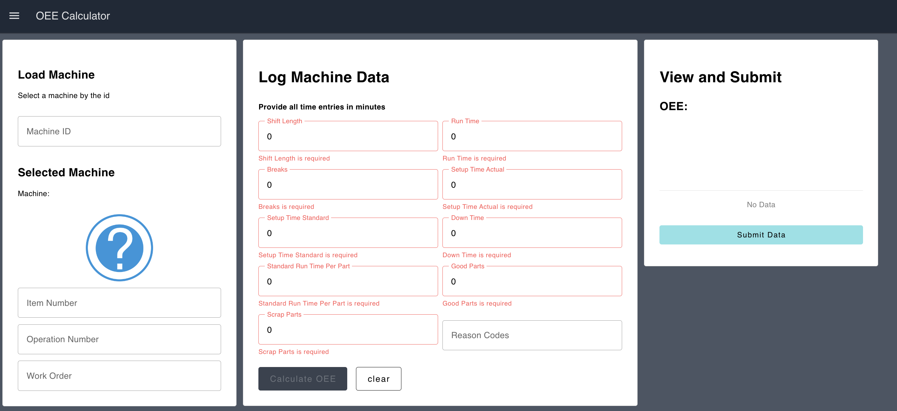
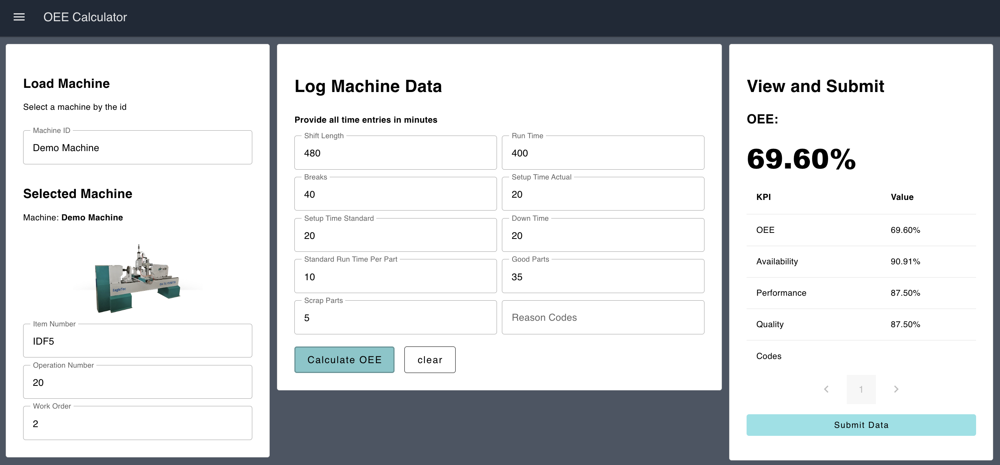

# OEE Calculator blueprint

The FlowFuse Overall Equipment Effectiveness (OEE) Calculator tool is designed as a straightforward and user-friendly solution for calculating, recording, and monitoring OEE metrics across various manually tracked operations. This tool functions independently of machinery connections.

The OEE Calculator uses specific methods, which are explained here. You can modify these calculations to better align with your specific operational need, as everythning can be modified in Node-RED.

- **Availability:** This metric assesses the operational duration of a process relative to the total available time. It is calculated as:
`Availability = (Run Time / (Run Time + Down Time + Setup Time Actual)) * 100`

- **Performance:** This metric evaluates the actual production output against the expected output. It is calculated as:
  `Performance = ((Good Parts + Scrap Parts) * (Standard Run Time per Part) / (Shift Length - Breaks)) * 100`

- **Quality:** This metric measures the ratio of quality products in comparison to the total production output. It is calculated as:
  `Quality = (Good Parts / (Good Parts + Scrap Parts)) * 100`

- **Overall OEE:** This is an aggregated measure of the above three metrics. It is calculated as:
  `OEE = (Availability * Performance * Quality) / 10000`

## [Start now](https://app.flowfuse.com/deploy/blueprint?blueprintId=PaRL4JNeBM)
This blueprint is available during the creation of a FlowFuse instance.