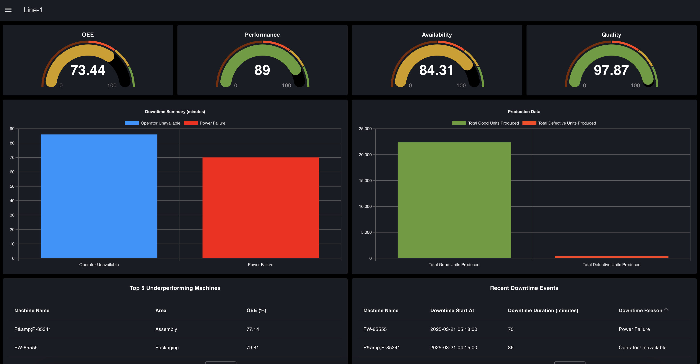
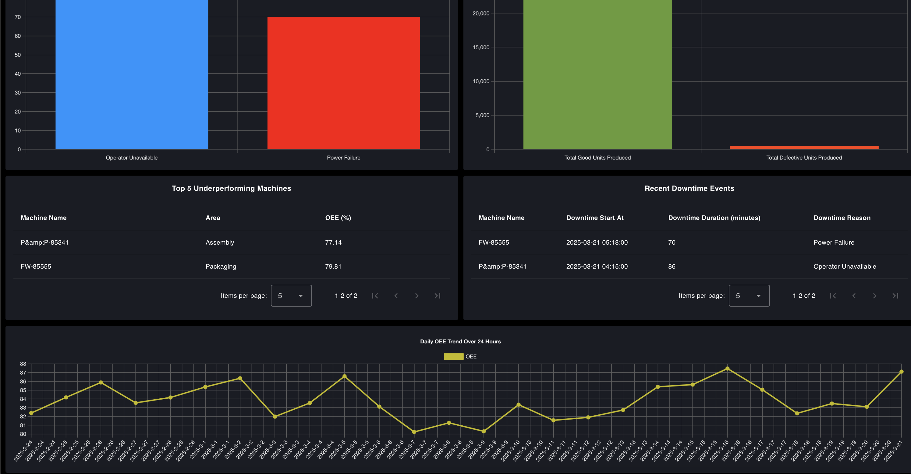
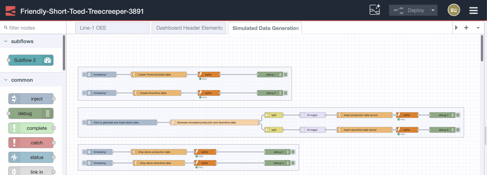
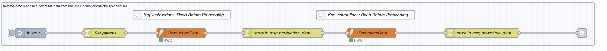
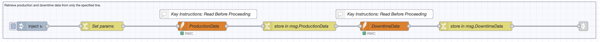
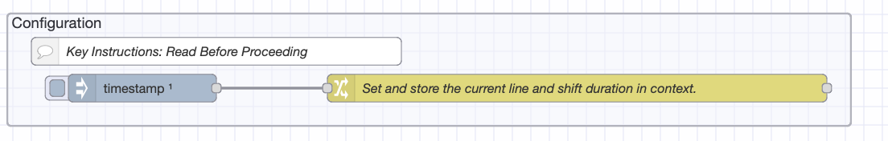

The OEE Dashboard Blueprint gives you a ready-to-use system for watching Overall Equipment Effectiveness in factories. Built on Node-RED and made for FlowFuse users, this blueprint solves a basic factory problem: turning equipment performance data into useful information you can act on.

If you're new to OEE, we suggest reading our [complete guide to OEE calculations and how to use them](https://flowfuse.com/blog/2025/04/building-oee-dashboard-with-flowfuse-part-1/#what-is-oee%3F) before you start.

  
*OEE Dashboard Blueprint - Primary View*

  
*OEE Dashboard Blueprint - Secondary View*

## Core Capabilities

The blueprint uses standard OEE calculation methods, breaking down equipment effectiveness into three main numbers:

- **Availability**: Measures actual running time compared to planned production time
- **Performance**: Compares actual output speed to maximum possible speed
- **Quality**: Measures the ratio of good units to total production

The system uses Node-RED's low-code approach, letting you make changes without needing software development skills.

## Getting Started with OEE Dashboard Blueprint

### Prerequisites

Before moving forward, ensure you have the following prepared:

- A FlowFuse account with the Starter, Pro, or Enterprise tier.

### Setting Up the Blueprint

1. To get started with the blueprint, click the ‘Deploy’ button on the right side of the page. This will redirect you to the FlowFuse platform’s instance creation interface with the blueprint pre-selected.
2. Select the appropriate settings based on your preferences, such as instance type, application, and Node-RED version.
3. Click the “Create Instance” button.

Once the instance is successfully created, you can:

- Click the “Open Editor” button in the top-right corner to navigate to the Node-RED Editor.

### Testing the Blueprint with Simulated Data  

To test and explore the blueprint, use the simulated data. A flow is available in the blueprint to generate and insert simulated production and downtime data into an SQLite table, which is automatically created upon deployment. 

To use this flow:  

1. Switch to the **"Simulated Data Generation"** flow tab. 

  
*Simulated Data Generation tab*

1. To start the process, click the inject node labeled **"Click to generate and insert demo data"**.  
2. Wait for a minute while the data is generated and inserted.  

This will populate the database with production and downtime records for the last 30 days, allowing you to analyze and test the dashboard effectively.

### Setting Up the Blueprint in the Real World

To implement the blueprint in a production environment, replace the **SQLite** node with the database where your production and downtime data is persisted. This can be **TimescaleDB**, **InfluxDB**, or any other suitable database.  

If you use **TimescaleDB** or another SQL-based database, the transition will be straightforward, as they share similar query structures. However, additional modifications will be required for **InfluxDB**, which is not SQL-based.  

For detailed instructions, refer to [how to set up and use different databases with Node-RED](/node-red/database/).

#### Blueprint Flexibility with Data  

The OEE Dashboard Blueprint is designed to be adaptable to various manufacturing setups. Users can integrate it with different data sources and customize dashboard elements according to specific needs.  

#### Customizing SQL Queries to Fit Your Database  

The blueprint includes two SQLite nodes connected to a **Template** node containing SQL queries:  

1. One SQLite flow retrieves data from the last X hours for a specified production line, combining results from both tables.

  
*flow to retrieve production and downtime data from the last X hours for only the specified line.*

1. The other SQLite flow retrieves all data from both tables, combining results from both tables.

  
*Retrieve production and downtime data from only from the specified line.*

#### Modifying SQL Queries for Your Setup:  

To adapt the queries to your database structure:  

1. If your field names are different, only update the field names in the query—do not change the alias names inside, as they define the structure of the returned data and its properties.
2. Replace table names with the actual table names used in your database.
3. Do not change the parameters that start with $, as they are used for dynamic values in the query.

For example: we have following query to retrive the production data:

```sql
SELECT
    timestamp as timestamp,
    machine_name as machine_name,
    area as area,
    line as line,
    total_produced_units as total_produced_units,
    good_units as good_units,
    defect_units as defect_units,
    target_output as target_output
FROM ProductionData 
WHERE
    timestamp BETWEEN $startTime AND $endTime AND line = $line;
```

If your database uses different field names, such as time instead of timestamp, machine instead of machine_name, section instead of area, production_line instead of line, produced_units instead of total_produced_units, quality_units instead of good_units, faulty_units instead of defect_units, or planned_output instead of target_output, you should update the query accordingly. After modification, it should look like this:

```sql
SELECT
    time AS timestamp,
    machine AS machine_name,
    section AS area,
    production_line AS line,
    produced_units AS total_produced_units,
    quality_units AS good_units,
    faulty_units AS defect_units,
    planned_output AS target_output
FROM YourTableName 
WHERE 
    time BETWEEN $startTime AND $endTime AND production_line = $line;
```

To help you update them easily, I have added the SQL query with placeholders, along with instructions in the comment node named "Key Instructions: Read Before Proceeding." Make sure to read and follow them before proceeding.

#### Configuring Dashboard for Your Production Line 

The blueprint includes a single page that calculates and visualizes OEE for "Line-1" by default. You can modify this by following these steps:  

  
*Configuration Group*

1. Locate the Change node labeled **"Set and store the current line and shift duration in context."**  
2. Update the **"line"** value to match your actual production line name.  
3. Set the **"shift_duration"** value to specify the actual shift duration of the line for the last **X hours** that you want to calculate OEE for.  
4. Update the **"shiftDuration24h"** value to represent the total shift duration within a **24-hour period**.  

#### Creating Additional Dashboard Pages for Other Lines  

If you need to create dashboard pages for additional production lines, follow these steps:  

1. **Copy the existing flow** from the current flow tab.  
2. **Create a new flow tab** in Node-RED and paste the copied flow.  
3. Locate the Change node labeled **"Set and store the current line and shift duration in context."** in the configuration group and update it with:  
   - The correct **line name**.  
   - The **shift_duration** value for the last **X hours** you want to calculate OEE for.  
   - The **shiftDuration24h** value for the total shift duration in **24 hours**.
4. Create a new page for the production line.
5. Locate the **"OEE Dashboard for Line 1."** Subflow.  
6. Double-click to configure it and **add a new groups** for each dashboard element and change the name of the subflow.  
7. When creating groups and pages, follow these configurations:  

##### Dashboard Group Size Configuration  

| Group Name | Width x Height |
|------------|--------------|
| Quality group | 3x2 |
| Availibility group | 3x2 |
| Performance group | 3x2 |
| OEE group | 3x2 |
| Production data group | 6x2 |
| Recent downtime groupe | 6x2 |
| Downtime summery group | 6x2 |
| Top underperforming machine group | 6x2 |
| OEE trend over time group | 12x1 |  

##### Dashboard Page Settings  

Ensure the following settings are applied to the new dashboard page:  

- **Theme**: Select **"OEE Blueprint Theme"**  
- **Layout**: Choose **"Grid"** layout  
- **Responsive Layout Table**: Change **Small Desktop Column Count** from **9 to 6**

Once you have added the flow and configuration correctly, you will see another page for your additional line.

## Advanced Integration: MCP-Enabled Intelligence

While OEE calculations give you number-based performance metrics, they naturally can't diagnose problems. OEE shows that performance has gotten worse but doesn't explain why or how to fix it.

[FlowFuse's MCP](/blog/2025/10/building-mcp-server-using-flowfuse/) (Model Context Protocol) integration solves this problem by enabling AI-assisted analysis of production data. The system can connect OEE drops with specific events, suggest likely causes based on past patterns, and speed up troubleshooting workflows.

For a hands-on demonstration of MCP integration with OEE dashboards, watch this implementation walkthrough:

<lite-youtube videoid="YyGke80U520" params="rel=0" style="margin-top: 20px; margin-bottom: 20px; width: 100%; height: 480px;" title="YouTube video player"></lite-youtube>

The video shows how MCP transforms raw OEE data into useful manufacturing information, cutting down the time from problem detection to finding the root cause.

## Conclusion

The OEE Dashboard Blueprint provides a production-ready foundation for equipment effectiveness monitoring. Its design balances immediate usefulness with expandability, letting organizations deploy quickly while keeping the flexibility to adapt to specific operational needs.

The blueprint's value isn't in being rigid but in its role as a starting point. Manufacturing environments differ significantly in their data structures, operational patterns, and reporting needs. This setup handles those differences through its modular design and documented customization points.

For organizations setting up OEE monitoring for the first time, this blueprint reduces deployment time from weeks to days. For factories with existing OEE systems, it offers a migration path to more flexible, cost-effective infrastructure.

Success with this blueprint depends on accurately reflecting your facility's operational reality in the configuration settings. Spend time on proper line definitions, shift patterns, and database integration. The dashboard will reflect the quality of the data and configuration you provide.
