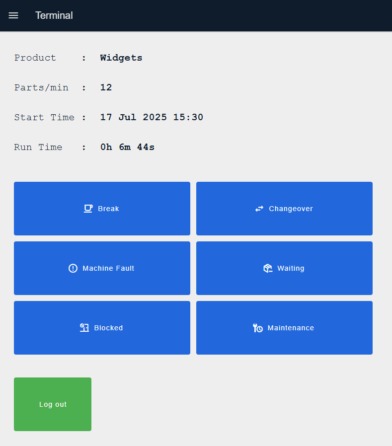
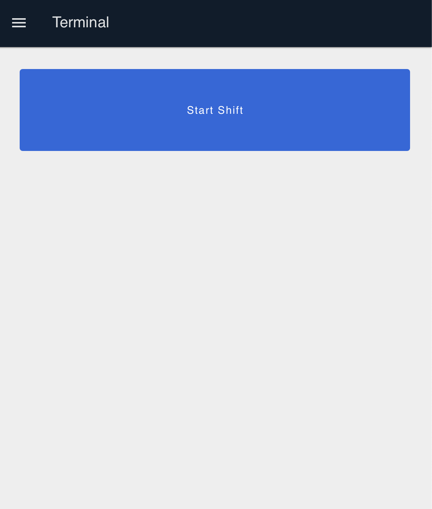
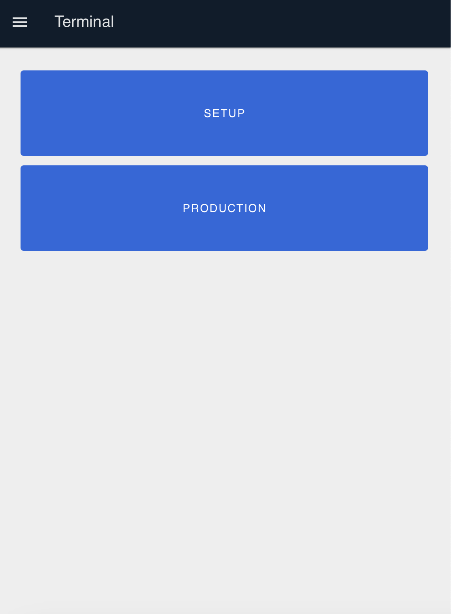
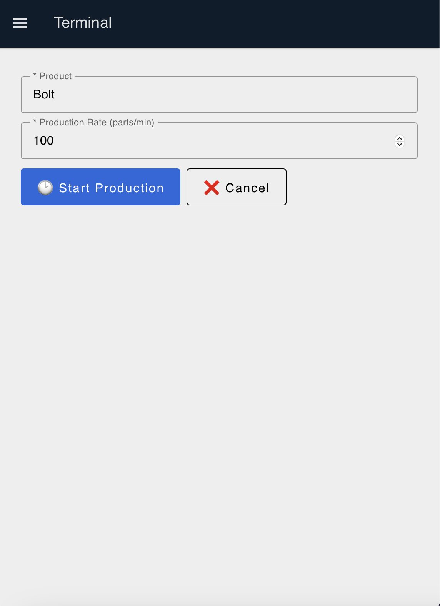
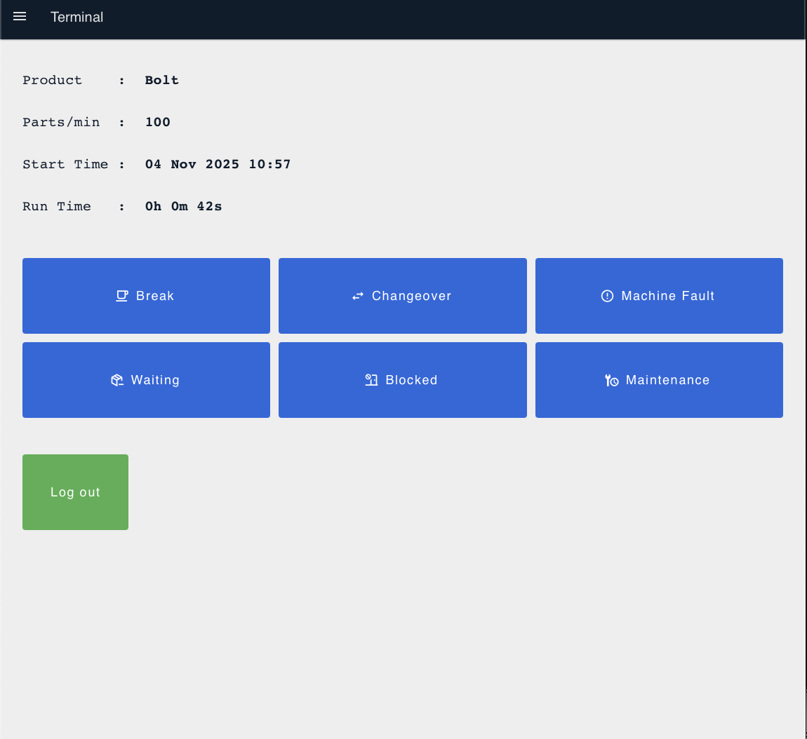
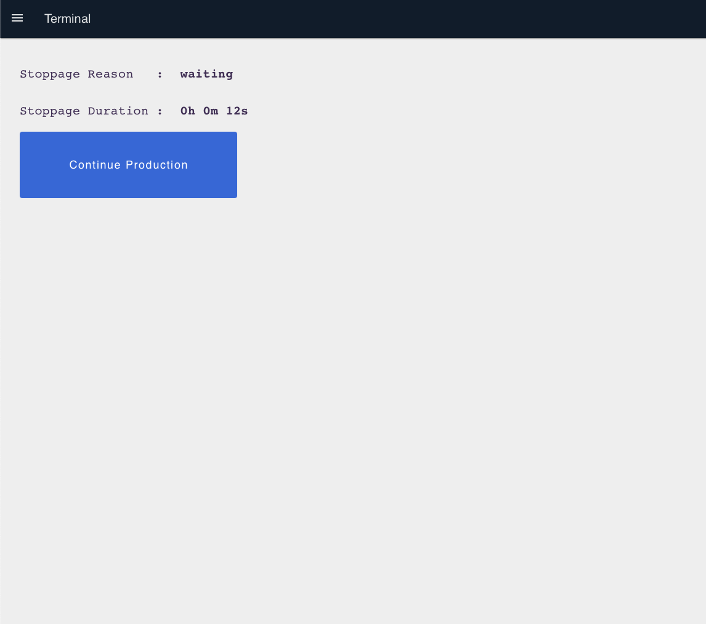
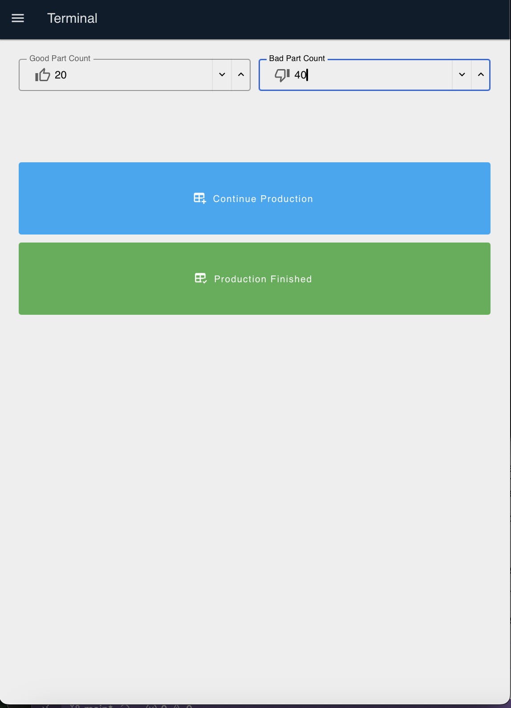
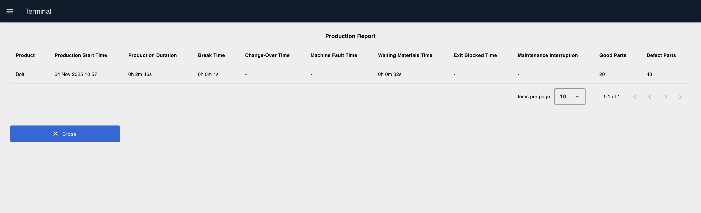

The Performance Operator Terminal blueprint provides a comprehensive, operator-friendly interface for tracking and managing machine performance in real-time. This blueprint empowers operators to monitor production metrics, record downtime events with specific reasons, and maintain accurate records of shift activities—all through an intuitive touchscreen-friendly interface.

*Performance Operator Terminal Blueprint - Main production monitoring screen*

## What is the Performance Operator Terminal Blueprint?

The Performance Operator Terminal is a digital workstation interface designed for manufacturing operators to track and manage machine performance throughout their shift. Unlike traditional paper-based tracking systems, this blueprint provides a modern, user-friendly digital solution that captures critical production data in real time.

Key capabilities include:
- Starting and ending production shifts with operator identification
- Tracking production setup and changeover times
- Recording good and bad part counts during production
- Documenting downtime events with specific reasons (Break, Changeover, Machine Fault, Waiting, Blocked, Maintenance)
- Monitoring real-time production rates and run times
- Generating comprehensive production reports at the end of the shift

The blueprint systematically captures all information, ensuring that every minute of machine operation is accounted for and categorized, enabling better analysis of Overall Equipment Effectiveness (OEE).

## What Problem Does It Solve?

Manufacturing facilities often struggle with accurate and consistent data collection from the shop floor. The Performance Operator Terminal Blueprint addresses several critical challenges:

**Inconsistent Data Collection**: Manual paper-based tracking leads to incomplete or inaccurate production records. This blueprint provides a structured digital interface that ensures all required data is captured consistently.

**Lost Production Time Insights**: Without proper tracking, it's difficult to understand where production time is actually spent. The terminal categorizes every moment as productive time, setup time, or downtime with specific reasons, providing complete visibility into time utilization.

**Delayed Data Availability**: Paper-based systems require manual data entry and compilation before analysis can begin. This blueprint captures data digitally in real-time, making it immediately available for analysis and decision-making.

**Operator Accountability**: The terminal requires operators to actively engage with the system throughout their shift, including logging in, recording production events, and documenting stoppages, This improves accountability and data quality.

**Difficult Root Cause Analysis**: When production issues occur, identifying the root cause is challenging without detailed historical data. This blueprint maintains comprehensive records of all downtime events with timestamps and reasons, facilitating effective root cause analysis.

**OEE Calculation Challenges**: Calculating accurate OEE requires detailed data on availability, performance, and quality. The terminal captures all necessary data points (run time, downtime, production counts, defect counts) needed for accurate OEE calculation.

By solving these problems, the Performance Operator Terminal Blueprint enables manufacturers to make data-driven decisions, identify improvement opportunities, and track the effectiveness of their improvement initiatives over time.

## Getting Started

### Prerequisites

Before moving forward, ensure you have:
- A FlowFuse account with the Starter, Team, or Enterprise tier

### Installation

1. Click the "Start" button at the bottom of this page. This will redirect you to the FlowFuse platform instance creation interface with the blueprint pre-selected.
2. Select the appropriate settings based on your preferences, such as instance type, application, and Node-RED version.
3. Click the "Create Instance" button.

Once the instance is successfully created:
- Click the "Dashboard" button in the top-right corner to access the Performance Operator Terminal interface
- Click the "Open Editor" button in the top-right corner to navigate to the Node-RED Editor for customization

### Using the Blueprint

The blueprint is ready to use immediately after deployment.

#### Starting a Shift

1. Open the dashboard by clicking the "Dashboard 2.0" button.
2. Click "Start Shift" to begin a new production shift.
3. You will see two buttons: "Setup" and "Production".
   - Click "Setup" if you need to perform machine setup tasks. Press the Setup button again to complete setup before proceeding.
   - Click "Production" to skip setup and begin production immediately.

*Shift start interface - Choose between Setup mode or direct Production start*

*Setup completion interface - Finish setup and proceed to production*

4. Enter the production name and production rate, then click "Start Production".

*Production configuration - Enter product details and expected production rate*

#### Monitoring Production

Once production starts, you will be redirected to the production monitoring screen displaying:

- Product name for the current production run
- Production rate (parts per minute)
- Production start time and date
- Total run time (live counter)

*Active production monitoring - Real-time tracking of production run with downtime recording options*

#### Recording Downtime

Record downtime by clicking the appropriate button:
- **Break**: Scheduled operator breaks
- **Changeover**: Product or tool changeovers
- **Machine Fault**: Equipment failures or malfunctions
- **Waiting**: Waiting for materials, instructions, or support
- **Blocked**: Machine output blocked (no space for finished parts)
- **Maintenance**: Scheduled or unscheduled maintenance activities

*Downtime tracking screen - Recording stoppage duration with option to resume production*

When a downtime button is clicked, the live run time stops and you're redirected to a screen showing the stoppage reason and live stoppage time. Click "Production" to resume production.

#### Ending Production

1. When production is complete, click the green "Logout" button.
2. Enter the number of good parts made and defects (bad parts).
   - Click "Production Finished" if the shift is complete
   - Click "Continue Production" to start another production run

*Shift completion interface - Record final part counts and choose to end shift or continue with new production run*

#### Viewing Reports

Once you click "Finish Production", you will be redirected to the report page displaying:
- Product name and total production duration
- All stoppage reasons with duration of each
- Total good and bad parts made
- Production start date and time

*Shift summary report - Complete production metrics including runtime, downtime analysis, and quality data*

## Production Environment Configuration

To implement the blueprint in a real production environment, consider these enhancements:

### Data Persistence

By default, the blueprint stores data in Node-RED's context storage. For long-term data retention and analysis:

1. Add database nodes (SQLite, MySQL, PostgreSQL, TimescaleDB, or InfluxDB) to persist production records.
2. Modify the flows to write production events, part counts, and downtime records to your database.
3. Create queries to retrieve historical data for analysis and reporting.

For detailed instructions on database integration, refer to [how to set up and use different databases with Node-RED](/node-red/database/).
