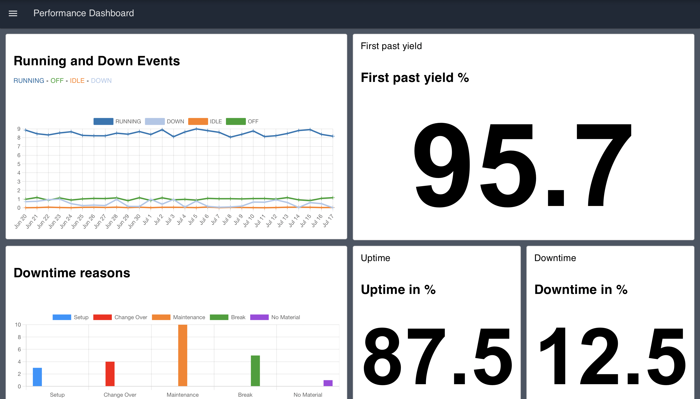

The Manufacturing Performance Dashboard serves as an overview for monitoring and analyzing key performance metrics in real-time, providing a comprehensive overview of the manufacturing operations for a station or line.

## What Problem Does It Solve?

In modern manufacturing environments, managers and supervisors need real-time visibility into production performance to make informed decisions. Without a centralized dashboard, teams often struggle with:

- Scattered data across multiple systems making it difficult to get a complete picture
- Delayed detection of performance issues and downtime
- Inability to identify patterns in downtime reasons
- Manual calculation of key metrics like OEE, uptime, and yield
- Lack of historical context for current performance
- Difficulty communicating performance status across teams

The Performance Overview Dashboard consolidates all critical manufacturing metrics into a single, real-time view. Supervisors and managers can instantly see how their station or line is performing, identify trends, and take corrective action before small issues become major problems.

## Understanding the Dashboard Sections

#### Downtime in %

This section visualizes the percentage of downtime for the manufacturing station or line. It calculates the ratio of time spent in DOWN or IDLE states compared to total operational time, providing a quick indicator of equipment availability.

#### Uptime in %

Similar to the Downtime KPI, this section displays the percentage of uptime. It shows the ratio of time spent in RUNNING state, helping teams understand productive time and track improvement initiatives.

#### First Pass Yield %

The First Pass Yield percentage is a measure of the quality and efficiency of the manufacturing process. It represents the percentage of products manufactured correctly the first time without requiring rework or scrap, serving as a key quality indicator.

#### Running and Down Events

This section provides a graphical representation of Running and Down events over time. The events are categorized as RUNNING, DOWN, IDLE, and OFF, each represented with a unique color on the chart. This timeline view helps identify patterns in equipment behavior and correlate downtime with shifts, products, or other factors.

#### Downtime Reasons

This group provides insights into the reasons for downtime. It employs a bar chart to visualize different reasons for downtime, with each reason represented by a unique color. This Pareto-style analysis helps teams focus improvement efforts on the most impactful downtime causes.

## Getting Started with Performance Overview Dashboard

### Prerequisites

Before moving forward, ensure you have the following prepared:

- A FlowFuse account with the Starter, Pro, or Enterprise tier.

This Performance Overview Dashboard Blueprint does not require configuring any nodes, as they are already pre-configured.

### Setting Up the Blueprint

1. Click the **Deploy** button on the right. You will be redirected to the FlowFuse platform's instance creation interface with the blueprint pre-selected.
2. Select the appropriate settings based on your preferences, such as instance type, application, and Node-RED version.
3. Click the **Create Instance** button.

Once the instance is successfully created, you can:

- Click the **Dashboard** button in the top-right corner to test the Performance Overview Dashboard Blueprint.
- Click the **Open Editor** button in the top-right corner to navigate to the Node-RED Editor.

### Replacing Simulated Data

Currently, the blueprint uses inject nodes and function nodes to simulate data for demonstration purposes. Before use in production, replace these nodes with your actual data source nodes. The dashboard is designed to accept real-time event data from your manufacturing execution system (MES), programmable logic controllers (PLCs), or other industrial data sources.

To replace the simulated data:

1. Open the Node-RED Editor by clicking the **Open Editor** button.
2. Locate the inject nodes and function nodes that are generating simulated data.
3. Replace these nodes with your source nodes (e.g., MQTT, OPC-UA, HTTP request, Database, or Modbus nodes).
4. Ensure your source nodes output data in the same format expected by the dashboard flows.
5. Deploy your changes and verify the dashboard displays your live data correctly.

### Customizing for Your Environment

The dashboard can be customized to match your specific manufacturing environment:

- Modify the downtime reason categories to align with your facility's classification system
- Adjust the time windows for metric calculations
- Add additional KPIs specific to your operation
- Integrate with your existing alerting systems for threshold-based notifications
