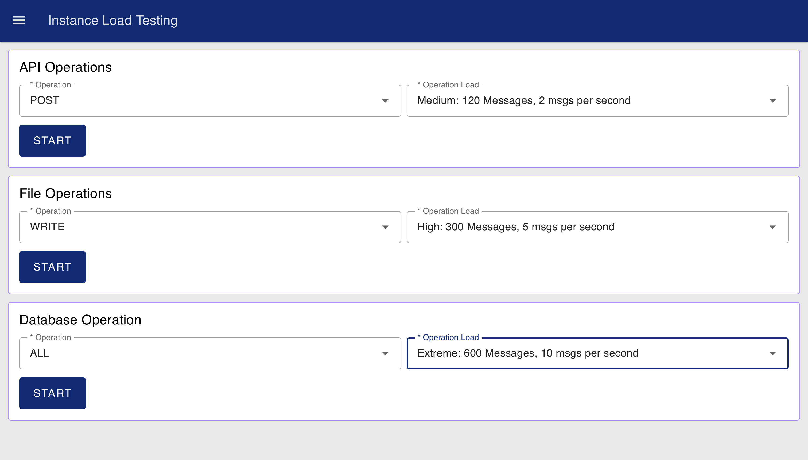
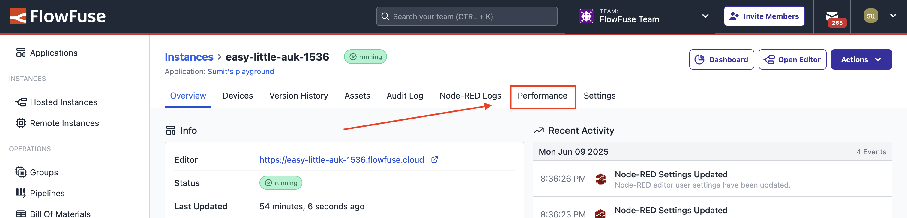
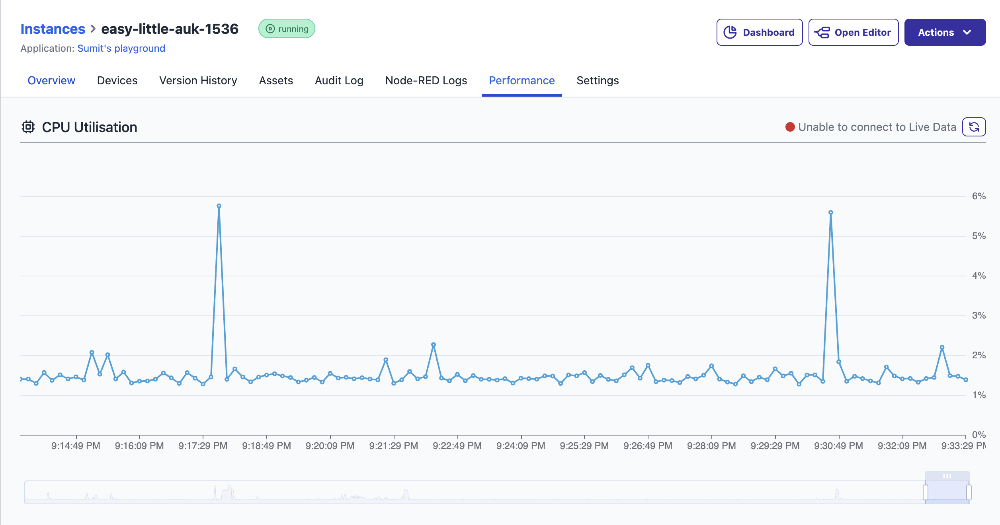

This blueprint helps you easily understand your Node-RED instance's capacity for handling heavy loads. It generates internal message traffic that simulates real-world scenarios across key areas such as API communication, database interactions, and file input/output. This allows you to effectively measure and evaluate your instance’s performance under varying stress levels when managing these essential operations.

With the [recent addition of the Performance view](https://flowfuse.com/changelog/2025/06/instance-performance-view/) in FlowFuse Cloud, you can now monitor CPU usage in real time while running load tests. This makes it easier to visualize how your Node-RED instance responds under different load conditions and helps identify performance bottlenecks more effectively.

> **Note:** These flows are intentionally designed to push the limits of Node-RED. In production environments, it is recommended to batch database writes and avoid parallel execution of file or API operations, unlike the approach used in this demo.

## Key Operation Categories

The test covers three primary categories, each including key operation types commonly used in real-world Node-RED applications:

| Category            | Operations                                              |
|---------------------|---------------------------------------------------------|
| **API Operations**  | `GET`, `POST`, `PUT`, `DELETE`, `All` (GET + POST + PUT + DELETE) |
| **Database Ops**    | `Read`, `Write`, `Update`, `Delete`, `All` (Read + Write + Update + Delete) |
| **File Operations** | `Read`, `Write`, `All` (Read + Write)                  |

## Load Levels and Message Frequency

Each test can be executed at one of four predefined load levels. The table below outlines the number of messages and the delay between each message at each level:

| Load Level | Total request | Delay (ms) | Messages per Second (approx.) | Duration (approx.) |
|------------|----------------|------------|-------------------------------|---------------------|
| **Low**    | 30             | 2000       | 0.5 msg/sec (1 message every 2 seconds)   | ~1 minute           |
| **Medium** | 120            | 500        | 2 msg/sec (1 message every 0.5 seconds)   | ~1 minute           |
| **High**   | 300            | 200        | 5 msg/sec (1 message every 0.2 seconds)   | ~1 minute           |
| **Extreme** | 600            | 100        | 10 msg/sec (1 message every 0.1 seconds)  | ~1 minute          |

When you select the 'All' option, the total number of requests is the Requests per Operation multiplied by the number of operations in that category.

- Example: The 'All' API test (4 operations) at the 'Extreme' level will run 600 times 4 = 2,400 total requests.

> **Note:** The "Extreme" level in this demo represents the maximum load configured within the provided flows—**not the actual limit of Node-RED itself**. Node-RED is capable of handling significantly higher throughput depending on flow design, instance size, and runtime optimizations. These values were chosen to strike a balance between realistic testing and resource safety in a shared environment.

## Getting Started with Node-RED Instance Load Testing

### Prerequisites

Before moving forward, ensure you have the following prepared:

- A FlowFuse account with the Starter, Team, or Enterprise tier.

### Setting Up the Blueprint

1. To get started with the blueprint, click the "Start" button at the bottom. This will redirect you to the FlowFuse platform instance creation interface with the blueprint pre-selected.
2. Select the appropriate settings based on your preferences, such as instance type, application, and Node-RED version.
3. Click the “Create Instance” button.

Once the instance is successfully created, you can:

- Click the “Open Editor” button in the top-right corner to navigate to the Node-RED Editor.

### Running the Load Test

1. Open the **FlowFuse Dashboard**.  
   To access it, switch to the **Dashboard 2.0** view using the sidebar, then click the **Open Dashboard** button located at the top-right.

  
*Dashboard Interface to Run tests*

2. Once the dashboard opens, you will see three separate forms—one for each operation category: **API Operations**, **Database Operations**, and **File Operations**.

2. For each category:
   - Select the **operation type** (e.g., GET, POST, Read, Write).
   - Select the **load level** (Low, Medium, High, or Extreme).
   - Click **Start** to begin the test.

Only one test per category can run at a time. While a test is in progress, its corresponding form will be disabled until the test completes.

> ⚠️ **Important:** Running tests at the **Extreme** level may cause the instance to restart if the load exceeds what it can handle within the default timeout window.  
> To avoid this, go to your instance settings in FlowFuse and **increase the "check period"** (timeout value). This provides the platform more time before considering the instance unresponsive during high-load testing.

### Monitoring the Performance of the Instance

To evaluate how your Node-RED instance performs under load:

1. Go back to your FlowFuse instance on the platform.
2. Switch to the **Performance** tab by clicking on **Performance** at the top.

  
*Option to open the instance performance view*

3. Monitor the **CPU usage** graph to see how the load test is affecting your instance's processing capacity.

  
*Instance CPU Usage Chart*

> **Tip:** A consistently high CPU load may indicate the need for an upgrade to a larger instance type.

## Load Test Considerations

- The test defines different load levels by increasing how often messages are sent. This helps identify when performance starts to drop and when the Node-RED instance reaches its limit.
- To set up the test, the blueprint creates demo REST APIs, a sample database table with demo data, and a temporary file.
- Data is created using function nodes, and the message frequency is controlled using setTimeout.
