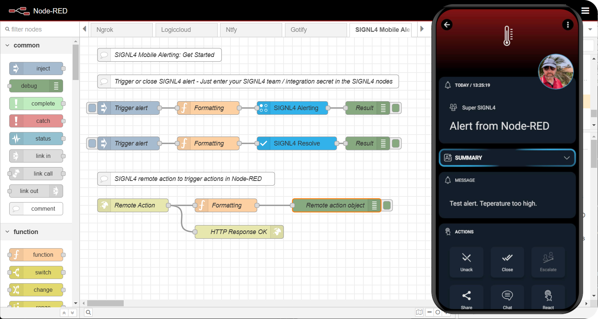

Add reliable mobile alerting directly into your flow with SIGNL4.

SIGNL4 is a SaaS offering for mobile alerting and incident management for operating critical infrastructure. It alerts you or your team persistently via app push, SMS text, voice calls, and email including tracking, escalation, shift and on-call duty scheduling and collaboration.

This blueprint allows you to trigger and to close alerts. It also uses an HTTP server to receive remote actions from the SIGNL4 app for running tasks within your Node-RED flow.

## Prerequisites

Before moving forward, ensure you have the following prepared:

- A FlowFuse account with the Starter, Team, or Enterprise tier.
- A SIGNL4 account with a team that includes the members you want to receive alerts. For more information on creating an account, setting up a team, and inviting members, refer to their [official guide](https://www.signl4.com/first-steps/).

## Setting Up the Blueprint

1. To get started with the blueprint, click the "Start" button at the bottom. This will redirect you to the FlowFuse platform instance creation interface with the blueprint pre-selected.
2. Select the appropriate settings based on your preferences, such as instance type, application, and Node-RED version.
3. Click the “Create Instance” button.

Once the instance is successfully created, open the Node-RED editor, and you can see the blueprint flow along with all necessary node packages installed.

## Getting Started

To integrate SIGNL4 with your Node-RED flow, follow these steps to configure the SIGNL4 nodes in the blueprint.

### Configuring SIGNL4 Nodes

Before using SIGNL4 in your Node-RED flow, you need to configure the SIGNL4 nodes with your team’s secret key. Follow these steps:

1. Double-click the SIGNL4 Alert and Resolve node to open the configuration dialog.
2. Enter your SIGNL4 team secret key in both nodes.
3. Click **Done** and deploy the flow.

### Sending an Alert  

To send an alert with SIGNL4, use the SIGNL4 Alerting node. This blueprint includes a flow demonstrating its usage, or you can integrate it with your existing Node-RED flow. 

1. Open the function node connected to the **SIGNL4 Alerting** node.  
2. In the function node, locate the `data` object variable and update it as needed. You can modify:  
   - `subject`: The alert title.  
   - `body`: A detailed description of the alert.  
   - A relevant property: This can be any key-value pair, such as temperature, humidity, or another sensor reading.  
   - `X-S4-Location`: Latitude and longitude to specify where the event occurred.  
   - `X-S4-ExternalID`: A unique identifier for the alert.  
3. Additional parameters can be included as required. For more details, refer to the [Node-RED SIGNL4 documentation](https://flows.nodered.org/node/node-red-contrib-signl4).  
4. Click **Done** and deploy the flow.  

To test the alert, click the **Inject** button of that flow. You should see the alert in the SIGNL4 mobile app. Ensure that you are part of the same SIGNL4 team configured in the flow to receive the alert.  

### Resolving an Alert  

Sometimes, after sending an alert, you may need to resolve it to indicate that no further action is required, preventing team members from responding unnecessarily.  

1. Open the function node connected to the **SIGNL4 Resolve** node.  
2. In the function node, locate the `data` object variable and update `X-S4-ExternalID` with the ID of the alert you want to resolve.  
3. Click **Done** and deploy the flow.  

To resolve an alert, click the **Inject** button of the flow. The alert will be marked as resolved. 

### Using SIGNL4 Remote Actions  

SIGNL4 remote actions allow team members to respond to alerts. You can use these actions to trigger flows in Node-RED, enabling automated incident responses. 

1. Go to the SIGNL4 platform and create a remote action, For more details on creating remote actions, refer to [this guide](https://www.signl4.com/blog/july-2022-update-remote-actions-fast-incident-remediation/).
2. Set the Target URL to your Node-RED instance, followed by `/signl4`, for example: `https://<your-instance-name>.flowfuse.cloud/signl4`.

Once configured, whenever a team member reacts to an alert in the SIGNL4 mobile app, the data configured at the time of creating the remote action will be sent to the `/signl4` endpoint in Node-RED, which can then trigger flows to automate responses.

## [Start now](https://app.flowfuse.com/deploy/blueprint?blueprintId=)
This blueprint is available during the creation of a FlowFuse instance.
