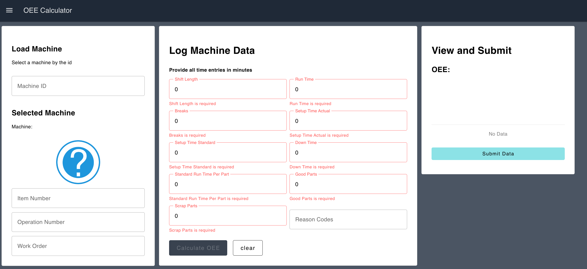
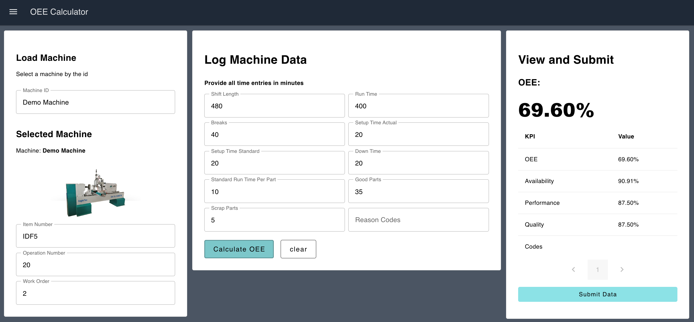

# OEE Calculator blueprint

The OEE Calculator blueprint allows an end user to input production information to calculate the Overall Equipment Effectiveness (OEE) for a machine, if no automatic calculation is possible.

