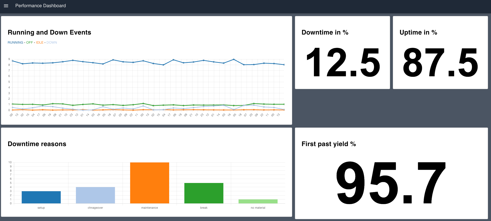

# Performance Overview Dashboard
The Manufacturing Performance Dashboard serves as an overview for monitoring and analyzing key performance metrics in real-time, providing a comprehensive overview of the manufacturing operations for a station or line.

## Downtime in %
This section visualizes the percentage of downtime for the manufacturing station (or line).

## Uptime in %
Similar to the Downtime KPI, this section displays the percentage of uptime.

## First Past Yield %
The First Past Yield percentage is a measure of the quality and efficiency of the manufacturing process.

## Running and Down Events
This section provides a graphical representation of Running and Down events over time. The events are categorized as RUNNING, DOWN, IDLE, and OFF, each represented with a unique color on the chart.

## Downtime Reasons
This group provides insights into the reasons for downtime. It employs a bar chart to visualize different reasons for downtime, with each reason represented by a unique color.
