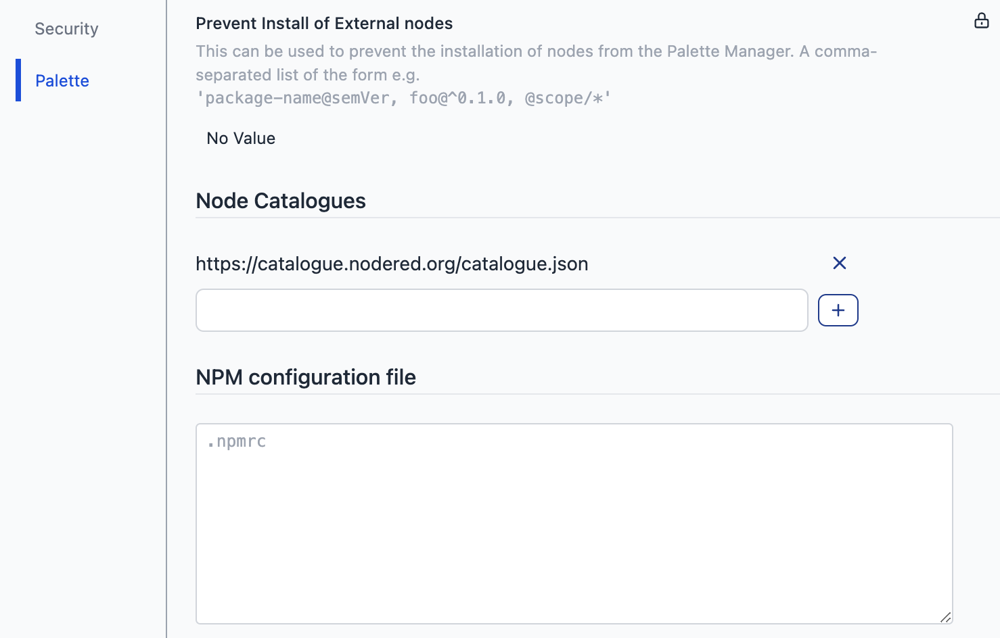

An often requested feature is support for custom nodes. Although Node-RED instances today connect automatically to the official Node-RED catalogue, which boasts over 4,400 custom nodes, we understand that specific use cases may require access to additional or different NPM registries and catalogues.

Starting today, you can extend your Node-RED environment by adding custom Node Catalogues. We have introduced the capability to modify the .npmrc file, allowing you to install modules that are not hosted in the official registry.

