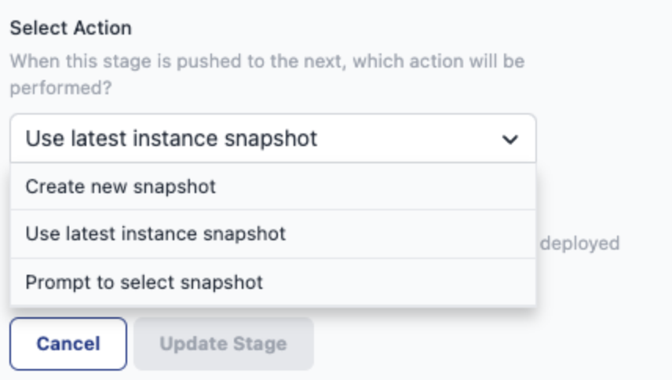

Starting today, you can configure a deployment stage to create a new snapshot, always copy the latest snapshot, or prompt you for an action. This provides a more flexible approach to managing snapshots, enabling you to directly push created snapshots through the pipeline rather than being limited to the current image on Node-RED instances.

