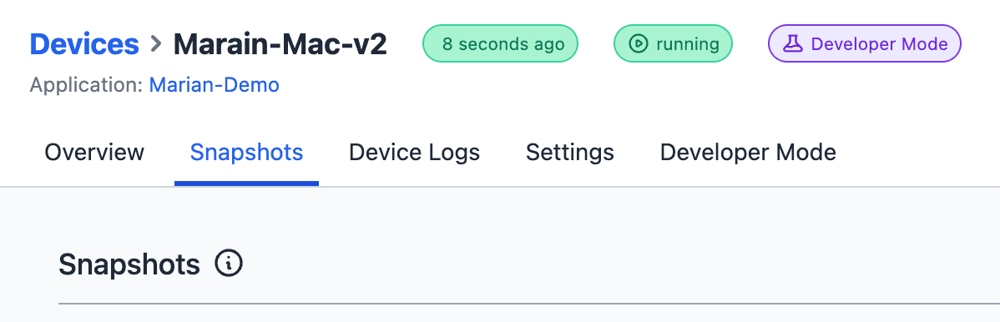

Four weeks ago, we began working on several [usability improvements to our Device Management](/blog/2023/08/flowfuse-1-11-release/#usability-improvements-to-device-management-%232294). This included the ability to associate devices at the application level, allowing for easier editing of Node-RED instances on edge devices.

Starting today, it will also be possible to create and manage snapshots for those standalone devices.

