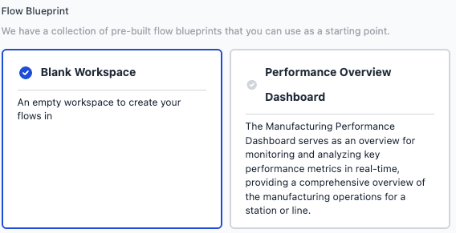

FlowFuse Blueprints are now available on FlowFuse Cloud and, upon request, for Teams and Enterprise Self-Hosted customers. Blueprints simplify Node-RED deployments by offering pre-built, customizable flows for specific use cases, thereby accelerating both new user onboarding and solution development for our seasoned users.

[Click here](/blog/2023/10/blueprints/) to learn more about Blueprints.

When creating a new instance, you can now also select a Blueprint.

