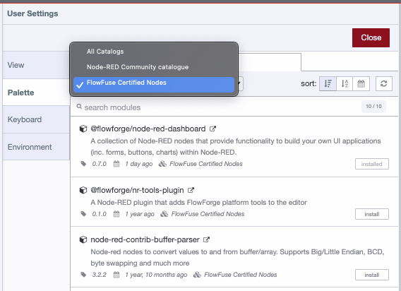

::note
Exciting Update! FlowFuse is now available as three different products: [FlowFuse Edge for OT teams](https://flowfuse.com/product/edge/), [FlowFuse Hub for IT teams](https://flowfuse.com/product/hub/), and [FlowFuse Fleet](https://flowfuse.com/product/fleet/) for managing devices at scale. Visit the [FlowFuse Product Page](https://flowfuse.com/product/) to learn how the platform enables you to build and manage industrial apps at scale.
::

Teams Tier customers can now leverage a curated selection of certfied Node-RED nodes, enhancing workflow efficiency and security.
- Quality Assurance: Each certified node undergoes testing, ensuring it's free from harmful components, aligning with our commitment to reliability.
- Proactive Security Measures: While prioritizing immediate resolutions for detected vulnerabilities, we maintain the discretion to revoke a node's certified status, ensuring system integrity. Affected customers will receive prompt notifications.
- Support: Assistance for certified nodes is provided, aiming for, but not promising, issue resolution.

How? You can find all certified nodes in your Node-RED palette manager or on the
[dedicated page](/integrations/?certified=1) on our website. 

