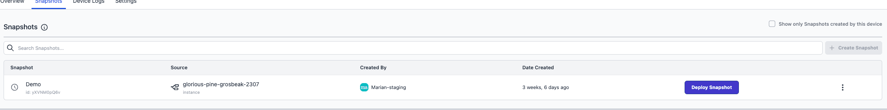

Users can now effortlessly deploy snapshots for devices assigned to an application through a new "Deploy Snapshot" button, available in the device's "snapshots" tab, thereby enhancing the workflow with the option to set either instance-owned or device-owned snapshots as the target.

