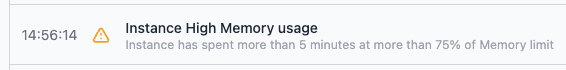

In the FlowFuse Audit Log of an instance, it will now display when the resource utilization of CPU or memory exceeds 75% over a period of five minutes. This should provide transparency regarding resource utilization and serve as an indicator for choosing the appropriate instance size.

