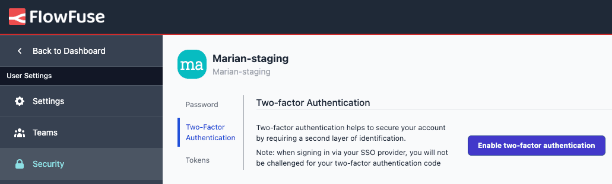

In our ongoing commitment to strengthen security, we're excited to announce the addition of two-factor authentication (2FA) for FlowFuse. This enhancement ensures an extra layer of security for your account. Setting up 2FA is straightforward, and the system supports all commonly used TOTP (Time-Based One-Time Password) tools, such as Google Authenticator. To enable 2FA, simply navigate to your User Settings and follow the easy setup process.

For more Details see our [Documentation](/docs/user/user-settings/)
2FA is available for all FlowFuse Cloud users and for Enterprise Self-Hosted customers.