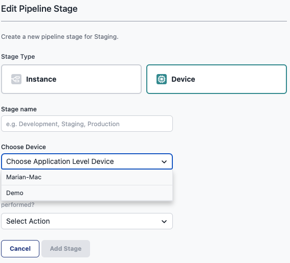

::note
Exciting Update! FlowFuse is now available as three different products: [FlowFuse Edge for OT teams](https://flowfuse.com/product/edge/), [FlowFuse Hub for IT teams](https://flowfuse.com/product/hub/), and [FlowFuse Fleet](https://flowfuse.com/product/fleet/) for managing devices at scale. Visit the [FlowFuse Product Page](https://flowfuse.com/product/) to learn how the platform enables you to build and manage industrial apps at scale.
::

Building on our [previous release](/blog/2023/08/flowfuse-1-11-release/#usability-improvements-to-device-management-%232294) that enabled the management of devices independently of instances. Now, the integration of individual devices into DevOps Pipelines is possible. This update marks a significant step towards more flexible and efficient device management within FlowFuse. In our ongoing efforts, we are also developing features to group devices, aiming to streamline and improve the overall device management experience.

Devices in DevOps Pipelines are available for every customer who has access to DevOps Pipelines. This includes all Cloud customers and those from the Pro Tier onwards for our self-hosted version.
